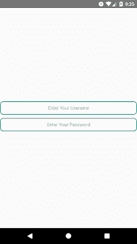

# React 本机设置提示占位符在 TextInput 内居中对齐

> 原文：<https://dev.to/skptricks/react-native-set-hint-placeholder-align-center-inside-textinput-3egk>

* * *

## 来源: [React Native Set 提示占位符在 TextInput 内居中对齐](https://www.skptricks.com/2019/01/react-native-set-hint-placeholder-align.html)

本教程解释了如何在 TextInput 组件中显示提示或占位符字段。此占位符向用户提供关于输入参数模式字段信息。在这个例子中，我们将使用 TextInput 组件，并以居中对齐的顺序显示占位符或提示。为了在居中对齐中显示提示或占位符，我们需要使用 css 样式表属性，这是 **textAlign: 'center'** 。

[](https://4.bp.blogspot.com/-zeDO31F_PQw/XD1dgqaqROI/AAAAAAAACVg/8A6igkep0Y0IQEUJ1kIdxjmM3b3fd9p_wCLcBGAs/s1600/placegolder.png)

## * *对 TextInput 内的本机设置提示或占位符做出反应**

让我们看看下面的源代码，它有助于在 react 本机应用程序的 TextInput 组件中显示提示或占位符。

```
/\*\*  
 \* Sample React Native App  
 \* https://github.com/facebook/react-native  
 \* @flow  
 \*/  

import React, { Component } from "react";  
import { Platform, StyleSheet, View, Button, TextInput, } from "react-native";  

export default class App extends Component {  

  render() {  
return (  
<View style={styles.container}>  

<TextInput  
 **placeholder**** ="Enter Your Userame"**  
          underlineColorAndroid='transparent'  
          style={styles.TextInputStyle}  
/>  

<TextInput  
 **placeholder**** ="Enter Your Password"**  
          underlineColorAndroid='transparent'  
          style={styles.TextInputStyle}  
          secureTextEntry={true}  
/>  

</View>  
);  
}  
}  

const styles = StyleSheet.create({  
  container: {  
    flex: 1,  
    justifyContent: 'center',  
},  
  headerText: {  
    fontSize: 20,  
    textAlign: "center",  
    margin: 10,  
    fontWeight: "bold"  
},  
TextInputStyle: {  
 **textAlign**** : 'center',**  
    height: 40,  
    borderRadius: 10,  
    borderWidth: 2,  
    borderColor: '#009688',  
    marginBottom: 10  
}  
}); 
```

**截图:**

[](https://1.bp.blogspot.com/-Xo0Z8oS8-N0/XD1cLqOYDgI/AAAAAAAACVU/dctYo9d5JC40cryjb4165vmyWR6AEr5-wCLcBGAs/s1600/Screenshot_1547525149.png)

这都是关于 **React 原生设置提示占位符在 TextInput 内居中对齐。**感谢您阅读这篇文章，如果您有任何问题，或者对这篇文章有其他更好的有用解决方案，请在评论区留言。