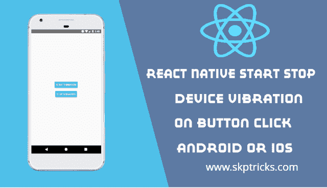

# 在 Android 或 iOS 上点击按钮时对本机启动停止设备振动做出反应

> 原文：<https://dev.to/skptricks/react-native-start-stop-device-vibration-on-button-click-android-or-ios-4caa>

贴吧链接:[反应原生启停设备振动上按钮点击安卓或 iOS](https://www.skptricks.com/2018/12/react-native-start-stop-device-vibration-on-button-click.html)

在本教程中，我们将讨论如何在 android 或 ios 设备的 react 本机应用程序中启动和停止按钮点击时的振动。如今，振动是每个移动设备最重要的组成部分，有助于通知移动用户最新的通知、呼叫等。在本教程中，我们将使用 react native 的振动 API 组件创建一个 React Native 应用程序。我们将开始停止按钮点击设备振动，并停止它。
点击 Android 或 iOS 上的按钮，对本机启动停止设备振动做出反应

[点击 Android 或 iOS 上的按钮反应本机启动停止设备振动](https://www.skptricks.com/2018/12/react-native-start-stop-device-vibration-on-button-click.html)

