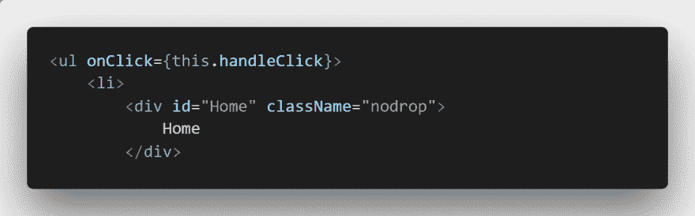
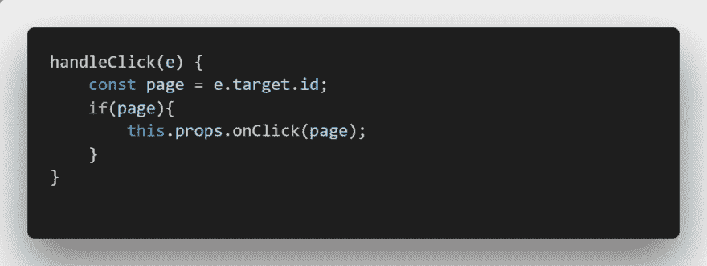
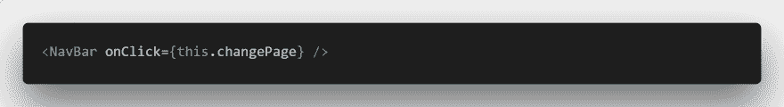
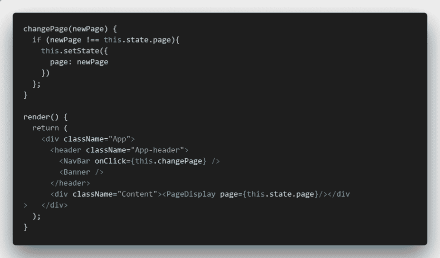
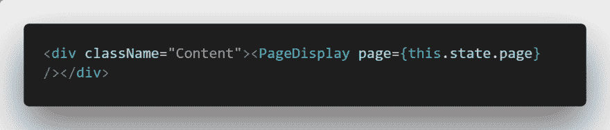
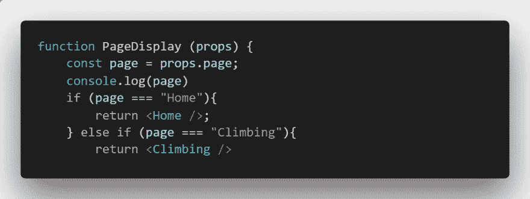
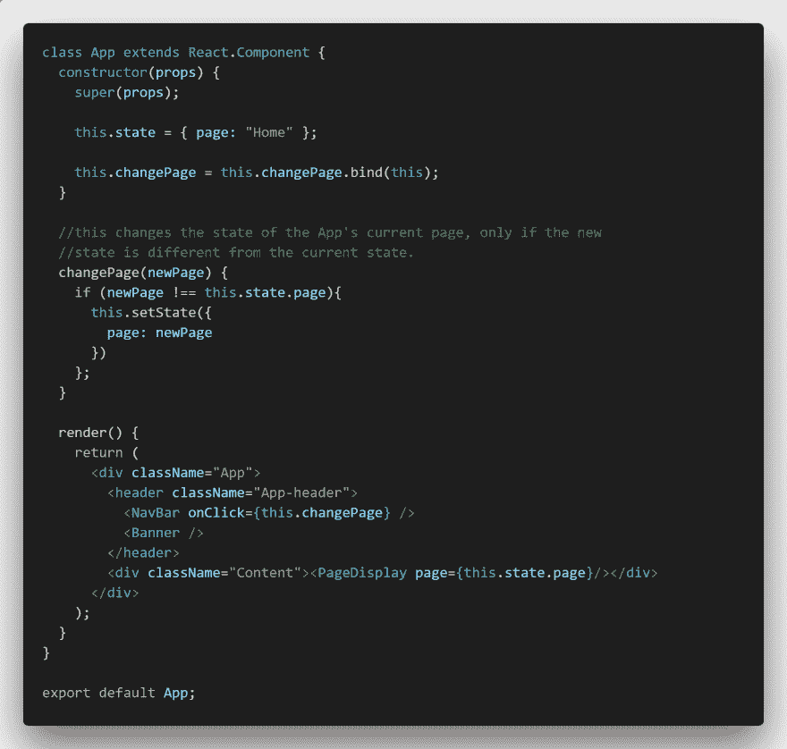

# React 导航条！

> 原文：<https://dev.to/andersjr1984/react-navigation-bar-5o3>

我大约一周前开始学习 react，参加了代码学院的课程，所以请对我下面可能非常难看的代码保持耐心。我最近完成了我的作品集的工作，我创造的最令人兴奋的元素之一是导航系统。我在几乎没有指导的情况下开发了这种导航方法，仅仅是从我的代码学院课程中获得的知识。我想做一个简单易懂的指南，这样新来的人就可以像我一样制作自己的导航条！对于 React pro 来说，代码可能看起来很丑，但我也想听到对我的代码的批评，所以请随意评论！

1.  我做的第一件事是在主导航列表中创建一个静态导航栏，包含“主页”、“关于我”和“爱好”，然后在“关于我”和“爱好”下创建一个子导航列表。这是简单的 HTML 和 CSS，大约有一百万个例子，所以我不会向你展示我的具体代码。在[w3schools.com 网站上可以找到一个关于如何创建导航条的很好的资源。](https://www.w3schools.com/css/css_navbar.asp)
2.  在初始的 ul 标记中，我放置了一个“onClick”事件的事件处理程序，它将您发送到内部函数 this.handleClick。
3.  我给了每个可点击的元素一个特定的 id，稍后将对其进行评估以确定要显示的页面。
4.  我编写了 handle click 函数，将特定的 id 作为属性发送给父元素，但前提是关联元素有 id。我不得不使用 e.target.id 来获取这些信息。我想我应该使用一个值而不是 id，但是由于某种原因，我不能让它工作。
5.  我创建了构造函数并绑定了 handleClick 函数。仍然不确定为什么需要这些步骤，我需要继续做研究。
6.  我在 App.js 的标题中呈现了 NavBar，然后在 click 事件中为函数 this.changePage 赋值。
7.  我编写了 changePage 函数来接收一个 newPage 元素，然后如果请求的新页面与当前页面不同，就重置页面。我将在下面展示代码和构造函数。
8.  我构建了构造函数并将初始状态设置为主页，并绑定了 changePage 函数。
9.  在标题下面，我创建了一个新元素来保存页面的内容。在这个元素中，我调用了一个函数来显示我的页面。
10.  我在几个 if-else 语句上构建了 PageDisplay 函数。每页一个，但是我只给你看几个，因为有很多相同的代码(同样，我可以用一个多星期的经验来清理这些)。
11.  我想向您展示整个代码，但除了我在应用程序组件中所做的之外，大部分代码都很简单。这是为你的观赏乐趣的应用组件。请让我知道你的想法！
