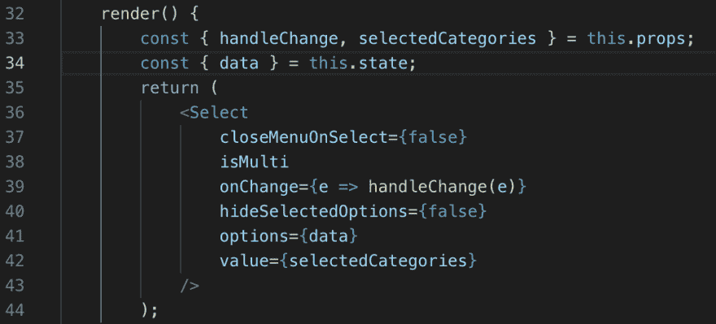
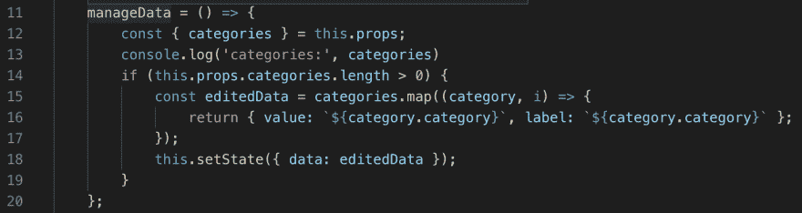
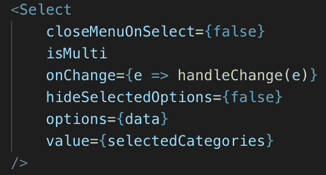
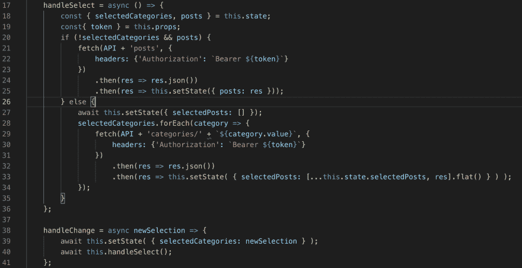
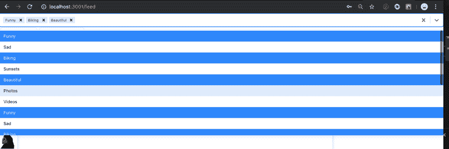
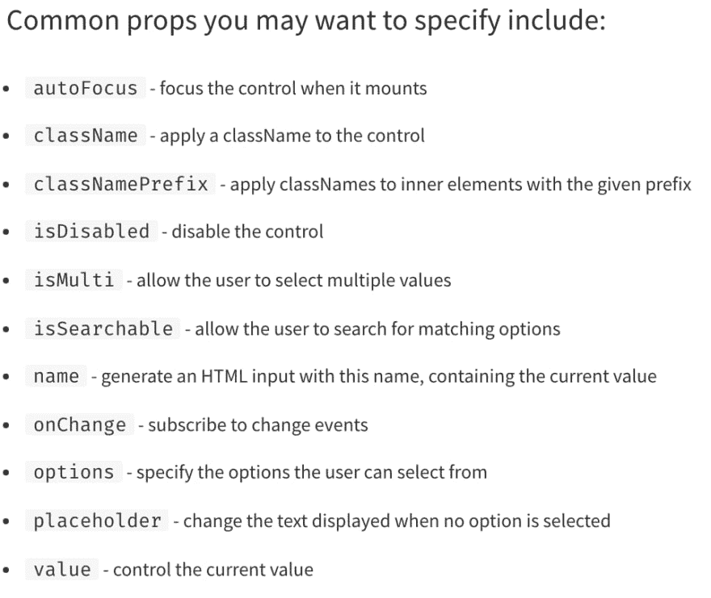

# 反应-选择:定制选择器变得简单

> 原文：<https://dev.to/andershornor/react-select-custom-selectors-made-easy-28dg>

# 反应-选择

当建立一个网页时，我讨厌不得不花上几个小时来获得酷的用户友好界面。这既烦人又费时，而且似乎没有必要。因此，和我之前的许多人一样，我四处寻找有用的工具，让我的生活更轻松。如果我找不到好的工作，那么如果我有时间，我会做些事情让我的生活更轻松。我没有太多的时间，所以我没有很多自己的工具来展示，但最近当我在为我正在做的网页制作粘性选择器时，我发现了一个非常棒的工具，它让我的生活变得更容易，我的网页也更漂亮。我发现的选择器工具是一个方便的小 API，和许多 API 一样，叫做 React-Select。

### 实现反应-选择

和我所知道的所有包一样，React-Select 很容易通过运行快速 bash 命令`yarn add react-select`或`npm install react-select`来下载，这取决于 react-app 运行的包管理器。
安装完软件包后，你必须将选择器导入到你希望使用它的文件中，如下所示:

React-Select 的强大之处在于它的易用性和可定制性。现在，您可以在您想要的文件中访问 react-select，您可以像使用您定义的任何组件一样使用它。下面是我使用 select API 的一个例子，我希望下拉菜单有多个选项，当添加“类别”时会更新，允许选择多个选项，并允许选择的选项在选择后保持不变。

它真的很容易实现，并且成为一个非常好的预设计组件，可以在任何需要选择的地方使用。

### 功能

现在你已经了解了 react-select 在这个基本用例中有多强大，让我们来深入研究如何正确使用 React-select，让你在下一个 react-app 中高效无误地实现它。
一个重要的起点是突出显示 Select 期望其选项数据所在的形状。与传统 select HTML 元素不同，React-Select 要求数据以`{value: "collection-value", label: "collection-label"}`格式组织。根据您存储集合的方式，您希望为构建一个选择器，您可能需要在将集合输入到您的 Select 组件之前重新构造它。虽然有更好的方法来重构数据(即使用另一个名为 [Proptypes](https://www.npmjs.com/package/prop-types) 、 [react-docs here](https://reactjs.org/docs/typechecking-with-proptypes.html) )的 api，但是对于上面的例子，我像这样重构了我的数据:

一旦您重新构造了数据以在列表中显示选项，您只需将集合作为 Select 组件的属性进行传递。

一旦你的选择通过了，大部分困难的工作就完成了。如果你想要一个简单的有光泽的单品选择元素，你基本上已经有了。创建一个 onChange()属性，并传入 handleChange()函数(老实说，这有点复杂，但它也做一些有条件的呈现和获取——可能有更好的方法——)

或者在函数本身中定义一个，瞧，一个漂亮的选择条显示在你的页面上。

但是等等，还有更多。在上面的例子中，我希望能够选择多个选项，并且希望在我选择它们之后，它们能够保留在选择栏中。就像这个预打包组件的许多其他功能一样，功能只需要两个布尔语句和一个集合变量。只需添加一个`isMulti`(缺省值为真)属性，添加一个`hideOptionsOnSelect`属性设置为假，

and 将值属性设置为一个集合变量，该变量使用上面确定的`handleChange()`函数中的选定值进行更新，您就可以得到想要的选择器 I。

### 更

但是等等，还有更多！更多的道具。 [npm docs](https://www.npmjs.com/package/react-select) 页面表示的常用道具

Some 如下:

我不会深入讨论这些，因为我还有很多要学习的东西，还有这个 api 所有令人敬畏的用途，但是我建议你自己去看看！

Thanks 这么多的阅读，我希望你继续学习，因为它太他妈的伟大了！