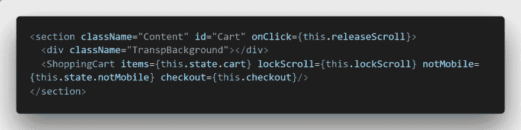
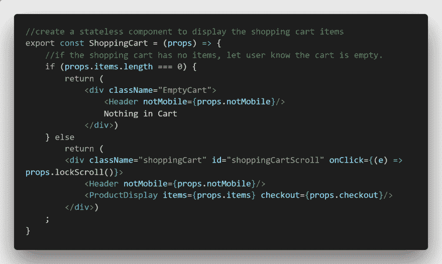
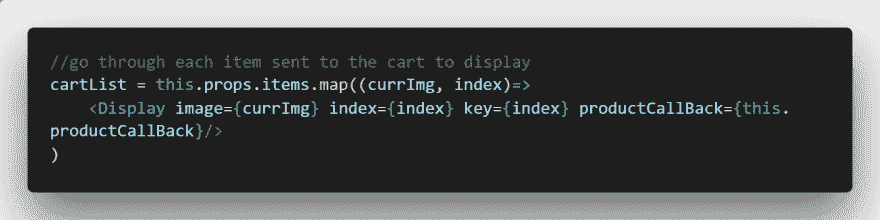
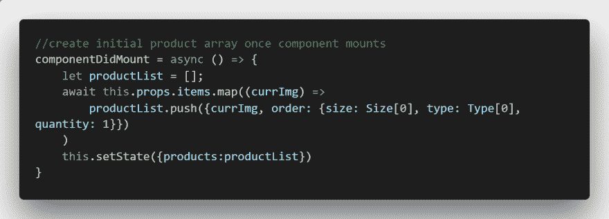
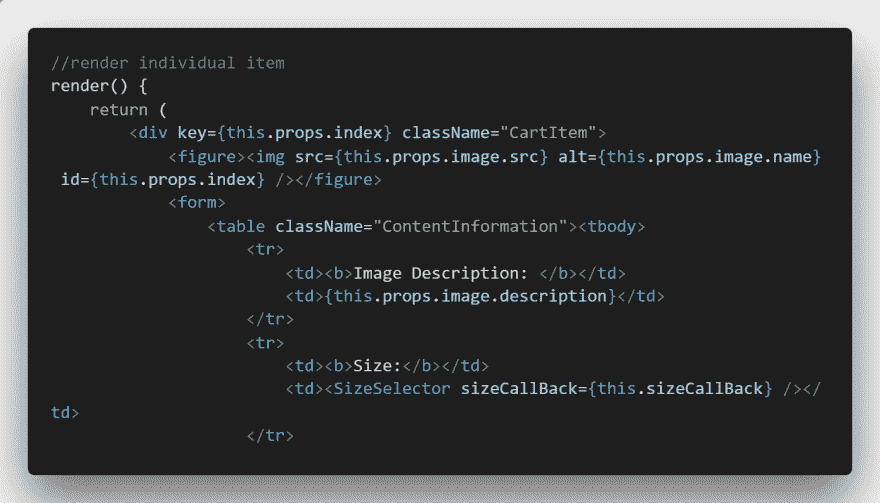
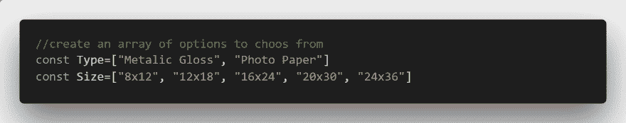
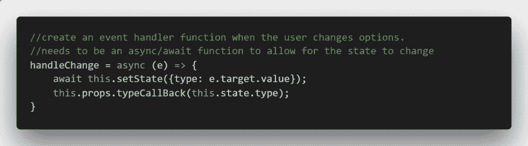
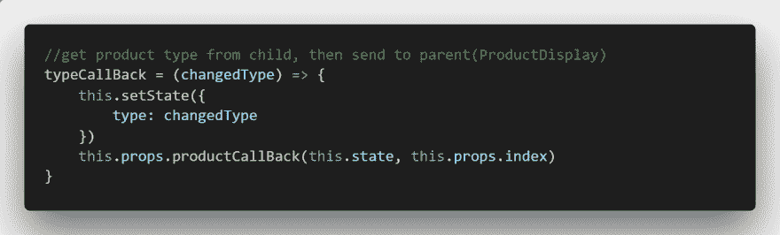
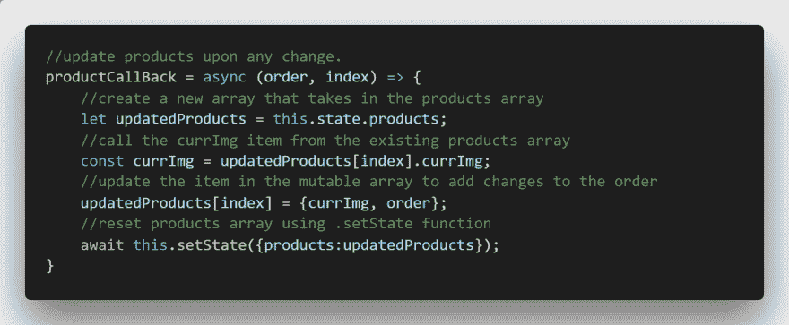

# React 购物车教程和代码

> 原文：<https://dev.to/andersjr1984/react-shopping-cart-tutorial-and-code-2609>

已编辑，可根据要求添加购物车工作演示。

### 我如何构建一个实用的购物车:

TLDR:一辆反应购物车！代码在 [github 这里。](https://github.com/andersjr1984/ReactShoppingCart/releases/latest)

[无耻的塞给我的数字组合。](https://andersjr1984.github.io/portfolio/)

[见大车在行动(工地在施工)。我知道可能有一些更简单的方法来做事情，但我找不到一个能正常工作的购物车，所以我决定自己造一个。总的来说，我对使用 React 和编程还很陌生，所以非常感谢您的任何意见或建议。这个小项目教会了我很多关于回调函数的知识，很好玩！](https://green-owl-photography.firebaseapp.com/)

1.  我的应用程序通过带有事件处理程序的“添加到购物车”按钮调用购物车，其中包含用户选择的商品列表。

3.  我从一个无状态组件开始，它的唯一目的是显示我的有状态组件。

5.  为了显示每个项目，ProductDisplay 接受项目列表，然后将它们映射到另一个“显示”组件上。

7.  ProductDisplay 有一个 state 组件，该组件创建了一个产品列表，其中包含安装后的默认大小、类型和数量。该列表稍后将被发送到 checkout。

9.  显示组件显示每个图像，并让您有机会更改打印类型、打印尺寸和订购数量。

11.  我创建了一个大小数组和一个类型数组来捕获所有的大小和类型选项。

13.  我们一会儿将回到回调函数，但是我想快速展示选择器改变事件处理程序。类型选择器只是通过迭代类型数组来呈现类型。

15.  对于需要用户输入的任何其他选项，如大小和选项，请执行上述步骤！
16.  如您所见，这启动了 props.callback 函数，该函数将子节点的状态数据发送给父节点。这里是父，显示组件，回调函数。

18.  另一个回调函数，这次是 ProductDisplay。下面是 ProductDisplay 的回调，它更新了在步骤 4 中创建的数组。

好了，如果你做到了以上几点，你就有了一个购物车。请随意窃取我的代码并对其进行改进。我也很想听听你认为如何改进。