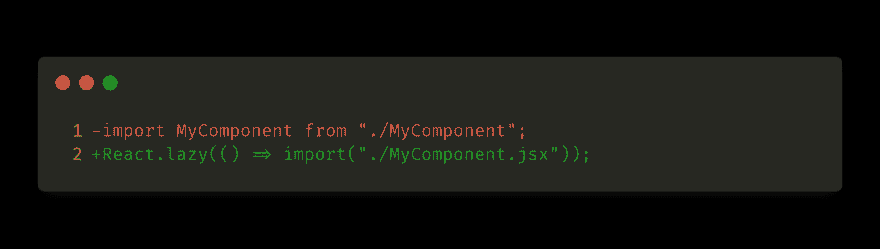

# 反应悬念—载入要点

> 原文：<https://dev.to/darthknoppix/react-suspenseload-the-essentials-5dio>

 

<figcaption>照片由[上](https://unsplash.com/@chuttersnap?utm_source=medium&utm_medium=referral)下[上](https://unsplash.com?utm_source=medium&utm_medium=referral)下</figcaption>

## 如何在 React 16 中轻松利用代码拆分

由于 React 团队在悬念方面所做的工作，代码拆分现在比以往任何时候都更容易。如果您今天没有进行代码拆分，那么让我们来看看为什么您可能想要拆分代码，这意味着什么，以及如何快速轻松地实现它。

### 为什么要用代码分割？

如果您在一个包中提供前端代码，那么每个特性和依赖项都会增加这个包的大小。一个更大的包意味着更多的代码被发送给你的用户。这可能会影响使用移动或低功耗设备的用户，尤其是使用数据上限的用户。这个问题有很多解决方案，但其中一个很有可能就是代码拆分。代码分割是分离出你的代码包的实践。目标是为用户提供合适的 JavaScript 包，仅此而已。对于一个单页面的 web 应用程序，这对于提供一个反应灵敏的用户体验和第一印象是至关重要的。一个应用程序需要下载一个大的整体包才能为用户提供任何价值，这是没有多大用处的。当用户盯着移动设备上的空白屏幕 5 秒钟等待你的应用程序加载时，他不太可能有耐心。他们很可能会去找你速度更快的竞争对手。

> 在您需要的时候，只加载您需要的内容。

当一些路径和/或组件需要在整个应用程序中使用大量的库时，代码分割尤其有用。您可能有一个非常轻量级的登录页面和一个显示大量数据的仪表板，其中的图表和数据可视化依赖于较重的库。当用户请求登录页面时，您不需要加载两者。那么如何在 React 16 中开始代码拆分呢？

### 如何使用代码分割？

从 React 16.6.0 开始，代码分割比以往任何时候都更容易。它现在内置在 React 中，只需很少的设置就能提供出色的体验。我们需要包装我们想要延迟加载的组件。然后我们需要做一些细微的改变。

 

<figcaption>从“导入我的组件”。/my component "；变成 React.lazy(() = > import("。/my component . jsx "))；</figcaption>

当 React 开始呈现 *MyComponent* 时，它将尝试导入它。组件周围的*悬念*包装器将在组件加载时提供一个后备，并在组件加载完成时将其换出。

#### **反应悬疑懒装例子**

下面是一个路由器示例，它有三个组件仪表板、区域设置和流，它们与同名的路由相关联，并且每个组件都使用一个大型库。