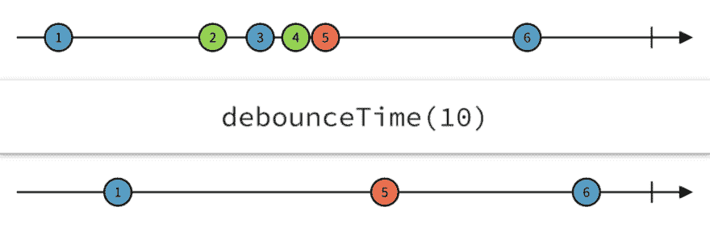
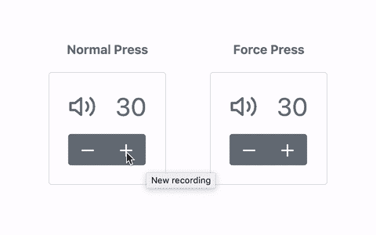
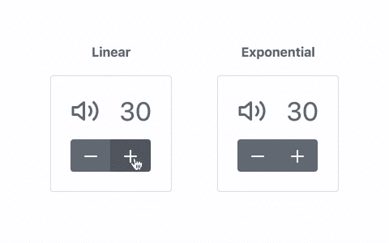
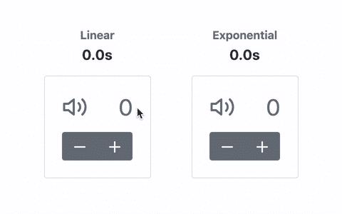
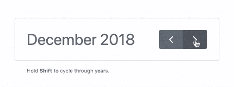

# 与 RxJS 的反应:压力

> 原文：<https://dev.to/bnevilleoneill/reactivity-with-rxjs-force-press-550g>

#### 使用 RxJS 实现按住

[](https://res.cloudinary.com/practicaldev/image/fetch/s--0npkRYZi--/c_limit%2Cf_auto%2Cfl_progressive%2Cq_auto%2Cw_880/https://cdn-images-1.medium.com/max/1024/1%2AjmVuNDbK13wDp5EY4ERb8w.jpeg)

[**RxJS**](http://reactivex.io/rxjs) 是一个用于 JavaScript 的反应式编程库，它利用可观察的序列来组成异步或基于事件的程序。作为[反应式扩展](http://reactivex.io/)项目的一部分，RxJS 的架构结合了来自 [*观察者*](https://en.wikipedia.org/wiki/Observer_pattern) 模式、 [*迭代器*](https://en.wikipedia.org/wiki/Iterator_pattern) 模式和*函数式编程*的最佳部分。

如果您以前使用过类似于 [Lodash](https://lodash.com/) 的 JavaScript 实用程序库，那么您可以将 RxJS 视为事件的 Lodash。

[RxJS](https://github.com/ReactiveX/rxjs) 不再是新的 JavaScript 库。事实上，在撰写本文时，该库的最新版本是 6.3.3，这是超过 105 个版本中的最新版本。

在本教程中，我们将利用使用 RxJS 的反应式编程来实现常规 DOM 鼠标事件的压力检测和处理。

下面是 [**代码沙箱**](https://codesandbox.io/s/z2pz3l222l) 上的 force press 演示。*导航到链接，按住音量控制键，查看原力按下的效果。*

[https://medium . com/media/b 78623965 ce A0 f 14 ea 9d 796 ad 078d 74d/href](https://medium.com/media/b78623965cea0f14ea9d796ad078d74d/href)

本教程不应该被用来代替一本合适的 RxJS 初学者指南，即使它简要地解释了一些反应式编程的概念和操作符。

[](https://logrocket.com/signup/)

### 可观测量和算符

**可观测量是 RxJS 架构的核心**。一个可观察对象可以被比作从一个源发出的可调用的值流或事件流。来源可以是时间间隔、AJAX 请求、DOM 事件等。

可观察到的:

*   *是懒惰的*(它直到被订阅才发出任何值)
*   可能有一个或多个*观察者*监听其值
*   可以通过一连串*操作符*转换成另一个可观察值

**算子是纯函数，可以从一个可观察的**返回一个新的可观察的。这种模式使得链操作符成为可能，因为一个可观察对象总是在最后返回。

事实上，RxJS 的最新版本在类上公开了一个. pipe()实例方法，该方法可用于将操作符链接为函数调用。

一个操作符基本上监听来自源可观察对象的值，在接收到的值上实现一些定义的逻辑，并基于该逻辑返回一个新的可观察对象发射值。

[](https://res.cloudinary.com/practicaldev/image/fetch/s--R8oCwm88--/c_limit%2Cf_auto%2Cfl_progressive%2Cq_auto%2Cw_880/https://cdn-images-1.medium.com/max/1024/0%2AngvYNnk9OlvyBZWo.png)

### 用力按下

*Force press 简单地指一个 DOM press 事件，如 keydown 和 mousedown，在相应的 DOM release 事件被激活之前持续一段时间，如本例中的 keyup 和 mouseup。*

 *> *简单来说，压力是按住的同义词。*

在用户界面中有许多地方可以应用压力。想象一下，一个音乐播放器部件有一组音量控件，您想将音量从 30 增加到 70。

基本上，您可以通过两种方式实现这一点:

1.  **按下音量增加按钮**几次，直到您达到所需的音量——这个按钮可能要按 40 次
2.  **用力按下*(按住)*音量调高按钮**直到达到或接近所需音量，然后调整直到达到所需音量

下面是这个例子的一个简单演示:

[](https://res.cloudinary.com/practicaldev/image/fetch/s--4wlU5JQv--/c_limit%2Cf_auto%2Cfl_progressive%2Cq_66%2Cw_880/https://cdn-images-1.medium.com/max/480/0%2A7X00He6Dh9ldxyyd.gif) 

<figcaption>比较多次按压来强制按压</figcaption>

### 用普通 JavaScript 强制按下

用普通的 JavaScript 实现 force press，类似于我们上面所做的，并不是一项艰巨的任务。这一实施将需要:

*   监听音量控制按钮上的鼠标按下事件
*   使用 setInterval()不断调整音量，直到发生 mouseup 事件

假设音量控件的标记如下所示:

[https://medium . com/media/0 de 2 bbd Fe 94 c 53d 947 f 457 f 0 f 7 B3 F2 ca/href](https://medium.com/media/0de2bbdfe94c53d947f457f0f7b3f2ca/href)

下面的代码片段展示了使用普通 JavaScript 实现 force press 的样子。*为简洁起见，省略了* *increaseVolume()和* *decreaseVolume()函数的实现:*

[https://medium . com/media/6332127 c 560 EAF 08546 DC 6088 ee 26 DC 5/href](https://medium.com/media/6332127c560eaf08546dc6088ee26dc5/href)

这个使用普通 JavaScript 的 force press 实现看起来非常简单，因此，像 RxJS 这样的库似乎没有必要。

对代码片段的快速观察将显示，音量将以相等的时间间隔连续调整相等的量，直到触发 mouseup 事件。这是一个线性级数。

然而，当我们想要对压力进行更高级的控制时，实现就变得复杂了。例如，假设我们想要体积的某种形式的指数级数。这意味着压力越大，音量变化越快。

下面是一个简单的例子来说明两者的区别:

[](https://res.cloudinary.com/practicaldev/image/fetch/s--0HmACrop--/c_limit%2Cf_auto%2Cfl_progressive%2Cq_66%2Cw_880/https://cdn-images-1.medium.com/max/480/0%2Aon9zDQ6NOJiOAkAf.gif)

使用普通的 JavaScript，像指数音量级数这样的实现将是非常具有挑战性的，因为您可能必须跟踪压力持续多长时间，以便确定音量应该变化得多快。

像这样的情况最适合 RxJS 库。RxJS 带来了更强大的能力来组合可观察序列，以处理复杂的异步任务。

### 用 RxJS 强制按压

让我们继续使用 RxJS 使用线性体积级数重新实现压力。下面是它的样子:

[https://medium . com/media/11 C4 b 30650279 f 19827 f 30 bec 51 bf8 CD/href](https://medium.com/media/11c4b30650279f19827f30bec51bf8cd/href)

仔细观察这段代码会发现，我们从 RxJS 库中导入了一些函数和操作符。假设您已经安装了 RxJS 作为项目的依赖项。

代码片段中有一些重要的部分值得强调。

**第七行**

```
const documentMouseup$ = fromEvent(document, 'mouseup'); 
```

fromEvent helper 函数创建一个新的 observable，每次在 DOM 节点上触发指定事件时都会发出该 observable。

例如，在上面的行中，fromEvent 创建了一个 observable，每当在文档节点上触发 mouseup 时，该 observable 就会发出一个 Event 对象。第 21 行中还使用了 fromEvent 函数来监听音量控制按钮上的 mousedown 事件。

请注意，可观察对象存储在名为 documentMouseup$的常量中。通常的做法是在用于存储可观察变量的变量名称后附加一个$。

**第 9–15 行**

```
const forcepress = fn => {
  return timer(500, 100).pipe(
    startWith(fn()),
    takeUntil(documentMouseup$),
    map(fn)
  );
}; 
```

forcepress()函数将处理函数 fn 作为其参数，并返回一个可观察值。返回的可观察值是使用 timer()函数从计时器创建的，并使用一系列操作符进行转换。

让我们逐行分解代码:

```
timer(500, 100) 
```

这个 timer()函数调用创建了一个新的 observable，它发出一个从零(0)开始的 count 整数。第一个整数在 500 毫秒后发出，然后后续整数以 100 毫秒的间隔发出。

的。可观察对象上的 pipe()方法用于从左到右将操作符作为常规函数进行链接。

**从**开始

```
timer(500, 100).pipe(
  startWith(fn())
) 
```

startWith()操作符接收一个值作为参数，该值应该由可观察对象首先发出。这对于从可观察值中得出初始值很有用。

这里，startWith()操作符用于执行处理程序 fn 并发出返回值。

**take until**T2】

```
timer(500, 100).pipe(
  takeUntil(documentMouseup$)
) 
```

takeUntil()运算符用于根据另一个可观察对象停止从源可观察对象发出值。它接收一个可观察值作为它的参数。当这个可观察对象发出它的第一个值时，源可观察对象不再发出更多的值。

在我们的代码片段中，documentMouseup$ observable 被传递给 takeUntil()操作符。这确保了在文档节点上触发 mouseup 事件时，计时器不会发出更多的值。

**地图**T2】

```
timer(500, 100).pipe(
  map(fn)
) 
```

map()操作符与 JavaScript 数组的 Array.map()非常相似。它将一个映射函数作为其参数，该函数从源可观察对象接收发出的值，并返回一个转换后的值。

这里，我们简单地将 fn 函数作为映射函数传递给 map()操作符。

**第 21–26 行**

```
fromEvent($button, 'mousedown').pipe(
  switchMap(evt => {
    evt.preventDefault();
    return forcepress(fn);
  })
).subscribe(); 
```

这些行只是使用 switchMap()操作符将音量控制按钮上的 mousedown 事件映射到 force press 操作。

它首先在 button 元素上创建一个可观察的 mousedown 事件。接下来，它使用 switchMap()操作符将发出的值映射到将发出其值的内部可观察对象。在我们的代码片段中，执行 forcepress()函数会返回内部可观察对象。

注意，我们按照定义将 fn 传递给了 forcepress()函数。同样重要的是要注意，我们使用 subscribe()方法订阅了可观察对象。记住，可观察的是懒惰的。如果它们没有被认购，就不会产生任何价值。

### 提高力压

使用 RxJS 操作符可以做一些事情来提高压力。一个改进将是实现指数体积级数，而不是我们之前看到的线性级数。

### 指数体积级数

用 RxJS 做到这一点非常简单。让我们假设音量调节功能的当前实现如下所示:

[https://medium . com/media/6b 27 D8 affe 951571 ad 470903 a 6582 c 15/href](https://medium.com/media/6b27d8affe951571ad470903a6582c15/href)

我们可以稍微修改音量调节功能，以接受音量步长因子。这些修改将使我们有可能达到指数级数，我们马上就会看到。

以下代码片段显示了这些修改:

[https://medium . com/media/e 691 e 432 f 95 b 31 f 0 f 789862 cbba 99 ebe/href](https://medium.com/media/e691e432f95b31f0f789862cbba99ebe/href)

经过这些修改，我们现在可以向音量调节函数传递一个因子来指定音量应该调节多少。在不传递因子的情况下调用这些函数只会一步一步地调整音量。

现在，我们可以修改前面创建的 forcepress()函数，如下所示:

[https://medium . com/media/e 06 eecb 1891 a 9795722 c 84 a6 ba 8 BD E0 c/href](https://medium.com/media/e06eecb1891a9795722c84a6ba8bde0c/href)

通过这种修改，我们已经成功地在音量控制按钮上实现了具有指数音量级数的强制按压。

**computedFactor**

这里我们添加了一个名为 computedFactor 的简单函数，用于计算音量调节因子。这个函数采用一个整数参数 n 来计算因子。

我们只是计算这个表达式:

```
Math.round(Math.pow(1.25 + n / 10, 1 + n / 5)); 
```

这里，我们使用 Math.pow()根据 n 的值逐步计算指数。可以修改该表达式以适应所需的指数级数。比如可以这么简单:

```
Math.pow(2, n); 
```

另外，请注意，我们在这里使用 Math.round()来确保我们得到一个整数因子，因为计算涉及到许多浮点数。

下面是 computedFactor()函数返回的前十个值的汇总。这似乎是计算因子的完美函数:

```
0 => Math.round(Math.pow(1.25, 1.0)) => 1
1 => Math.round(Math.pow(1.35, 1.2)) => 1
2 => Math.round(Math.pow(1.45, 1.4)) => 2
3 => Math.round(Math.pow(1.55, 1.6)) => 2
4 => Math.round(Math.pow(1.65, 1.8)) => 2
5 => Math.round(Math.pow(1.75, 2.0)) => 3
6 => Math.round(Math.pow(1.85, 2.2)) => 4
7 => Math.round(Math.pow(1.95, 2.4)) => 5
8 => Math.round(Math.pow(2.05, 2.6)) => 6
9 => Math.round(Math.pow(2.15, 2.8)) => 9 
```

**与来自**的最新消息

仔细观察 forcepress()函数会发现这一行:

```
map(fn) 
```

已被替换为这些行:

```
withLatestFrom(
  timer(1000, 500).pipe(startWith(0))
),
map(([t, n]) => fn(computedFactor(n))) 
```

这里，我们引入了另一个 RxJS 操作符 LatestFrom()。它将另一个可观测值作为它的第一个参数。该运算符对于将多个可观察值作为一个值数组发出来很有用。

但是，它只在源可观测值每次发出时发出，每次按顺序发出所有可观测值的最新值。

在我们的示例中，我们将另一个用 timer()函数创建的可观察对象传递给 withLatestFrom()操作符。

可观察计时器在 1000 毫秒后发出一个整数，然后每隔 500 毫秒发出一个整数。startWith()操作符通过管道传递给计时器可观察对象，使其从初始值 0 开始。

传递给 map()运算符的 mapper 函数需要一个数组作为其第一个参数，因为 withLatestFrom()运算符发出一个值数组。

这里又是地图操作符:

```
map(([t, n]) => fn(computedFactor(n))) 
```

在这个代码片段中，t 代表第一个可观察对象发出的值，在本例中是源可观察对象。n 代表第二个可观察对象发出的值，即计时器。

最后，我们像以前一样调用 fn()，只是这次我们传递一个计算的音量调整因子，该因子是通过用 n 调用 computedFactor()函数得到的。

下面是线性级数和指数级数之间的比较，显示了音量从 0 增加到 100 的持续时间:

[](https://res.cloudinary.com/practicaldev/image/fetch/s--TIh6C9lO--/c_limit%2Cf_auto%2Cfl_progressive%2Cq_66%2Cw_880/https://cdn-images-1.medium.com/max/480/0%2AywiOmMdv7kY5agAk.gif)

### 增强力按下终止

到目前为止，一旦在文档节点上触发了 mouseup 事件，我们就终止强制按下音量调整。但是，我们可以进一步增强它，以允许当体积达到任何限制(0 或 100)时终止压力。

我们可以创建一个自定义的操作符函数，我们可以通过管道将它连接到源可观察对象，以防止它在发生以下任何情况时发出:

*   mouseup 事件在文档节点上触发
*   音量达到 0 或 100

下面是名为 limitVolume()的自定义运算符函数:

[https://medium . com/media/df9f 41326 f 7 bb 50101 e9 be 05d 426d 614/href](https://medium.com/media/df9f41326f7bb50101e9be05d426d614/href)

在这里，我们创建了两个计时器观察值，即 timerUntilMouseup$和 timerWithinLimits$它们分别根据我们所述的两个条件终止。

然后，我们使用 zip()和 last()操作符从两个可观测量中合成 volumeStop$ observable，以确保该可观测量只为终止的两个可观测量中的第一个发出一个值。

最后，我们在 limitVolume()自定义操作符函数中使用 takeUntil()操作符来确保当 volumeStop$ observable 发出第一个值时，source$ observable 终止。

请注意，limitVolume()返回一个函数，该函数将一个可观察对象作为其参数，并返回另一个可观察对象。这个实现对于将其用作 RxJS 操作符是至关重要的。

使用 limitVolume()自定义操作符，我们现在可以修改 forcepress()，如下所示:

[https://medium . com/media/ed 39 a 337 be 4 CEB 60 c 9d 359 B2 ce 3c f 521/href](https://medium.com/media/ed39a337be4ceb60c9d359b2ce3cf521/href)

### 多力按为日历

在实施压力方面已经做了很多工作。然而，让我们考虑另一个涉及日历月和日历年循环的 force press 演示。

假设您正在构建一个日历小部件，并希望用户在日历上循环显示月份和年份。这听起来像是一个很好的压力用例。

以下是演示的截图:

[](https://res.cloudinary.com/practicaldev/image/fetch/s--liu3x7fj--/c_limit%2Cf_auto%2Cfl_progressive%2Cq_66%2Cw_880/https://cdn-images-1.medium.com/max/480/0%2AHW5PNJPXrU0dbBxC.gif)

在这个演示中，在 force press 中加入了一点香料来实现按键检测。请注意，每当按下 SHIFT 键时，周期就会从月切换到年。

此外，请注意，几个月的循环速度比几年的循环速度更快。

用 setTimeout()和普通的 JavaScript 实现这样的东西会非常复杂。然而，使用 RxJS 要容易得多。

下面的代码片段显示了实现。*为简洁起见，省略了月和年循环功能:*

[https://medium . com/media/5951 c99d 3198 c 1245 D5 d 185474 BBC 04 e/href](https://medium.com/media/5951c99d3198c1245d5d185474bbc04e/href)

我将让您来弄清楚这个示例中的代码片段是如何工作的。不过可以在 [**代码沙箱**](https://codesandbox.io/s/ly84kp7y4q) 上获得现场演示。

[https://medium . com/media/b2cf 425764 c 0873700756338 a7 CDF 67d/href](https://medium.com/media/b2cf425764c0873700756338a7cdf67d/href)

### 结论

RxJS 是一个非常强大的库，用于编写异步事件和序列。它可以用来构建复杂的异步程序，而仅仅使用普通的 JavaScript 无法轻松构建这些程序。

在本教程中，我们已经学习了如何使用 RxJS 实现改进的压力按压(*按住*)。尽管我们关注的是鼠标事件上的强制按下，但同样的情况也可以在键盘事件上实现。

#### 拍拍&跟着

如果你觉得这篇文章很有见地，如果你不介意的话，请随意鼓掌。

你也可以在 Medium ( [Glad Chinda](https://medium.com/u/ddcd0e9719e5) )上关注我，获取更多对你有帮助的有见地的文章。你也可以在推特上关注我( [@gladchinda](https://twitter.com/@gladchinda) )。

***享受编码……***

### Plug: [LogRocket](https://logrocket.com/signup/) ，一款适用于网络应用的 DVR

[](https://logrocket.com/signup/)

<figcaption>[https://logrocket.com/signup/](https://logrocket.com/signup/)</figcaption>

LogRocket 是一个前端日志工具，可以让你回放问题，就像它们发生在你自己的浏览器中一样。LogRocket 不需要猜测错误发生的原因，也不需要向用户询问截图和日志转储，而是让您重放会话以快速了解哪里出错了。它可以与任何应用程序完美配合，不管是什么框架，并且有插件可以记录来自 Redux、Vuex 和@ngrx/store 的额外上下文。

除了记录 Redux 操作和状态，LogRocket 还记录控制台日志、JavaScript 错误、堆栈跟踪、带有头+正文的网络请求/响应、浏览器元数据和自定义日志。它还使用 DOM 来记录页面上的 HTML 和 CSS，甚至为最复杂的单页面应用程序重新创建像素级完美视频。

免费试用。

* * **