# 用 Gatsby + GraphQL 从 JSON 文件中读取数据

> 原文：<https://dev.to/emmabostian/reading-data-from-a-json-file-with-gatsby--graphql-58a2>

**目标:**使用`gatsby-transformer-json`从本地 JSON 文件中读取数据，并在 React 组件中动态生成列表项。

**用例:**我有一个侧边栏 React 组件，它接受侧边栏列表项(对象)的数组，并从它们的数据中动态生成列表项。我不想硬编码所有的侧边栏值，因为这会很快变得难以控制。因此，我希望有一个 JSON 文件，可以在其中快速添加新的列表项，并将其传播到 UI。

本博客假设你已经创建了一个 Gatsby 项目。你可以使用 [Gatsby CLI](https://www.gatsbyjs.org/) 快速启动一个新的应用程序。我的 sidebar.js 组件正在被导入到 index.js starter 文件中，该文件是在运行 CLI 命令后生成的。

1.  创建存储 JSON 数据的目录和 JSON 文件。我的会住在`src/data/sidebarItems.json`里面。

我的 JSON 数据具有以下结构:

[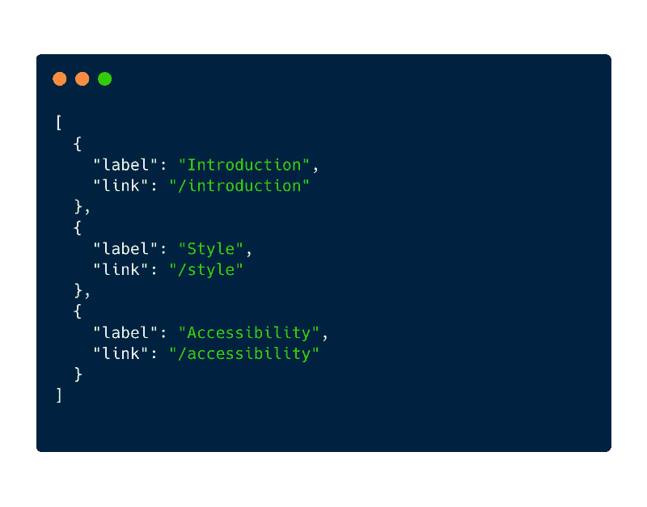](https://res.cloudinary.com/practicaldev/image/fetch/s--Cnv-zmgL--/c_limit%2Cf_auto%2Cfl_progressive%2Cq_auto%2Cw_880/https://cdn-images-1.medium.com/max/800/1%2AvKxpJ3gse6Bo5W1KxOcmFA.png)

1.  接下来，安装`gatsby-transformer-json`和`gatsby-source-filesystem`。

```
npm install gatsby-transformer-json gatsby-source-filesystem --save 
```

1.  在`gatsby-config.js`文件中，添加以下内容:

[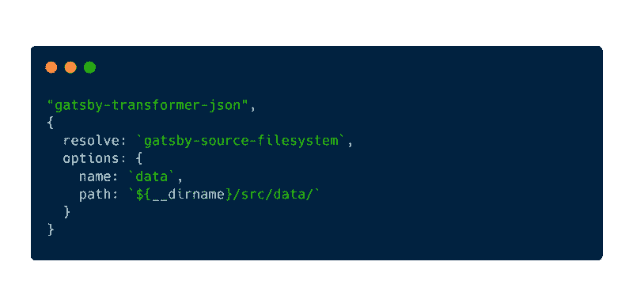](https://res.cloudinary.com/practicaldev/image/fetch/s--v_N3S_1q--/c_limit%2Cf_auto%2Cfl_progressive%2Cq_auto%2Cw_880/https://cdn-images-1.medium.com/max/800/1%2A693UhT8gmukxqvxEkxhlow.png)

`path`值将是包含 JSON 文件的文件夹的链接。

1.  接下来，打开要使用数据的组件。我住在`sidebar.js`里面

首先，从`gatsby`进口`StaticQuery`和`graphql`。我们需要这些来访问我们的 JSON 数据。

[](https://res.cloudinary.com/practicaldev/image/fetch/s--2wx-EcUI--/c_limit%2Cf_auto%2Cfl_progressive%2Cq_auto%2Cw_880/https://cdn-images-1.medium.com/max/800/1%2Aj_xHIft1jC-FX__9BaS6TA.png)

我们将使用 Gatsby 的[静态查询](https://www.gatsbyjs.org/docs/static-query/)来包装一个[无状态功能反应组件](https://itnext.io/react-component-class-vs-stateless-component-e3797c7d23ab)。

在`<StaticQuery />`元素内部，添加两个属性:`query`和`render`。

# 查询属性

查询属性的值如下所示:

[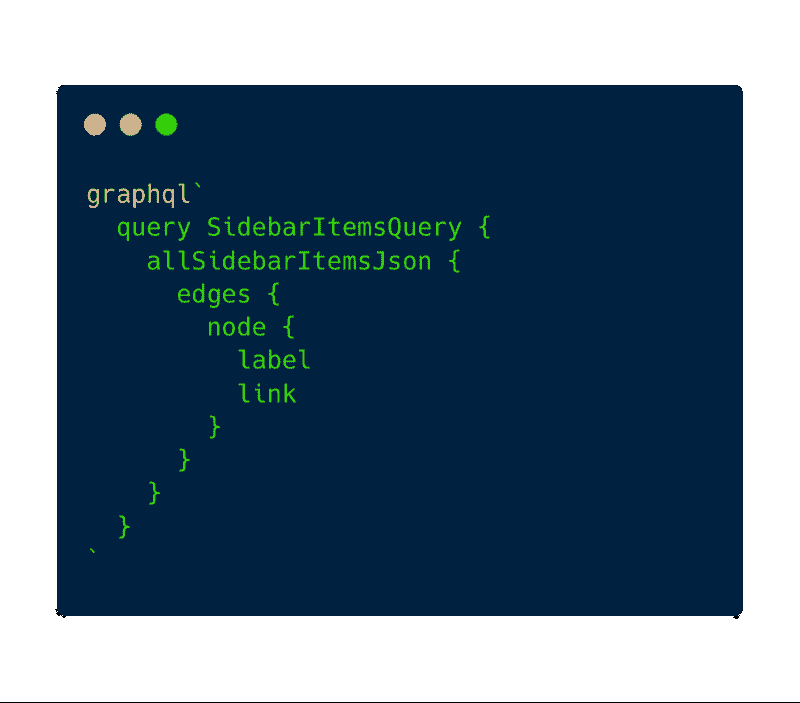](https://res.cloudinary.com/practicaldev/image/fetch/s--DE44BZuJ--/c_limit%2Cf_auto%2Cfl_progressive%2Cq_auto%2Cw_880/https://cdn-images-1.medium.com/max/800/1%2AeiTBvfkzaRlA_4Ap9RYUfw.png)

我们正在创建一个名为`SidebarItemsQuery`的查询(您可以随意命名该查询；我选择命名为`{dataReturned}Query`。返回的数据将是侧栏条目，因此查询名称将是`SidebarItemsQuery`。

接下来我们有`allSidebarItemsJson`。您必须根据您的 JSON 文件名来命名它。自从我有了`SidebarItems.json`，这就叫做`allSidebarItemsJson`。这是默认的命名约定，但是您可以在`gatsby-config.js`中更改它(更多细节请参见最后的“更改默认的 gatsby-transformer-json 命名约定”一节)。

其中有`edges`、`node`，以及我们希望从查询中返回的值。在我的例子中，由于我创建了一个侧边栏，其中有一列指向不同内容的链接，所以我有一个标签和一个链接(参见下面的“GraphQL 命名法”一节，了解边和节点的高级定义)。

# 渲染属性

现在我们有了查询，让我们定义呈现属性。该属性将接受一个参数:来自我们刚刚编写的查询的数据。它将返回我们希望无状态功能组件呈现的 JSX。

*注意:您可以将 JSX 放在空括号`<>...</>`中，作为[反应片段](https://reactjs.org/docs/fragments.html)的简写。这允许您返回多个子组件，而无需向 DOM 追加额外的节点。*

[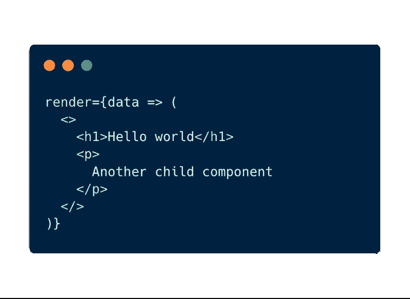](https://res.cloudinary.com/practicaldev/image/fetch/s--KojkGUiJ--/c_limit%2Cf_auto%2Cfl_progressive%2Cq_auto%2Cw_880/https://cdn-images-1.medium.com/max/800/1%2AR_nbNg-kG2m5CIaHiLrYHA.png)

这和写这个是一样的:

[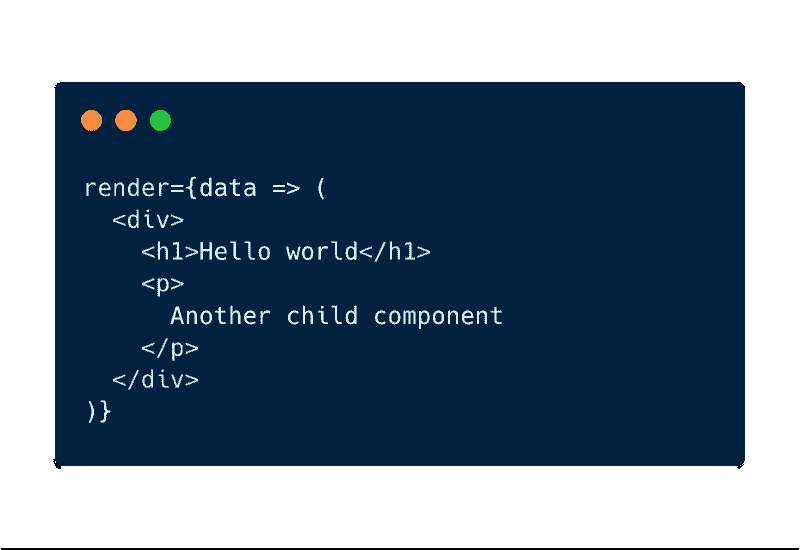](https://res.cloudinary.com/practicaldev/image/fetch/s--wEQrelWP--/c_limit%2Cf_auto%2Cfl_progressive%2Cq_auto%2Cw_880/https://cdn-images-1.medium.com/max/800/1%2A6kjAsbQwcXEAJ7-V6w3pjA.png)

现在，我想迭代这些节点，并为每个标签创建一个`<h1>`；它可能看起来像这样。我创建了一个`getSidebarLabels`助手函数，它接收数据并对其进行迭代以创建三个`<li>`项。

[](https://res.cloudinary.com/practicaldev/image/fetch/s--aGTrz-hi--/c_limit%2Cf_auto%2Cfl_progressive%2Cq_auto%2Cw_880/https://cdn-images-1.medium.com/max/800/1%2A8z2WjMlR_GJVa6MMhV-4Eg.png)

助手功能如下:

[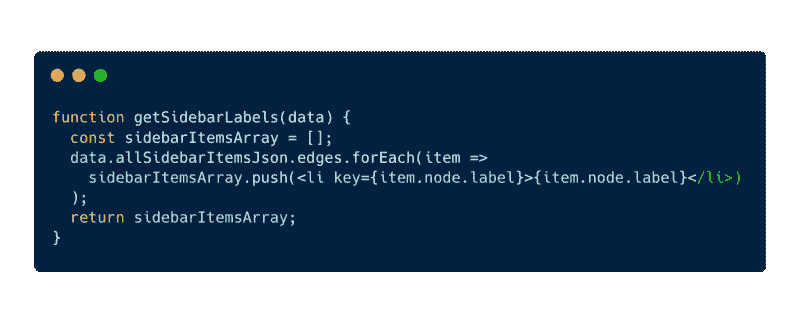](https://res.cloudinary.com/practicaldev/image/fetch/s--qd7IeAy9--/c_limit%2Cf_auto%2Cfl_progressive%2Cq_auto%2Cw_880/https://cdn-images-1.medium.com/max/800/1%2A0VdQ2FVDtP3_L5Q4iYJCTQ.png)

正如我们所料，DOM 中添加了三个列表项。

[](https://res.cloudinary.com/practicaldev/image/fetch/s--cdo7wz68--/c_limit%2Cf_auto%2Cfl_progressive%2Cq_auto%2Cw_880/https://cdn-images-1.medium.com/max/800/1%2ARFYcaCmQSFKIZhQi_M0_JA.png)

这里是`sidebar.js`中无状态功能组件的完整代码。

[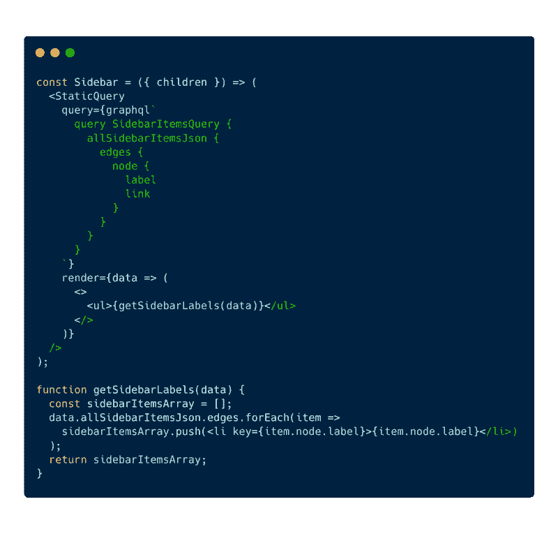](https://res.cloudinary.com/practicaldev/image/fetch/s--JZClROFN--/c_limit%2Cf_auto%2Cfl_progressive%2Cq_auto%2Cw_880/https://cdn-images-1.medium.com/max/800/1%2Aki5QO0Q9j-Wb6LFJfNb9Zw.png)

# GraphQL 命名法

[GraphQL](https://graphql.org/learn/) 用图来表示数据。你可以把它想象成这样:

[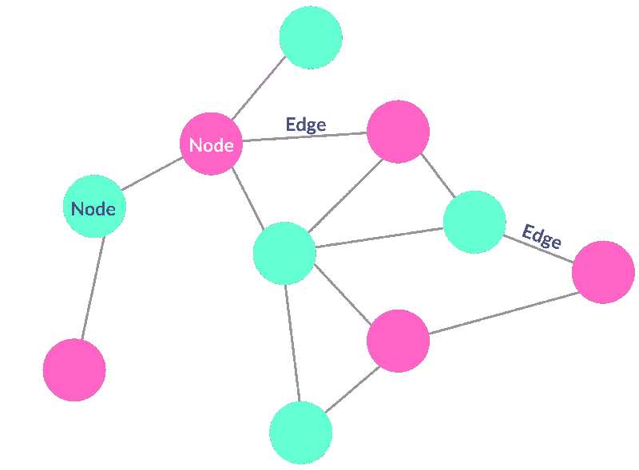](https://res.cloudinary.com/practicaldev/image/fetch/s--0nqKHL3j--/c_limit%2Cf_auto%2Cfl_progressive%2Cq_auto%2Cw_880/https://cdn-images-1.medium.com/max/800/1%2Ae72Er_KPHQtHtb92TBRk7g.png)

**边:**连接图中不同节点的线，代表一种关系。

**节点:**记录或数据。

让我们举一个像 Medium 这样的博客网站的例子。在这个用例中，节点可以被认为是博客文章或用户。

[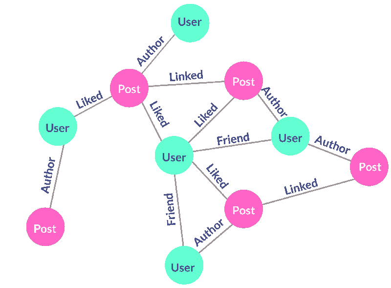](https://res.cloudinary.com/practicaldev/image/fetch/s--SlAfZpAR--/c_limit%2Cf_auto%2Cfl_progressive%2Cq_auto%2Cw_880/https://cdn-images-1.medium.com/max/800/1%2AtAd1ZPpiNUKaQDh_GS-P3Q.png)

我不是 GraphQL 方面的专家；我还在学！如果我说错了什么，请在下面留下你的评论。

# 改变默认的 gatsby-transformer-json 命名约定

要更改 JSON 查询，请转到`gatsby-config.js`，用下面的对象替换`"gatsby-transformer-json"`行。

在选项对象内部，更新`typeName`键；这可以是任何字符串值。这里，我们放入了静态值`Json`，尽管需要注意的是这只是一个字符串值，所以如果你愿意，你可以称它为 Cats。

[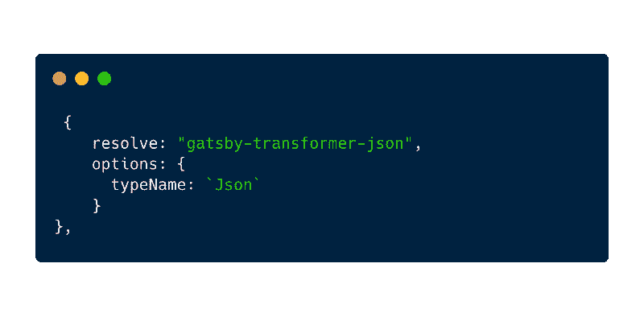](https://res.cloudinary.com/practicaldev/image/fetch/s--q-KKm7oZ--/c_limit%2Cf_auto%2Cfl_progressive%2Cq_auto%2Cw_880/https://cdn-images-1.medium.com/max/800/1%2AtunJXAiR82_PwusAV-Axyw.png)

现在，在我们创建 GraphQL 查询(在我的例子中是`sidebar.js`)的文件内部，用`all{typeName}`引用查询中新命名的`typeName`值。

[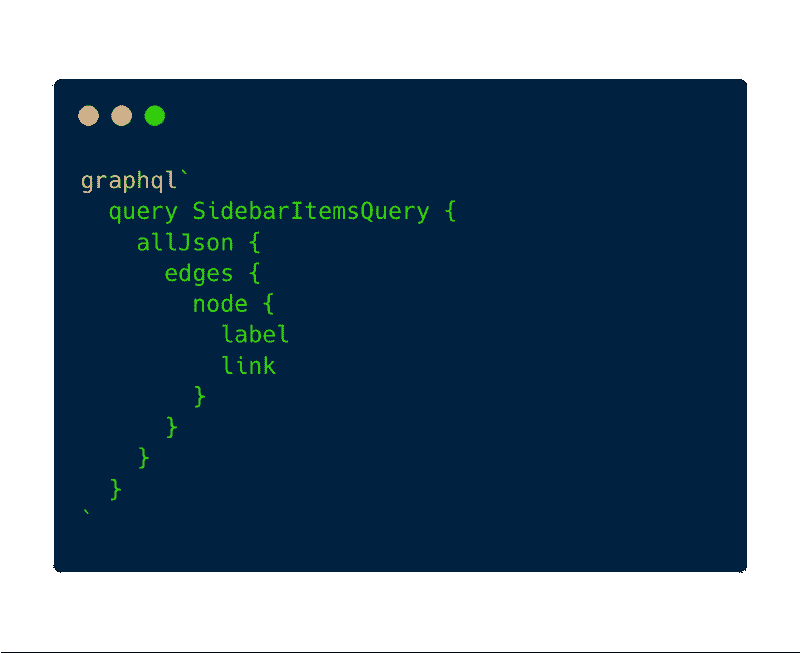](https://res.cloudinary.com/practicaldev/image/fetch/s--hBxxzGzg--/c_limit%2Cf_auto%2Cfl_progressive%2Cq_auto%2Cw_880/https://cdn-images-1.medium.com/max/800/1%2AllQsOLJBZgBDFVrNhutDsA.png)

* * *

现在您知道了如何使用`gatsby-transformer-json`从本地 JSON 文件中读取数据。我写这篇博文主要是为了我自己的利益(我以后可能需要引用它)，所以可能会有一些小错误。如果你发现了什么，请在下面的评论中告诉我。:)