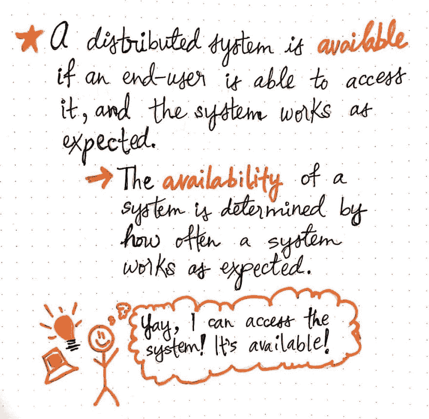
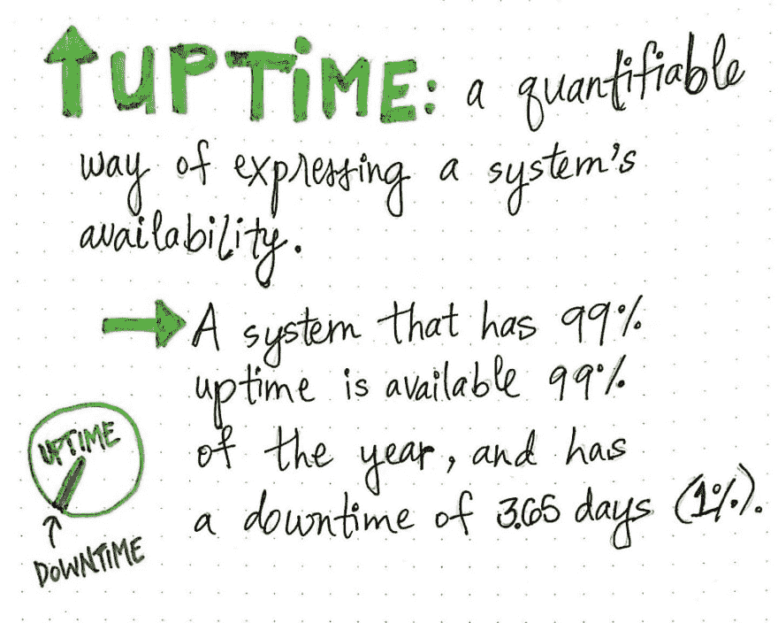
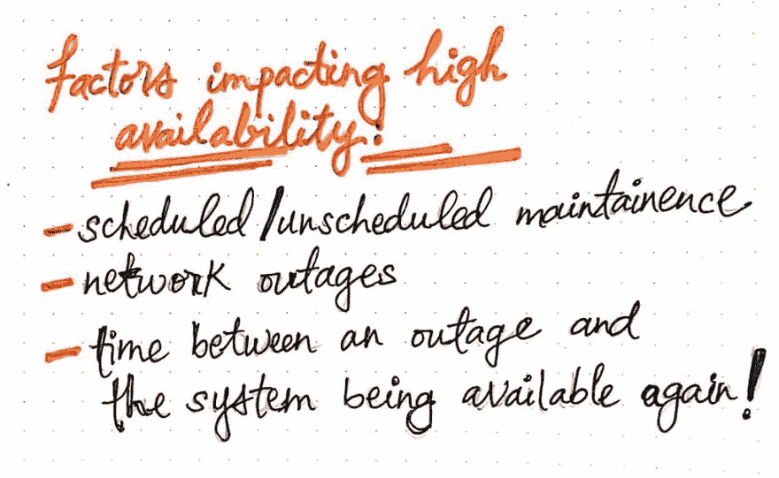
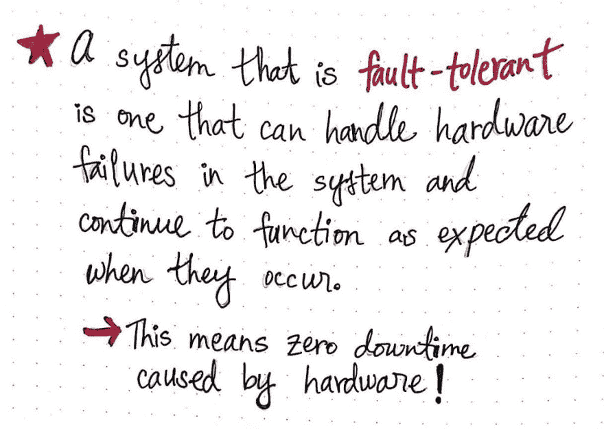
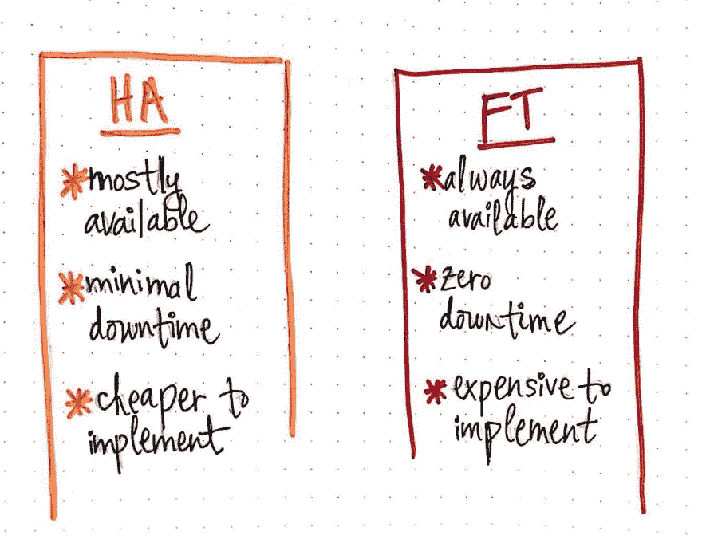
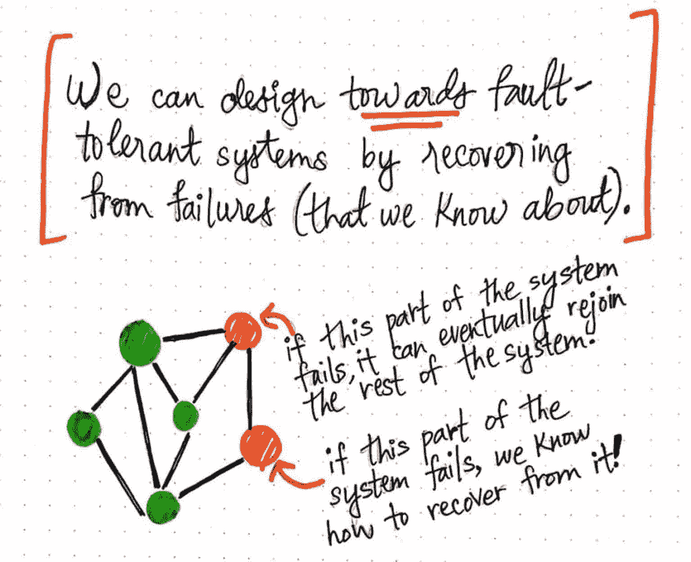

# 现成可用的分布式系统

> 原文：<https://dev.to/vaidehijoshi/ready-and-available-distributed-systems-bck>

当大多数人谈论分布式系统时，他们可以对系统如何运行做出某些假设。例如，我们通常可以(安全地)假设一个分布式系统——不管它是如何复杂地建立或架构的——可以被它的用户使用。

乍一看，这似乎是非常明显的，但是随着我们对分布式系统的深入了解，我们越来越多地遇到这样的情况，我们的系统实际上对我们的最终用户是不可用的。这使得一个系统有点不稳定，不确定，不可靠。当然，我们都不希望这样——这听起来很糟糕。当我们设计和构建一个系统时，我们希望(也许还会祈祷！)可以说它能用自己的双脚站立起来。在分布式系统的世界中，系统的可靠性和自给自足的程度与它的构建和它能够处理的情况密切相关。

一个可靠的系统是一个能够经受住障碍的系统，这是我们所有人努力的目标。但是在可靠性和系统架构背后有一整套语言，我们还没有深入研究，这些术语和概念在这个领域出现了很多。因此，让我们深入了解什么是可靠的系统，以及我们如何谈论它们！

#### 准备好，设定好，可供使用

基本上，一个可靠的分布式系统是一个以特定方式运行的系统。根据我们正在构建的系统类型和我们期望它做什么，“可靠性”可以有不同的定义(更不用说一些系统可能比其他系统更强调可靠性的某些方面)。

<figure> 

<figcaption>当我们谈论可用性时我们谈论什么</figcaption>

</figure>

但是不管我们的系统要做什么，或者它是如何构建的，有一点是肯定的:我们希望我们的用户能够访问它！在计算世界中，如果一个系统能够被其最终用户访问(并且在被访问时表现出预期的行为)，则称其为 ***可用*** 。

从用户的角度来看，系统行为正确的频率越高，就越能决定系统的 ***可用性*** 。通常，这可能就像用户能够访问系统，或者能够检索一些数据并与之交互一样简单；最终，系统的可用性完全取决于系统到底做什么。但是，作为一个基本的基线，我们可以假设用户必须能够在*基础*级别上与系统交互——例如，他们应该能够访问他们的帐户或网页或应用程序——以便系统被认为是“可用的”。

现在，作为系统的设计者和创造者，我们在构建和维护分布式系统时认真考虑可用性是有意义的。显然，我们希望我们的用户能够访问我们的系统，而且最有可能的是，我们会第一个知道我们的(也许生气？)用户无法像预期的那样访问系统。

幸运的是，我们可能已经遇到了一个指标，它可以帮助我们评估和量化我们在满足最终用户期望和需求方面的表现！ ***正常运行时间*** 是我们以可量化的方式表达系统可用性的一种方式。

<figure> 

<figcaption>正常运行时间:一个定义(加上，一些数学！)</figcaption>

</figure>

我们可以根据一年中系统对用户可用的时间占总时间的百分比来计算系统的正常运行时间。例如，如果一个系统全年的正常运行时间为 99%，有时也称为“两个九”，我们可以推断出它在一年中的 1%的时间里不可用，这相当于 3.65 天(我们知道这一点是因为 365 乘以 0.01 等于 3.65 天)。在这个例子中，一年中系统*不*可供用户访问的可量化的 1%被称为 ***停机时间*** ，或者与正常运行时间相反。

停机是分布式系统不可避免的一部分，尽管我们当然想避免它！试图为我们的用户避免停机的一个重要部分是理解停机的原因，然后围绕它进行计划。因此，让我们仔细看看在实现可用性方面有哪些因素阻碍了我们的发展！

#### 抵制和容忍过失

当谈到创建可用的分布式系统时，我们的目标都是创建始终启动和运行的可用系统，并且可供我们的用户访问。但是完全可用是很难实现的，主要是因为一些恼人的，但始终存在的因素。

首先，有时阻止我们 100%正常运行和完全可用的东西是…我们自己创造的！更具体地说，我们可能会发现自己将系统的一部分脱机，以便提供一些维护。当我们执行维护时，我们几乎总是能够控制我们系统的某个部分何时需要变得不可用，也称为 ***计划维护*** 。

但是，作为互联网(及其明面上！)变得越来越分散，许多系统实际上依赖于*其他*系统的某些部分服务；当第三方服务和外部服务离线进行维护时，我们可能对此没有任何发言权(这使其成为 ***非计划维护*** )，但这肯定会影响我们的正常运行时间。但是维护甚至不是阻碍我们前进的最可怕的因素，因为在大多数情况下，我们事先就知道维护和潜在的停机时间(也许我们正是对此负责的人！).

<figure> 

<figcaption>影响高可用性的因素</figcaption>

</figure>

相反，我会说是 ***网络中断*** ，或者更大的分布式系统网络中的故障，才更令人生畏。当网络出现问题时，不幸的是，我们很难控制或注意到它！通常，这可能是硬件问题，甚至超出了我们的修复能力。例如，如果数据中心的某个地方断电了，而这个数据中心里有一台运行着我们所依赖的进程的服务器……那么，对于*阻止这种情况发生，我们也无能为力。*

与网络中断相关的另一个级联因素是，即使中断发生并(最终)自行解决，在中断 后的某个 ***时间，系统仍在重启，因此无法再次完全可用。例如，如果一个进程因为网络中断而被终止或终止，一旦网络最终*恢复*，它可能需要重新启动自己或以某种方式重启——这是一些额外的时间，最终也会影响我们的停机时间！***

<figure> 

<figcaption>什么是“容错”分布式系统？</figcaption>

</figure>

显然，有许多因素会增加我们的停机时间，并阻止我们实现高可用性。当然，从软件的角度来看，系统内部可能会出问题。但是从*硬件*的角度来看，事情也可能出错！

那么，我们能做什么呢？这就是容错系统开始变得非常好的地方。一个 ***容错系统*** 是一个能够处理和说明来自我们系统内部的故障的系统；即使出现与硬件相关的故障，某些东西停止运行，系统也能继续按预期运行！出于本文的目的，让我们将 ***故障*** 视为与硬件相关的故障(在本系列的后面，我们将更多地讨论不同类型的故障和失效，包括与软件相关的)。

如果我们停下来认真思考一下，我们可能会意识到，这消除了妨碍我们更早实现完全可用性的两个主要因素:不再有硬件(网络)中断，也不再需要花费时间来尝试恢复。换句话说，没有因硬件故障导致的停机时间！

如果这听起来好得不像是真的…嗯，那是因为有时它确实是真的。

#### 取得一种可利用的、宽容的平衡

容错很难实现，而且通常代价很大。实际上有一些现代的[服务](https://www.ibm.com/support/knowledgecenter/en/SSPHQG_7.2/concept/ha_concepts_fault.htm)提供完全容错的硬件。然而，其内部机制可能相当复杂，通常涉及检测某个硬件何时出现故障，并立即提供一个已经安装的备份/替换硬件，并准备好在它确实出现故障时进入故障部分。如果这听起来让你精疲力尽，不要担心——这听起来对我来说也有很多事情要做！

<figure> 

<figcaption>高可用系统与容错系统</figcaption>

</figure>

事实是，创建一个始终可用且零宕机的容错系统不仅实施起来成本高昂，而且有时可能不值得。停机本身并不一定是件坏事，尤其是当我们的停机时间比正常运行时间少的时候。

我们可以尝试构建一个*大部分*可用的系统，也就是通常所说的 ***高可用系统*** ，而不是尝试完全可用。我们的目标是尽可能减少我们的停机时间，而不要让我们自己耗尽精力去实现一个保证我们零停机时间的系统。大多数系统实际上不需要“零”停机时间，尤其是当停机时间相当短，并且实现容错系统的好处不值得仅仅拥有一个高可用性系统的成本时。

当设计一个具有最小停机时间的高可用性系统时，保持这一切的关键是我们的系统 ***从故障中恢复*** 的方式。当我们设计一个系统时，我们可以以尽可能接近容错为目标；如果我们知道某件事*可能*失败，我们可以计划如果某件事*失败了，我们的系统会发生什么。*

<figure> 

<figcaption>我们不能永远容错，但我们最起码可以恢复！</figcaption>

</figure>

这可能意味着，如果系统的一部分出现故障，另一部分可以介入，或者说明故障部分将如何自我修复并重新加入系统的其余部分。如果我们设计一个容错系统，我们将最小化潜在的停机时间，并希望最终得到一个高度可用的系统。

当然，这里有一点需要注意:我们只能计划从我们系统中已知的错误中恢复。如果我们不知道某件事会失败，那么我们当然不能考虑从中恢复的方法。未知故障以及随后无法解释的恢复会增加导致停机的潜在因素。

但是，嘿，一点点不完美是没问题的！我们(最终)会想出办法从中恢复过来。😉

#### 资源

因为可用性和容错性的概念对于分布式系统来说是非常基础的，所以这些术语在学术著作和介绍性材料中出现了很多。幸运的是，这仅仅意味着在这个话题上有丰富的知识！如果你正在寻找更多的资源来继续阅读，下面是一些很好的起点。

1.  [分布式系统介绍](https://courses.cs.washington.edu/courses/cse490h/07wi/readings/IntroductionToDistributedSystems.pdf)，谷歌
2.  分布式系统的全面介绍，Stanislav Kozlovski
3.  [分布式系统:容错](https://www.cs.helsinki.fi/webfm_send/1262)，Jussi Kangasharju 教授
4.  [以娱乐和盈利为目的的分布式系统](http://book.mixu.net/distsys/single-page.html)，Mikito Takada
5.  [什么是高可用性？](https://www.digitalocean.com/community/tutorials/what-is-high-availability)、艾丽卡·海蒂
6.  [高可用性与容错](https://www.ibm.com/support/knowledgecenter/en/SSPHQG_7.2/concept/ha_concepts_fault.htm)，IBM

* * *