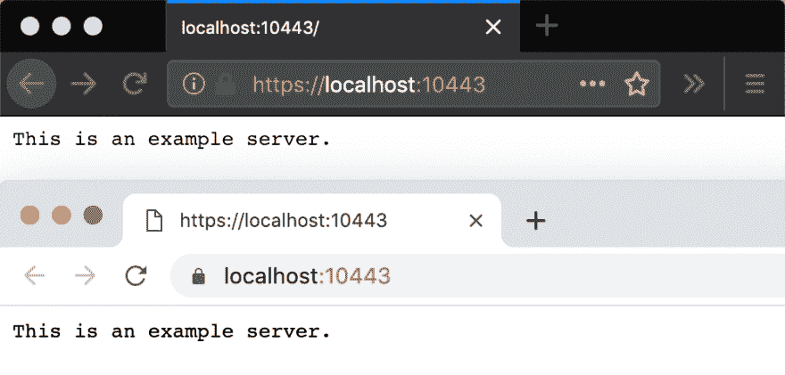

# HTTPS 本地主机在本地主机上使用 HTTPS 的简单方法

> 原文：<https://dev.to/rhymes/really-easy-way-to-use-https-on-localhost-341m>

测试你的站点在本地机器上是否运行良好总是很麻烦的。

我找到了一个工具，让它变得非常简单， [mkcert](https://github.com/FiloSottile/mkcert) :

```
➜  localhost-https mkcert -install
Using the local CA at "/Users/.../mkcert" ✨
The local CA is now installed in the system trust store! ⚡️
The local CA is now installed in the Firefox trust store (requires browser restart)! 🦊
The local CA is now installed in Java''s trust store! ☕️

➜  localhost-https mkcert localhost
Using the local CA at "/Users/.../mkcert" ✨

Created a new certificate valid for the following names 📜
 - "localhost"

The certificate is at "./localhost.pem" and the key at "./localhost-key.pem" ✅ 
```

Enter fullscreen mode Exit fullscreen mode

然后你可以用一个简单的 HTML 页面进行测试:

```
➜  localhost-https cat index.html
───────┬──────────────────────────────────────────────────────────────────────────────────────────────────────────────────────────────────────────────────────────────────────────────────────────────────────────────────────────────────────
       │ File: index.html
───────┼──────────────────────────────────────────────────────────────────────────────────────────────────────────────────────────────────────────────────────────────────────────────────────────────────────────────────────────────────────
   1   │ <html>
   2   │ <body>
   3   │ HELLO WORLD
   4   │ </body>
   5   │ </html>
───────┴──────────────────────────────────────────────────────────────────────────────────────────────────────────────────────────────────────────────────────────────────────────────────────────────────────────────────────────────────────
➜  localhost-https ./node_modules/http-server/bin/http-server -S -C ./localhost.pem -K ./localhost-key.pem                                                                                                                         [18:12:41]
Starting up http-server, serving ./ through https
Available on:
  https://127.0.0.1:8080
  https://192.168.1.69:8080
Hit CTRL-C to stop the server 
```

Enter fullscreen mode Exit fullscreen mode

这是结果:

[](https://res.cloudinary.com/practicaldev/image/fetch/s--n6XXjrew--/c_limit%2Cf_auto%2Cfl_progressive%2Cq_auto%2Cw_880/https://thepracticaldev.s3.amazonaws.com/i/1z5km8xkhgqqwgyrm80i.png)

## /[mkcert](https://github.com/FiloSottile/mkcert)

### 一个简单的零配置工具，可以用您喜欢的任何名称创建本地信任的开发证书。

<article class="markdown-body entry-content container-lg" itemprop="text">

# mkcert

mkcert 是一个制作本地信任的开发证书的简单工具。它不需要任何配置。

```
$ mkcert -install
Created a new local CA 💥
The local CA is now installed in the system trust store! ⚡️
The local CA is now installed in the Firefox trust store (requires browser restart)! 🦊

$ mkcert example.com "*.example.com" example.test localhost 127.0.0.1 ::1

Created a new certificate valid for the following names 📜
 - "example.com"
 - "*.example.com"
 - "example.test"
 - "localhost"
 - "127.0.0.1"
 - "::1"

The certificate is at "./example.com+5.pem" and the key at "./example.com+5-key.pem" ✅ 
```

[](https://user-images.githubusercontent.com/1225294/51066373-96d4aa80-15be-11e9-91e2-f4e44a3a4458.png)

使用来自真实证书颁发机构(ca)的证书进行开发可能是危险的或不可能的(对于像`example.test`、`localhost`或`127.0.0.1`这样的主机)，但是自签名证书会导致信任错误。管理自己的 CA 是最好的解决方案，但通常涉及到晦涩难懂的命令、专业知识和手动步骤。

mkcert 自动在系统中创建并安装一个本地 CA…

</article>

[View on GitHub](https://github.com/FiloSottile/mkcert)