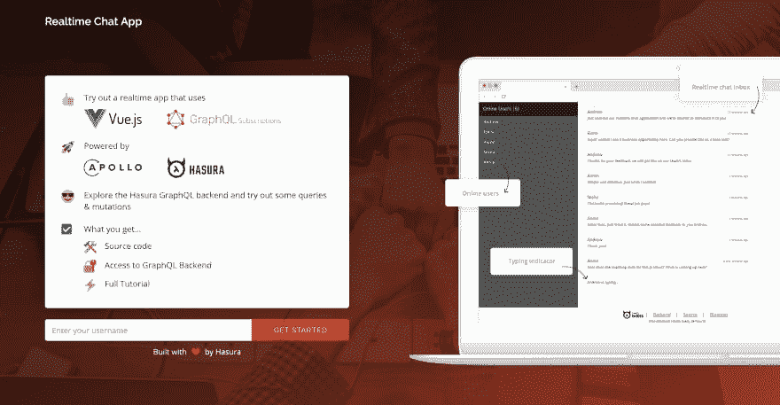

# 使用 Vue 和 Hasura 的实时聊天应用程序

> 原文：<https://dev.to/hasurahq/realtime-chat-app-with-vue-and-hasura-202h>

所以在 VueConf 之前，我认为将我们的 React 实时聊天应用程序重写为 VueJS 是一个很好的主意，它具有登录、实时聊天收件箱、输入指示器、在线用户等功能

[](https://res.cloudinary.com/practicaldev/image/fetch/s--4DwNscIt--/c_limit%2Cf_auto%2Cfl_progressive%2Cq_auto%2Cw_880/https://thepracticaldev.s3.amazonaws.com/i/cmilix7370rc3txufb48.png)

所以现在你可以开始聊天了[这里](https://realtime-chat-vue.hasura.app)

所以在这篇博文中，我想描述一下我实际上是如何重写的。我不会深入研究数据建模，因为在这篇[博客文章](https://blog.hasura.io/building-a-realtime-chat-app-with-graphql-subscriptions-d68cd33e73f/)中已经很好地解释了这一点，但是让我解释一下我在 Vue 中创建它的步骤。
关于如何使用 Vue 和 GraphQL 的更多详细解释，你可以在这里查看我的课程:

液体错误:内部

如果你真的是 GraphQL 的新手，你可以看看我在我的 [Youtube 频道](https://www.youtube.com/channel/UCxiXx-gMssQnY0hTt5bStpw)上做的训练营

查看我们的 Youtube 频道,了解更多的 Hasura 内容

所以我在数据建模后做的步骤是:

# 1。为 Vue 路由器添加登录功能:

```
router.beforeEach((to, from, next) => {
  const isPublic = to.matched.some(record => record.meta.public);
  const onlyWhenLoggedOut = 
    to.matched.some(record => record.meta.onlyWhenLoggedOut)
  const loggedIn = !!TokenService.getToken();
  if (!isPublic && !loggedIn) {
    return next({
      path: "/login",
      query: { redirect: to.fullPath }
    });
  }
  if (loggedIn && onlyWhenLoggedOut) {
    return next('/')
  }
  next();
}); 
```

Enter fullscreen mode Exit fullscreen mode

# 2。用订阅设置 Apollo 客户端。

你可以在[课程](https://dev.to/hasurahq/vue-and-graphql-with-hasura-video-course-3mpp)
中学到更多

```
import VueApollo from "vue-apollo";
// Http endpoint
const httpLink = new HttpLink({
  uri: "https://realtime-chat.demo.hasura.app/v1alpha1/graphql"
})

const wsLink = new WebSocketLink({
  uri: "wss://realtime-chat.demo.hasura.app/v1alpha1/graphql",
  options: {
    reconnect: true
  }
});

const link = split(
  ({ query }) => {
    const { kind, operation } = getMainDefinition(query);
    return kind === "OperationDefinition" && operation === "subscription";
  },
  wsLink,
  httpLink
);

const apolloClient = new ApolloClient({
  link,
  cache: new InMemoryCache(),
  connectToDevTools: true
});

Vue.use(VueApollo);

// Call this in the Vue app file
export function createProvider() {
  return new VueApollo({
    defaultClient: apolloClient,
    defaultOptions: {
      $loadingKey: "loading"
    }
  });
} 
```

Enter fullscreen mode Exit fullscreen mode

# 3。获取在线用户

为了显示在线用户，我们希望在每次用户登录时发出在线事件，因此在我们的本地路由中，我们必须使用阿波罗变异发出在线事件

```
created(){
    setInterval(
      async () => {
        await this.$apollo.mutate({
          mutation: require('../graphql/emitOnlineEvent.gql'),
          variables: {
            userId: this.userId
          }
        })
      },
      3000
    )
  } 
```

Enter fullscreen mode Exit fullscreen mode

# 4。订阅消息

为了获取消息，我创建了一个查询，该查询将获取所有消息，然后订阅新消息。我已经在我的 Vue 课程中解释了如何处理这个问题。

```
 apollo: {
      messages: {
        query: require('../graphql/fetchMessages.gql'),
        loadingKey: "loading",
        variables(){
          return {
            last_received_id: -1,
            last_received_ts: "2018-08-21T19:58:46.987552+00:00"
          }
        },
        update(data){
          const receivedmessages = data.message
          return receivedmessages
        },
        fetchPolicy: 'cache-and-network',
        subscribeToMore: {
          document: require('../graphql/subscribeToNewMessages.gql'),
          updateQuery: (previousResult, { subscriptionData }) => {
            if (previousResult) {
              return {
                message: [
                  ...previousResult.message,
                  ...subscriptionData.data.message
                ]
              }
            }
          }
        },
        error(){
          alert("Error occured")
        }
      } 
```

Enter fullscreen mode Exit fullscreen mode

# 5。打字指示器

我们还需要用户输入通知，所以我创建了 emitTyping 事件突变，每隔几个字符就发出一次事件。这让我们可以跟踪输入用户，并在其他用户输入时显示输入指示器

```
 watch: {
      text: function(value){
        const textLength = value.length;
        if ((textLength !== 0 && textLength % 5 === 0) || textLength === 1) {
          this.emitTypingEvent();
        }
      }
    },
    methods: {
      emitTypingEvent(){
        if(this.userId) {
          this.$apollo.mutate({
          mutation: require('../graphql/emitTypingEvent.gql'),
          variables: {
              userId: this.userId
          }
          })
        }
      }, 
```

Enter fullscreen mode Exit fullscreen mode

简单地说，就是这样。我用 VueJS 创建了这个应用程序，这是一次令人惊奇的经历，关于我在编写这个应用程序时是如何以及做了什么决定的更多信息，你可以在我的[github](https://github.com/vnovick/vue-realtime-chat)或者在 Hasura 示例应用程序[存储库](https://github.com/hasura/graphql-engine/tree/master/community/sample-apps)中查看