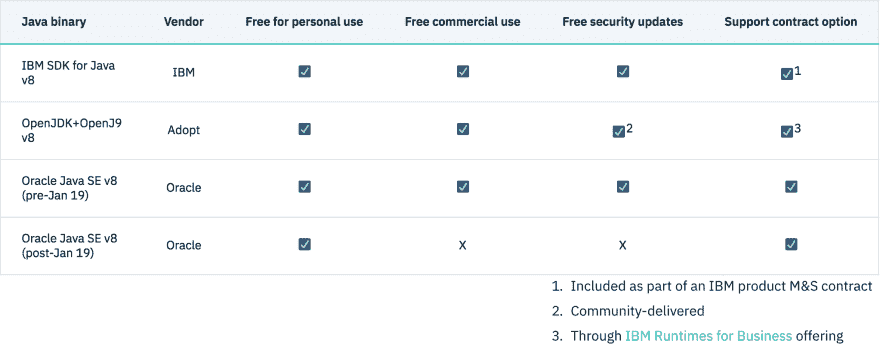

# IBM 最近的 Java 更新

> 原文：<https://dev.to/nheidloff/recent-java-updates-from-ibm-3nmn>

为了准备 Java 会议，我花了一些时间来了解 Java 社区的最新活动。随着 Java EE 向 Eclipse 和 MicroProfile 等项目的转移，有很多事情正在进行，并且有很多创新。以下是我的同事们最近发表的一些文章的链接。

**发牌**

Oracle 已经更改了商业用途的许可。幸运的是，IBM 开源了 OpenJ9，它可以和 OpenJDK 一起从 [AdoptOpenJDK](https://adoptopenjdk.net/) 免费获得，甚至可以用于商业用途。

关于许可的更多信息:

*   [Java 许可已经改变，但是还有一个好消息](https://www.ibm.com/blogs/bluemix/2019/02/java-licensing-has-changed-but-theres-good-news/)
*   [付费支持的免费 Java:IBM 的观点](https://developer.ibm.com/blogs/2019/01/30/free-java-with-paid-support/)
*   [AdoptOpenJDK:一个你可以信赖的开放 Java 发行版和社区](https://developer.ibm.com/blogs/2019/01/16/adoptopenjdk-an-open-java-distribution-and-community-you-can-count-on/)
*   [Java 许可已经改变，您可能会受到影响](https://developer.ibm.com/blogs/2019/01/24/java-licensing-is-changing-and-you-could-be-affected/)

**Eclipse OpenJ9**

开源 JVM [OpenJ9](https://www.eclipse.org/openj9/) 的代码与 IBM SDK for Java 使用的代码基础相同，这意味着它是企业就绪的。此外，与其他 JVM 相比，启动时间快 40%，内存使用量低 60%，这使得它非常适合基于容器的工作负载。

关于 OpenJ9 的更多信息:

*   [OpenJ9](https://www.eclipse.org/openj9/)
*   [OpenJ9 性能](https://www.eclipse.org/openj9/oj9_performance.html)
*   [视频:带 Eclipse OpenJ9 的 OpenJDK:给你的 Java 应用一个惊喜](https://www.youtube.com/watch?v=srfR38j2CFc)
*   [带 Eclipse OpenJ9 的 OpenJDK:不用担心，只是改进](https://developer.ibm.com/blogs/2019/01/10/openjdk-with-eclipse-openj9-no-worries-just-improvements/)

**Eclipse 微文件**

MicroProfile 允许构建云原生企业微服务。我特别喜欢基于 MircoProfile 的服务可以补充 Istio 功能，例如用于特定应用程序的回退。

关于 MicroProfile 的更多信息:

*   [MicroProfile，为 Istio 打造的微服务编程模型](https://www.eclipse.org/community/eclipse_newsletter/2018/september/MicroProfile_istio.php)
*   [微文件](https://microprofile.io/)
*   [微文件启动器](https://start.microprofile.io/)
*   写一个简单的微文件应用程序
*   [代码模式:使用 Eclipse MicroProfile Config 配置您的应用程序](https://developer.ibm.com/patterns/configure-your-app-using-eclipse-microprofile-config/)
*   [Istio](https://istio.io/)
*   [代码模式:用 Istio 让 Java 微服务具有弹性](https://developer.ibm.com/patterns/make-java-microservices-resilient-with-istio/)

**更多资源**

要了解 IBM 为 Java 开发人员提供的更多信息，请查阅以下资源:

*   [IBM 开发人员 Java 技术公司](https://developer.ibm.com/technologies/java/)
*   [IBM Cloud CLI 创建新应用](https://cloud.ibm.com/docs/cli/idt/index.html#developing)
*   [IBM Cloud Starter 应用](https://cloud.ibm.com/developer/appservice/starter-kits/java-microservice-with-eclipse-microprofile-and-java-ee)
*   [IBM Jetbrains ide 云开发工具](https://cloud.ibm.com/docs/cli/idt/jetbrains.html#ibm-dev-tools-for-jetbrains)
*   [代码模式](https://developer.ibm.com/patterns/category/java/)
*   [视频:Java 更新](https://www.youtube.com/watch?v=Sy-JmAXZPmY)
*   [开放自由](https://openliberty.io/)