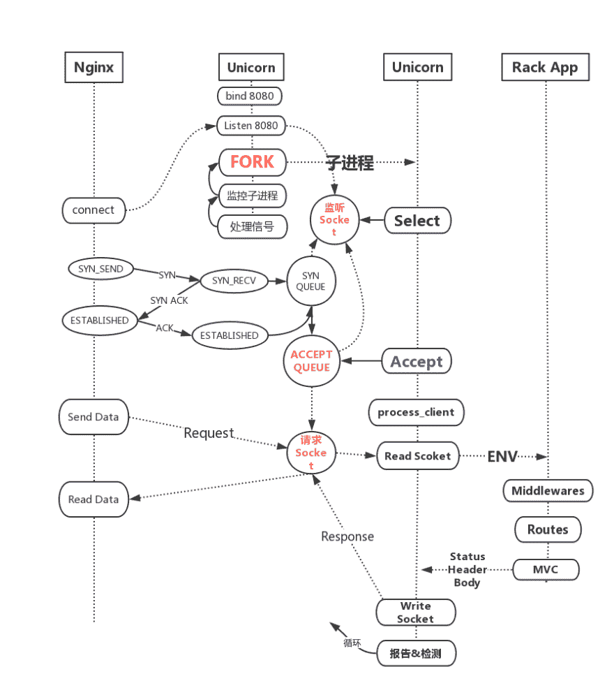

# 推荐:插图独角兽是如何工作的？

> 原文：<https://dev.to/chenge/recommendillustration-how-does-unicorn-work-2ibn>

彩色图表非常适合阅读。

[链接- >](https://translate.google.com/translate?hl=&sl=auto&tl=en&u=https%3A%2F%2Fruby-china.org%2Ftopics%2F37868)

我有一个问题，Node 和 Go 需要一个独立的应用服务器吗？

文章有一个自动生成的目录，希望开发者将来能提供这个目录功能，这对于阅读长文很有帮助。