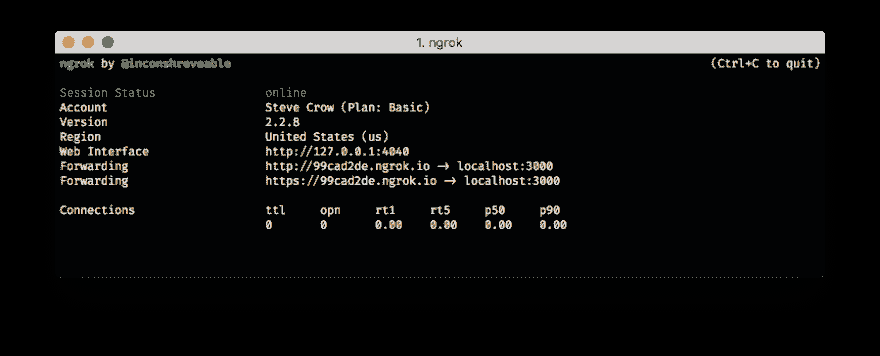

# 用 Java 录制电话留言

> 原文：<https://dev.to/vonagedev/record-a-phone-message-with-java-56j3>

## 简介

在之前的教程中，我们向您展示了如何用 Java 接听电话并使用文本到语音进行回复。我们还可以允许用户留下信息，然后检索记录的信息。

## 先决条件

要完成本教程，您需要一个 [Nexmo 帐户](https://dashboard.nexmo.com/sign-up)。如果您还没有帐户，请立即注册。

您将使用 [Gradle](https://gradle.org) 来管理您的依赖项并运行您的应用程序。此外，您需要确保安装了 JDK 的副本。我将在本教程中使用 JDK 8。

最后，您需要安装 [Nexmo CLI](https://github.com/Nexmo/nexmo-cli) 。您将使用它来购买电话号码，并配置您的 Nexmo 帐户以指向您的新应用程序。

## 用 Java 记录电话留言

本教程将引导您完成以下步骤:

1.  使用 Gradle 创建一个新的 Java 项目。
2.  使用 [Spark](http://sparkjava.com) 框架来控制调用。
3.  购买一个号码并配置您的 Nexmo 帐户，以便在您的应用程序中使用该号码。

### 使用 Gradle 设置一个新的 Java 项目

您将使用 Gradle 来管理您的依赖项，并创建和运行您的 Java 应用程序。

`gradle init --type=java-application`命令将创建您需要的所有文件夹以及一个示例类，您将在其中编写代码。

在命令行中，使用以下命令创建一个新的 Java 项目:

```
mkdir record-a-message
cd record-a-message
gradle init --type=java-application 
```

### 使用 Spark 框架来控制调用

当您的号码收到呼叫时，您将使用 Spark 框架接收 Nexmo 发出的 HTTP 呼叫，并在消息被记录后接收 Nexmo 发送的请求。

#### 添加依赖关系

将以下内容添加到您的`build.gradle`文件中的`dependencies`块:

```
// Spark Framework
compile 'com.sparkjava:spark-core:2.7.2'

// Nexmo Java Client
compile 'com.nexmo:client:4.0.1' 
```

您的`dependencies`块应该是这样的:

```
dependencies {
    compile 'com.sparkjava:spark-core:2.7.2'
    compile 'com.nexmo:client:4.0.1'

    // Use JUnit test framework
    testCompile 'junit:junit:4.12'
} 
```

Gradle 将在`src/main/java`文件夹中创建`App`类。这个类中有一个`getGreeting`和一个`main`方法。您不需要`getGreeting`方法，所以可以随意删除它。

#### 定义应答路线

首先，您将定义用于应答呼叫的路由。当收到一个调用时，Nexmo 将向一个预定义的 webhook URL 发送一个请求。它期望接收一个 [Nexmo 呼叫控制对象(NCCO)](https://developer.nexmo.com/voice/voice-api/ncco-reference) ，其中包含要执行的动作列表。

当电话被接听时，您的应用程序将指示 Nexmo 执行三个操作:

1.  问候来电者并指导他们如何留言的动作。
2.  一个`record`动作，指示语音 API 开始录音。
3.  感谢他们留言的一个动作。

这是您的应用程序将创建的结果 NCCO:

```
[  {  "text":  "Please leave a message after the tone, then press #. We will get back to you as soon as we can.",  "action":  "talk"  },  {  "endOnSilence":  3,  "endOnKey":  "#",  "beepStart":  true,  "eventUrl":  [  "http://your-web-address/webhooks/recordings"  ],  "action":  "record"  },  {  "text":  "Thank you for your message. Goodbye",  "action":  "talk"  }  ] 
```

将以下代码添加到`App`类的`main`方法中，确保解析所有导入:

```
/*
* Route to answer and connect incoming calls with recording.
*/
Route answerRoute = (req, res) -> {
    String recordingUrl = String.format("%s://%s/webhooks/recordings", req.scheme(), req.host());

    TalkAction intro = new TalkAction.Builder("Please leave a message after the tone, then press #. We will get back to you as soon as we can.")
            .build();

    RecordAction record = new RecordAction.Builder()
            .eventUrl(recordingUrl)
            .endOnSilence(3)
            .endOnKey('#')
            .beepStart(true)
            .build();

    TalkAction outro = new TalkAction.Builder("Thank you for your message. Goodbye").build();

    res.type("application/json");

    return new Ncco(intro, record, outro).toJson();
}; 
```

`record`动作有一些不同的属性。例如，您可以定义当记录完成时将向其发送请求的事件 url，在特定按键时结束记录，并在记录开始时发出嘟嘟声。

#### 定义录像路线

`record`动作有一个名为`eventUrl`的属性，用于在记录完成时进行通信。下面是一个发送到事件 url 的返回参数的例子:

```
{  "start_time":  "2020-01-01T12:00:00Z",  "recording_url":  "https://api.nexmo.com/media/download?id=aaaaaaaa-bbbb-cccc-dddd-0123456789ab",  "size":  12345,  "recording_uuid":  "aaaaaaaa-bbbb-cccc-dddd-0123456789ab",  "end_time":  "2020-01-01T12:01:00Z",  "conversation_uuid":  "bbbbbbbb-cccc-dddd-eeee-0123456789ab",  "timestamp":  "2020-01-01T14:00:00.000Z"  } 
```

[Nexmo Java 客户端](https://github.com/Nexmo/nexmo-java)有一个名为`RecordEvent`的类，可以用来反序列化发送给`eventUrl`的 JSON。现在，您将把`recording_url`输出到控制台。

将以下代码添加到`App`类的`main`方法中，解析任何导入:

```
/*
* Route which prints out the recording URL it is given to stdout.
*/
Route recordingRoute = (req, res) -> {
    RecordEvent recordEvent = RecordEvent.fromJson(req.body());
    System.out.println(recordEvent.getUrl());

    res.status(204);
    return "";
}; 
```

#### 登记路线

至此，您已经定义了两条路线:

*   当 Nexmo 应答来电时，第一个路由将使用 NCCO 响应 Nexmo。
*   当 Nexmo 完成记录消息时，第二个路由将记录记录 URL。

为了使用这些路由，我们需要配置 Spark。您的应用程序将在端口`3000`上监听，路由将在`/webhooks/answer`和`/webhooks/recordings`上配置。

将以下代码添加到`App`类的`main`方法中:

```
Spark.port(3000);
Spark.get("/webhooks/answer", answerRoute);
Spark.post("/webhooks/recordings", recordingRoute); 
```

### 采购数量

您需要一个 Nexmo 号码才能接听电话。如果您没有号码，您可以使用 Nexmo CLI 购买一个:

```
nexmo number:buy --country_code US 
```

记下购买时分配给您的号码。您将需要这个号码来链接您的应用程序和进行测试。

### 公开您的应用程序

为了向应用程序发送 HTTP 请求，Nexmo 需要知道应用程序运行的 URL。

您可以使用 [ngrok](https://ngrok.com/) 安全地将您的应用程序公开到互联网上，而不是配置您的本地网络或在外部服务上托管您的应用程序。

下载 ngrok 并运行以下命令:

```
ngrok http 3000 
```

请记下转发地址，因为在配置您的帐户时会用到它。下图，转发地址是`http://99cad2de.ngrok.io`。

[](https://res.cloudinary.com/practicaldev/image/fetch/s--jymgB-Eq--/c_limit%2Cf_auto%2Cfl_progressive%2Cq_auto%2Cw_880/https://www.nexmo.com/wp-content/uploads/2018/08/ngrok.png)

### 配置您的 Nexmo 账户

如果您没有应用程序，您可以使用 Nexmo CLI 通过您的 ngrok 转发地址创建一个:

```
nexmo app:create "Record Message Demo" http://your-ngrok-forwarding-address/webhooks/answer http://your-ngrok-forwarding-address/webhooks/events --keyfile private.key 
```

运行此命令后，您将看到一个应用程序 id。比如:`notreal-1111-2222-3333-appid`。您将需要此应用程序 id 来将您的电话号码链接到该应用程序。

您可以使用 Nexmo CLI 链接您的电话号码和应用:

```
nexmo link:app your-nexmo-phone-number your-application-id 
```

该命令指示 Nexmo 在您的帐户上创建一个新的应用程序。当收到电话时，应用程序将向第一个 URL 发送请求。当呼叫状态改变时，应用程序将向第二个 URL 发送请求。

### 测试您的应用程序

在您的`record-a-message`目录中用`gradle run`命令启动您的应用程序。

拨打您的 Nexmo 号码，测试您的应用程序。您将听到留言:“请在提示音后留言，然后按井号键。我们会尽快回复您。”听到哔哔声后，请留言，然后按`#`。然后你会听到“谢谢你的留言。再见。”录制 URL 将显示在您的控制台上。

## 结论

在几行代码中，您创建了一个应用程序，该应用程序可以接听电话，录制消息，然后显示该录音的 URL。

查看我们关于 [Nexmo 开发者](https://developer.nexmo.com)的文档，在那里你可以了解更多关于[调用流](https://developer.nexmo.com/voice/voice-api/guides/call-flow)或 [Nexmo 调用控制对象](https://developer.nexmo.com/voice/voice-api/ncco-reference)的信息。参见我们的 [Nexmo 快速入门 Java 示例](https://github.com/nexmo-community/nexmo-java-quickstart)，获取关于[本教程](https://github.com/nexmo-community/nexmo-java-quickstart/blob/master/src/main/java/com/nexmo/quickstart/voice/RecordMessage.java)及更多内容的完整代码示例。

用 Java 记录电话留言的帖子[最早出现在](https://www.nexmo.com/blog/2019/02/19/record-a-phone-message-with-java-dr/) [Nexmo](https://www.nexmo.com) 上。