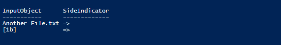

# 递归文件夹与 PowerShell 的比较

> 原文：<https://dev.to/yerac/recursive-folder-comparison-with-powershell-1dfi>

## 这个问题

这篇文章肯定不是“新的”或革命性的，但我很惊讶地发现 PS 中的比较对象助手，我将来肯定会忘记…

作为最近一些路线图工作的一部分，我们为我们的一些工具转移到一个新的安装程序技术。这带来了一些小麻烦，比如验证我们已经获得了所有正确的文件。这种方法的第一次迭代是手动检查，很明显容易出现人为错误——除了令人麻木之外！

我并不真的想使用第三方工具。 [WinMerge](http://winmerge.org/?lang=en) 可以执行奇妙的比较，但我想快速和定制的东西。理想情况下，创建任何代码的时间也不要超过 10 分钟！

第一次迭代是做一个递归循环，将所有文件名(注意:不是路径)提取到两个单独的文本文件中。唯一的“好处”是我将目录名用方括号括起来，让它有一些组织性。

这样做的缺点是，它只对我的包含几个项目的示例文件夹有效。在有数千个文件和嵌套文件夹的生产中，这是一片混乱。此外，我不得不在第三方工具中比较这些文件，比如 WinMerge 这样做没有意义！

我的脚本的最终版本旨在只显示差异(避免噪声)，理想情况下使用 PowerShell 中的 **Compare-Object** 显示变化发生的方向。

## 结果

*   通过目录结构进行递归循环
*   将文件夹名称输出为[Folder]，并递归地向下搜索。这有点脏，因为我不想要完整的路径(更难比较)，但我想区分当我挖下去。YMMV。
*   输出文件名，排除一些我不关心的文件(比如。tmp &。XML 文件)
*   对文件夹 A 和文件夹 B 这样做，将结果存储到一个变量中
*   对这些变量使用 Compare-Object 并输出结果。

```
function GetFiles($path, [string[]]$excludedFiles)
{
    foreach ($item in Get-ChildItem $path)
    {
        if ($excludedFiles | Where {$item -like $_}) { continue }

        if( (Get-Item $item.FullName) -is [System.IO.DirectoryInfo]){
         $('['+$item.Name+']')
        }else{
          $($item.Name)
        }
        if (Test-Path $item.FullName -PathType Container)
        {
            GetFiles $item.FullName $excludedFiles
        }
    }
} 
$env1 = GetFiles -path "C:\folderA\" -excludedFiles "*.xml",".tmp"
$env2 = GetFiles -path "C:\folderB\" -excludedFiles "*.xml",".tmp"

Compare-Object -DifferenceObject $env1 -ReferenceObject $env2 
```

Enter fullscreen mode Exit fullscreen mode

它提供如下输出:

[](https://res.cloudinary.com/practicaldev/image/fetch/s--cBIv1f9m--/c_limit%2Cf_auto%2Cfl_progressive%2Cq_auto%2Cw_880/https://i2.wp.com/yer.ac/blog/wp-content/uploads/2019/03/image-11.png%3Fw%3D840)

这肯定可以优化和清理，YMMV 大规模。

总的来说，在 PowerShell 中的几分钟，我成功地节省了大量时间——这是我唯一的真正目标！

帖子[递归文件夹与 PowerShell](http://yer.ac/blog/2019/03/25/recursive-folder-comparison-with-powershell/) 的比较最早出现在[yer . AC | Adventures of a developer 和其他东西上。](http://yer.ac/blog)。