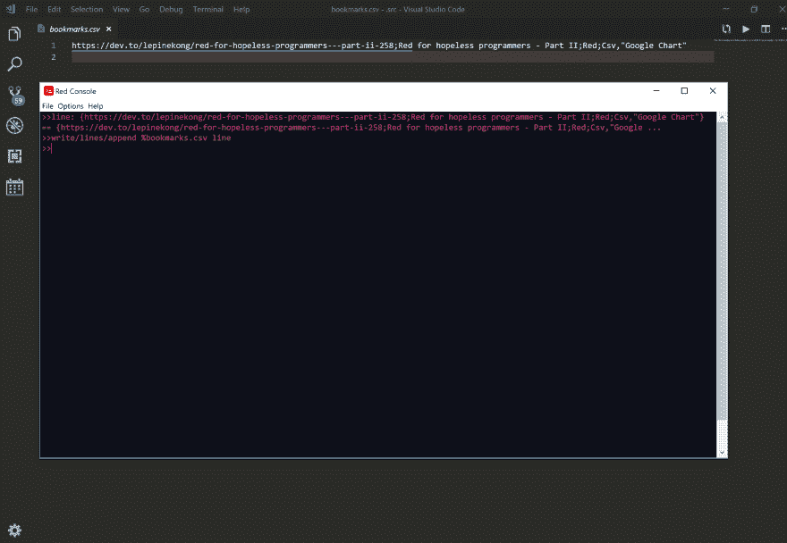
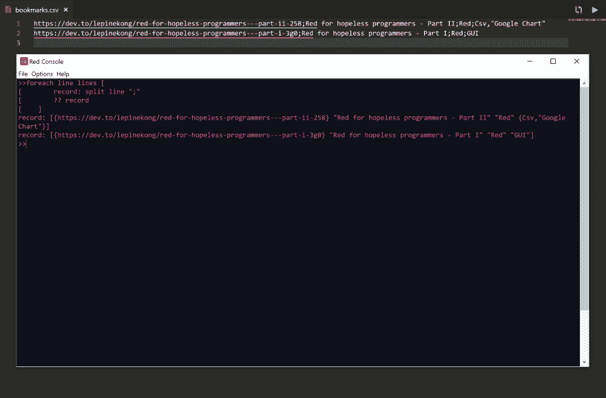
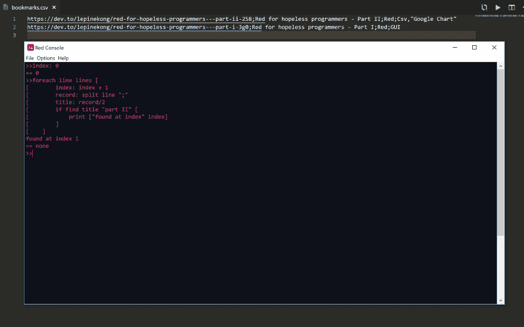
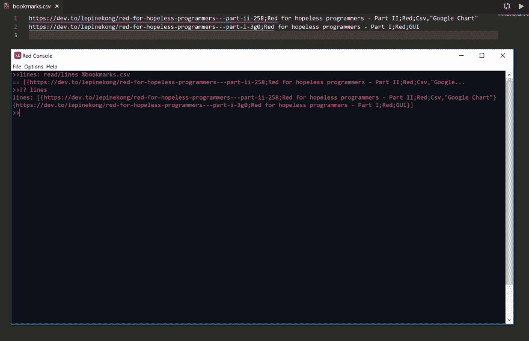
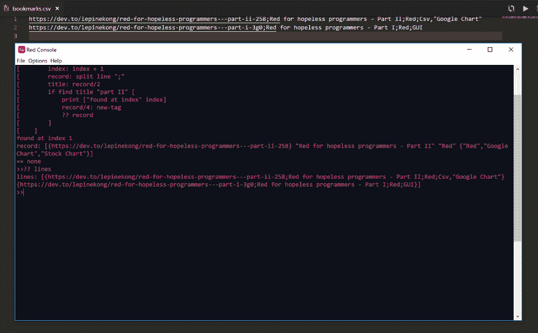
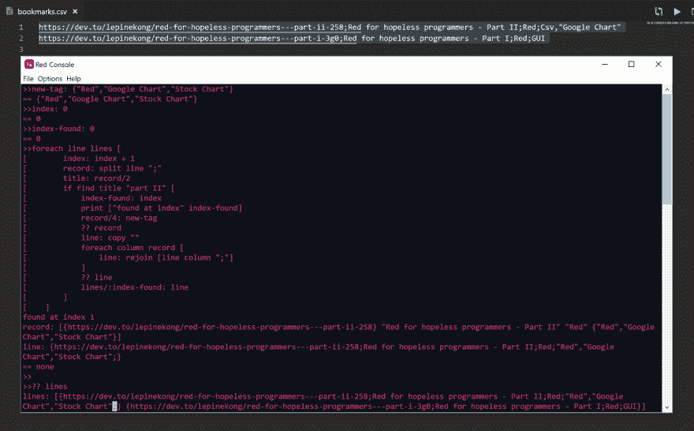
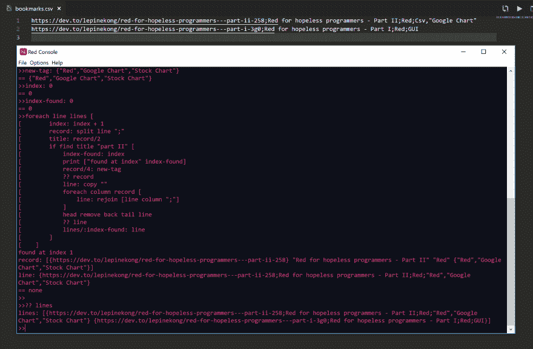
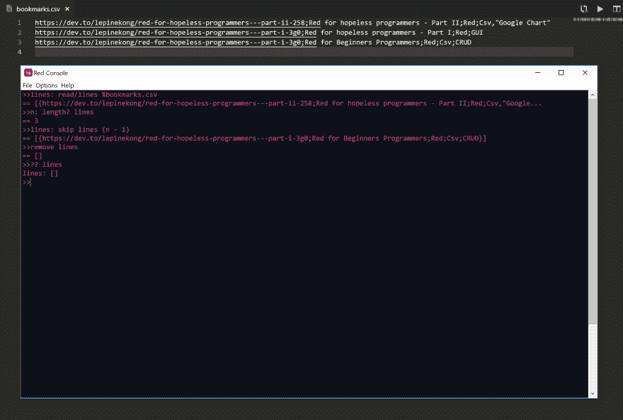
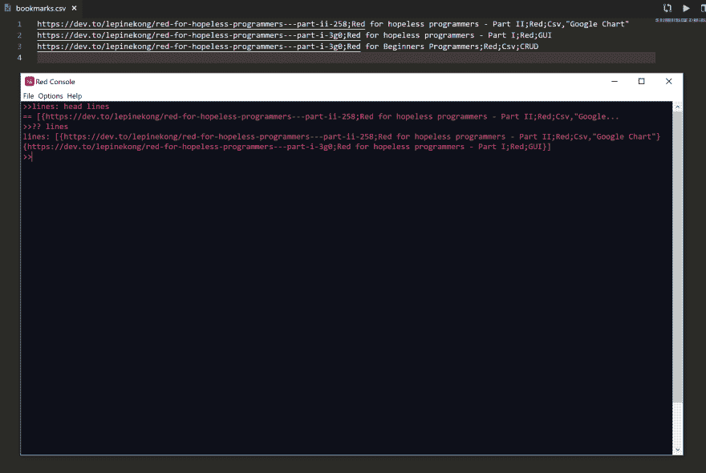
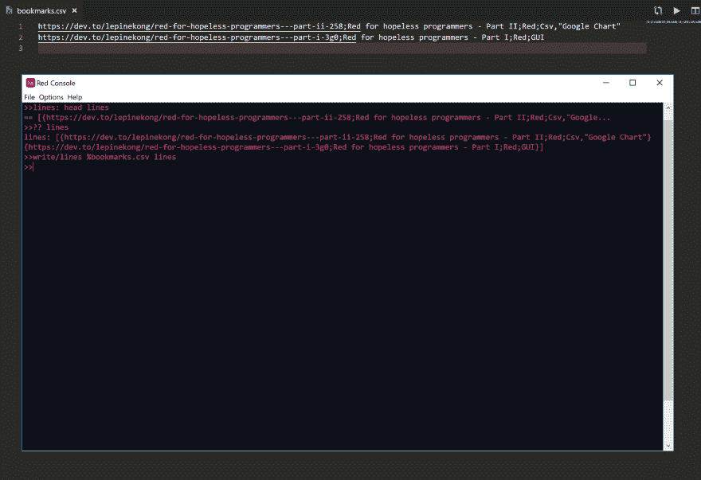

# 绝望的程序员之红色 III

> 原文：<https://dev.to/lepinekong/red-for-hopeless-programmers-iii-31a2>

注:这是一个草稿，我还没有重读，如果你指出错误，不要犹豫，通知我；)

## CRUD 数据库

这是绝望的程序员系列 [Red 的第三部分。](https://dev.to/lepinekong/red-for-hopeless-programmers---part-i-3g0)

如果你还没有读过，那就去读第一部分和第二部分吧，尽管我试图让每个教程对完全的初学者来说都是可以理解的。

首先对于非编码人员来说，CRUD 是关于用以下 4 种操作对数据进行操作:

> 创建读取更新删除。

数据可以是简单的“平面”记录，就像您钟爱的 CSV (Excel 文本格式)文件一样，也可以是“嵌套的”或分层的，这对于表示真实的用例非常有用。所以我将把这个教程分成两个子系列，并举例说明如何创建一个书签数据库。

III.1 -创建 CSV 格式的书签数据库(本文)

III.2 -创建可读人类格式的书签数据库(下一篇)

### C - Create

如果是第一条记录，该文件甚至可能不存在。在一些编程语言中，你必须考虑这种特殊情况，用红色表示，它是自动创建的。假设您想要写入文件:

> 书签. csv

你的代码应该是

```
 write/lines/append %bookmarks.csv line 
```

Enter fullscreen mode Exit fullscreen mode

> 网址；标题；类别；标签

例如

> 行:{[https://dev.to/lepinekong/Red-for-hopeless-programmers-part-ii-258；红色](https://dev.to/lepinekong/Red-for-hopeless-programmers---part-ii-258;Red)给不可救药的程序员——第二部分；红色；Csv，“谷歌图表”}

你可以在控制台执行这两条指令(如果你懒的话就复制粘贴):
[](https://res.cloudinary.com/practicaldev/image/fetch/s--F-QO757d--/c_limit%2Cf_auto%2Cfl_progressive%2Cq_auto%2Cw_880/https://i.imgur.com/YrddyzL.png)

添加另一条记录:

> line:{[https://dev.to/lepinekong/Red-for-hopeless-programmers-part-I-3g 0；红色](https://dev.to/lepinekong/Red-for-hopeless-programmers---part-i-3g0;Red)给不可救药的程序员——第一部分；红色；GUI}

### R - Read

读一行知道行索引很容易:

```
lines/:index 
```

Enter fullscreen mode Exit fullscreen mode

但是通常你必须查找记录。假设您想要文章“第二部分”。你可以在 title 的第二列中搜索字符串“part II ”,一旦找到，你就可以得到索引和整个记录。

这意味着你必须首先将每一行拆分成列，然后像这样搜索第二列:

```
 foreach line lines [
    record: split line ";"
    ?? record
] 
```

Enter fullscreen mode Exit fullscreen mode

[](https://res.cloudinary.com/practicaldev/image/fetch/s--rrz42RFv--/c_limit%2Cf_auto%2Cfl_progressive%2Cq_auto%2Cw_880/https://i.imgur.com/OOERaQw.png)

现在让我们搜索第二列标题:

```
 index: 0
foreach line lines [
    index: index + 1
    record: split line ";"
    title: record/2
    if find title "part II" [
        print ["found at index" index]
    ]
] 
```

Enter fullscreen mode Exit fullscreen mode

在控制台中运行时，您应该找到索引 1:
[](https://res.cloudinary.com/practicaldev/image/fetch/s--fAGtxQNO--/c_limit%2Cf_auto%2Cfl_progressive%2Cq_auto%2Cw_880/https://i.imgur.com/RXQLeue.png)

### ★更新

为了能够容易地更新，你应该首先把数据库装入一个块 a 行，用:

```
lines: read/lines %bookmarks.csv 
```

Enter fullscreen mode Exit fullscreen mode

[](https://res.cloudinary.com/practicaldev/image/fetch/s--xD8x7GdV--/c_limit%2Cf_auto%2Cfl_progressive%2Cq_auto%2Cw_880/https://i.imgur.com/KM1MhQC.png)

正如您在上面的图片中看到的，要检查线条块，您可以使用

> ？？线

如果您想更新行索引，这是最简单的方法。假设您想要替换第 2 行(与许多其他语言中的数组不同，行数从索引 1 开始，而不是 0。)，你会写:

```
lines/2: update-value 
```

Enter fullscreen mode Exit fullscreen mode

但是通常你必须查找一个记录并更新它，我们已经在上面看到了，所以一旦找到记录索引，你就可以更新她的第 4 列(标签):

```
 new-tag: {"Red","Google Chart","Stock Chart"}
index: 0
foreach line lines [
    index: index + 1
    record: split line ";"
    title: record/2
    if find title "part II" [
        print ["found at index" index]
        record/4: new-tag
        ?? record
    ]
] 
?? lines 
```

Enter fullscreen mode Exit fullscreen mode

[](https://res.cloudinary.com/practicaldev/image/fetch/s--sLCx8Iei--/c_limit%2Cf_auto%2Cfl_progressive%2Cq_auto%2Cw_880/https://i.imgur.com/Kborf9m.png)

如果您检查如图所示的行，您应该意识到有问题:它没有用更新的记录更新。记录独立于原始行。这就是非编码人员有些困难，更喜欢 excel 公式的地方！我们将需要一个未来的教程来看看如何使用另一个编程模型来模拟 excel 的魔力。它是关于反应式编程的，这是更概念性的，所以我现在不敢处理它。

所以只要承认对于 neow 你必须重新创建行和更新行。

那么如何从记录中重现这条线呢？第一个想法是用分隔符“；”连接每一列

```
 new-tag: {"Red","Google Chart","Stock Chart"}
index: 0
index-found: 0
foreach line lines [
    index: index + 1
    record: split line ";"
    title: record/2
    if find title "part II" [
        index-found: index
        print ["found at index" index-found]
        record/4: new-tag
        ?? record
        line: copy ""
        foreach column record [
            line: rejoin [line column ";"]
        ]
        ?? line
        lines/:index-found: line 
    ]
]

?? lines 
```

Enter fullscreen mode Exit fullscreen mode

细节很糟糕，你可能忘了去掉补充的“；”对于连接时的行(非编码人员必须习惯的另一个障碍，我正在研究一个解决方案，在未来减轻这些讨厌的细节，但那是另一个故事):
[](https://res.cloudinary.com/practicaldev/image/fetch/s--9XCNDU1b--/c_limit%2Cf_auto%2Cfl_progressive%2Cq_auto%2Cw_880/https://i.imgur.com/atCQGET.png)

所以你必须添加一个指令，使用[【https://Redlang.Red/tail】](https://Redlang.Red/tail)函数
(阅读那里的解释，我写了那个术语表术语，以便能够在编写教程时引用它们，以免中断流程):

```
 new-tag: {"Red","Google Chart","Stock Chart"}
index: 0
index-found: 0
foreach line lines [
    index: index + 1
    record: split line ";"
    title: record/2
    if find title "part II" [
        index-found: index
        print ["found at index" index-found]
        record/4: new-tag
        ?? record
        line: copy ""
        foreach column record [
            line: rejoin [line column ";"]
        ]
        head remove back tail line
        ?? line
        lines/:index-found: line 
    ]
]

?? lines 
```

Enter fullscreen mode Exit fullscreen mode

[](https://res.cloudinary.com/practicaldev/image/fetch/s--JI8IptOt--/c_limit%2Cf_auto%2Cfl_progressive%2Cq_auto%2Cw_880/https://i.imgur.com/gHNdqBq.png)

现在事情看起来很好:更新是最难的！

遗憾的是，您还没有完成:行在内存中，但没有保存在文件中。我们将在删除后的最后看到，因为删除也需要将数据从内存保存到文件中(称为持久化操作)。幸运的是，这很容易:你已经看到了最困难的部分。

### D -删除

要删除，您必须将光标定位在您想要删除的记录上，并使用删除功能。

比如说你错加了一条记录

```
write/lines/append %bookmarks.csv {https://dev.to/lepinekong/Red-for-hopeless-programmers---part-i-3g0;Red for Beginners Programmers;Red;Csv;CRUD} 
```

Enter fullscreen mode Exit fullscreen mode

要删除最后一行，你必须首先像已经看到的那样加载这些行，然后通过跳过 n - 1 行转到最后一行:

```
lines: read/lines %bookmarks.csv
n: length? lines
lines: skip lines (n - 1)
remove lines
?? lines 
```

Enter fullscreen mode Exit fullscreen mode

[](https://res.cloudinary.com/practicaldev/image/fetch/s--1sKRnwcB--/c_limit%2Cf_auto%2Cfl_progressive%2Cq_auto%2Cw_880/https://i.imgur.com/tI0AgTL.png)

好像有 bug 自？？lines 是[]但是这是 skip 和 remove 命令的工作方式，在 remove 光标位于行尾之后，所以你必须使用 head 来检查控制台中的行:

```
lines: head lines
?? lines 
```

Enter fullscreen mode Exit fullscreen mode

[](https://res.cloudinary.com/practicaldev/image/fetch/s--9FQlbjJL--/c_limit%2Cf_auto%2Cfl_progressive%2Cq_auto%2Cw_880/https://i.imgur.com/b2Rvu0I.png)

### 将行块持久化到文件中

为了保持行的块，你只需要做读/行的对称，也就是写/行:

```
write/lines %bookmarks.csv lines 
```

Enter fullscreen mode Exit fullscreen mode

[](https://res.cloudinary.com/practicaldev/image/fetch/s--WNPhnD61--/c_limit%2Cf_auto%2Cfl_progressive%2Cq_auto%2Cw_880/https://i.imgur.com/NapDP6a.png)

那都是乡亲们！
[T3】](https://res.cloudinary.com/practicaldev/image/fetch/s--8Me1SCFM--/c_limit%2Cf_auto%2Cfl_progressive%2Cq_66%2Cw_880/https://vignette.wikia.nocookie.net/looneytunimg/a/a4/THAT%27SALLGIFS.gif/revision/latest/scale-to-width-down/260%3Fcb%3D20160806162644)

> “哎！没这么快……”

好吧！我听说你们中的一些人曾经追随过瑞德。For .无望.程序员. I :

> 如何将数据库连接到 UI？！

这与 CRUD 本身无关，所以它不是合同的一部分:你可以自己做，这是很好的练习😊

> Grr！！！

好吧，用数据绑定 GUI 在任何编程语言中都不是小事，即使是在 Red 中。你可以试着自己做
或者等待下一个教程，就像我在反应式编程中说的那样(你可以不做，这和在 Visual Basic 中做一样难，但我懒得这样做，因为我自己)。但是这个概念在我脑子里还不清楚，所以我现在不想解释。

### 养气链接

*   [红色给绝望的程序员——第一部分|开发到](https://dev.to/lepinekong/red-for-hopeless-programmers---part-i-3g0)

*   [绝望的程序员的红色-第二部分|开发到](https://dev.to/lepinekong/red-for-hopeless-programmers---part-ii-258)