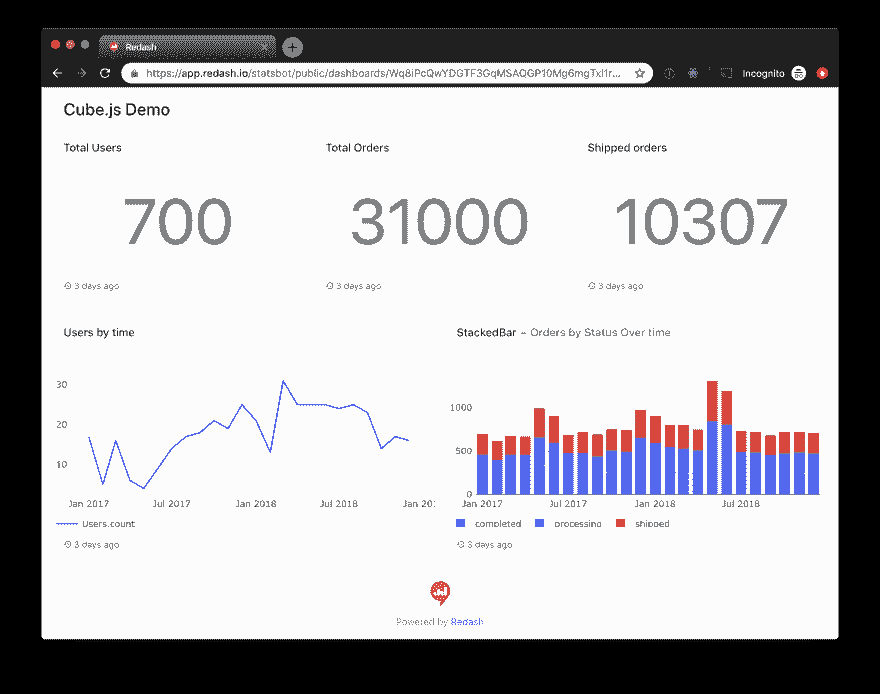
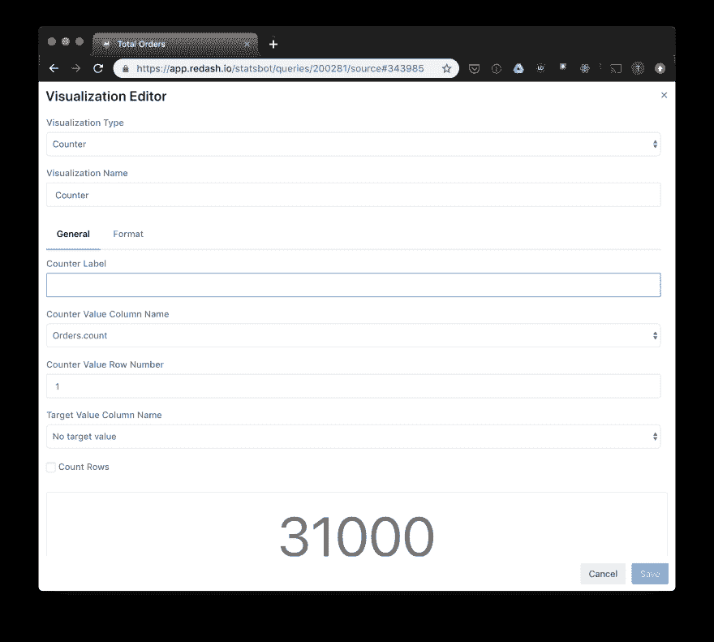
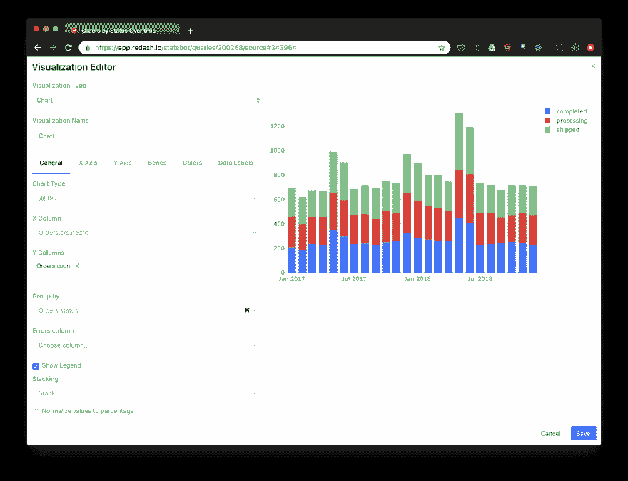
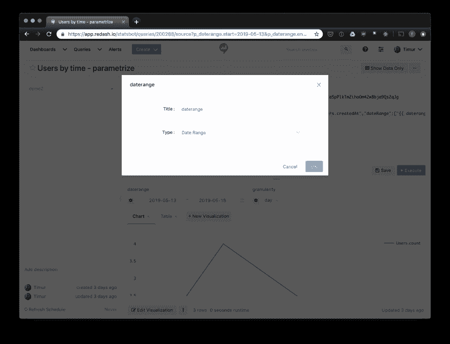
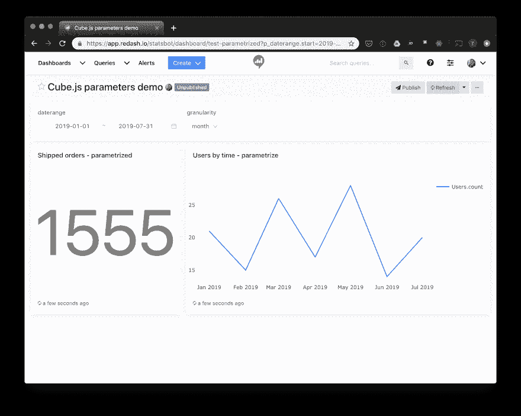

# 使用 Cube.js 的 Redash 仪表板教程

> 原文：<https://dev.to/cubejs/redash-dashboard-tutorial-with-cube-js-2ef4>

我们最近介绍了如何使用 react、vue 或 angular 构建分析仪表板。但是，如果您不想编码和托管自己的仪表板，您有一些开源的替代方案。今天，我将向您展示如何使用 [Cube.js](https://cube.dev) 后端和 [Redash](https://redash.io/) 构建一个分析仪表板。
你可以在这里找到生成的仪表盘实况[。](https://app.redash.io/statsbot/public/dashboards/Wq8iPcQwYDGTF3GqMSAQGP10Mg6mgTxl1r5C6MKH)

[](https://res.cloudinary.com/practicaldev/image/fetch/s--TUyU4uOA--/c_limit%2Cf_auto%2Cfl_progressive%2Cq_auto%2Cw_880/https://thepracticaldev.s3.amazonaws.com/i/ft65145gqwdjqwol7ms0.png)

## 为什么是 Cube.js？

您总是可以将 Redash 直接连接到您的数据库。然后，您可以用纯 SQL 编写查询并构建相同的仪表板。如果您有一个仪表板和几个查询，那么管理起来很容易。但通常，一个小仪表板只是构建复杂分析解决方案的第一步。随着您业务的增长，您的数据量也会增长。很快，您可能会发现一百个仪表板，其中包含多个部门使用的数千个查询。现在假设您更改了数据库中的一列。应该检查并更新所有的查询。

另一个问题可能是数据量。假设您有一个由一些复杂查询驱动的大型仪表板，这些查询需要一些时间来执行。一旦您更改了仪表板上的过滤器值，所有查询都将在数据库上执行。在一个简单的例子中，更新仪表板可能需要很长时间，但如果你使用的是像 Google Bigquery 或 AWS Athena 这样的按查询计费的数据库，这也会影响你的月账单。

Cube.js 解决了这两个问题。Redash 中使用的查询可以独立更新，因此更新列名或添加连接条件是数据模式文件中的一个简单更新。此外，Cube.js 后端管理[预聚合](https://cube.dev/blog/high-performance-data-analytics-with-cubejs-pre-aggregations/)，这有助于快速高效地加载大量数据。Cube.js 在单独的表中预聚合大型查询的数据，并在后台更新它们。这在性能和成本方面是高效的。[在这里](https://cube.dev/docs/getting-started-cubejs-schema)你可以找到关于 Cube.js 数据模式的指南，以便更好地理解核心概念。

## 设置 Cube.js 后端

要启动 Cube.js 后端，您需要提供一个存储分析数据的数据库和一个托管选项。在这个演示中，我们将使用 Postgresql 数据库和我们的演示数据集。如果您现在无法访问您的分析数据库，您可以使用此数据集:

```
curl http://cube.dev/downloads/ecom-dump.sql > ecom-dump.sql
createdb ecom
psql --dbname ecom -f ecom-dump.sql 
```

Enter fullscreen mode Exit fullscreen mode

现在，当您运行数据库时，我们必须选择一个部署选项。对于这个演示，我们将在 Heroku 上托管我们的后端。在[文档](https://cube.dev/docs/deployment)中有其他部署选项的指南。

让我们安装`cubejs-cli`并创建一个新的 Cube.js 应用:

```
npm install -g cubejs-cli
cubejs new redash-demo -d postgres
cd redash-demo 
```

Enter fullscreen mode Exit fullscreen mode

现在我们必须建立一个数据模型。对于这个演示，我们将只定义一个立方体并跳过高级选项，这些选项在[文档](https://cube.dev/docs/getting-started-cubejs-schema)中有介绍。

```
cube(`Users`, {
  sql: `SELECT * FROM users`,

  measures: {
    count: {
      sql: `id`,
      type: `count`
    }
  },

  dimensions: {
    city: {
      sql: `city`,
      type: `string`
    },

    signedUp: {
      sql: `created_at`,
      type: `time`
    },

    companyName: {
      sql: `company_name`,
      type: `string`
    }
  }
}); 
```

Enter fullscreen mode Exit fullscreen mode

现在，当我们有了数据模型集，我们就可以将这个应用程序部署到 Heroku:

```
git init
git add -A
git commit -am "Initial commit"
heroku create cubejs-redash-demo
git push heroku master 
```

Enter fullscreen mode Exit fullscreen mode

## 创建 Redash 仪表板

要在 Redash 中使用 Cube.js 后端，需要创建一个 [JSON 数据源](https://redash.io/help/data-sources/querying/urls)。

完成后，您就可以创建查询了。有几个选项，比如 URL 和 Authorization Headers，将在所有查询之间共享，因此您可以创建一个查询，然后派生出其他查询。下面是一个简单的查询，它将对我们的演示数据集中的所有订单进行计数:

```
url: "YOUR-CUBEJS-URL/cubejs-api/v1/load"
headers: 
    Authorization: YOUR-API-TOKEN
path: data
params:
    query: '{"measures":  ["Orders.count"]}' 
```

Enter fullscreen mode Exit fullscreen mode

这里您需要提供您的 API URL，这取决于您选择的部署选项。此外，您需要创建一个 [API 令牌](https://cube.dev/docs/security)来认证请求。
现在点击“保存”和“执行”您应该会得到如下所示的响应:

[](https://res.cloudinary.com/practicaldev/image/fetch/s--cg5BSJ50--/c_limit%2Cf_auto%2Cfl_progressive%2Cq_auto%2Cw_880/https://thepracticaldev.s3.amazonaws.com/i/jrqjj92mx1nefhs6jugz.png)

现在，您可以添加一个可视化。对于这个查询，我们将使用一个简单的“计数器”选项:

[](https://res.cloudinary.com/practicaldev/image/fetch/s--oMqpp0Iw--/c_limit%2Cf_auto%2Cfl_progressive%2Cq_auto%2Cw_880/https://thepracticaldev.s3.amazonaws.com/i/ygl5j571qe5qf6wwurzp.png)

让我们创建一个更复杂的查询。我们将为订单创建一个堆积条形图。首先，让我们定义查询:

```
url: "https://react-query-builder.herokuapp.com/cubejs-api/v1/load"
headers: 
    Authorization: eyJhbGciOiJIUzI1NiIsInR5cCI6IkpXVCJ9.e30.K9PiJkjegbhnw4Ca5pPlkTmZihoOm42w8bja9Qs2qJg
path: data
params:
    query: '{
      "measures":["Orders.count"],
      "dimensions":["Orders.status"],
      "timeDimensions":[{"dimension":"Orders.createdAt",
        "dateRange":["2017-01-01","2018-12-31"],
        "granularity":"month"
      }]
}' 
```

Enter fullscreen mode Exit fullscreen mode

保存并执行查询，您将得到一个表，这是默认的可视化。让我们创建一个条形图:

[](https://res.cloudinary.com/practicaldev/image/fetch/s--k7deCuwC--/c_limit%2Cf_auto%2Cfl_progressive%2Cq_auto%2Cw_880/https://thepracticaldev.s3.amazonaws.com/i/xd9z7fkp3ewa0mem5uo1.png)

现在我们有足够的查询来创建一个仪表板。点击“创建”->“仪表板”，选择一个名称，然后添加您的查询小部件。

仪表板就做好了！

## 设置过滤器

还有一个名为参数的 Redash 选项。我们可以使用它设置一些查询值。让我们在查询中添加一个日期范围过滤器:

```
url: "https://react-query-builder.herokuapp.com/cubejs-api/v1/load"
headers: 
    Authorization: eyJhbGciOiJIUzI1NiIsInR5cCI6IkpXVCJ9.e30.K9PiJkjegbhnw4Ca5pPlkTmZihoOm42w8bja9Qs2qJg
path: data
params:
    query: '{"measures":["Orders.count"],
        "timeDimensions":  [{
          "dimension"  :  "Orders.createdAt",
          "dateRange":  ["{{  daterange.start  }}","{{  daterange.end  }}"]
        }]
    }' 
```

Enter fullscreen mode Exit fullscreen mode

您可以看到我们已经使用`{{ }}`表达式添加了参数。现在让我们将参数类型更改为 daterange:

[](https://res.cloudinary.com/practicaldev/image/fetch/s--p21AYAlq--/c_limit%2Cf_auto%2Cfl_progressive%2Cq_auto%2Cw_880/https://thepracticaldev.s3.amazonaws.com/i/apq9smcpw35fv8zojv74.png)

点击“保存”和“执行”现在这个查询有了一个日期范围过滤器。您可以用同样的方式向查询中添加其他参数。此外，您可以使用“编辑参数”菜单将多个查询设置为使用一个仪表板级别的过滤器值。这里有一个例子:

[](https://res.cloudinary.com/practicaldev/image/fetch/s--E7IUYkmI--/c_limit%2Cf_auto%2Cfl_progressive%2Cq_auto%2Cw_880/https://thepracticaldev.s3.amazonaws.com/i/17wbnsakge7l603k5sbr.png)

完成了！现在，我们在 Redash 中有了一个实时仪表板，您可以发布、查询，甚至在带有自动更新功能的显示器上运行。