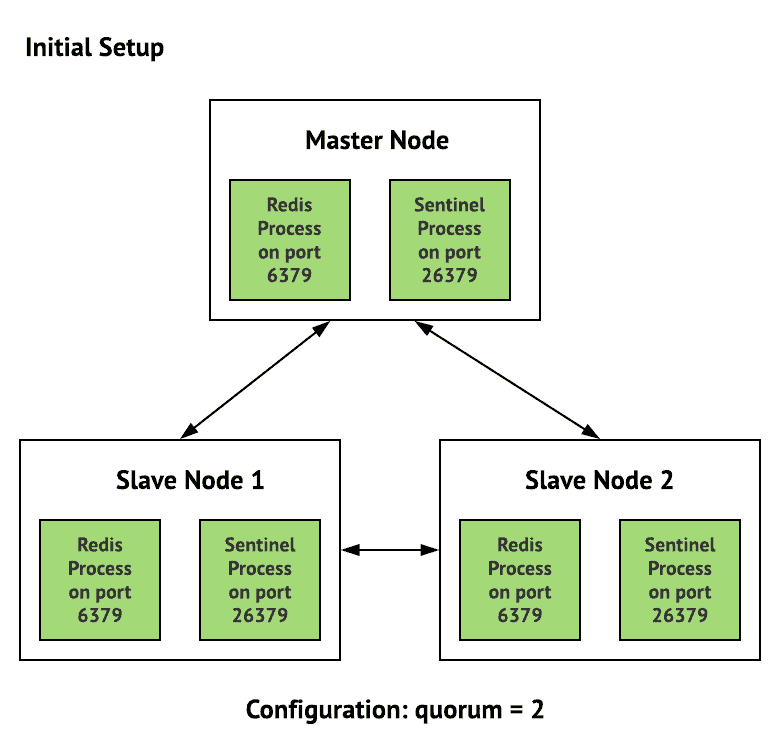

# Redis:复制，第 4 部分——使用 Redis Sentinel provisioning 为主从复制编写一个可行的角色

> 原文：<https://dev.to/setevoy/redis-replication-part-4-writing-an-ansible-role-fore-the-master-slave-replication-with-redis-sentinel-provisioning-468p>

[](https://res.cloudinary.com/practicaldev/image/fetch/s--rqSEDlVy--/c_limit%2Cf_auto%2Cfl_progressive%2Cq_auto%2Cw_880/https://rtfm.co.ua/wp-content/uploads/2018/05/redislogo.png) 下一篇帖子来自 Redis 复制系列。

以前的零件:

1.  Redis:复制，第 1 部分-概述。复制与分片。哨兵 vs 集群。Redis 拓扑。

2.  [Redis:复制，第 2 部分-主从复制，以及 Redis Sentinel](https://rtfm.co.ua/en/redis-replication-part-2-master-slave-replication-and-redis-sentinel/)

3.  [重复:复制，第 3 部分–重复提示和与 Python 的重复提示配合工作](https://rtfm.co.ua/en/redis-replication-part-3-redis-py-and-work-with-redis-sentinel-from-python/)

现在的任务是为自动 Redis 复制集群供应和配置编写一个可行的角色。

该角色必须安装并运行一个 Redis 主节点及其两个 Redis 从节点，以及–Redis Sentinel 实例，这些实例必须监视 Redis 副本，并在当前主节点离线时运行故障转移操作来创建新的主节点。

这项任务有点复杂，因为我们的环境中已经运行了 Redis，新集群必须与现有集群同时工作一段时间，直到后端开发将更新我们的所有项目以使用复制和 Sentinel。

为了实现这一点，新的 Redis 节点将使用端口 6389(而标准的 6379 将由当前现有的 Redis 节点使用)，还必须创建自己的`systemd`单元文件来管理新的 Redis 和 Sentinels。

整个新方案将是绝对通用的:

[](https://rtfm.co.ua/wp-content/uploads/2019/04/1_7AfXYNub6eC9j21-JZ-f-A.png)

也就是说，这里将有三台服务器:

1.  控制台(Console):或者中央主机，我们在那里运行一些管理任务。另外，Redis 主节点和第一个 Sentinel 实例将放在这里
2.  App-1 和 *App-2* :我们的两个应用程序主机将有两个 Redis Slaves 和两个 Sentinels

### 可变角色

为新角色创建目录:

```
$ mkdir roles/redis-cluster/{tasks,templates} 
```

及其对剧本的执行:

```
...
    - role: redis-cluster
      tags: common, app, redis-cluster
      when: "'backend-bastion' not in inventory_hostname"
... 
```

### 变量

创建将在该角色中使用的变量:

```
...
### ROLES VARS ###
# redis-cluster
redis_cluster_config_home: "/etc/redis-cluster"
redis_cluster_logs_home: "/var/log/redis-cluster"
redis_cluster_data_home: "/var/lib/redis-cluster"
redis_cluster_runtime_home: "/var/run/redis-cluster"
redis_cluster_node_port: 6389
redis_cluster_master_host: "dev.backend-console-internal.example.com"
redis_cluster_name: "redis-{{ env }}-cluster"
redis_cluster_sentinel_port: 26389
... 
```

### 任务

创建任务文件`roles/redis-cluster/tasks/main.yml`。

将从 Redis 主安装开始编写我们的角色，并开始。

目录和文件必须归`redis`用户所有。

对于 Redis 主机，将使用`when: "'backend-console' in inventory_hostname"`条件——我们的主机名是*dev.backend-console-internal.example.com*代表主机，而*dev.backend-app1-internal.example.com*带и*dev.backend-app2-internal.example.com*代表 Redis 从机。

描述任务:

```
- name: "Install Redis"
  apt:
    name: "redis-server"
    state: present
- name: "Create {{ redis_cluster_config_home }}"
  file:
    path: "{{ redis_cluster_config_home }}"
    state: directory
    owner: "redis"
    group: "redis"
- name: "Create {{ redis_cluster_logs_home }}"
  file:
    path: "{{ redis_cluster_logs_home }}"
    state: directory
    owner: "redis"
    group: "redis"
- name: "Create {{ redis_cluster_data_home }}"
  file:                                                                                                                                                                                                 
    path: "{{ redis_cluster_data_home }}"
    state: directory                                                                                                                                                                                    
    owner: "redis"
    group: "redis"
- name: "Copy redis-cluster-master.conf to {{ redis_cluster_config_home }}"
  template:
    src: "templates/redis-cluster-master.conf.j2"
    dest: "{{ redis_cluster_config_home }}/redis-cluster.conf"
    owner: "redis"
    group: "redis"
    mode: 0644
  when: "'backend-console' in inventory_hostname"
- name: "Copy Redis replication cluster systemd unit file"
  template:
    src: "templates/redis-cluster-replica-systemd.j2"
    dest: "/etc/systemd/system/redis-cluster.service"
    owner: "root"
    group:  "root"
    mode: 0644
- name: "Redis relication cluster restart"
  systemd:
    name: "redis-cluster"
    state: restarted
    enabled: yes
    daemon_reload: yes 
```

### 模板

创建文件模板

就从`systemd`开始。由于我们新的 Redis 集群必须与现有的 Redis 节点一起工作，并使用非标准端口和目录，因此我们不能使用默认的热地的`systemd`单元文件。

因此，复制它，并根据我们的需要进行更新。

#### `systemd`

创建一个`roles/redis-cluster/templates/redis-cluster-replica-systemd.j2`模板文件:

```
[Unit]
Description=Redis relication cluster node
After=network.target

[Service]
Type=forking
ExecStart=/usr/bin/redis-server {{ redis_cluster_config_home }}/redis-cluster.conf
PIDFile={{ redis_cluster_runtime_home }}/redis-cluster.pid
TimeoutStopSec=0
Restart=always
User=redis 
Group=redis
RuntimeDirectory=redis-cluster

ExecStop=/bin/kill -s TERM $MAINPID

UMask=007
PrivateTmp=yes
LimitNOFILE=65535
PrivateDevices=yes
ProtectHome=yes
ReadOnlyDirectories=/
ReadWriteDirectories=-{{ redis_cluster_data_home }}
ReadWriteDirectories=-{{ redis_cluster_logs_home }}
ReadWriteDirectories=-{{ redis_cluster_runtime_home }}
CapabilityBoundingSet=~CAP_SYS_PTRACE
ProtectSystem=true
ReadWriteDirectories=-{{ redis_cluster_config_home }}

[Install]
WantedBy=multi-user.target 
```

在`ExecStart=/usr/bin/redis-server {{ redis_cluster_config_home }}/redis-cluster-master.conf`参数中，我们自己的 Redis 配置文件将被传递。

#### 重定向大师

创建一个 Redis 主配置文件模板`roles/redis-cluster/templates/redis-cluster-master.conf.j2` :

```
bind 0.0.0.0
protected-mode yes
port {{ redis_cluster_node_port }}
tcp-backlog 511
timeout 0
tcp-keepalive 300
daemonize yes 
supervised no
pidfile {{ redis_cluster_runtime_home }}/redis-cluster.pid
loglevel notice
logfile {{ redis_cluster_logs_home }}/redis-cluster.log
databases 16
stop-writes-on-bgsave-error yes
rdbcompression yes
rdbchecksum yes
dbfilename dump.rdb
dir {{ redis_cluster_data_home }}
slave-serve-stale-data yes
slave-read-only yes
repl-diskless-sync no
repl-diskless-sync-delay 5
repl-disable-tcp-nodelay no
slave-priority 100
appendonly yes 
appendfilename "appendonly.aof"
appendfsync everysec
no-appendfsync-on-rewrite no
auto-aof-rewrite-percentage 100
auto-aof-rewrite-min-size 64mb
aof-load-truncated yes
lua-time-limit 5000
slowlog-log-slower-than 10000
slowlog-max-len 128
latency-monitor-threshold 0
notify-keyspace-events "" 
hash-max-ziplist-entries 512
hash-max-ziplist-value 64
list-max-ziplist-size -2
list-compress-depth 0 
set-max-intset-entries 512
zset-max-ziplist-entries 128
zset-max-ziplist-value 64
hll-sparse-max-bytes 3000
activerehashing yes
client-output-buffer-limit normal 0 0 0
client-output-buffer-limit slave 256mb 64mb 60
client-output-buffer-limit pubsub 32mb 8mb 60
hz 10
aof-rewrite-incremental-fsync yes 
```

稍后将不得不更新它并设置更合适的参数，但现在，可以保留默认值-只需更新`bind`和`port`。

使用 [`ansible_exec.sh`](https://github.com/setevoy2/rtfm-infrastructure/blob/master/ansible_exec.sh) 进行部署。将来，它将通过 Jenkins 作业进行部署:

```
$ ./ansible_exec.sh -t redis-cluster
Tags: redis-cluster
Env: mobilebackend-dev
... 
```

检查 Redis 主状态:

```
root@bttrm-dev-console:/home/admin# systemctl status redis-cluster.service
● redis-cluster.service - Redis relication cluster node
Loaded: loaded (/etc/systemd/system/redis-cluster.service; enabled; vendor preset: enabled)
Active: active (running) since Wed 2019-04-03 14:05:46 EEST; 9s ago
Process: 22125 ExecStop=/bin/kill -s TERM $MAINPID (code=exited, status=0/SUCCESS)
Process: 22131 ExecStart=/usr/bin/redis-server /etc/redis-cluster/redis-cluster-master.conf (code=exited, status=0/SUCCESS)
Main PID: 22133 (redis-server)
Tasks: 3 (limit: 4915)
Memory: 1.1M
CPU: 14ms
CGroup: /system.slice/redis-cluster.service
└─22133 /usr/bin/redis-server 0.0.0.0:6389
Apr 03 14:05:46 bttrm-dev-console systemd[1]: Starting Redis relication cluster node...
Apr 03 14:05:46 bttrm-dev-console systemd[1]: redis-cluster.service: PID file /var/run/redis/redis-cluster.pid not readable (yet?) after start: No such file or directory
Apr 03 14:05:46 bttrm-dev-console systemd[1]: Started Redis relication cluster node. 
```

好的。

#### 背奴隶

添加 Redis 从站的配置-`roles/redis-cluster/templates/redis-cluster-slave.conf.j2`。

它几乎与主配置相同，只是有`slaveoff` :

```
slaveof {{ redis_cluster_master_host }} {{ redis_cluster_node_port }}
bind 0.0.0.0
port {{ redis_cluster_node_port }}
pidfile {{ redis_cluster_runtime_home }}/redis-cluster.pid
logfile {{ redis_cluster_logs_home }}/redis-cluster.log
dir {{ redis_cluster_data_home }}
protected-mode yes
tcp-backlog 511
timeout 0 
tcp-keepalive 300
... 
```

添加任务。

这里的`when: "'backend-console' not in inventory_hostname"`条件仅用于将该文件复制到 *App-1* 和*App-2*:

```
...
- name: "Copy redis-cluster-slave.conf to {{ redis_cluster_config_home }}"
  template: 
    src: "templates/redis-cluster-slave.conf.j2"
    dest: "{{ redis_cluster_config_home }}/redis-cluster.conf"
    owner: "redis"
    group: "redis"
    mode: 0644
  when: "'backend-console' not in inventory_hostname"
... 
```

部署，检查:

```
root@bttrm-dev-app-1:/home/admin# redis-cli -p 6389 info replication
Replication
role:slave
master_host:dev.backend-console-internal.example.com
master_port:6389
master_link_status:down
master_last_io_seconds_ago:-1
... 
```

检查复制

在主控上添加一个键:

```
root@bttrm-dev-console:/home/admin# redis-cli -p 6389 set test 'test'
OK
Get it on slaves:
root@bttrm-dev-app-1:/home/admin# redis-cli -p 6389 get test
"test"
root@bttrm-dev-app-2:/home/admin# redis-cli -p 6389 get test
"test" 
```

### 重复哨兵

添加一个 Redis Sentinel 的配置，一个用于所有主机-`roles/redis-cluster/templates/redis-cluster-sentinel.conf.j2`。

此处使用`sentinel announce-ip`，详见[Redis:Sentinel–bind 0 . 0 . 0 . 0，localhost 问题和 announce-ip 选项](https://rtfm.co.ua/en/redis-sentinel-bind-0-0-0-0-the-localhost-issue-and-the-announce-ip-option/):

```
sentinel monitor {{ redis_cluster_name }} {{ redis_cluster_master_host }} {{ redis_cluster_node_port }} 2
bind 0.0.0.0
port {{ redis_cluster_sentinel_port }}
sentinel announce-ip {{ hostvars[inventory_hostname]['ansible_default_ipv4']['address'] }}
sentinel down-after-milliseconds {{ redis_cluster_name }} 6001
sentinel failover-timeout {{ redis_cluster_name }} 60000
sentinel parallel-syncs {{ redis_cluster_name }} 1
daemonize yes
logfile {{ redis_cluster_logs_home }}/redis-sentinel.log
pidfile {{ redis_cluster_runtime_home }}/redis-sentinel.pid 
```

为哨兵服务`systemd`单位档案增加一个模板—`roles/redis-cluster/templates/redis-cluster-sentinel-systemd.j2`:

```
[Unit]
Description=Redis relication Sentinel instance
After=network.target
[Service]
Type=forking
ExecStart=/usr/bin/redis-server {{ redis_cluster_config_home }}/redis-sentinel.conf --sentinel
PIDFile={{ redis_cluster_runtime_home }}/redis-sentinel.pid
TimeoutStopSec=0
Restart=always
User=redis 
Group=redis

ExecStop=/bin/kill -s TERM $MAINPID

ProtectSystem=true
ReadWriteDirectories=-{{ redis_cluster_logs_home }}
ReadWriteDirectories=-{{ redis_cluster_config_home }}
ReadWriteDirectories=-{{ redis_cluster_runtime_home }}
[Install]
WantedBy=multi-user.target 
```

在`roles/redis-cluster/tasks/main.yml`的最开始添加 Sentinels stop 任务，否则在部署期间，如果 Sentinel 实例将运行，它将覆盖 Ansible 在其 config:
中的更改

```
- name: "Install Redis"
  apt:
    name: "redis-server"
    state: present
- name: "Redis replication Sentinel stop"
  systemd:
    name: "redis-sentinel"
    state: stopped
  ignore_errors: true
... 
```

添加文件拷贝和哨兵启动:

```
...
- name: "Copy redis-cluster-sentinel.conf to {{ redis_cluster_config_home }}"
  template: 
    src: "templates/redis-cluster-sentinel.conf.j2"
    dest: "{{ redis_cluster_config_home }}/redis-sentinel.conf"
    owner: "redis"
    group: "redis"
    mode: 0644
...
- name: "Copy Redis replication Sentinel systemd unit file"
  template:
    src: "templates/redis-cluster-sentinel-systemd.j2"
    dest: "/etc/systemd/system/redis-sentinel.service"
    owner: "root"
    group:  "root"
    mode: 0644
...
- name: "Redis relication Sentinel restart"
  systemd:
    name: "redis-sentinel"
    state: restarted
    enabled: yes
    daemon_reload: yes 
```

[文档说](https://redis.io/topics/sentinel#adding-or-removing-sentinels) Sentinels 必须在至少 30 秒的停顿后启动——但是没有它也能工作(目前)。

将在开发/阶段测试期间检查/

部署，检查:

```
root@bttrm-dev-console:/home/admin# redis-cli -p 26389 info sentinel
Sentinel
sentinel_masters:1
sentinel_tilt:0
sentinel_running_scripts:0
sentinel_scripts_queue_length:0
sentinel_simulate_failure_flags:0
master0:name=redis-dev-cluster,status=ok,address=127.0.0.1:6389,slaves=2,sentinels=3 
```

#### 测试哨兵故障转移

运行`tail -f`获取所有实例的日志:

```
root@bttrm-dev-app-1:/etc/redis-cluster# tail -f /var/log/redis-cluster/redis-sentinel.log 
```

在主机上–检查当前主机的 IP:

```
root@bttrm-dev-console:/etc/redis-cluster# redis-cli -h 10.0.2.104 -p 26389 sentinel get-master-addr-by-name redis-dev-cluster
1) "127.0.0.1"
2) "6389" 
```

和复制状态:

```
root@bttrm-dev-console:/etc/redis-cluster# redis-cli -h 10.0.2.104 -p 6389 info replication
Replication
role:master
connected_slaves:2
... 
```

角色——主人，两个奴隶——都好。

停止主服务器的 Redis 节点:

```
root@bttrm-dev-console:/etc/redis-cluster# systemctl stop redis-cluster.service 
```

登录 *App-2* :

```
11976:X 09 Apr 13:12:13.869 # +sdown master redis-dev-cluster 10.0.2.104 6389
11976:X 09 Apr 13:12:13.983 # +new-epoch 1
11976:X 09 Apr 13:12:13.984 # +vote-for-leader 8fd5f2bb50132db0dc528e69089cc2f9d82e01d0 1
11976:X 09 Apr 13:12:14.994 # +odown master redis-dev-cluster 10.0.2.104 6389 #quorum 2/2
11976:X 09 Apr 13:12:14.994 # Next failover delay: I will not start a failover before Tue Apr  9 13:14:14 2019
11976:X 09 Apr 13:12:15.105 # +config-update-from sentinel 8fd5f2bb50132db0dc528e69089cc2f9d82e01d0 10.0.2.71 26389 @ redis-dev-cluster 10.0.2.104 6389
11976:X 09 Apr 13:12:15.105 # +switch-master redis-dev-cluster 10.0.2.104 6389 10.0.2.71 6389 
```

1.  哨兵认为主人倒下了
2.  `odown master quorum 2/2`:在 *App-1* 和 *App-2* 上的哨兵都同意
3.  `switch-master ... 10.0.2.71`–Sentinel 将 10.0.2.71 上的 Redis 节点从从属角色重新配置为新的主角色

所有作品？？

查看 10.0.2.71，是 *App-1* :

```
root@bttrm-dev-app-1:/etc/redis-cluster# redis-cli -p 6389 info replication
Replication
role:master
connected_slaves:1
... 
```

在控制台/主控主机上打开 Redis Master:

```
root@bttrm-dev-console:/etc/redis-cluster# systemctl start redis-cluster.service 
```

检查 *App-2* 日志:

```
11976:X 09 Apr 13:17:23.954 # -sdown slave 10.0.2.104:6389 10.0.2.104 6389 @ redis-dev-cluster 10.0.2.71 6389

11976:X 09 Apr 13:17:33.880 * +convert-to-slave slave 10.0.2.104:6389 10.0.2.104 6389 @ redis-dev-cluster 10.0.2.71 6389 
```

检查新的主日志:

```
root@bttrm-dev-console:/etc/redis-cluster# redis-cli -p 6389 info replication
Replication
role:slave
master_host:10.0.2.71
master_port:6389
master_link_status:up
... 
```

旧主人现在成了奴隶。

所有作品。

完成了。

### 类似的帖子

*   <small>03/29/2019</small> [Redis:复制，第 2 部分-主从复制，Redis Sentinel](https://dev.to/setevoy/redis-replication-part-2-master-slave-replication-and-redis-sentinel-1hoe) <small>(0)</small>
*   <small>03/29/2019</small> [Redis:复制，第 1 部分–概述。复制与分片。哨兵 vs 集群。Redis 拓扑。](https://dev.to/setevoy/redis-replication-part-1-an-overview-replication-vs-sharding-sentinel-vs-cluster-redis-topology-3ao9) <small>(0)</small>