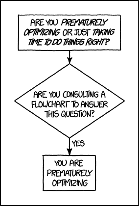
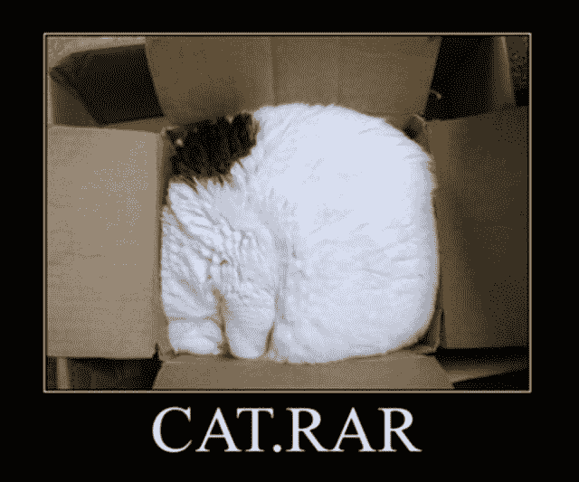
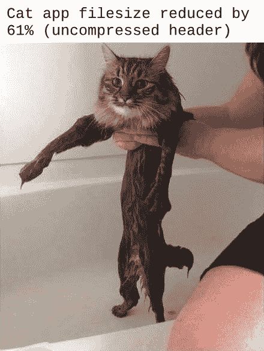

# 减少 NW.js 中的应用分发大小

> 原文：<https://dev.to/thejaredwilcurt/reducing-app-distribution-size-in-nwjs-3d5f>

使用工具构建 XPDA(跨平台桌面应用)有很多好处。然而，工具越容易使用，功能越强大，你的发行包就越大。NW.js 也不例外。我做桌面应用已经超过 5 年了。在那段时间里，我发现了一些优化桌面应用程序的技巧和最佳实践，今天我想分享其中的一些技巧。

我们将介绍的四种方法:

1.  [NW . js 的旧版本](#1-using-older-versions-of-nwjs)
2.  [减少节点模块](#2-reducing-node-modules)
3.  [优化您的应用](#3-optimizing-your-app)
4.  [从 NW.js 中移除文件](#4-removing-files-from-nwjs-itself-not-advised)

* * *

## 1。使用 NW.js 的旧版本

[](https://res.cloudinary.com/practicaldev/image/fetch/s--srqZnP9N--/c_limit%2Cf_auto%2Cfl_progressive%2Cq_auto%2Cw_880/https://thepracticaldev.s3.amazonaws.com/i/g4jil7ad37plleoy1kay.png)

简单来说，NW.js 是一个改进的 Chromium 浏览器，内置了 Node.js。所以随着时间的推移，Chromium 和 Node 不断改进，获得新的特性，变得更加安全。结果它们也变大了。由于 NW.js 是建立在这些技术之上的，它继承了这些改进，但也继承了它们在文件大小上的增长。

NW.js 以拥有最新技术而闻名。它通常会在新的 Chromium 或 Node 发布后的 24 小时内生成新的发布。这个因素吸引了很多人。然而，对于那些愿意使用这些技术的旧版本的人来说，这为一些有趣的权衡提供了机会。

减小文件大小的一个解决方案是使用 NW.js 的旧版本。首选版本是`0.14.7`，长期支持(LTS)版本。这是支持传统操作系统(Windows XP+，OSX 10.6+)的最新版本。使用这个旧版本将意味着应用程序总发行规模的大幅缩减，但也意味着放弃使用最新 Node/Chromium 版本中的新特性和新开发工具。

老版本的另一个选择是`0.12.3`。这是 NW.js 的最后一个版本，在此之前，它有一个主要的架构变化，以允许更快和更频繁地发布。不建议使用这个版本，因为它的 API 与`0.13.0+`版本有细微的差别。这意味着将来将你的应用程序更新到 NW.js 的新版本会更加困难。如果你使用`0.13.0`或更高版本来创建你的应用，那么升级到 NW.js 的新版本是完全没有痛苦的，并且几乎不需要任何代码修改，除非 Chromium 或 Node 本身有什么东西被否决了(除了实验性的特性之外，这种情况很少见)。

### 本次选择的结果

使用 Windows 版本作为基线，NW.js 的最新版本(~0.36.x)大约为 189 MB，LTS (0.14.7)版本为 126 MB，过时的版本(0.12.3)为 103 MB(同样，不值得)。这可以节省 63 MB(或者 86MB，如果你真的疯了)。这种节省是以放弃一些开发人员便利性、更新的特性和最重要的安全补丁为代价的。但是你会得到更广泛的支持和更小的范围。一个折中的办法是只为传统操作系统构建这个版本；但是其他的都用最新版本的 NW.js。不过，这将需要两倍的应用程序手动测试。

## 2。减少节点模块

[](https://res.cloudinary.com/practicaldev/image/fetch/s--VUo0igbJ--/c_limit%2Cf_auto%2Cfl_progressive%2Cq_auto%2Cw_880/https://thepracticaldev.s3.amazonaws.com/i/y0rwhiii0pmcst3op5uo.png)

文件夹有野兽般的名声。NW.js 的一个重要特性是能够直接从 DOM 访问节点模块。因此，你的应用程序可能需要附带一些软件包。

**包装类型:**

1.  **开发**所需要的东西——这些应该在`package.json`中的`devDependencies`中，到了构建发行版的时候再移除。例子:ESLint，Jest，Babel。
2.  **你的代码使用的库**——如果这些只是代码库，那么理想情况下，它们也应该在`devDependencies`中，并且相关代码由自动捆绑器/树抖动工具(Webpack、Rollup、Gulp 等)拉入。).例如:Lodash、Vue、Moment。
3.  **包含二进制文件或其他无法捆绑的独特文件的模块**——这些应该被列为`dependencies`。示例:Scout-App 是一个桌面应用程序，处理对 CSS 的 Sass，因此它需要附带的`node-sass`二进制文件。Koa11y 需要 Pa11y 和 PhantomJS 的依赖关系来测试网页上的可访问性问题。

好吧，所以简单地把所有你可以带走的东西从`dependencies`中移走会有很大帮助。但是那些你做不到的事情呢？大多数情况下，每个节点模块都会附带许多您的最终用户不需要的额外文件(`README.md`、`src`文件夹、`tests`文件夹等)。).为此，我通常会创建一个定制的构建或后期构建脚本，在一个数组中列出每个垃圾文件/文件夹的路径。然后遍历`junk`数组，在构建期间或之后删除它们。

这存在一些固有的风险，因为您是手动选择要自动删除的文件，并且这些文件可能会在您将来更新依赖项时发生变化。虽然这是一个小风险，但在更新依赖项时，您应该意识到这一点。当您更新任何依赖项时，确保彻底测试您的构建，并在构建后检查`node_modules`文件夹，以确保没有新的垃圾文件/文件夹添加到列表中。

### 减少节点模块的结果

这里的结果完全取决于您的应用程序以及您如何开发它。一般来说，这种类型的优化将使大多数应用程序在减少发行规模方面获得最大收益。它通常以几十到几百兆字节来度量。我们将使用 Koa11y 作为真实世界的例子，它是一个 XPDA，用于检测网页中的可访问性问题。

*   包含依赖项、开发依赖项和额外文件的 KOA 11y:274 MB
*   包含依赖项和额外文件的 KOA 11y:158 MB
*   移除依赖项和额外文件后的 KOA 11y:121 MB

这个案例研究显示了减少应用程序中依赖项的数量是多么重要。因为每一个都是交付给用户的，所以添加依赖项的决定必须谨慎处理。在这种情况下，仅删除 devDependencies 就节省了 **116 MB** 。构建后的脚本删除了应用程序运行不需要的文件(垃圾文件)，额外删除了 **37 MB** 。

## 3。优化您的应用

[](https://res.cloudinary.com/practicaldev/image/fetch/s--jjJU3iHm--/c_limit%2Cf_auto%2Cfl_progressive%2Cq_auto%2Cw_880/https://thepracticaldev.s3.amazonaws.com/i/zx3c2787yvn73uy9nkag.png)

当谈到优化网络应用程序时，许多人都专注于减少比特和字节。老实说，当处理用 NW.js 制作的 XPDAs 时，这是浪费时间。我将快速介绍您可以跳过的内容，以及有可能节省几兆字节的内容。

### 哪些不优化:

由于 NW.js 使用 web 技术来开发桌面应用程序，因此尝试应用 web 开发人员使用的所有相同技术来优化他们的 web 应用程序是很有诱惑力的。虽然有些技巧仍然适用，但了解你工作的媒介是很重要的。桌面应用不是网络。

1.  **不要串联** -在网络上，人们非常关注减少将要传输的文件数量。这是因为服务器通常一次只能处理每个用户 4 或 5 个网络请求。因此，将所有的 JS 连接到一个文件中，将所有的 CSS 连接到一个文件中，可以大大节省加载时间。但是...这不是我们需要担心的事情，因为所有文件都是直接从本地磁盘加载的(假设你遵循了将桌面应用设计为离线优先的最佳实践)。因此，文件的连接是不相关的。这样做没有坏处，但也没有真正的好处。
2.  不要丑化——通过网络加载页面时，丑化确实会产生影响，尤其是在网速较慢的连接和移动设备上。但我们不是在处理网络和移动设备。我们的应用程序提供了一个 100 多 MB 的运行时环境，所以，减少几个字节的东西是完全微不足道的**。用户将进行一次性的大量下载。如果下载多花了 1 秒钟，他们不在乎，他们仍然需要在它完成下载后解压缩或安装它。除了在 prod 中调试更加困难之外，变丑或变小并没有什么坏处，但是也没有什么真正的好处，除非它在文件大小上节省了兆字节。**
***   **不要担心延迟** -同样，网络请求和延迟并不重要，他们已经在本地拥有了所有文件。*   **不要担心“关键 CSS”**——所有的样式都已经从本地加载到磁盘上了。关键的 CSS 在这里没有任何好处。*   **不要卸载到网络上** -不要使用网络字体或 CDN。使用这些意味着你的应用程序不能在没有互联网接入的情况下运行。几乎所有的桌面应用都应该设计成离线运行。cdn 提供的优势都不适用于桌面应用。因此，用应用程序存储字体和库是一个最佳实践。这些类型的文件都很小。**

 **### 那么什么样的优化才是最重要的呢？

1.  **捆绑**——这允许你保持库作为开发依赖，只拉进你的应用需要的部分。例如，LoDash 是开发人员常用的工具。如果您使用它的全部目的是`_.cloneDeep`，那么您可以只导入该部分，并将其与您的代码捆绑在一起。或者，如果您打包所有的 LoDash，那么您的 dist 大小将增加几兆字节。最流行的捆绑工具是 WebPack，尽管也存在类似包裹这样的替代工具。
2.  这是追踪你所有代码的过程，只引入曾经使用过的部分。因此，运行应用程序时不会被访问的杂散函数或部分库只是被修剪掉的树的分支。这也可以节省几 MB 的空间。WebPack 和 Rollup 是最流行的摇树工具。
3.  **媒体优化** -图像、视频和音频文件都可以压缩成更小的文件。对于视频，像 HandBrake 这样的工具提供了高级压缩选项，可以通过需要更多时间编码的技术以更小的文件大小产生相同质量的视频。尽管最终在媒体文件中获得较小文件大小的最佳技术将导致更大压缩的质量折衷。不过，对于图像，PNG 文件有一些无损压缩形式，可以以更小的尺寸产生逐像素相同的图像。对于 SVG 的，有 SVGO 来优化它们。
4.  **压缩分发**——有很多方法可以打包和分发你的应用，但最常见的是要么压缩文件，让用户只需“解压，双击”，要么将它们打包到一个安装程序中(双击，点击几次下一步，完成，然后点击快捷方式)。这只会影响发行版的下载大小，而不会影响解压缩后的大小。对于压缩路径，有一些工具可以用来自动化压缩，比如节点模块`7zip-bin`，或者`nw-builder-phoenix`中的选项(比如`nsis7z`)。或者，您可以使用 WinRAR 的 GUI 来生成一个自解压的可执行文件，使用它的 RAR 压缩(而不是 zip，这通常是您可以生成的最小的安装程序选项)进行压缩。你不想做的是每次打开你的应用程序时都要强制解压。NW.js 允许这种类型的打包，但不建议这样做，因为它只会任意增加应用程序的启动时间，因为它必须在每次启动之前将应用程序文件解压缩到一个临时文件夹中。

### 结果

[](https://res.cloudinary.com/practicaldev/image/fetch/s--UxnfeUEf--/c_limit%2Cf_auto%2Cfl_progressive%2Cq_auto%2Cw_880/https://thepracticaldev.s3.amazonaws.com/i/tdtmwjt680bp3pmwusxk.png)

这完全取决于您的应用程序。不过一般来说，直接优化应用程序可以节省最少的成本。然而，用一些 zip 或 rar 之类的压缩来打包你的应用程序可以显著地减少你的应用程序的大小，通常减少到 60-70 MB 左右，尽管在某些情况下可能会更小。这种压缩只是为了初始下载，一旦解压缩/安装后，应用程序的完整大小就会显示出来。

## 4。从 NW.js 本身删除文件(不建议)

[](https://res.cloudinary.com/practicaldev/image/fetch/s--W3hOowQS--/c_limit%2Cf_auto%2Cfl_progressive%2Cq_auto%2Cw_880/https://thepracticaldev.s3.amazonaws.com/i/sfm9qef2lwcdzj1rm127.png)

当您检查 NW.js 附带的文件时，您会发现有些文件比其他文件更重要。有些文件只有在您使用某些功能时才需要。

例如，当你的应用程序与你的视频驱动程序对话以显示 3D 模型时使用`libEGL.dll`，就像使用 WebGL 时一样。如果这个文件丢失了，而你试图加载一个 3D 模型到 DOM 中，NW.js 会调用`libEGL.dll`，找不到，然后崩溃！但是如果你的应用程序从不调用 libEGL，那么它的缺失不会有任何负面影响。正如你可能已经推测的那样，删除可能导致你的应用崩溃的文件是非常危险的，这也是为什么**我不建议这么做**。但为了教育起见，我还是列出 NW.js 为了运行必须要有的文件:

```
/locales/en-US.pak
ffmpeg.dll (not all versions require this)
icudtl.dat
natives_blob.bin
node.dll
nw.dll
nw.exe
nw_elf.dll (not all versions require this)
resources.pak
v8_context_snapshot.bin (not all versions require this) 
```

Enter fullscreen mode Exit fullscreen mode

`locales`文件对于您的操作系统所设置的语言环境是唯一的。因此，删除额外的应用程序意味着你节省了空间，但该应用程序无法在设置了不同语言环境的电脑上运行。有`.pak`和`.pak.info`档。删除`.pak.info`语言环境文件没有负面影响。

如果您试图删除额外的文件，请确保手动测试应用程序的各个方面。因为您的应用程序可能不会崩溃，直到您的应用程序中的某个交互发生，如播放视频、查看 PDF、查看 3D 模型等。

### 结果

这实际上可以剃掉大约 **43 MB** 。当然，你的应用程序可能会随机崩溃，但你知道，要么做大，要么回家(开玩笑，实际上不要这样做)。

* * *

# **结论**

[](https://res.cloudinary.com/practicaldev/image/fetch/s--L1bkiw5h--/c_limit%2Cf_auto%2Cfl_progressive%2Cq_auto%2Cw_880/https://thepracticaldev.s3.amazonaws.com/i/arsze4aod9owmia43wzo.jpg)

我已经介绍了几种方法来减少你的体重。许多是桌面开发特有的。有些很容易赢。有些有取舍。有些更复杂或风险更大。知道取舍和你所有的选择是很重要的，即使它们并不都是安全的。同样重要的是，要知道哪些优化是白费力气。

您会注意到，在这篇文章中，我只测量了兆字节的节省。我想让读者记住他们也应该这样做。记住，你是在给你的用户发送一个 70 - 200 MB 的应用。如果你关注的是节省 20KB，那你就关注错了。

最后，我们将继续使用 Koa11y 作为我们的真实示例。让我们比较不同的方法。

| NW.js 版本 | 发展部 | 垃圾文件 | NW.js 文件 | 总尺寸 |
| --- | --- | --- | --- | --- |
| 0.36.0 | 有 | 有 | 有 | **485 MB** |
| 0.36.0 | 相异的 | 有 | 有 | **205 MB** |
| 0.36.0 | 相异的 | 相异的 | 有 | **188 MB** |
| 0.36.0 | 相异的 | 相异的 | 相异的 | **145 MB** |
| 0.14.7 | 有 | 有 | 有 | **274 MB** |
| 0.14.7 | 相异的 | 有 | 有 | **158 MB** |
| 0.14.7 | 相异的 | 相异的 | 有 | **121 MB** |
| 0.14.7 | 相异的 | 相异的 | 相异的 | **119 MB** |

119 对于运送 Chromium、Node.js、PhantomJS(KOA 11y 用的)来说还不算太寒酸。

Koa11y 的官方下载被压缩，在 Windows 上降到了**59.8 MB**(OSX 66.6 MB，Linux 78.4 MB)。

* * *

许多 NW.js 资源可在此处获得:

*   [https://NWUtils.io](https://NWUtils.io)

要了解有关跨平台桌面应用程序(XPDA)开发的更多信息:

*   [https://XPDA.net](https://XPDA.net)

为了开始使用 NW.js，我写了一个初学者友好教程:

*   [https://gitlab.com/TheJaredWilcurt/battery-app-workshop](https://gitlab.com/TheJaredWilcurt/battery-app-workshop)

如果以上任何一条需要澄清或进一步解释，你可以在下面的评论中提问。**