# 使用 JavaScript 中的显示模块和命令模式重构视频播放器

> 原文：<https://dev.to/carlillo/refactoring-a-video-player-using-reveal-module-and-command-pattern-in-javascript-4bgg>

* * *

最初发布于[www . carloscaballero . io](https://carloscaballero.io/refactoring-a-video-player-using-reveal-pattern-and-command-pattern-in-js/)2019 . 1 . 11。

* * *

今天，我将展示一个基本的代码，其中一个视频播放器使用了一些好的实践来开发 JavaScript 语言的代码。我的意图是展示从原始代码
到使用几个经典模式完成代码的一步一步的过程，比如 [RevealModule](https://addyosmani.com/resources/essentialjsdesignpatterns/book/#revealingmodulepatternjavascript) 和 [Command](https://addyosmani.com/resources/essentialjsdesignpatterns/book/#commandpatternjavascript) 。

因此，初始代码如下:

[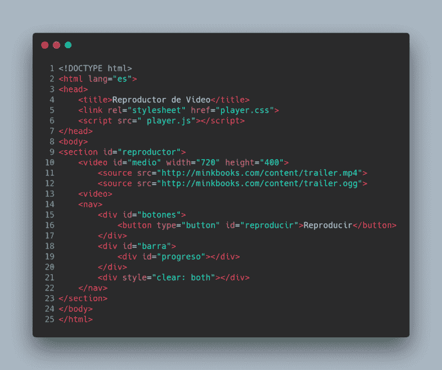](https://res.cloudinary.com/practicaldev/image/fetch/s--rgpAZdz8--/c_limit%2Cf_auto%2Cfl_progressive%2Cq_auto%2Cw_880/https://cdn-images-1.medium.com/max/1000/1%2AXlEOJsMYNUj-QjqIaPod1A.png)

[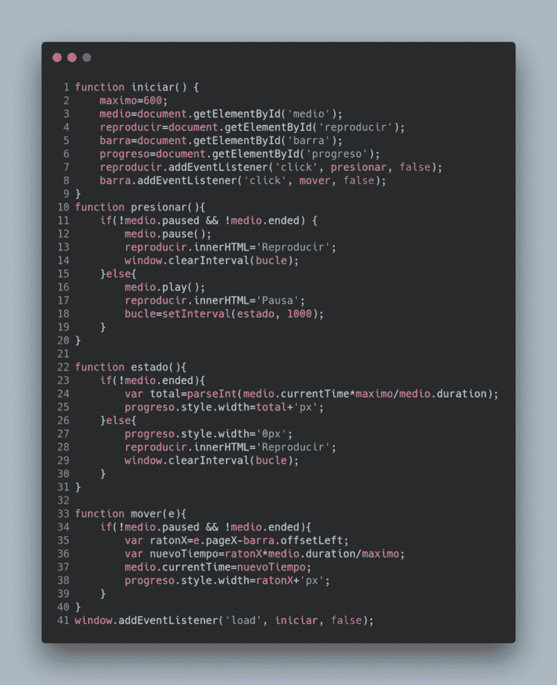](https://res.cloudinary.com/practicaldev/image/fetch/s--XDTvSnih--/c_limit%2Cf_auto%2Cfl_progressive%2Cq_auto%2Cw_880/https://cdn-images-1.medium.com/max/1000/1%2AbLL0j_DuJIA3wOp2DFOzUg.png)

我们代码的结果如下图所示。

### 使用国际语言编码:英语+漂亮点

这个世界上任何代码的第一步都是使用国际语言
编码。今天的主流语言是英语，我知道其他语言如中文或西班牙语是最流行的语言，但真正更容易理解的是 T2 用英语写的代码。我是土生土长的西班牙人，对我来说用英语写和说
更难，但我知道如果我用英语写
我的代码，我就能与世界分享我的代码。

所以，第一步是把我的代码翻译成英语，这并不需要完美的英语，因为大多数观众的母语不是英语。

另一个重要且基本的编码技巧是使用一个工具来规范化你的代码
，因为在你的代码中没有相关的空格或制表符，每行中使用的
字符的数量，或者你创建一个新对象的方式
，但是有一点**非常重要**，你总是以同样的方式完成这个任务。也就是说，
你需要和你的伙伴一起规范你的代码。今天网络开发生态系统中最好的工具是漂亮的。
所以，我建议你在你最喜欢的 IDE 中安装这个工具(在我的例子中
我使用的是 [VSCode](https://marketplace.visualstudio.com/items?itemName=esbenp.prettier-vscode) 中的扩展)。

现在，您可以使用一种国际语言和一个格式化我的代码的工具
来阅读代码:

[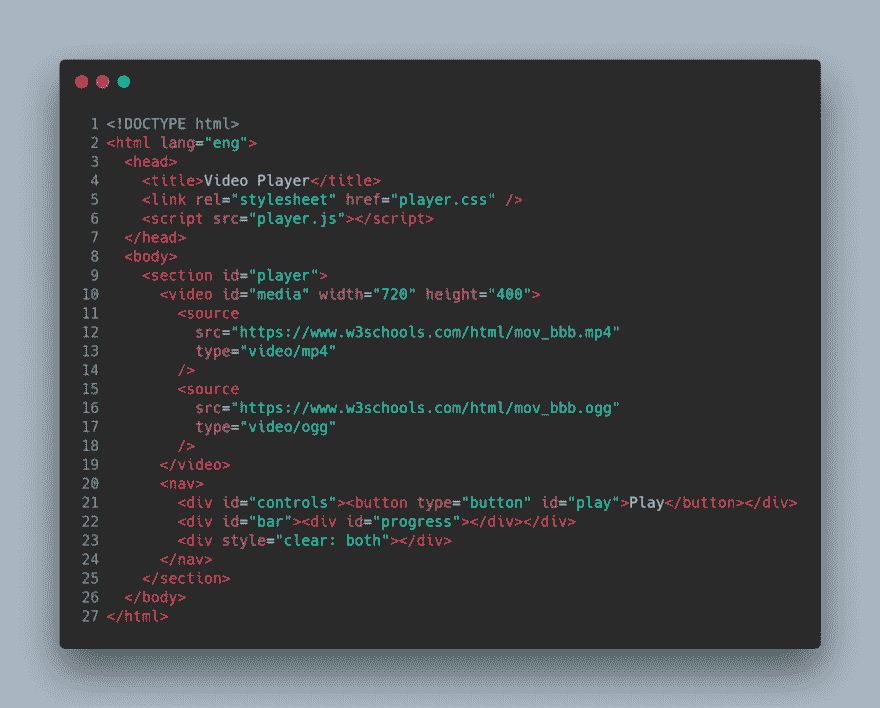](https://res.cloudinary.com/practicaldev/image/fetch/s--jTGyMdxw--/c_limit%2Cf_auto%2Cfl_progressive%2Cq_auto%2Cw_880/https://cdn-images-1.medium.com/max/1000/1%2ATG19Tz7aidG34KJrmZCnGg.png)

[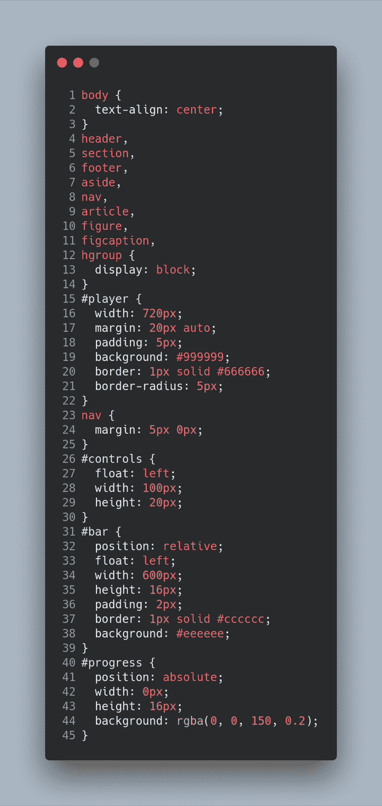](https://res.cloudinary.com/practicaldev/image/fetch/s--OAsGRgCz--/c_limit%2Cf_auto%2Cfl_progressive%2Cq_auto%2Cw_880/https://cdn-images-1.medium.com/max/1000/1%2API4kKnBoRCipyO7eVlQUZg.png)

[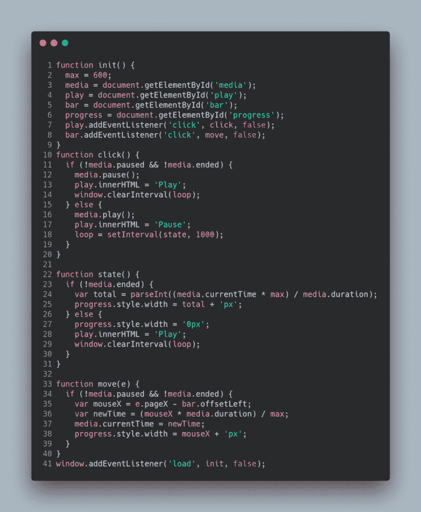](https://res.cloudinary.com/practicaldev/image/fetch/s--krnooEM5--/c_limit%2Cf_auto%2Cfl_progressive%2Cq_auto%2Cw_880/https://cdn-images-1.medium.com/max/1000/1%2ALYYKKs7WCQRY3Bnn3d867g.png)

> 该分支中的 GitHub 项目是[https://GitHub . com/Caballerog/refactoring-js-patterns-tips/tree/01-international-code](https://github.com/Caballerog/refactoring-js-patterns-tips/tree/01-international-code)。

### 变量范围—显示模块模式

了解变量作用域在你的语言中是如何工作的非常重要，因为你可以避免将来的副作用，并使你的代码更加清晰易读。

在 JavaScript 中有 4 种定义变量的方法，这些方法的主要区别在于变量的范围。在下面的链接中，你可以
阅读这个[沃伊特克鲁兹卡的博客](https://www.vojtechruzicka.com/javascript-hoisting-var-let-const-variables/)、[斯塔克韦尔弗洛的 QA](https://stackoverflow.com/questions/762011/whats-the-difference-between-using-let-and-var-to-declare-a-variable-in-jav) 和[安迪卡特的博客](https://andy-carter.com/blog/variable-scope-in-modern-javascript)，但是下面可能是一个简短的摘要:

1.  只在代码的任何地方写变量。这是声明变量最糟糕的方式。在这种情况下，变量在您的应用程序中有一个作用域**全局**(OMG！！既然是私有函数，你就定义了一个**全局**变量，这可能会在你的代码中引起副作用和一些冲突。所以，不要在没有关键字的情况下声明变量。
2.  使用关键字 **var** 。使用关键字 var，您可以提升和功能范围。你的变量可能会在函数中引起副作用，因为变量是在代码的顶部(在你的函数中)定义的，在函数中的任何地方都有，值是在初始化变量的代码行中赋值的。
3.  使用关键字 **let/const** 。这是 ES6 和社区更喜欢用来定义变量的方式，因为这个变量的范围是 block(正如你所期望的那样，因为大多数语言都使用 block 范围),但是 let 和 const 之间的主要区别是，存储变量值的引用的内存指针可以改变也可以不改变(OMG！).换句话说，let 用于代码中值可以改变的变量，而 const 用于类型为基元(数字或字符串)时变量的值不能改变的情况，如果类型为非基元，值的指针不能改变的情况，例如 objects 和 array。

好的，现在我知道我应该改变在 JavaScript 中定义变量的方式。因此，代码如下所示:

[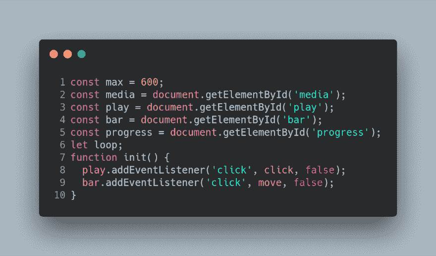](https://res.cloudinary.com/practicaldev/image/fetch/s--ekKJ9LaM--/c_limit%2Cf_auto%2Cfl_progressive%2Cq_auto%2Cw_880/https://cdn-images-1.medium.com/max/1000/1%2AhBV9EJbItIOfjKiG-yPz0A.png)

在 init 函数中定义的全局变量被移到脚本的顶部
，并使用关键字`const`，因为这里引用了
DOM 或一个原始值，如`max`。此外，还有一个名为`loop`
的变量，用于存储使用`setTimeInterval`
函数返回的引用 ID。

此时，两个代码的行为是相同的，因为变量是全局的
,此时也是全局的。为此，我们可以使用模式[Reveal Module([https://addyosmani . com/resources/essentialjsdesignpatterns/book/# revealingmodulepatternjavascript](https://addyosmani.com/resources/essentialjsdesignpatterns/book/#revealingmodulepatternjavascript)),它允许为函数和变量创建私有范围。这种模式可以在这篇[博客](https://blog.bitsrc.io/understanding-design-patterns-in-javascript-13345223f2dd)中读到。

模式模块 reveal 允许我们公开转换我们的接口
与代码的其他部分通信。在这种情况下，方法有
`init`、`click`和`move`。方法`state`现在有了我们的模块
的范围，这个模块叫做`player`。其余的变量也是私有的，所以我们
只是为了避免对我们的变量或
方法的全局范围产生副作用。

应用此模式的代码如下:

但是下面的代码不工作，因为模式模块 reveal 使用了在 DOM 加载之前运行的
生命，所以变量`media`，
`play`等等。这些台词是`null`在脚本运行的时候写的。解决方案是将
这个变量的定义移到方法 init 中，但是在这个重构中
我们将创建一个名为`GUI`的对象，它存储关于
DOM 的信息(在大型应用程序中，这个对象将使用
著名的模式
[MVC](https://addyosmani.com/resources/essentialjsdesignpatterns/book/#detailmvc) 转换成其他文件)。

因此，这一步的最终代码如下:

[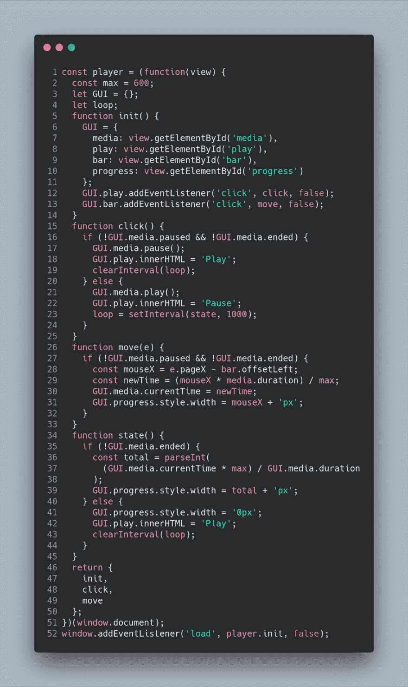](https://res.cloudinary.com/practicaldev/image/fetch/s--0KvaC_vp--/c_limit%2Cf_auto%2Cfl_progressive%2Cq_auto%2Cw_880/https://cdn-images-1.medium.com/max/1000/1%2Ab7IHl2ZD4XPKaFJdBWsZFg.png)

> 该分支中的 GitHub 项目是[https://GitHub . com/Caballerog/refactoring-js-patterns-tips/tree/02-scope-module](https://github.com/Caballerog/refactoring-js-patterns-tips/tree/02-scope-module)。

### 创建条件方法

为了避免代码中的复杂性，下面的步骤是创建函数
,这些函数将复杂的逻辑抽象成简单易读的函数，以对不同的状态做出
决定。

例如，条件句中的逻辑可以提取为简短的
函数，使用前缀“is”来表示该函数返回布尔值
。

[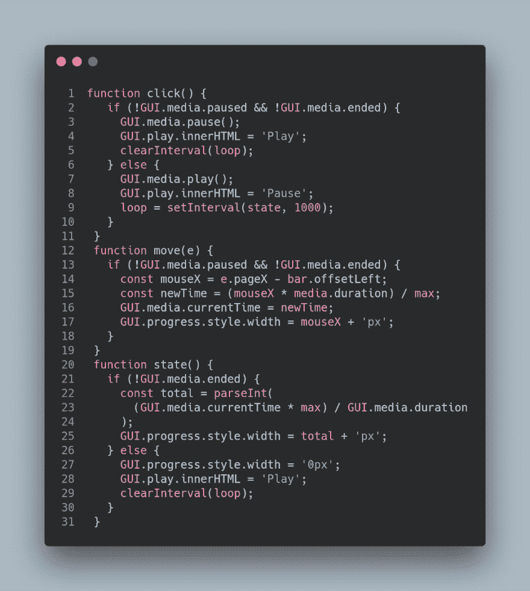](https://res.cloudinary.com/practicaldev/image/fetch/s--2pzD7-Sp--/c_limit%2Cf_auto%2Cfl_progressive%2Cq_auto%2Cw_880/https://cdn-images-1.medium.com/max/1000/1%2Ar2f6j52x-FfQDLb5ai0Ztg.png)

代码可能如下所示:

[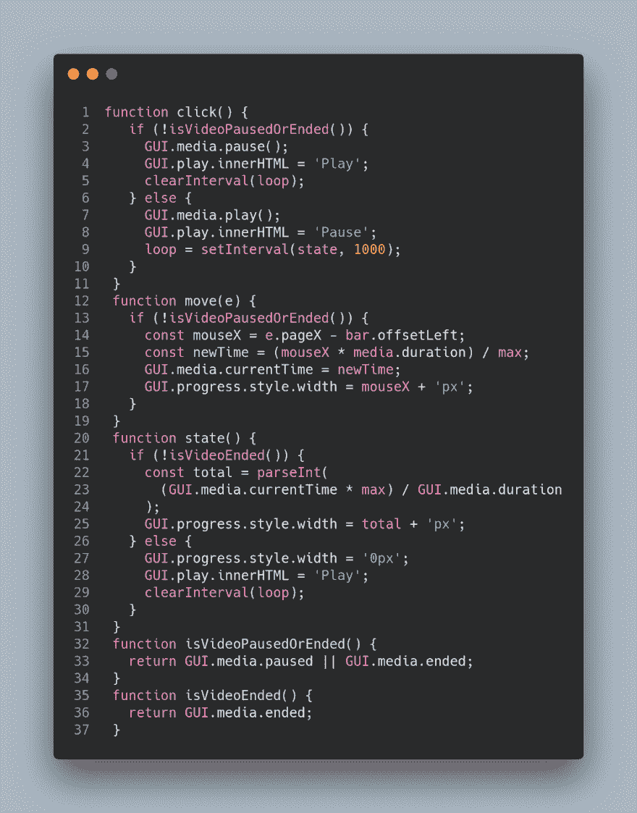](https://res.cloudinary.com/practicaldev/image/fetch/s--50Yq6tPi--/c_limit%2Cf_auto%2Cfl_progressive%2Cq_auto%2Cw_880/https://cdn-images-1.medium.com/max/1000/1%2AmOjzg_ANHP6pMtPXXHReVw.png)

> 该分支中的 GitHub 项目是[https://GitHub . com/Caballerog/refactoring-js-patterns-tips/tree/04-create-conditional-methods](https://github.com/Caballerog/refactoring-js-patterns-tips/tree/04-create-conditional-methods)。

下一步可以是从可读的代码片段(函数)中提取代码，这些代码在我们的代码中增加了语义值。由于这个决定，我们可以考虑我们应用程序的
目标。所以，方法 click 和 state 可以在下面的
方法中重构:

重构代码

> 该分支中的 GitHub 项目是[https://GitHub . com/Caballerog/refactoring-js-patterns-tips/tree/05-short-methods](https://github.com/Caballerog/refactoring-js-patterns-tips/tree/05-short-methods)。

### 命令模式

此时，代码有点混乱，因为我们使用 if-else 来使用一个
函数来执行一个动作或命令。有一个经典的模式叫做
`Command`，它允许我们在一个对象中抽象出我们的动作/命令。这种
模式在传统版本中更复杂，但是在 JavaScript 中，我们可以
使用一个对象来实现这种模式，该对象接收一个键来指示要做的
动作。

所以，第一步是定义命令/动作，为了简化代码，这个
对象是在同一个 player.js 中定义的。

[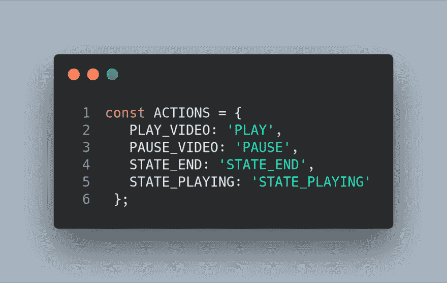](https://res.cloudinary.com/practicaldev/image/fetch/s--Y_aSCQO8--/c_limit%2Cf_auto%2Cfl_progressive%2Cq_auto%2Cw_880/https://cdn-images-1.medium.com/max/1000/1%2A9F6i6EzbkGQSLmnvW6rW7w.png)

动作有**播放**、**暂停**、**状态** **结束**和**状态**
**播放**。[命令模式](https://addyosmani.com/resources/essentialjsdesignpatterns/book/#commandpatternjavascript)在于使用该键执行一个方法或动作(在我们的例子中没有必需的参数)，因此命令对象如下:

[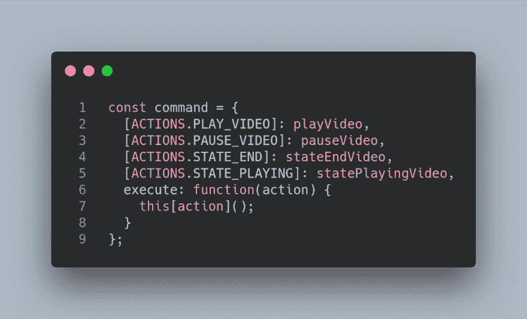](https://res.cloudinary.com/practicaldev/image/fetch/s--k2Imos3Z--/c_limit%2Cf_auto%2Cfl_progressive%2Cq_auto%2Cw_880/https://cdn-images-1.medium.com/max/1000/1%2AtyUJg2vVwVe9rcuKWPFbTQ.png)

现在，当 if-else 使用 pattern 命令消失时:

[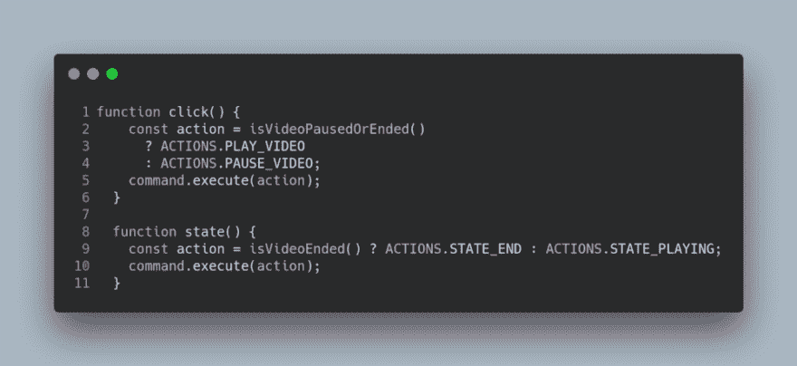](https://res.cloudinary.com/practicaldev/image/fetch/s--08Y42G4Y--/c_limit%2Cf_auto%2Cfl_progressive%2Cq_auto%2Cw_880/https://cdn-images-1.medium.com/max/1000/1%2A7yYbcof8P5-3evJyfpCcxg.png)

> 该分支中的 GitHub 项目是[https://GitHub . com/Caballerog/refactoring-js-patterns-tips/tree/06-command-pattern](https://github.com/Caballerog/refactoring-js-patterns-tips/tree/06-command-pattern)。

### 简历

在这个例子中，我做了一些改变来提高代码的质量。我的代码的质量与性能无关，但也与可读性和可扩展性有关。下面的列表是我在代码中应用的不同的
技术的简历。

1.  **国际代码。不要用你的本地语言编程，除非你的本地语言是英语。如今，国际语言是英语。所以，你必须用英语开发你的代码。想象一个德语、法语或波兰语的代码，而你不懂这种语言！**
2.  **漂亮+迷人**
3.  **变量范围。用你的语言研究作用域在变量声明中是如何工作的。在 JavaScript 中必须明白有 4 种方法来定义一个变量，并且它的范围是完全不同的。**
4.  **创建条件方法。**重构函数中的条件，将复杂的逻辑抽象成简单易读的函数。
5.  创建简短易读的函数。从可重用函数中提取代码，或者至少在代码中添加语义值。

> GitHub 项目是[https://github.com/Caballerog/refactoring-js-patterns-tips](https://github.com/Caballerog/refactoring-js-patterns-tips)。

* * *

最初发布于[www . carloscaballero . io](https://carloscaballero.io/refactoring-a-video-player-using-reveal-pattern-and-command-pattern-in-js/)2019 . 1 . 11。

* * *