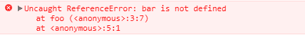

# 引用错误:JavaScript

> 原文：<https://dev.to/saifsadiq1995/reference-error-javascript-fk5>

当你去参加一个工作面试，到达面试地点后，你发现你要去的公司根本不存在，这是什么感觉？

显然你生气了，你的大脑会开始产生消极的想法。

JavaScript 也是如此。

当将任何值赋给未声明的变量或赋值时，如果没有 var 关键字或变量不在当前范围内，可能会导致意想不到的结果，这就是 JavaScript 在严格模式下显示`ReferenceError: assignment to undeclared variable "x"`的原因。并且该错误导致函数执行中的问题。

如果你已经开始尝试 JavaScript，你可能会遇到一些令人困惑的错误。我知道我确实做了…

## 引用错误:赋值给未声明的变量“x”

关于未声明变量赋值的错误只出现在严格模式代码中。在非严格代码中，它们会被默默地忽略。
**代码不带‘var’关键字**

```
function foo() { 
  'use strict'; 
  bar = true; //variable not declared
} 
foo(); 
```

Enter fullscreen mode Exit fullscreen mode

执行上述程序后你会得到什么？？一个错误？？🙁

[](https://res.cloudinary.com/practicaldev/image/fetch/s--ZqxXymSo--/c_limit%2Cf_auto%2Cfl_progressive%2Cq_auto%2Cw_880/https://www.lambdatest.com/blog/wp-content/uploads/2018/04/re.png)

**你需要如何编码**🙂
在你的变量前插入‘var ’,看到你的程序运行

```
function foo() {
  'use strict';
  var bar = true; //declared variable here
}
foo(); 
```

Enter fullscreen mode Exit fullscreen mode

同样，有许多脚本因素可能会在 javascript 中产生引用错误。

`ReferenceError: "x" is not defined`
`ReferenceError: deprecated caller or arguments usage`
`ReferenceError: can't access lexical declaration` X '在初始化之前ReferenceError:引用未定义的属性“X”reference error:无效的左侧赋值` 1

[](https://goo.gl/aSD1f7)

原文出处:[lambdatest.com](https://goo.gl/xPw5ts)

**相关文章**

1.  [未知:JavaScript 中的脚本错误](https://goo.gl/J9JBC8)
2.  [未捕获的范围错误:JavaScript 中的最大调用堆栈](https://goo.gl/gHzewv)
3.  [使用浏览器的开发者控制台调试 JavaScript】](https://goo.gl/UJrxR2)