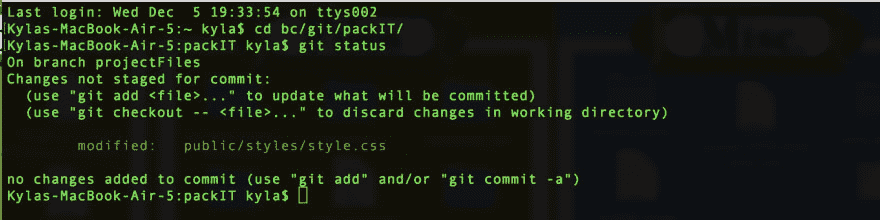
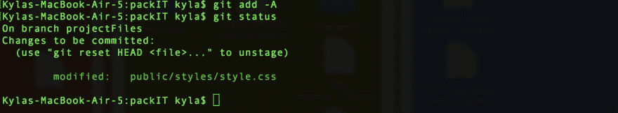

# 参考指南:提交更改

> 原文：<https://dev.to/kymiddleton/reference-guide-committing-changes-43el>

欢迎回到我的参考指南系列的第三部分。

*   点击此处查看[第一部分:](https://dev.to/kymiddleton/reference-guide-common-commands-for-terminal-6no)参考指南:终端常用命令。
*   点击这里进入第二部分创建一个 GitHub 库

**提交变更**
构建新应用时，web 开发的最佳实践是编写几行代码，测试几行代码，然后`commit`进行变更。`commit`过程相当于通过点击`save`图标来保存对文档的修改。

通过在终端中输入以下命令开始对`commit`文件进行更改:

*   `git status`
    *   以红色显示的项目表示文件和后续更改没有被跟踪。这些文件需要暂存并提交。

*   `git add –A`
    *   该命令启动被跟踪的变更，`A`表示`all`文件。这还会转换要登台的代码。
*   `git status`
    *   重复此命令将显示先前在`red`中突出显示的文件已切换到`green`，表明更改已被跟踪、保存并准备好推送到存储库。

*   `git commit –m “add comment description of changes made”`
    *   暂存代码现在保存在本地，并带有代码注释。使提交消息具有描述性和意义。
*   `git status`
    *   重复命令以验证所有更改都已暂存并准备好推送至存储库。
*   `git push origin master`
    *   推进到主分支应该被限制在项目存储库的第一次提交。
    *   有多个合作者的存储库应该总是保护主分支，将变更推送到一个分支，然后通过创建一个拉请求拉入主分支。

接下来:[提交分支](https://dev.to/kymiddleton/reference-guide-committing-changes-with-branches-2f8d)的变更。

对于完整的参考指南系列:

*   第一部分:参考指南:终端常用命令。
*   第二部分:创建一个 GitHub 存储库
*   第三部分:提交变更
*   [第四部分:](https://dev.to/kymiddleton/reference-guide-committing-changes-with-branches-2f8d)提交分支变更- [第五部分:](https://dev.to/kymiddleton/reference-guide-merge-conflicts-6op)合并冲突
*   第六部分:拉取请求
*   [第七部分:](https://dev.to/kymiddleton/reference-guide-conducting-a-code-review-k6m)进行代码评审- [第八部分:](https://dev.to/kymiddleton/reference-guide-complete-and-merge-a-pull-request--12n4)完成并合并一个拉请求