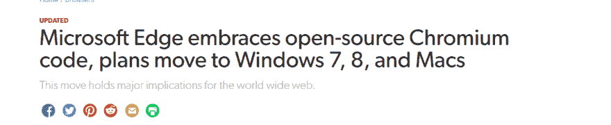
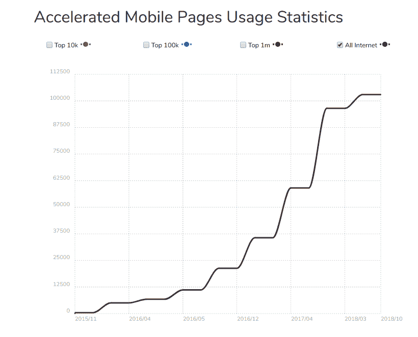
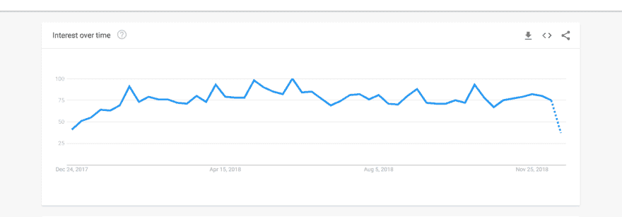
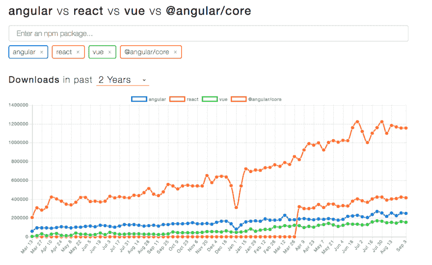
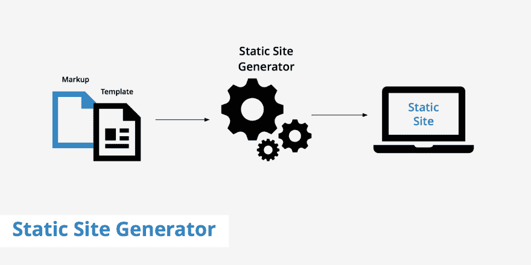
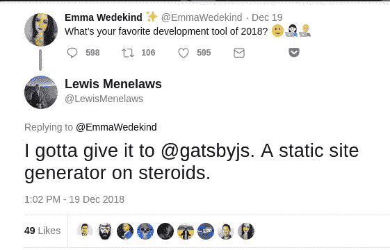
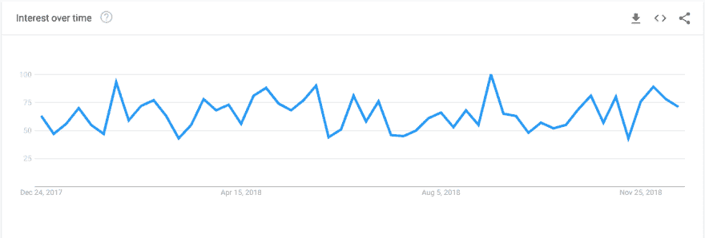

# 反思 2018 年网络的最大趋势

> 原文：<https://dev.to/lewismenelaws/reflecting-on-the-biggest-trends-on-the-web-in-2018-1k58>

2018 年对于网络来说是令人敬畏的一年。我学到了很多，并能够将这些知识转化到现实世界中。时间过得真快！

我回顾了 Antoni Zolciak 在年初写的文章，比较他预测的趋势。结果很有趣，我不得不为他的预测而向他致敬。

我现在唯一的愿望是清除一些现代网络浏览器的多余杂物...

...圣诞节提前到来了。

### 加速移动页面

如果我回顾 2018 年，似乎有一股巨大的推动力在创造更容易获得的东西。感谢上帝有一个，因为网站变得太臃肿了。

Google AMP 是谷歌的一项开源技术，它可以将内容驱动的网页转换为极快的网站加载速度，主要用于移动设备。有很多事情可以做到这一点，但重要的是，它推动了互联网的发展。

当然，[本有](https://daringfireball.net/linked/2017/05/20/gilbertson-amp) [附带](https://medium.com/the-set-list/google-amp-a-70-drop-in-our-conversion-rate-35fe3cb69c59) [很多批判](https://www.socpub.com/articles/chris-graham-why-google-amp-threat-open-web-15847)。尤其是因为它遵循了谷歌咄咄逼人的商业惯例。

不管有什么政治或商业动机，Google AMP 的人气飙升，并继续推动其在移动设备上实现更好性能的使命。

### 渐进式网络应用(PWA)

如果你是一个网络开发人员，那么你肯定知道什么是渐进式网络应用。

渐进式 web 应用程序是快速、可靠和引人入胜的 web 体验，感觉就像本地应用程序一样。一个很好的例子就是这个网站。开发到

在这篇推文中，我下载了一个 pokedex 应用程序，感觉像一个原生应用程序。

谷歌还通过其新的灯塔服务大力推动 PWA，该服务可以确定你可以在哪里改进你的网站。同样，谷歌在网络性能方面也付出了巨大努力，这也是今年的一大亮点。

许多不同的公司将担保 PWA 的实施，因为一些公司已经看到它对他们的业务有很大的好处。

PWA 的未来看起来很棒，我期待着我们能继续前进。

### 单页面应用框架

单页应用程序不断变大。构建这些应用程序的 JavaScript 框架也变得越来越流行。为什么不呢？它们为开发者提供了许多令人惊叹的特性。

没有 [JavaScript 疲劳](https://medium.com/@ericclemmons/javascript-fatigue-48d4011b6fc4)就谈不上 JavaScript。你有多经常看到人们不知道从哪一个开始？

所有这些都非常受欢迎，你不会失去选择它们中的任何一个。

2018 年，我们能从所有的 JavaScript 框架中学到什么？

嗯，生态系统是巨大的。即使你使用 Vue、Angular、React 或 Bottle.js(这是我编的)，你也会处于一个生态系统中，在那里你可以找到适合你的问题的正确的包和解决方案。

这也是 2018 年单页应用如此强大的原因。生态系统的快速发展使得所有这些框架在有经验的和新的开发人员中真正出类拔萃，并且它只是从这里开始发展。

### 静态网站

静态站点生成器在过去几年非常流行，但在 2018 年飙升。

您可能知道这样的静态站点生成器，如:

*   雨果
*   吉基尔博士
*   Nuxt
*   然后
*   盖茨比（姓）

就我个人而言，我在艾玛·韦德金德的推特上给了盖茨比 2018 年我最喜欢的开发工具。

那么是什么让静态站点生成器如此伟大呢？这是性能和快速创建许多页面的能力。如果你正在创建一个需要最少维护的网站(比如博客),这是正确的一步。

不仅是静态站点生成器本身变得非常流行，与之相伴的服务也变得非常流行。像 [Netlify](https://netlify.com) 这样的服务允许你免费托管网站，同时包含云功能，为其增加动态能力。

真的很棒。

随着 Nuxt 和 Gatsby 的发布，由服务器端呈现的 JavaScript 支持的静态站点生成器非常受欢迎。Netlify 只是让它长得更快。

### 我们能从 2018 年带走什么？

简单。2018 年，web 关注性能和可访问性。我简要介绍了网络的历史，以及它是如何变得越来越臃肿的。

随着大型科技公司大力推进更快的内容，像 AMP、静态网站生成器和渐进式网络应用这样的技术似乎会一直存在下去。

### 你们觉得 2018 年的一个巨大趋势是什么？请在评论中告诉我！