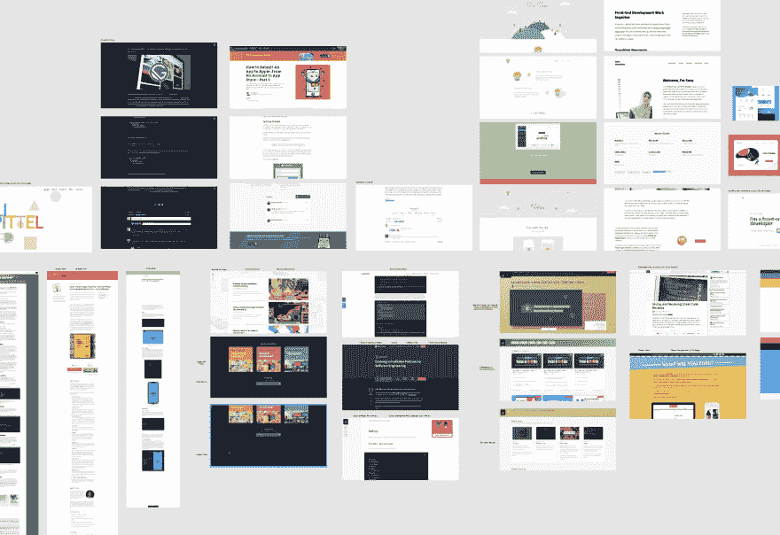
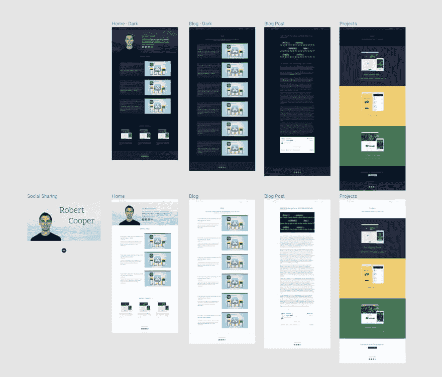
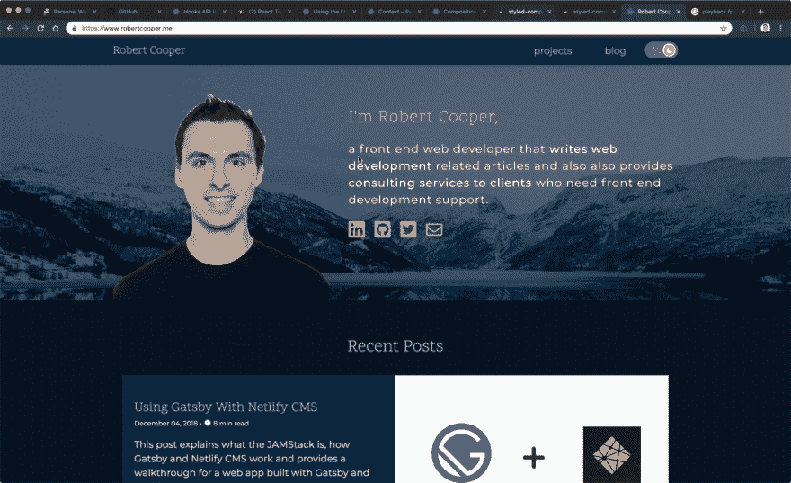
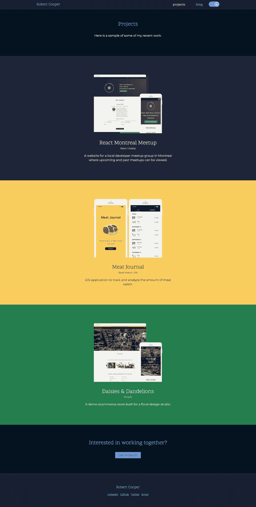
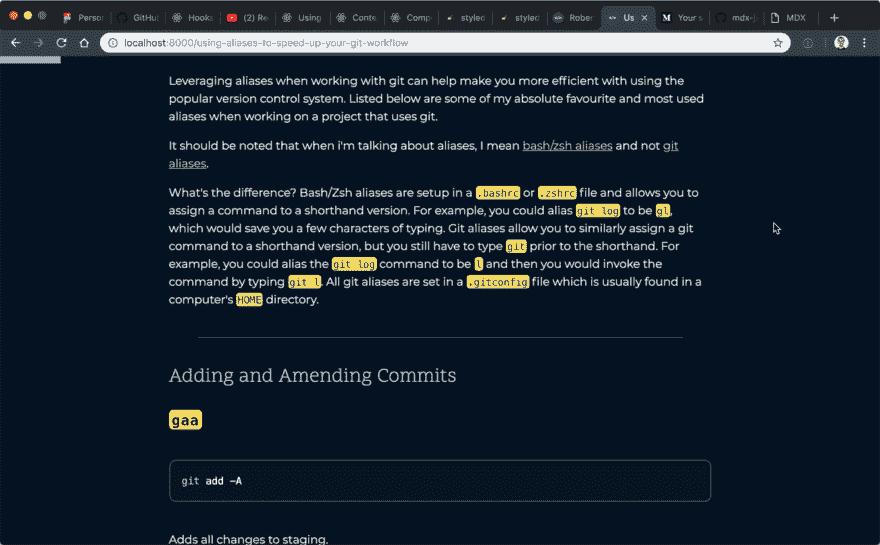
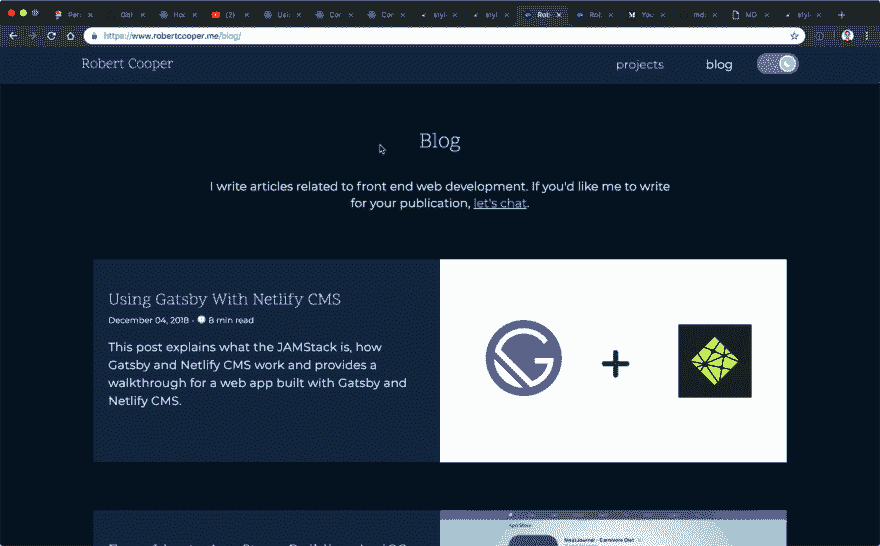

# 刷新我的个人网站

> 原文：<https://dev.to/robertcoopercode/refreshing-my-personal-website-17ie>

> 最初在我的博客上发布[。](https://www.robertcooper.me/refreshing-my-personal-website)

我决定再一次重做我的网站。这是我的网站的第三或第四次迭代。

以下是重新设计的动机和目标:

#### 1。在我自己的网站上托管我的博客文章

我已经在[媒体](https://medium.com/@robertcooper_rc)和[开发社区](https://dev.to/robertcoopercode)上写了很多东西，但是我想在我的博客帖子的设计和展示上有更多的控制权。我对 Medium 最大的不满之一是代码块缺乏语法高亮。

#### 2。更好地突出过去的项目

2019 年，我想兼职和几个客户一起工作，以补充我通过全职工作获得的收入。做到这一点的第一步是确保我能以有利的角度展示我过去的一些工作。

#### 3。新技术堆栈

我之前的网站是用 gulp 从模板化的 [pug 文件](https://pugjs.org/api/getting-started.html)构建 HTML 页面。这不是那么糟糕，因为我在网站上只有一个页面，所以没有必要在页面之间移动。然而，现在我要包括一个博客，我将不得不在网站上有多个页面，因此我想使用 React 来获得与单页面应用程序相关的性能。

## 设计

所以带着这三个目标，我开始研究我欣赏的博客。我确保截屏并注明任何让我印象深刻的元素。我在我选择的设计应用中收集了所有这些截图: [Figma](https://www.figma.com/) 。

<figure>

<figcaption>A collection of screenshots from the blogs and websites that I admire.</figcaption>

</figure>

在我收集了所有的灵感之后，我开始设计我自己的网站。我知道我想让我的网站有一个明亮和黑暗的主题，所以我确保设计两种变化。

<figure>

<figcaption>The designs for both light and dark theme pages of my new website.</figcaption>

</figure>

我之所以创建设计模型，而不是直接编码网站，是因为这样我可以快速测试出哪些设计看起来不错。我发现在最终设计出来之前，我会做一些设计交互。在代码中而不是在设计软件中做这些不同的变化会花费更长的时间。我还发现，当我在进入代码之前设计项目时，它帮助我更好地组织我的工作，并且它最终节省了我的时间。

## 首页

主页是网站访问者访问我的网站时首先登陆的地方，包括我是谁的简短描述，我最近写的博客文章，以及我最近从事的项目的预览。我使用卷轴库上的[动画制作页面上的元素，以使体验更加愉快。](https://github.com/michalsnik/aos)

<figure>

<figcaption>The home page elements fade into the page as a user scrolls.</figcaption>

</figure>

我附上了一张自己的头像，并试着从图片中去掉所有的背景。不幸的是，我没有去除头发上白色背景所需的设计技巧，每次看到它都会让我很烦恼。

<figure>

<figcaption>Lingering white background that remains on the headshot image 😑</figcaption>

</figure>

## 项目

我创建了一个页面来更好地展示我过去的项目。每个应用程序都以类似的方式呈现，在桌面/移动设备框架中可以找到应用程序的截图。每个项目都有自己的部分，并附有简短的描述和关键词，说明项目使用的主要技术。在页面的底部有一个行动号召部分，供任何有兴趣在一个项目上合作的访问者使用。

在未来，我计划为每个项目创建完整的页面，以便将它们作为成熟的案例研究来展示。

<figure>

<figcaption>The new projects page of the website showcases three recent projects and a call to action link at the bottom of the page.</figcaption>

</figure>

## 博客

博客是事情变得令人兴奋的技术明智的地方。网站是用 React 和[盖茨比](https://www.gatsbyjs.org/)搭建的。我也在使用 [gatsby-mdx](https://gatsby-mdx.netlify.com/) ，它允许我使用 mdx 写博客。 [MDX](https://github.com/mdx-js/mdx) 是 markdown 的另一种风格，它允许使用 JSX 和 React 组件与 Markdown 在同一个文件中共存。

如果我想在博客文章中包含一个定制的 React 组件，使文章更具交互性，现在我可以在 MDX 中实现。举个例子，我可以把我的网站使用的主题切换组件嵌入到这篇文章中:

> 在我的网站上看到这篇博文[可以看到 embbeded React 组件。](https://www.robertcooper.me/refreshing-my-personal-website)

我很高兴在我未来的一些博客文章中利用 MDX 的强大功能。

我在博客中添加的另一个功能是水平进度条，它显示用户在博客文章中的进度。我在其他一些博客上看到过这种 UI 模式，我自己也很喜欢。

<figure>

<figcaption>An horizontal progress bar at the top of a blog article indicates how much further a user needs to scroll to reach the bottom of the page.</figcaption>

</figure>

我还用 Disqus 嵌入了博客帖子的评论部分。使用 [disqus-react](https://github.com/disqus/disqus-react) 将它整合到网站中非常容易。

## 暗/亮主题

也许我最喜欢的网站部分是能够切换黑暗和光明的主题。我使用[风格组件](https://www.styled-components.com/)来管理我网站的风格，幸运的是它有一个很棒的 [API 来管理主题化](https://www.styled-components.com/docs/advanced#theming)。

<figure>

<figcaption>Toggling between dark and light theme.</figcaption>

</figure>

我想指出的是，主题切换开关的设计和功能都来自于 [@thekitze](https://twitter.com/thekitze) 的 Twizzy App [登陆页面](https://twizzy.app/)。当像这样有才华的人将他们的项目开源，让其他人受益时，我总是心存感激。

* * *

我希望继续对我的网站进行增量改进。我想补充的一些东西包括单元测试、端到端测试和网站的 RSS 提要。我还需要消灭一些虫子👞🐜。

[见源代码。](https://github.com/robertcoopercode/personal-website)