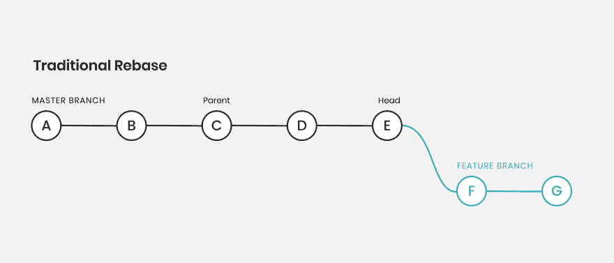
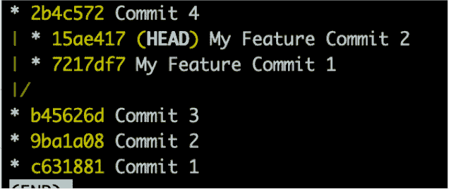
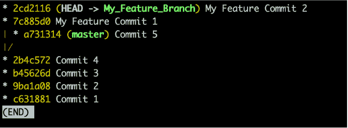
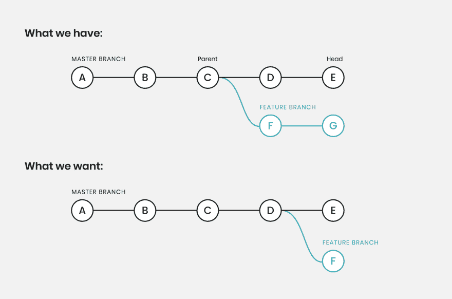
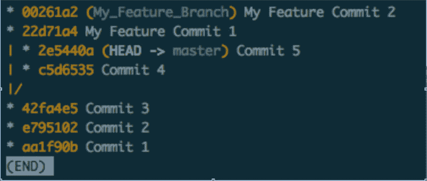
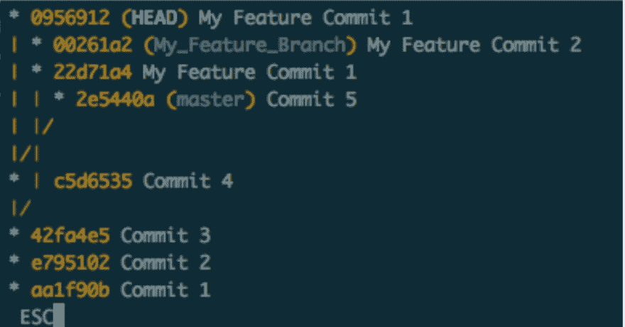

# 用 git rebase - onto 重新获得对分支的控制

> 原文：<https://dev.to/headwayio/regain-control-of-branches-with-git-rebase-onto-3075>

*本文原载于 [Headway 的博客](https://headway.io/blog/regain-control-of-branches-with-git-rebase-onto/)*

用`git`重新构建分支是所有开发人员都要经历的过程。有时，让您的所有提交都准确地到达您希望它们最终到达的地方是一件具有挑战性的事情。虽然`git`并不完美，但是当你不得不使用非标准重定基础时，`git rebase --onto`可以帮助驯服你的分支。`git rebase --onto`让我们对我们想要更容易处理复杂 rebases 的地方和提交更加挑剔一些。

## 传统重定基数的工作原理

传统的 rebasess(没有`--onto`标志的 rebase)非常容易理解。提交应用于您最初创建的工作分支的分支负责人，这在大多数情况下是有效的，但有时您的基本分支负责人会出错，或者您正在进行一些测试，并且希望一次一个地移动您的特性分支。

[](https://res.cloudinary.com/practicaldev/image/fetch/s--EZpzUWwB--/c_limit%2Cf_auto%2Cfl_progressive%2Cq_auto%2Cw_880/https://thepracticaldev.s3.amazonaws.com/i/84hqvynpdcfrur2ms3xn.png)

下面的大多数例子都很做作，但我认为`git rebase --onto`适用于很多情况。测试大型特征分支，或将特征分支从一个基础移动到另一个基础。使用`git rebase --onto`的原因包括修复错误，或者将一个特性从一个特性分支移到某种基础分支上。当你的`git rebase`需要手术刀的时候，`git rebase --onto`可以成为你的朋友。

为了在 repo 中轻松地再现一系列提交并使其易于使用，这里有一个快速 bash 脚本，它将生成一个 ruby 文件并提交一系列次，以使我们的“git 世界”更加一致。

```
 #!/bin/bash

  function create_basic_git_repo()
  {
    echo 'git rebase is great'
    mkdir gitexample
    cd gitexample
    git init
    mkdir lib
    touch lib/my_thing.rb
    echo "class MyThing; def my_method; 1 + 1 == 2; end; end" | tee lib/my_thing.rb
    git add lib/my_thing.rb
    git commit -m 'Commit 1'
    echo "class MyThing; def my_method; 1 + 2 == 3; end; end" | tee lib/my_thing.rb
    git add lib/my_thing.rb
    git commit -m 'Commit 2'
    echo "class MyThing; def my_method; 1 + 3 == 4; end; end" | tee lib/my_thing.rb
    git add lib/my_thing.rb
    git commit -m 'Commit 3'
    git checkout -B My_Feature_Branch
    echo "class MyThing; def my_method; 1 + 4 == 5; end; end" | tee lib/my_thing.rb
    git add lib/my_thing.rb
    git commit -m 'My Feature Commit 1'
    echo "class MyThing; def my_method; 1 + 5 == 6; end; end" | tee lib/my_thing.rb
    git add lib/my_thing.rb
    git commit -m 'My Feature Commit 2'
    git checkout master
    echo "class MyThing; def my_method; 1 + 6 == 7; end; end" | tee lib/my_thing.rb
    git add lib/my_thing.rb
    git commit -m 'Commit 4'
    echo "class MyThing; def my_method; 1 + 7 == 8; end; end" | tee lib/my_thing.rb
    git add lib/my_thing.rb
    git commit -m 'Commit 5'
  }

  create_basic_git_repo 
```

Enter fullscreen mode Exit fullscreen mode

在这个 repo 中，您应该看到一个`lib`目录以及一个名为`my_thing.rb`的文件，其中包含一些提交。基于`master`分支的第三次提交，在`master`分支上进行 5 次提交，在特征分支上进行 2 次提交。您的回购和我的回购之间的 SHA 将会不同，但至少提交消息将是相同的，以便轻松地遵循我们下面正在做的事情。

## 对象标识符

顺便提一下，我们先来讨论一下 git 中的对象标识符。

一个对象标识符通常标识一个`commit`，我们通常称它们为`SHA's`，但是当我们通过`branch`名称引用工作集 a 时，我们也可以说是一个`branch.`，我们只是在说组成的`commit`的集合，我们通过分支的名称引用`commit`集合的头。

任何对象标识符都是带有`rebase`的有效参数。我们可以基于一个分支名，阿沙，一个标签，只要它标识了一个提交，它就是`rebase`的有效参数。

## Git rebase—on

`git rebase --onto`有两个版本，二元和三元函数。也写作`git rebase --onto/2`和`git rebase --onto/3`。

## Git rebase —onto/2

git rebase onto 的两个参数版本用于将一组提交从一个对象标识符移动到任意对象标识符。

换句话说，我想将我的提交集从一个提交移动到任何其他任意提交。

[](https://res.cloudinary.com/practicaldev/image/fetch/s--cufE0ydX--/c_limit%2Cf_auto%2Cfl_progressive%2Cq_auto%2Cw_880/https://thepracticaldev.s3.amazonaws.com/i/ed2r1lb3nn1e96gjrycg.png)

在大多数情况下，如果您不想将您的提交移动到分支的顶部，或者由于某种原因您不能将您的特性分支放在`master`的顶部，这是很有帮助的。但是如果您有一个发布分支，并且需要跨多个分支维护您的工作，那么它也是有用的。

我喜欢把 git 的“我想去的地方”从“我曾在的地方”改为“我想去的地方”，其中“我想去的地方”是您希望所有提交去的地方的对象标识符，“我曾在的地方”是您的分支当前所在的地方的对象标识符。

例如，在这种情况下，我做了`git rebase --onto 2b4c572 b45626d`

我希望我的工作在 SHA `2b4c572`的提交 4 之上，目前它在 SHA `b45626d`的提交 3 上。不太坏也不太复杂。对于这些情况，我从`My Feature Commit 1`和`My Feature Commit 2`中获取了更改，以确保提交适用于查看示例。

[](https://res.cloudinary.com/practicaldev/image/fetch/s--TeApLqyU--/c_limit%2Cf_auto%2Cfl_progressive%2Cq_auto%2Cw_880/https://thepracticaldev.s3.amazonaws.com/i/sd93in0i5ggkj06pqj2l.png)
[T6】](https://res.cloudinary.com/practicaldev/image/fetch/s--IpjTXRyG--/c_limit%2Cf_auto%2Cfl_progressive%2Cq_auto%2Cw_880/https://thepracticaldev.s3.amazonaws.com/i/e1jwixht8izeknyirdtx.png)

## Git rebase - onto/3

git rebase - onto 的三个参数版本稍微强大一些，但并不总是有用。我倾向于只在我真的把事情搞砸了或者有很好的理由使用它的时候才使用它。事实上，我不确定我是否曾经用它在 git 库中做了一些完全有用的事情。无论哪种方式，它在某些时候都是有用的。

对于这一个，我们希望将我的提交集从一个对象标识符移动到另一个对象标识符，但是我希望只从我的分支中选择一定数量的提交。

[](https://res.cloudinary.com/practicaldev/image/fetch/s--6xB4z7bB--/c_limit%2Cf_auto%2Cfl_progressive%2Cq_auto%2Cw_880/https://thepracticaldev.s3.amazonaws.com/i/8qu12nre0s9b4b5z08f7.png)

请注意，我们熟练而轻松地从我们的特性分支中删除了 commit G。这使得它很容易做到这一点。

我们想`git rebase --onto "where I want to go" from "where we were" up to "my chosen commit"`

例如这里我们可以做`git rebase --onto c5d6535 42fa4e5 22d71a4`

我们正在提交 42fa4e5，我们只想在提交 c5d6536 的基础上提交 22d71a4。

[](https://res.cloudinary.com/practicaldev/image/fetch/s--30DRee1b--/c_limit%2Cf_auto%2Cfl_progressive%2Cq_auto%2Cw_880/https://thepracticaldev.s3.amazonaws.com/i/08o2ld98trx1ibj8lhme.png)

[](https://res.cloudinary.com/practicaldev/image/fetch/s--5Jvw1jI---/c_limit%2Cf_auto%2Cfl_progressive%2Cq_auto%2Cw_880/https://thepracticaldev.s3.amazonaws.com/i/ymfcow9enawav4zt2rgf.png)

如果你问我的话，这很容易。需要注意的一点是，`git rebase --onto/3`使`HEAD`处于分离状态，为了保存这种状态，您需要给分支命名。

所有这些例子都是使用快速 bash 脚本生成的，每次都生成相同的提交。尽管提交 SHA(对象标识符)会有所不同(感谢 Git！).

请随意查看 bash 脚本并使用`git commit rebase --onto`进行试验，它可能需要一些时间来适应，但它是一个强大的工具，在过去确实帮助我最小化了一些`git`痛苦。

有什么问题吗？下面让我知道。

## 了解更多关于 Git 重置基础的信息

[Git Rebase 文档](https://git-scm.com/docs/git-rebase)

[Git Rebase—转到教程](https://content.pivotal.io/blog/git-rebase-onto)