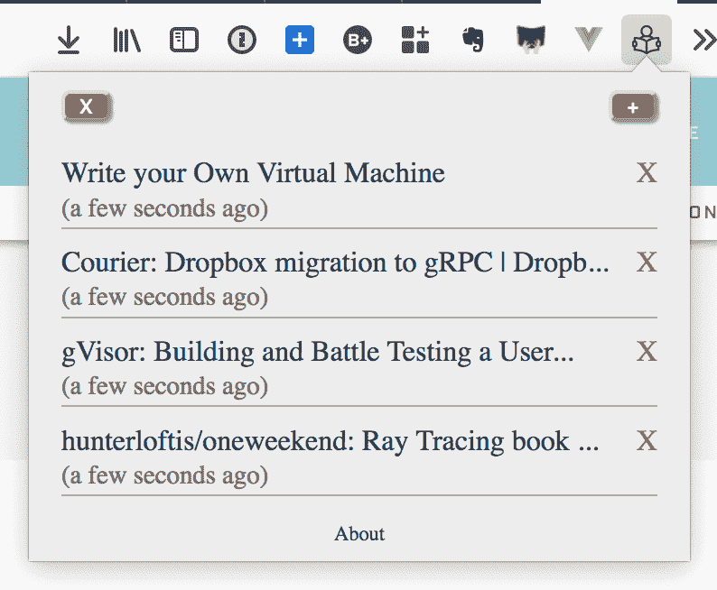

# relaxed reader——一款对抗阅读焦虑的 Firefox 插件

> 原文：<https://dev.to/citizen428/relaxedreader--a-firefox-addon-to-fight-reading-anxiety-1l7h>

在过去的几天里，我使用 [Vue.js](https://vuejs.org/) 构建了一个名为 [RelaxedReader](https://addons.mozilla.org/en-US/firefox/addon/relaxedreader/) 的小型 Firefox 扩展。

这是一个典型的阅读列表/书签工具，有一些重要的区别:

*   您最多可以储存 10 件物品。如果增加更多，最老的将被挤出(FIFO)。
*   项目会在 30 天后自动过期。
*   没有通知，徽章，未读计数或任何其他提示焦虑和/或 FOMO。
*   没有跟踪，第三方服务器或 API 调用。所有数据都存储在[扩展存储器](https://developer.mozilla.org/en-US/docs/Mozilla/Add-ons/WebExtensions/API/storage)中。
*   使用`storage.sync`，因此阅读列表在用户登录的浏览器的所有实例中同步，跨越不同的设备。

很简单。不是特别漂亮，但正是我需要的。源代码可在[这里](https://gitlab.com/citizen428/RelaxedReader)获得。