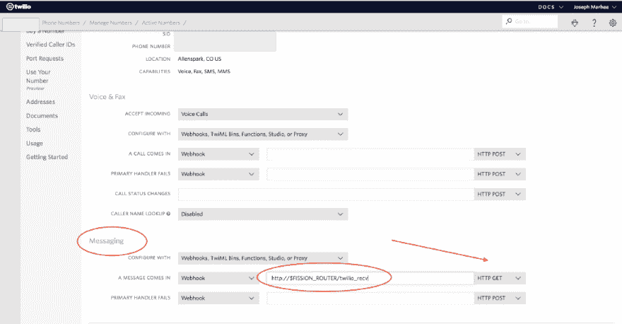

# 通过 Slack 转发和回复 Twilio 短信

> 原文：<https://dev.to/jmarhee/relaying-and-replying-to-twilio-sms-via-slack-with-fissionio-functions-abf>

使用像裂变. io 这样的无服务器框架是一种快速、可移植的方式，可以在 Twilio 和 Slack 这样的高度可编程服务之间创建一个应用层，Twilio 和 Slack 是常见的，但并不总是容易自动化和集成的服务，可供开发人员对 SMS、语音和聊天服务等通信服务进行编程。裂变通过允许您运行轻量级程序来处理这个问题，这些程序可以消费和操作请求数据，并且在我们的场景中，充当这些通信工具的协调器或路由器。

我们要创建的是两个裂变任务，小 Python(在我们的例子中)程序，接收一个号码和一条消息，通过 Slack 发送到 Twilio 给预定的接收者，当你的 Twilio SMS 号码接收到一条消息时，它被发送到 Slack。

**先决条件**

您将需要来自 Slack 的一个传入的 webhook(将消息发布到一个通道)和一个 Slash 命令(让裂变通过这个 webhook 上来自 Slack 的 post 请求触发您的函数):

[传入网页挂钩](https://api.slack.com/incoming-webhooks#create_a_webhook)

一会儿记下您的裂变任务的 hooks.slack URL。然后，为 Slash 命令创建 Slack 应用程序，类似于/twilio:

[斜线命令](https://api.slack.com/slash-commands#creating_commands)

从 Twilio，您只需要您的帐户 SID、API 令牌和一个支持 SMS 的 Twilio 号码:

[Twilio | Login](https://www.twilio.com/console)

一旦部署了任务(因为您将需要最终创建的裂变 URL)，您还将为您的任何一个号码创建一个 Twilio Webhook:

[配置电话号码以接收和回复短信和彩信](https://support.twilio.com/hc/en-us/articles/223136047-Configuring-Phone-Numbers-to-Receive-and-Respond-to-SMS-and-MMS-Messages#webhook)

**创建我们的函数**

在 send.py 中，我们将创建在运行 Slash 命令时运行的脚本(从 Slack 到裂变的 POST 请求):

```
import json

import requests

import urllib

from flask import request, redirect

from twilio.rest import Client

CHANNEL\_NAME="twilio"

SLACK\_TOKEN=""

TWILIO\_SENDER="" #Number with Country code

LIMIT\_TO\_CC="" #i.e. +1 
```

Enter fullscreen mode Exit fullscreen mode

在本节中，将 SLACK_TOKEN 替换为您的 Slack App token，定义您希望 Slack API 的响应进入的通道(理想情况下是将运行命令的通道)，然后可选地添加国家代码以限制 SMS 消息(以便您可以让用户提供 10 位电话号码)，并在 TWILIO_SENDER 中添加您的 Twilio 号码。

在我们的 main()函数(裂变的 Python 任务的默认入口点)中，我们需要做一些设置，这样当一个斜线命令如/twilio 发送:8325551900 hello，你好，你好吗点击你的裂变任务:

```
_def_ main():

    params = urllib.parse.parse\_qs(_str_(request.get\_data()))

    incoming\_token = params["b'token"][0]

    channel\_name = params['channel\_name'][0]

    response\_url = params['response\_url'][0]

    message = params['text'][0] 
```

Enter fullscreen mode Exit fullscreen mode

这里有几个新的部分，incoming_token 和 response_url，我们一会儿将再次讨论它，以确保它与 Slack 应用程序所需的令牌相匹配，response _ url 将为我们提供一个 URL，用于发布一个带有请求状态的响应。

接下来，我们将添加一些帮助文本，然后开始分割消息:

[jmarhee/裂变-twilio-sms-slack](https://github.com/jmarhee/fission-twilio-sms-slack/blob/master/send.py#L34-L57)

因此，我们从消息文本中分离出数字，然后将其传递给我们的 twilio_conn 函数(我将在稍后介绍)，并将该响应发送回 Slack 响应 URL，以便您可以在 slack_callback 中查看您的消息是否正确发送:

[jmarhee/裂变-twilio-sms-slack](https://github.com/jmarhee/fission-twilio-sms-slack/blob/master/send.py#L13-L32)

此时，我们可以创建这个函数:

```
fission function create --name twilio\_send --env python3 --route /twilio\_send --method POST --code send.py 
```

Enter fullscreen mode Exit fullscreen mode

并把网址 http://$裂变 _ 路由器/twilio_send 给你的 Slack app 的 Slash 命令发布到。

下一步我们将为 Twilio 创建一个端点来发送请求，所以我们将在 recv.py 脚本上做类似的设置。为此，您只需要从 Slack 获得 Webhook URL:

[jmarhee/裂变-twilio-sms-slack](https://github.com/jmarhee/fission-twilio-sms-slack/blob/master/recv.py#L4-L10)

在我们继续之前，让我们看一下 Twilio 通过这个 webhook 发送的数据类型。在我们的例子中，我们将从 Twilio 得到如下所示的 get 请求:

```
"GET /twil?ToCountry=US&ToState=CO&SmsMessageSid=&NumMedia=0&ToCity=&FromZip=&SmsSid=&FromState=TX&SmsStatus=received&FromCity=&Body=Dhdhdhdhsh&FromCountry=US&To=%&ToZip=&NumSegments=1&MessageSid=&AccountSid=&From=%&ApiVersion=2010-04-01 HTTP/1.1" 
```

Enter fullscreen mode Exit fullscreen mode

我们主要关心来自 Twilio 的有效负载中的 From、To 和 Body 字段，因此在我们的 recv.py 入口点中，我们希望处理这些字段，并将它们传递给 slack_callout 函数，就像我们在 send.py 中以更简单的工作流所做的那样:

[jmarhee/裂变-twilio-sms-slack](https://github.com/jmarhee/fission-twilio-sms-slack/blob/master/recv.py#L20-L28)

我们从包含上述格式化有效负载的 request.args 对象中获取这些字段，将这些值转换为字符串，并将其传递给一个类似的 Slack callout 函数，该函数直接发送到 webhook URL，将消息及其发送者转储到通道中。

创建任务后:

```
fission function create --name twilio\_recv --env python3 --route /twilio\_recv --method GET --code recv.py 
```

Enter fullscreen mode Exit fullscreen mode

回到 Twilio 控制台，在您的号码的 SMS 字段中，您将指定您想要一个 Webhook，并将数据作为 GET 请求发送到该端点，您的 http://$裂变 _ 路由器/twilio_recv URL:

[](https://res.cloudinary.com/practicaldev/image/fetch/s--j2jDO2TS--/c_limit%2Cf_auto%2Cfl_progressive%2Cq_auto%2Cw_880/https://cdn-images-1.medium.com/max/1024/1%2ACI8zXkEu7SxUduJcKoV4jg.png)

**延伸阅读**

您可以在这里查看完整的脚本:

[jmarhee/裂变-twilio-sms-slack](https://github.com/jmarhee/fission-twilio-sms-slack)