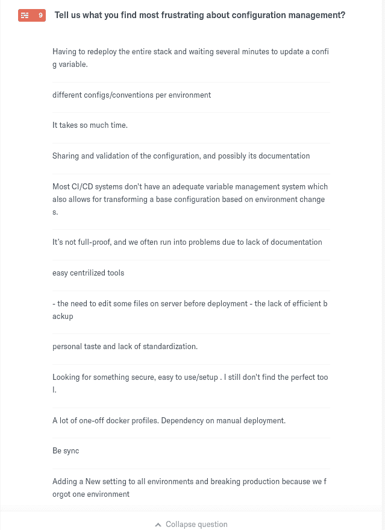
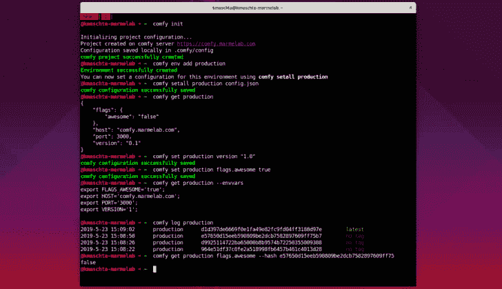
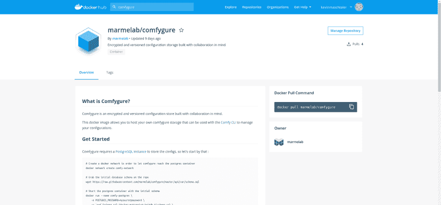

# 发布 Comfygure 1.0

> 原文：<https://dev.to/kmaschta/releasing-comfygure-1-0-46j3>

两年前，我们引入了一个叫做 **comfygure** 的开源配置管理器。从那以后，我们一直在生产中使用这个工具，我们已经对它进行了调整，使它为黄金时间做好了准备。今天，我们自豪地宣布，我们发布了一个稳定的版本！

请继续阅读，看看这个版本中包含了什么，如何测试它，以及我们对这个项目的未来有什么计划。

> 博文发表评论黑客新闻:[https://news.ycombinator.com/item?id=20029420](https://news.ycombinator.com/item?id=20029420)

## 什么是 Comfygure？

让我们花两分钟的时间来解释一下什么是 comfygure 以及它是如何工作的。不久前，我做了一个关于软件工程师如何处理环境部署的小调查。

[调查仍然在线](https://kvinmaschtaler.typeform.com/to/KMXdh2)，您可以通过以下链接看到结果:[配置管理调查结果](https://kvinmaschtaler.typeform.com/report/KMXdh2/A4g9saoaIc2vFfbl)

让我总结一下参与者的回答:

*   软件工程师和操作人员完全有责任自己启动生产部署
*   大多数时候，2 到 5 个团队成员就能做到
*   部署是自动化的，至少是部分自动化的
*   每个团队倾向于每个应用程序有 2 到 3 个环境
*   环境变量、JSON 文件和 YAML 文件是最受欢迎的配置格式
*   对于如何存储这些配置，还没有达成共识
*   大多数回答者不使用配置或秘密管理器，但愿意使用

我还让他们有机会说出他们对配置管理的不满之处:

[](https://res.cloudinary.com/practicaldev/image/fetch/s--7q58tTj9--/c_limit%2Cf_auto%2Cfl_progressive%2Cq_auto%2Cw_880/https://i.imgur.com/C3ko1pT.jpg)

没有足够的参与者来推断。然而，我理解每一个参与者，因为我们处于类似的情况:拥有自动化和全功能的配置管理为时过早，但手动管理配置又为时过早。

这就是为什么[我们决定建立一个新的解决方案](https://marmelab.com/blog/2017/11/07/introducing-comfygure.html)来满足我们的需求。

一个小工具，可以存储、版本化、检索和格式化我们的应用程序配置，以便在同事和环境之间保持同步。

[](https://res.cloudinary.com/practicaldev/image/fetch/s--LPmyLa1A--/c_limit%2Cf_auto%2Cfl_progressive%2Cq_auto%2Cw_880/https://i.imgur.com/jp5soSLg.png)

## 稳定版的新功能

### 快速配置访问器

这个版本引入了一个新命令(`comfy set`)并改进了`comfy get`命令，以便让您读取或更新配置
的*子集*

```
$ comfy set production version "1.0.0"
$ comfy get production version
1.0.0

$ comfy set production flags.stable true
$ comfy get production flags --json
{
    "stable": true
} 
```

您不再需要获取配置文件，用您的 IDE 打开它，更新那个标志并更新文件的完整版本。所有这些都由`comfy set`管理。这对于快速更改特性标志或修改项目版本特别有用。

### 记录您的配置历史

之前的版本已经有一个`comfy log`命令，显示配置的最新变化。稳定版解决了一些问题。此外，现在可以检索配置的特定版本。

结合标记，这些命令将让您部署一个固定版本到您的环境，并以光速回滚！

```
$ comfy log production
2019-5-24 10:50:30  production  da70d7d69bb7f158748cf3ea76c08b9c4a12c3c0    latest
2019-5-24 10:50:19  production  ae30ab2567e7316cf5521d26b8c7a03ece0522d3    no tag
2019-5-24 10:50:10  production  964e51df37c0fe2a518998fb6457b461c4013d28    no tag

$ comfy get production version --hash 964e51df37c0fe2a518998fb6457b461c4013d28
0.1.4
$ comfy get productiion version --hash ae30ab2567e7316cf5521d26b8c7a03ece0522d3
1.0.0 
```

您可能还会注意到，当您创建一个新环境时，标签`latest`会替换掉标签`stable`和`next`。您仍然可以通过运行`comfy tag add production stable <hash>`手动创建它们。

### 托管您自己的配置存储和服务器

Marmelab 在`https://comfy.marmelab.com`免费托管默认的 comfygure 服务器。但是有些人不想让第三方公司存储他们的配置，尽管这是一个零知识平台(配置是加密的客户端)，这完全没问题。

这就是为什么我们致力于让你在这个版本中拥有自己的 comfygure 服务变得容易。

为此，我们发布了[大量文档](https://marmelab.com/comfygure/HostYourOwn.html)解释如何在 [ZEIT 的 now](https://zeit.co/now) 上部署 comygure，例如，以及 Docker Hub 上的 Docker 图像:[marmelab/comygure](https://hub.docker.com/r/marmelab/comfygure)。

我们使用[无服务器](https://serverless.com/)来部署我们自己的 comfygure origin 服务器。这意味着你也可以在[亚马逊网络服务、微软 Azure、谷歌云平台和许多其他平台上部署你自己的舒适服务器](https://serverless.com/framework/docs/providers/)！

请随意部署您自己的 comfygure 服务器并使用它。服务器越多，这项服务就越不集中。我们的目标不是成为默认主机，只是让开发者的生活更轻松一点。

[](https://res.cloudinary.com/practicaldev/image/fetch/s--9d7JZSAE--/c_limit%2Cf_auto%2Cfl_progressive%2Cq_auto%2Cw_880/https://i.imgur.com/ZsnLnuL.jpg)

## 接下来是什么？

这个版本的目标是实现主要的突破性变化，并发布一个稳定的版本。1.1 的目标是让这个工具更容易使用。

在本地安装 comfy 很容易，因为所有的配置都存储在一个文件中。在服务器或配置项上，这可能有点麻烦，因为它需要至少六个环境变量。对于一个想让配置更容易处理的工具来说，这是多么讽刺啊！所以下一个版本的第一个里程碑就是让服务器安装变得快速简单，并更新相关文档，用一些真实的例子。

类似地，comfy 上有一个小型的权限管理系统，带有只读和管理令牌。这不够明确，这些令牌需要是可编辑的。这也将是下一个版本的目标。

此外，我发现很难浏览配置历史。我希望有一个`comfy diff <env> <tag|hash> <tag|hash>`命令来显示两个版本之间的变化！所以，它在管道里。

最后，也是最重要的一点，我想听听你对这个小工具有什么看法！请试一试，并告诉我你对它的看法。

以下是一些链接，您可以从中找到更多详细信息:

*   [GitHub 库](https://github.com/marmelab/comfygure)
*   [NPM 的舒适套餐](https://www.npmjs.com/comfygure)
*   [文档](https://marmelab.com/comfygure/)
*   [Docker 图像](https://hub.docker.com/r/marmelab/comfygure)
*   [之前关于 comfy 的博文](https://marmelab.com/blog/2017/11/07/introducing-comfygure.html)
*   [我的推特账户@Kmaschta](https://twitter.com/Kmaschta)