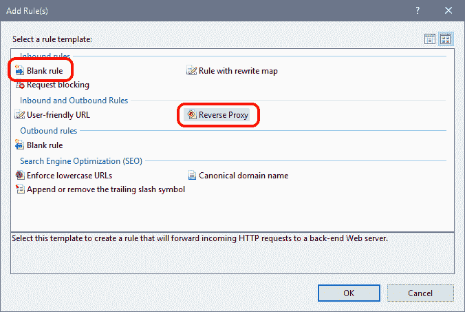
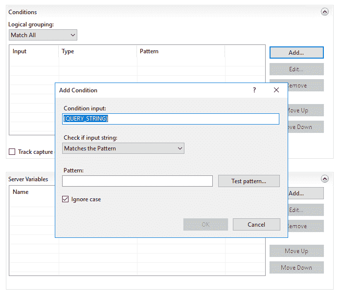

# 如果您想在 Sitecore 站点上进行反向代理，请记住路由

> 原文：<https://dev.to/jermdavis/remember-the-routing-if-you-want-to-reverse-proxy-on-a-sitecore-site-2554>

曾经被要求设置一个反向代理来允许你的网站上的一个特定 URL 从其他地方的一个站点获取它的内容吗？这并不是一个不常见的需求，但它似乎也导致了一些配置挑战。最近，我被选中来解决这样一个设置的一些问题，下面是我下次得到这份工作时需要记住的东西的快速描述:

## 依赖关系

一般来说，要重写请求，您需要为 IIS 安装“URL 重写”模块。(您可以很容易地从 [Web 平台安装程序](https://www.microsoft.com/web/downloads/platform.aspx)中获得)但是要在 IIS 中启用反向代理规则，它会告诉您需要安装应用程序请求路由扩展。你也可以通过 WPI 来添加，或者可以从[https://www . IIS . net/downloads/Microsoft/application-request-routing](https://www.iis.net/downloads/microsoft/application-request-routing)下载，并作为标准的 MSI 包安装。

## 重写规则

接下来，您需要确保 IIS 被配置为替您重写。虽然有一个“反向代理”规则模板，但它实际上并没有添加太多内容，因此如果您愿意，可以从一个空白规则开始:

[](https://jermdavis.files.wordpress.com/2019/01/createrule.png)

您需要配置的关键字段是:

*   **模式**这是您想要匹配和重写的传入 URL。默认情况下，匹配模式是一个正则表达式，因此您可以使用分组将它分成您需要的部分。默认情况下，您会得到“`(.*)`”，它可以匹配任何内容。您可能有某种基本 url 需要匹配这种反向代理——因此您可能有一个类似于“`the-url-you-want-to-reverse-proxy/(.*)`”的规则来匹配您的前缀，并把其他所有东西放在一边以备后用。(另外，请注意，默认情况下，此过程仅匹配 URL 的路径，您不需要考虑域名)
*   **重写 URL** 这是一个表达式，它描述了你想要将输入的 URL 重写为什么。它接受您提供的任何静态数据，并可以将它与从上述模式中捕获的组和其他数据混合，以获得结果 URL。如果这个网址不在这个服务器上，它可以从外部获取。通常情况下，你最终会得到一个看起来像“`https://MyOtherDomain.com/SomePath/{R:1}`”的模式，将模式末尾剩下的内容添加到重写后的域中。

但是如果你有更复杂的重写需求，你的规则看起来也会更复杂。如果你这样做了，你可能会在规则的细节中填入额外的条件:

[](https://jermdavis.files.wordpress.com/2019/02/advancedruleoptions.png)

## 别忘了让 Sitecore 玩好看！

这里被遗忘的一个关键点是，你需要确保 Sitecore 不会试图处理你想要反向代理的 URL。如果它真的参与进来，那么你将会以 Sitecore 的 404 页面结束，因为无论你试图用你的代理 url 重写什么路径，它几乎肯定不会映射到一个可以被呈现的有效的 Sitecore 内容项…

有两种方法可以解决这个问题。首先，您可以编写一些代码来定制路由，并明确地告诉路由引擎忽略您想要反向代理的路径。根据 Sitecore 的版本，你可以在初始化管道中添加一些路由配置来完成这个任务:

```
public static void RegisterRoutes(RouteCollection routes)
{
  routes.IgnoreRoute("some-reverse-proxied-path/{*pathInfo}");
} 
```

Enter fullscreen mode Exit fullscreen mode

([详见文档](https://doc.sitecore.com/developers/90/sitecore-experience-management/en/use-mvc-routing.html))

或者，你可以为 Sitecore 预先设置的应该忽略的 URL 打补丁。虽然这不是最容易修补的设置之一(因为默认情况下它只是一个很长的字符串——[尽管如果你愿意，你可以使用一些方法使它变得更容易](http://firebreaksice.com/sitecore-patchable-ignore-lists/))，但这可能是让 Sitecore 忽略 url 的最快方法，并且不涉及部署代码:

```
<configuration xmlns:patch="http://www.sitecore.net/xmlconfig/">
  <sitecore>
    <settings>
      <setting name="IgnoreUrlPrefixes" value="/the-url-you-want-to-reverse-proxy|/sitecore/default.aspx|/trace.axd|/webresource.axd|/sitecore/shell/Controls/Rich Text Editor/Telerik.Web.UI.DialogHandler.aspx|/sitecore/shell/applications/content manager/telerik.web.ui.dialoghandler.aspx|/sitecore/shell/Controls/Rich Text Editor/Telerik.Web.UI.SpellCheckHandler.axd|/Telerik.Web.UI.WebResource.axd|/sitecore/admin/upgrade/|/layouts/testing|/sitecore/service/xdb/disabled.aspx" />
    </settings>
  </sitecore>
</configuration> 
```

Enter fullscreen mode Exit fullscreen mode

OTB 它只是一个用管道分隔的 URL 前缀列表，没有域名——所以你可以把你需要的 URL 放在开头…

一旦你完成了这三个设置，你应该会发现你的反向代理 URL 开始工作了。