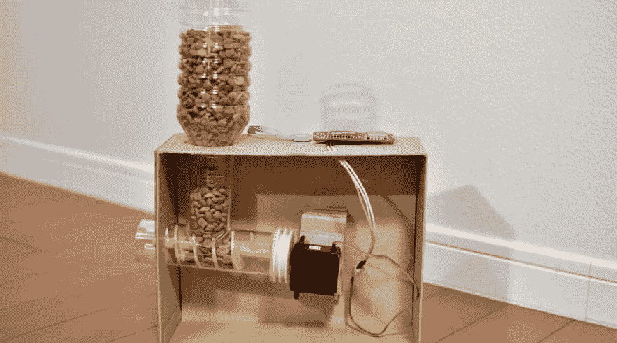
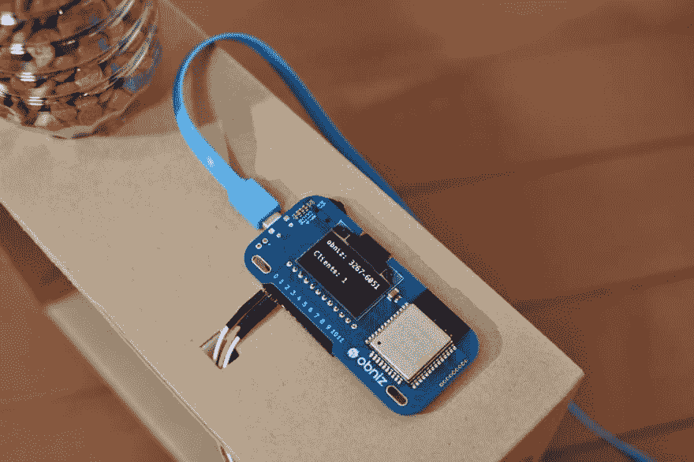

# 远程宠物喂食器

> 原文：<https://dev.to/obniz_io/remote-pet-feeder-2bl5>

## 工作原理

你想在户外喂养你的宠物吗？这是一个可以通过网络控制的进料器。

## 材料

*   ob niz–1
*   电池或 usb 适配器和电缆–1
*   螺丝和管道
*   伺服电机(无限制旋转)–1
*   宠物食品——越多越好

## 第一步

切割管道并准备好螺丝。这是一个样本 stl 文件。你可以下载并用 3D 打印机打印出来。然后，建造这些东西，并把螺丝连接到马达上。
并把它们放进一个盒子里。

## 第二步

将伺服电机连接到 obniz。
喜欢

io0: GND，
io1: VCC，
io2:信号
然后启动你的 obniz。

## 第三步

在下面写代码。把食物放进去，尝一尝。
食物会是结果。

[https://youtu.be/hxVx4Slo9kY](https://youtu.be/hxVx4Slo9kY)

## 程序

[https://obniz.io/explore/4](https://obniz.io/explore/4)