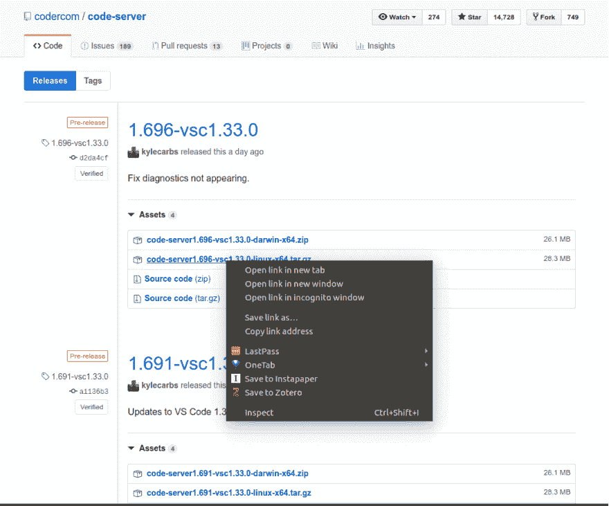
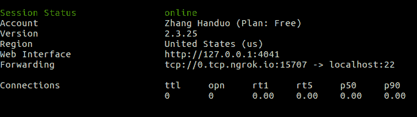

# 无需使用 vim 即可远程编辑您的作品

> 原文：<https://dev.to/zhanghanduo/remotely-edit-your-work-without-using-vim-20pi>

当你的服务器没有公共 IP 地址，你又不想花钱的时候，远程编辑你的作品就不那么容易了。也许你可以使用 Team viewer 或 Anydesk，甚至是 chrome remote desktop，但是会有很高的延迟。也许您可以使用 ngrok 远程 ssh 到您的远程服务器，但是您必须使用 vim，并且您对它一点也不熟悉😧。我试着使用 rmate，但是在一个文件夹中编辑不同的文件并不方便。

我最近发现了一个热门的 github 库，名为 [code-server](https://github.com/codercom/code-server) ，它能够在远程服务器上运行 **VS Code** ，可以通过浏览器访问。于是突然想到，只要有 linux/macOS 环境，就可以免费远程编辑任何代码。

让我们假设您已经了解了 SSH 密钥的基本知识，因为您将要使用它。关于如何生成 SSH 密钥的教程，请参考[如何设置 SSH 密钥](https://www.digitalocean.com/community/tutorials/how-to-set-up-ssh-keys--2)和[用 SSH 连接 GitHub](https://help.github.com/en/articles/connecting-to-github-with-ssh)。

首先，你需要看看你的服务器是否有一个公共 IP 地址。如果是(我知道这并不常见)，那么事情真的很简单，你只需遵循步骤 1、2 和 3；否则，直接转到步骤 0，然后是步骤 2 和 3。

## 第一步。SSH 连接

```
ssh server_username@IP_address -L 8843:localhost:8843 
```

这里的`-L 8843:localhost:8843`是**本地端口转发**，可以让你访问没有暴露在互联网上的本地网络资源。第一个 8843 是本地端口，`localhost:8843`是远程**码服务器**默认端口。

看你是否能成功链接到服务器。前提条件是 1)您安装了 openssh-client 2)您已经生成了 ssh 密钥。如果不成功，可能你没有公共 IP 地址。然后转到步骤 0。

## 第二步。下载代码-服务器

在您的客户端浏览器上打开此页面，找到最新版本的[代码服务器](https://github.com/codercom/code-server/releases)。找到 linux 的二进制文件并获得下载地址。

[](https://res.cloudinary.com/practicaldev/image/fetch/s--WuS4aJEJ--/c_limit%2Cf_auto%2Cfl_progressive%2Cq_auto%2Cw_880/https://thepracticaldev.s3.amazonaws.com/i/nfekp57y05t3q0xts01i.png)

然后在 ssh 连接到远程服务器的终端窗口中，键入:

```
wget code-server_downloading_address
# Example:
wget https://github.com/codercom/code-server/releases/download/1.696-vsc1.33.0/code-server1.696-vsc1.33.0-linux-x64.tar.gz
tar -xvzf code-server1.696-vsc1.33.0-linux-x64.tar.gz
cd code-server1.696-vsc1.33.0-linux-x64/
sudo mv code-server /usr/local/bin/
sudo chmod a+x /usr/local/bin/code-server 
```

然后您的**代码服务器**将被安装！

## 第三步。运行代码-服务器

转到等待编辑的代码所在的文件夹，在终端窗口 ssh connected to remote server 中键入`code-server`。
然后打开浏览器，输入`localhost:8843`，你的 VSCode 工作区就会展现在你面前！这个速度令我满意。

* * *

## 第 0 步。Ngrok

有些人会使用 VPS 服务器或云托管提供商，如 [Vultr](//www.vultr.com) ，AWS 等等，来支付公共 IP 地址。但是这里我们只需要 [Ngrok](//www.ngrok.com) ，一个伟大的工具，可以创建一个从公共互联网到本地机器端口的隧道。你可以把这个网址给任何人，任何地方，不需要付任何钱！

去 [Ngrok](//www.ngrok.com) 注册获得你的 authtoken。按照“Setup & Installation”将 ngrok 下载到您的远程服务器上(我建议您阅读 [doc](https://ngrok.com/docs) 并查看“ngrok 配置文件”部分)并将二进制文件放入/usr/local/bin/中。也许需要`sudo chmod a+x ngrok`。
然后输入:

```
ngrok tcp 22 --region ap 
```

其中- region 是指您所在的地区。有四个地区选项:美国(俄亥俄州)、欧盟(法兰克福)、亚太地区(新加坡)、澳大利亚(悉尼)。如果你没有选择一个地区，默认的是美国，如果你不在美国，这可能会很慢。

然后你的屏幕会显示这样的东西:
[](https://res.cloudinary.com/practicaldev/image/fetch/s--mnkdacKN--/c_limit%2Cf_auto%2Cfl_progressive%2Cq_auto%2Cw_880/https://thepracticaldev.s3.amazonaws.com/i/ik6nyv7vf0c1e76r80r3.png)

`0.tcp.ngrok.io:` **后面有一个数字 15707** 。你需要记住这个端口号。如果你想保持隧道畅通，请打开这扇窗户。

然后，您可以通过复制命令来 ssh 到您的远程服务器:

```
ssh hd@0.tcp.ngrok.io -p15707 -L 8443:localhost:8443
#Or your region is ap
ssh hd@0.tcp.ap.ngrok.io -p15707 -L 8443:localhost:8443 
```