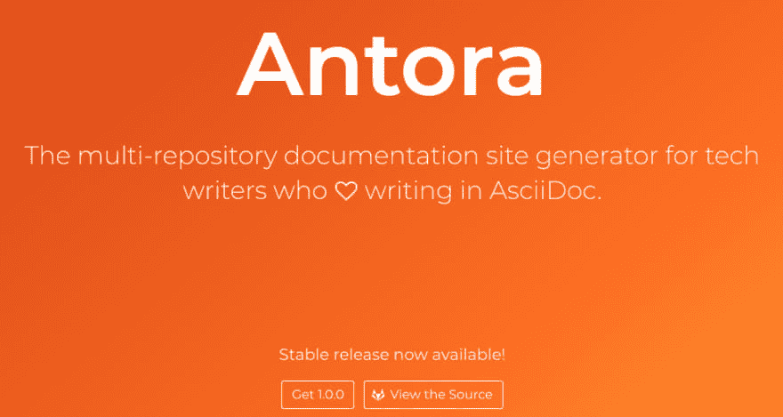
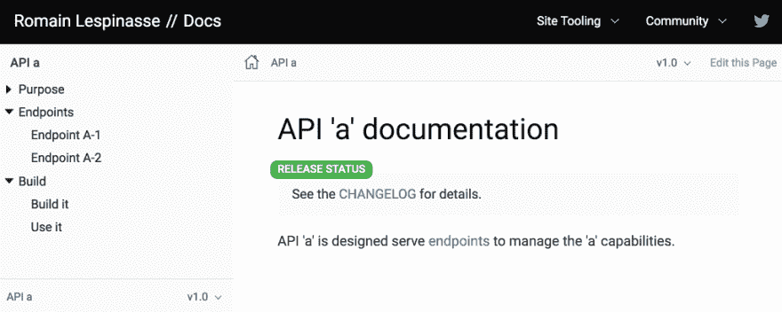
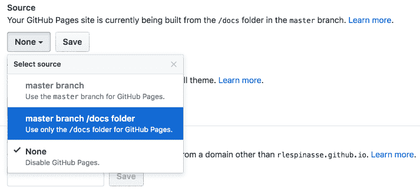

# 用文档网站替换你的维基

> 原文：<https://dev.to/rlespinasse/replace-your-wiki-with-a-documentation-site-3p90>

> 你好，这篇文章的法文版可以在 [dev.to](https://dev.to/rlespinasse/remplacer-votre-wiki-par-un-site-de-documentation-207k) 上阅读

无论您的 IT 项目是什么，总会需要存储一些文档。选择使用[维基](https://en.wikipedia.org/wiki/Wiki)在企业界相当普遍。

让我们来谈谈你，一个程序的开发者，你的不同项目的文档是由一个容易访问和编辑的维基来管理的吗？

如果你看看这个维基的内容，你可能会发现:

*   页面带有章节名`still need documentation`，
*   信息不正确的页面，
*   弃用的页面，
*   页面只对某个团队有用，
*   包含仍在开发中的功能文档的页面。

所以你想知道如何让从事不同项目的人更容易。

在这一点上，`documentation as code`的原理似乎就是你需求的解决方案。

## 您开始了将文档作为代码的冒险

将文档视为程序源代码是很有趣的。
你想用一个致力于文档的项目替换你当前的 wiki，并允许你对这些改变做出`code review`。
但这只是纠正了部分问题，你只是用另一种格式的文件替换了维基页面，比如:

*   [降价](https://daringfireball.net/projects/markdown/syntax)格式，
*   [Asciidoc](http://www.methods.co.nz/asciidoc/) 格式。

由于其简单和可访问的语法，`Markdown`是最流行的格式之一，尤其是在 github 或 gitlab 这样的网站上，但是它对于进一步的文档来说太简单了。

`Asciidoc`是不是[更有趣](https://github.com/asciidoctor/asciidoctor.org/blob/master/docs/_includes/asciidoc-vs-markdown.adoc)，让你的文档更有表现力。
相关工具 [Asciidoctor](https://asciidoctor.org/) 提供[有用的特性](https://asciidoctor.org/docs/asciidoc-writers-guide/)以及集成，比如用 [plantuml](http://plantuml.com/) 生成图表。

因此，您选择在您的每个项目中编写 **Asciidoctor** 文档。
这允许您在交付相关代码的同时交付文档。

即使您的程序由一组项目组成，每个项目都有自己的文档，您也希望保持一个单一的站点来访问它们。

Asciidoctor 背后的人最近向开源社区发布了一个聚合文档站点生成器: [Antora](https://antora.org/) 的稳定版本(`1.0.0`)。

[](https://res.cloudinary.com/practicaldev/image/fetch/s--9imfnskl--/c_limit%2Cf_auto%2Cfl_progressive%2Cq_auto%2Cw_880/https://thepracticaldev.s3.amazonaws.com/i/y0hrwcftoqua8lruudtr.png)

## 使用 Antora/asciidor 创建新的文档站点

Antora 生成的站点[由三个元素](https://docs.antora.org)组成:

*   包含它们的文档的项目，
*   配置文件站点生成的 [**剧本**](https://docs.antora.org/antora/1.0/playbook/) ，
*   一个 [**UI**](https://docs.antora.org/antora/1.0/playbook/configure-ui/) ，它定义了你的站点的视觉效果(默认的是合适的)。

要被 Antora 使用，一个项目必须遵守一个[文件结构](https://docs.antora.org/antora/1.0/component-structure/)

```
./docs
├── antora.yml
└── modules
    └── ROOT
        ├── _attributes.adoc
        ├── nav.adoc
        └── pages
            ├── _attributes.adoc
            └── index.adoc 
```

Enter fullscreen mode Exit fullscreen mode

### 您将文档设置为项目的代码

所以你努力把它贴在:

*   你的 API([API A](https://github.com/rlespinasse/api-a)、 [api B](https://github.com/rlespinasse/api-b) 、 [api C](//https%20:%20//github.com/rlespinasse/api-c) )
*   你的工具([构建工具](https://github.com/rlespinasse/buildtools))，
*   你的发展指南([指南](https://github.com/rlespinasse/guidelines))。

`Asciidoctor`格式的文档可在`docs`文件夹中获得。

> 对于`guideline`，没有必要使用这个树，它只是一个文档项目。

### 您正在准备生成您的文档网站

因此，您创建了一个[特定项目](https://github.com/rlespinasse/docssite)来存储**剧本**。

```
site:
  title: "Romain  Lespinasse  //  Docs"
  start_page: guidelines::index
  url: https://rlespinasse.github.io/docssite
content:
  sources:
  - url: https://github.com/rlespinasse/api-a.git
    branches: master
    tags: v*
    start_path: docs
  - url: https://github.com/rlespinasse/api-b.git
    branches: master
    tags: v*
    start_path: docs
  - url: https://github.com/rlespinasse/api-c.git
    branches: master
    tags: v*
    start_path: docs
  - url: https://github.com/rlespinasse/buildtools.git
    branches: master
    tags: v*
    start_path: docs
  - url: https://github.com/rlespinasse/guidelines.git
    branches: master
ui:
  bundle:
    url: https://gitlab.com/antora/antora-ui-default/-/jobs/artifacts/master/raw/build/ui-bundle.zip?job=bundle-stable
    snapshot: true
  output_dir: ui-bundle
  supplemental_files: ./supplemental-ui
output:
  dir: ./docs 
```

Enter fullscreen mode Exit fullscreen mode

[剧本](https://docs.antora.org/antora/1.0/playbook/playbook/)的内容`site.yml`定义:

*   通过`site:`将[相关信息](https://docs.antora.org/antora/1.0/playbook/configure-site/)发送到站点本身，
*   [内容的定义](https://docs.antora.org/antora/1.0/playbook/configure-content-sources/)通过`content:`、
*   网站的[主题通过`ui:`，](https://docs.antora.org/antora/1.0/playbook/configure-ui/)
*   [通过`output:`构建文件夹](https://docs.antora.org/antora/1.0/playbook/configure-output/)。

官方文档没有提到它，因为它是一个仍在试验中的[开发](https://gitlab.com/antora/antora/issues/147)，但是你通过`supplemental-ui/partials/`中的`header-content.hbs`文件设置了导航栏来添加有用的链接。

> 其他模板文件可在 [Antora 默认 UI](https://gitlab.com/antora/antora-ui-default/tree/master/src/partials) 中替换。

## 您生成并部署新的文档站点

你可以通过这个[指南](https://docs.antora.org/antora/1.0/install/install-antora/)安装 antora 或者通过`docker run -v `pwd` command: / antora --rm antora / antora --stacktrace site.yml`使用 docker 镜像(其中 **site.yml** 是剧本)

行动手册定义了`docs`文件夹，以使您的新文档站点可用。

[](https://res.cloudinary.com/practicaldev/image/fetch/s--NUZ2f2sm--/c_limit%2Cf_auto%2Cfl_progressive%2Cq_auto%2Cw_880/https://thepracticaldev.s3.amazonaws.com/i/oe53z1s841okkznvw79m.png)

例如，为了在 Github 上访问它，您可以通过您的`docssite`项目的 Github 页面来部署它。

[](https://res.cloudinary.com/practicaldev/image/fetch/s--F1fAI3v5--/c_limit%2Cf_auto%2Cfl_progressive%2Cq_auto%2Cw_880/https://thepracticaldev.s3.amazonaws.com/i/el2qpoqq8tgfty9fto32.png)

平台会自动将`/docs`文件夹的内容暴露给[https://rlespinasse.github.io/docssite](https://rlespinasse.github.io/docssite)。

## 你让其他人从新的文档网站中受益

从现在开始，从事这个项目的人将能够非常容易地添加、创建和维护每个项目的文档。您的新文档网站提供了对所有这些页面的访问。

场地[docs.antora.org](https://docs.antora.org)使用`Antora`项目本身。

> 感谢 [Aurélien Allienne](https://twitter.com/sn0rks) 、 [Antoine Méausoone](https://twitter.com/AMeausoone) 、 [Tanguy Baudrin](https://twitter.com/TanguyBAUDRIN) 和 [Tony Proum](https://twitter.com/chezTone) 对文章的审阅。
> 感谢 [Aurélien Allienne](https://twitter.com/sn0rks) 、 [Guillaume Mantopoulos](http://twitter.com/MrGuiMan) 对这篇文章的法文英译本进行审核。