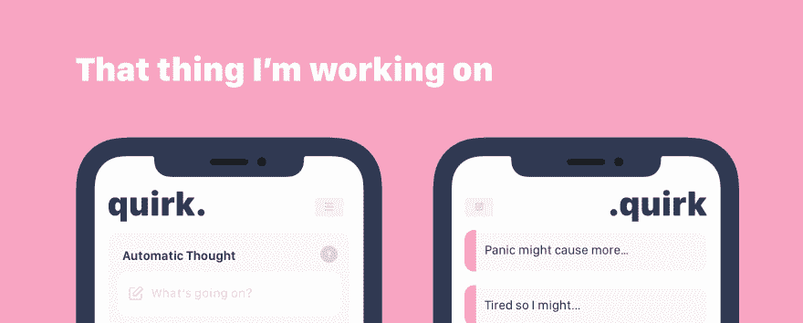
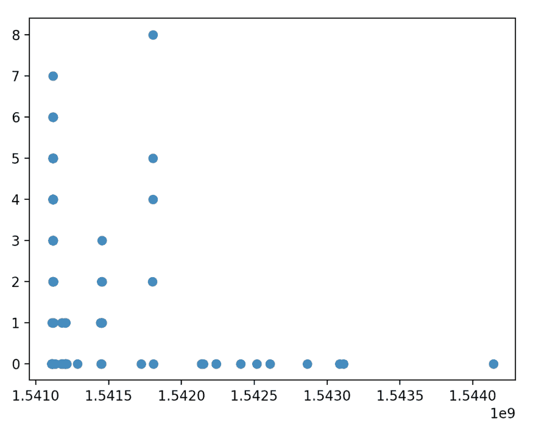
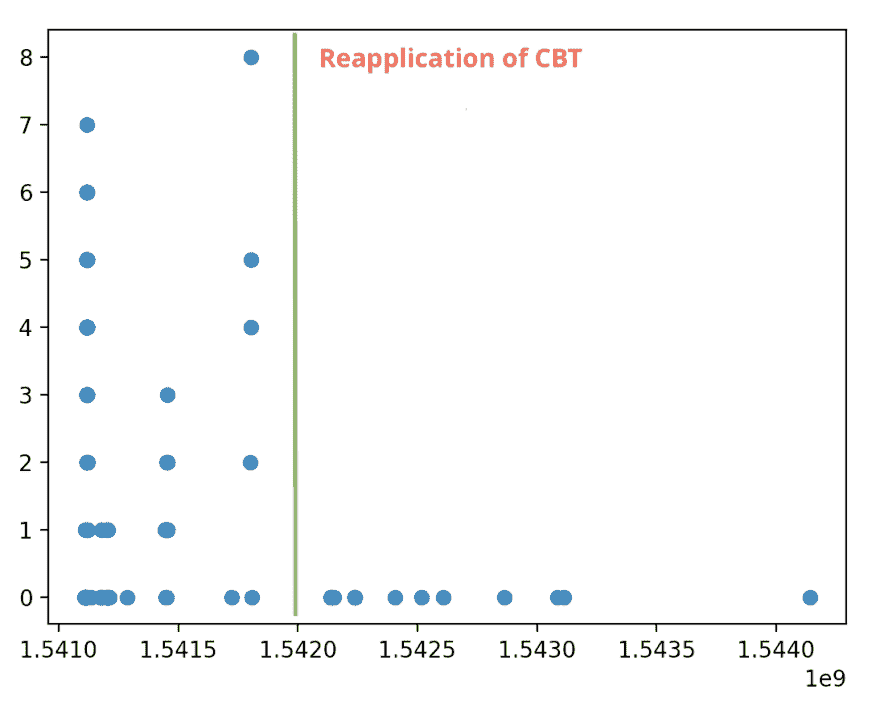
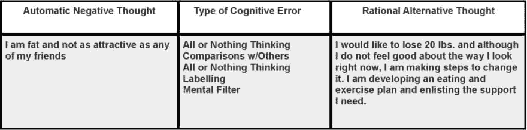
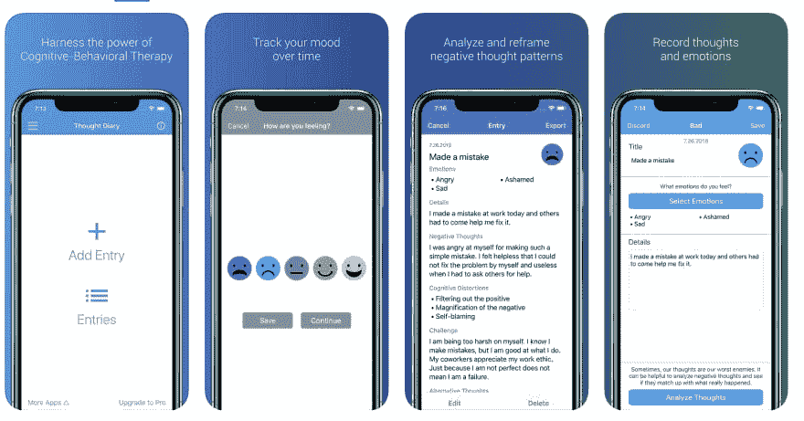
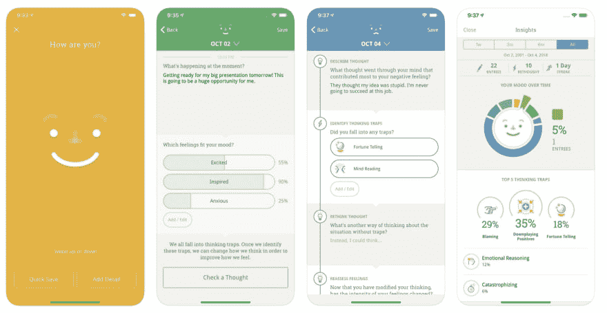
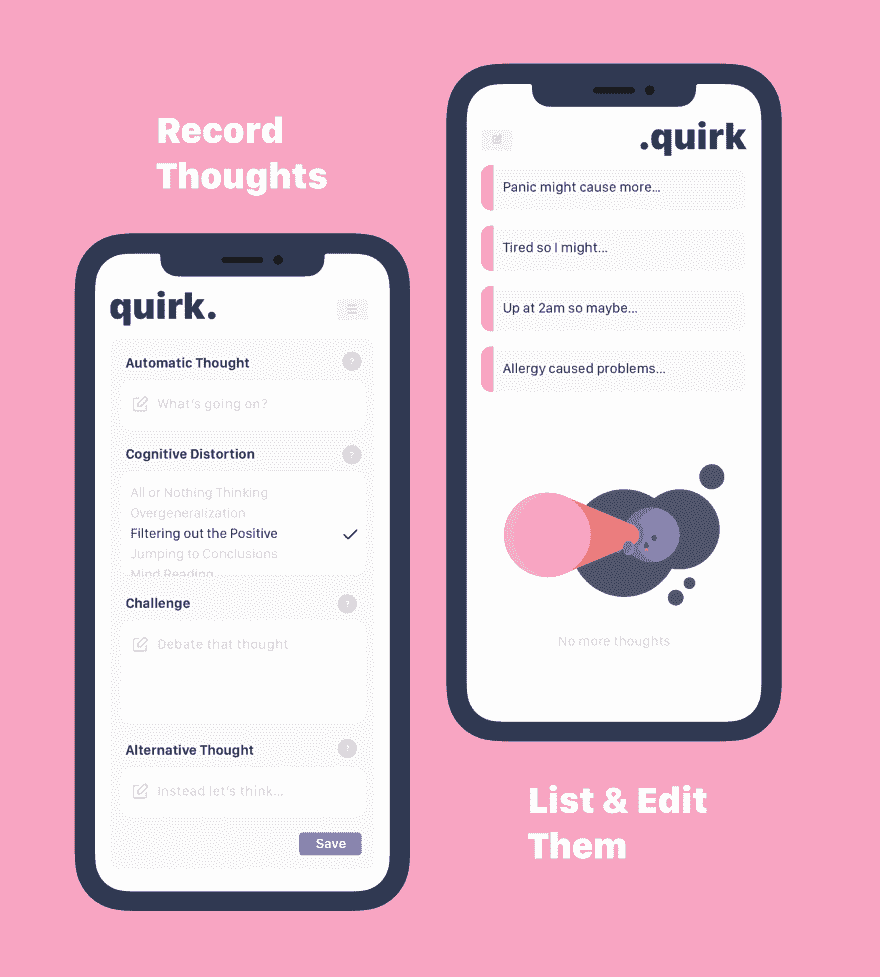

# 征求意见:Quirk，一款开源的认知行为治疗应用

> 原文：<https://dev.to/flaque/request-for-comments-quirk-an-open-source-cognitive-behavioral-therapy-app-12il>

免责声明:我不是医生，也不是医学研究者。我不会给出建议，也不会诊断任何事情，我唯一的经历就是我自己。

大约两个月前，我制作了一个小工具来测量我的惊恐发作。在你开始担心之前，这是一个公开的发展类型的故事；这不是秘密。我告诉我的开发圈子里的大多数人恐慌，因为[恐慌是我开始编程](https://econn.tech/how-i-got-to-now)的原因。

我不是来羞辱你，告诉你说“疯狂”是违法的，也不是来为更好的工作时间辩护的。我在这里向你展示我正在研究的东西。T3】

[](https://res.cloudinary.com/practicaldev/image/fetch/s--Xbq_6H9a--/c_limit%2Cf_auto%2Cfl_progressive%2Cq_auto%2Cw_880/https://i.imgur.com/HTglKHf.png)

# 欢迎来到我的私生活

这是我在大约两个月的时间里遭受攻击的图表。

[](https://res.cloudinary.com/practicaldev/image/fetch/s--RtLEoI9t--/c_limit%2Cf_auto%2Cfl_progressive%2Cq_auto%2Cw_880/https://i.imgur.com/StVbtVt.png)

这张图来自我构建的那个工具，被亲切地称为`freak`。这是一个简单的命令行工具，记录时间戳和强度:

```
$ freak 8 
```

Enter fullscreen mode Exit fullscreen mode

像恐慌这样的偶发性障碍很容易被遗忘。当它糟糕的时候，人们很容易忘记它可能会变好，而当它好的时候，人们会忘记它曾经变得有多糟糕。

很容易“忘记”哪些治疗有效，哪些是猪食。

对我来说，这是记录它们何时发生、何时停止的硬数据的简单方法。这样，没有一个纸上谈兵的心理学家可以声称我的发作只是“由月球轨道引起的”或诸如此类的东西。

我可以指出任何一种治疗方法，并肯定地说“是的，这似乎对我很有效。”

# 等等，慢点说，到底什么是惊恐发作？

许多人对此有不同的描述，所以我不能给你一个通用的描述。我不能告诉你我的攻击是什么。

对我来说，恐慌不是压力，而是恐惧。

惊恐发作是对并不危险的事物产生强烈恐惧的生理体验。这是当你差点出车祸时，你肚子里的肾上腺素。看完一部恐怖电影后，你知道你的地下室里有一个杀人犯。是*里的“逃跑”打架还是逃跑*；它在躲避老虎，但没有老虎。

恐慌是你的身体把脚放在地板上，把踏板放在金属上，把球放在停车场的墙上。

它会持续一两个小时，有时会“成群”出现这不是普遍的焦虑，因为一般来说，你是快乐和健康的。

# 认知行为疗法和你的大脑

从我记事起，我就有这些症状，从我记事起，人们就向我建议愚蠢的、互联网背后的、纸上谈兵的治疗方法。在尝试了很多之后，真的很容易变得怀疑。

在我上高中时的一个特别糟糕的插曲后，我开始看推荐 CBT 的医生。

我传达了提议。

当时，我不知道治疗意味着什么。当你周围的每个人都建议治疗时，你倾向于将他们与硬治疗和软治疗联系起来。

由于许多外行人对药物治疗有一种不幸的道德上的反对，他们倾向于提供温和的治疗。由于他们通常不知道自己在说什么，他们的“治疗”不起作用。

你变得对温和疗法有偏见，即使医生建议这样做。

几年来，我忽略了任何形式的治疗的概念。直到去年，我才开始探索认知行为疗法(CBT)，这是“软”治疗选择的黄金标准。

# 这是迄今为止最有效的方法

它不仅减少了攻击的总量，而且在群集期间重新应用还显著降低了攻击的强度和持续时间。

[](https://res.cloudinary.com/practicaldev/image/fetch/s--EEgdZBIc--/c_limit%2Cf_auto%2Cfl_progressive%2Cq_auto%2Cw_880/https://i.imgur.com/PoG9NOL.png)

在我最近被`freak`捕获的集群中，它停止了攻击。

我不是唯一一个认为 CBT 有效的人，大量研究表明它至少和 SSRIs 治疗一样好。它在 80 年代就已经出现了，通常是你去看心理医生时尝试的第一种治疗方法。

# 所以等等，CBT 是什么？

自 20 世纪 80 年代开始普及以来，CBT 出现了多种形式。 CBT 包含许多不同的练习；我的解释将集中在治疗的“简化”版本上。

## 自动产生思想

CBT 要求你认识到是你的思想引起了感觉，而不是相反。虽然你现有的情绪确实可以让一些想法变得更容易，但通常破坏性和不健康的情绪是由不合逻辑和“扭曲”的想法引起的。这也表明，许多这些想法是“自动的”和自我实现的预言。

例如，通常我的攻击会开始，因为我认为他们会开始。小而短暂的事情会吓到我，我会注意到它，我会*自动*想:

> 我感到有点恐慌，所以我就要恐慌发作了。

过去袭击的画面在我的脑海中闪现，我开始思考如果我真的*有一次袭击会有多糟糕。也许我正在工作，准备做一个超级重要的演示。如果我在绩效评估中被击中了怎么办？如果我不得不中途退出演示怎么办？*

 *## 认知扭曲

CBT 会让我注意原始思想中的*认知扭曲*(实际上是逻辑谬误的心理词汇)。

在这个例子中，我把*变成了*。真的有人会在乎我搞砸了一个演示吗？大多数人都知道我有这些症状。我会解释发生了什么事。另外，我的任何一个队友都可以拿走那个演示；他们都非常聪明。

如果我不得不在演示中途离开，这真的是一件大事吗？这种事以前肯定发生过。很多人在大型活动前都会生病。

## 挑战思想

CBT 会要求我记录这些逻辑论点。把它们写下来有助于巩固概念，所以在你的大脑从一个可怕的想法跳到下一个之前，它们会更自然地出现。

## 找到一个替代品

最后，CBT 会要求你找到一种合乎逻辑的方式来解释这种情况。例如:

> 我感到了一点恐慌，但这并不意味着它会导致更多的恐慌或袭击。

# 就是这样。

你记录下你的想法，挑战它，然后找到另一种想法。你为你可能有的每一个不合逻辑的、不合理的、可怕的想法去做。

在 80 年代，当治疗正式化时，他们建议患者分三列进行:

[](https://res.cloudinary.com/practicaldev/image/fetch/s--5J2SMMfm--/c_limit%2Cf_auto%2Cfl_progressive%2Cq_auto%2Cw_880/https://pro.psychcentral.com/psychoeducation/wp-content/uploads/sites/9/2017/07/1-2-1024x254.jpg)

但是任何在现代社会中这样做过的人都可能注意到，有了设备，事情变得简单多了。软件给你两大优势:

*   离散记录
*   累积指标

把它放在你的手机上意味着你总是有办法录音。

# 当前的应用程序笨重、昂贵

目前有几个应用程序，即“思想日记”和“备忘录”思想日记是免费的，但它相当乏味。

[](https://res.cloudinary.com/practicaldev/image/fetch/s--_07DMSvE--/c_limit%2Cf_auto%2Cfl_progressive%2Cq_auto%2Cw_880/https://i.imgur.com/HT3a7Ut.png)

MoodNotes 是 5 美元，但更好看。

[](https://res.cloudinary.com/practicaldev/image/fetch/s--3lZ4juhO--/c_limit%2Cf_auto%2Cfl_progressive%2Cq_auto%2Cw_880/https://i.imgur.com/DepVkJO.png)

两者都深受对情绪的强烈关注之苦。他们假设用户使用 CBT 治疗抑郁症，因此将“情绪”疗法与认知改变紧密结合。

## 在这两个应用程序中，你都不能记录你是否开心

当你录制东西的时候，你要做的第一件事就是告诉程序你在做什么。如果你快乐，它不会让你记录和挑战一个想法。

这意味着，如果你今天过得很好，但注意到自己在想一些不合逻辑的事情，而这些事情可能会让你情绪低落，你必须要么等待这种想法失控，要么对应用撒谎，告诉它你不开心。

这是一款试图帮助你将不合逻辑的想法从灾难性情绪中分离出来的应用程序中的一个非常糟糕的缺陷。

## 每个应用程序输入任何东西都要花费很长时间

因为他们如此专注于情绪疗法，所以他们增加了许多不同的步骤，这意味着更多的点击和更多的字段要填写。

如果你花了 30 秒来填写一些东西，你可以很容易地偷偷把它放进来，即使你正在开会。如果花了你 2 分钟，那就难多了。

## 我们可以做得更好

更重要的是，我们可以做得更少。这些应用程序中有很多都存在功能退化的问题。他们试图用所有的华而不实的东西做出一个非常具体的解决方案，并向每个人推销。

相反，我们可以削减功能，使一些更集中。

* * *

# ShowDev: Quirk，一款开源的 CBT app。

在过去的几周里，我一直在做一个 CBT 应用的原型。它仍然处于非常早期的阶段，但这里是它可能/将要成为的一般要点:

*   在 aGPL 下获得许可，在 Github 上有回购协议
*   在设备上存储数据以保护隐私
*   非商业性

请注意，非商业和开源并不意味着“免费”，只是这种努力的目的不是为了赚钱。没有生意被创造出来；这只是我周末做的一个项目。也就是说，在各种商店上放置或保留一个应用程序并不便宜。

下面所有的模型都完成得非常快，并且处于一个非常有延展性的状态。它们不是最终的，甚至可能与完成状态相差甚远。

从代码的角度来看，这个应用程序真的很小，我已经有了一个坚实但丑陋的工作原型。所以这篇文章更多的是关于我们如何制造一个伟大的产品。

## 跨平台，但 iOS 作为重点

代码是用 React Native 编写的，所以我计划在 Google Play 商店和苹果应用商店发布它。

也就是说，我目前没有 Android 设备，也有一段时间没有使用 Android 了。您的里程可能会有所不同。

## 两个屏幕

为了尽可能地限制范围，实际上只有两个主屏幕。一个用于记录，一个用于以后观看。这些屏幕之间的转换将是滑动的，因此您可以将录制屏幕视为“在左边”，将列表屏幕视为“在右边”

为了突出这一点，我们将把过渡按钮放在相反的两边，甚至改变`quirk.`中的时间段的位置，以真正销售效果。

[](https://res.cloudinary.com/practicaldev/image/fetch/s--q8lF8neg--/c_limit%2Cf_auto%2Cfl_progressive%2Cq_auto%2Cw_880/https://i.imgur.com/n8B5xne.png)

## 入职

当用户加入时，我们会给他们一个 CBT 速成班。这必须*真的*最小，否则他们不会记得，所以我们会添加一些插图，使它更令人难忘。

[](https://res.cloudinary.com/practicaldev/image/fetch/s--o3OaUufn--/c_limit%2Cf_auto%2Cfl_progressive%2Cq_auto%2Cw_880/https://i.imgur.com/sl5GGAF.jpg)

# 如果这是你感兴趣的东西

然后让我知道。我首先是为自己建造这个。但是我打算发布它，因为我怀疑我不是唯一需要它的人。

所以如果*你*有兴趣帮助建造或者使用它，请告诉我！如果可以的话，请填写[这份包含 4 个问题的调查。](https://goo.gl/forms/2grxxc50WF9oGW3s2)

# 项目状态

到目前为止，这个项目大约有三次迭代，都是原型。目前*没有*发布，也没有在 Github 上发布。一旦我可以适当地清理它，并有合理的切入点，它将在未来。

# 欢迎批评

我喜欢这个应用程序的评论。我不能保证我能做所有的事情；这个 app 的范围很小是有原因的。但是肯定有办法改进这个产品。*