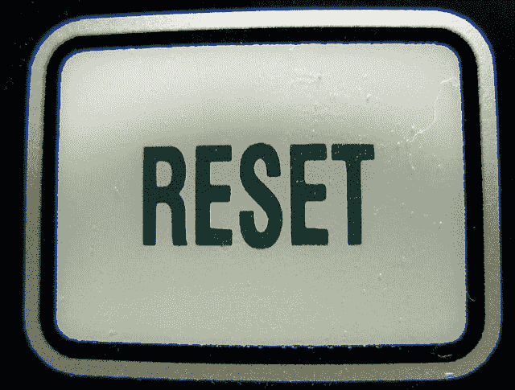

# 复原按钮

> 原文：<https://dev.to/mchadley_io/reset-button-4g7i>

当我还是个孩子的时候，玩电子游戏最有用的两个工具是快速保存按钮和重置按钮。我无法告诉你我花了多少个晚上按下重置按钮，试图击败超级马里奥 64 或在托尼·霍克的职业滑冰运动员身上获得完美的运行。重置。重置。重置。

在生活中，似乎有几次我们希望自己也有一个重置按钮！

2013 年，我毕业于大众传播专业，获得了学士学位，有了四年多的知识，我开始天真地期待毕业后能找到一份工作，住在我女朋友附近，也许两三年后就能结婚。但是正如所有的程序员都知道的那样，仅仅因为你写了一个看起来完美的语句，并不意味着它会完美地运行。我是说，老实说，没有什么事情第一次就能完美运行。

三年后，我发现自己失业了，因为我工作的电脑商店被收购了，新公司清理了房间；我单身，失业，和妈妈住在一起。这开始听起来像一个电影比喻，或者是我这个年龄的人所写的每一篇新闻报道的开始。

显然，我的学士学位这个黑洞不会成功。那又怎样？

那时我发现了编码。不像有些人那样，在一个月内打字和学习一门语言是不可思议的。不…我不是一个“摇滚明星程序员”。老实说，我浏览了一些关于 Ruby 和其他一些我都不记得的编码语言的教程，心想，“嘿！这很有趣。”我审视了一下自己，觉得尽管数学能力是我的致命弱点，但我还是应该看看这个。我喜欢解决问题，我喜欢创造力，我喜欢看着我做的东西从一点一点拼凑起来，然后真正做点什么。因此，在对 HTML/CSS 一无所知的情况下(我更像一个 Xanga 的孩子，我在高中时没有真正定制过我的 Myspace 页面)，我查看了新兵训练营，并在一些帮助下决定了我刚刚毕业的 A.A.S。

关于重置按钮，他们没有告诉你的是，按下一个按钮需要很大的勇气。后果是有的。财务承诺，牺牲夜晚和周末；更关心如何确保 java final 中的抽象类与子类一起工作，或者 PHP 如何使用 Salt 加密密码，然后如何解密以登录？！

但是在生活中，你只有几次机会按下重置按钮，然后准确地到达你需要的地方。也许我还没有完成这个关卡，但是我现在的起点肯定比开始的时候要好。有时候你需要做的就是有勇气去重置，不管是在生活中，还是在你过不去一个特别硬的错误信息的时候，(我看着你 PHP)。谁知道呢，你可能会一路向上。