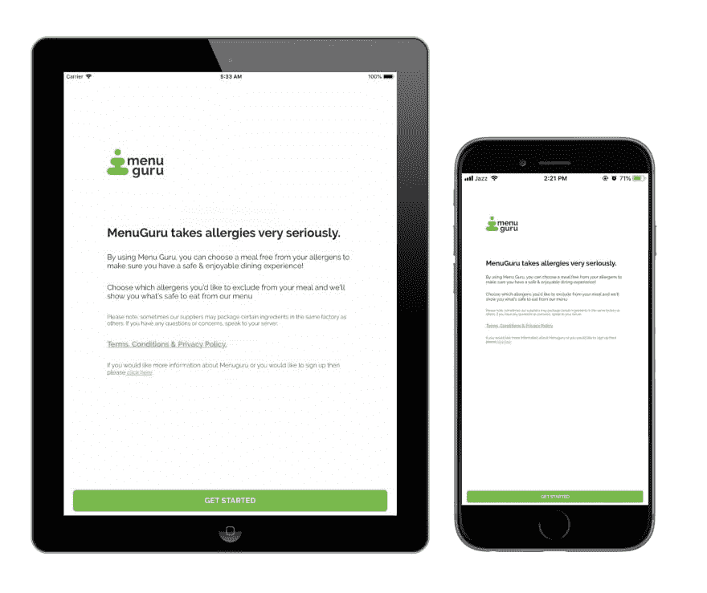

# 响应式设计

> 原文：<https://dev.to/aneeqakhan/responsive-design-gj7>

我们正在开发 react native 应用程序，它需要在不同的设备上显示，如 IPads 或 IPhones，不同的设备有不同的屏幕尺寸。因此，这是我们在项目中使用的解决方案，使我们的应用程序在不同的屏幕上做出响应。

### 实现

最初，应用程序设计是为宽度为“768”的 IPad 屏幕设计的。所以我们写了一个简单的名为“Dimension”的函数，它接受 size 并除以默认宽度，然后乘以当前屏幕的宽度。

```
import { Dimensions } from "react-native";

const Dimension = size => {
  const { width } = Dimensions.get("window");
  const designBenchmark = 768;
  return (size / designBenchmark) * width;
}; 
```

Enter fullscreen mode Exit fullscreen mode

这里 designBenchmark 描述了给定设计的宽度，你可以随时根据你给定的设计宽度改变它，尺寸类是从“react-native”导入的

### 用法

然后导出该函数以从任何其他组件访问它。可以这样用。

```
marginBottom: Dimension(20); 
```

Enter fullscreen mode Exit fullscreen mode

它神奇地为我们工作，设计在不同的设备上有很好的反应。你可以分别在 IPad 和 IPhone 上查看下面的应用截图图片。

[](https://res.cloudinary.com/practicaldev/image/fetch/s--touc8Zbi--/c_limit%2Cf_auto%2Cfl_progressive%2Cq_auto%2Cw_880/https://thepracticaldev.s3.amazonaws.com/i/8zq7jgwe6veelaicpzdn.png)