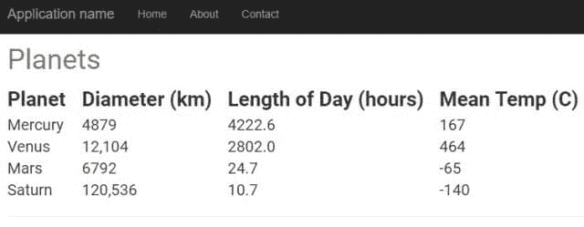
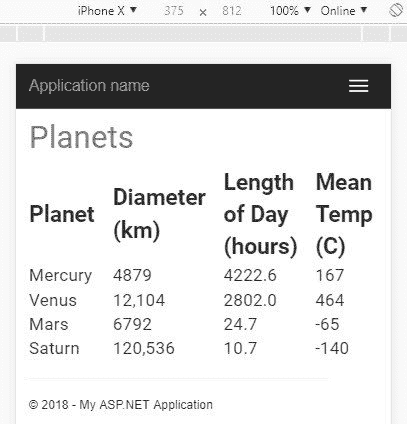
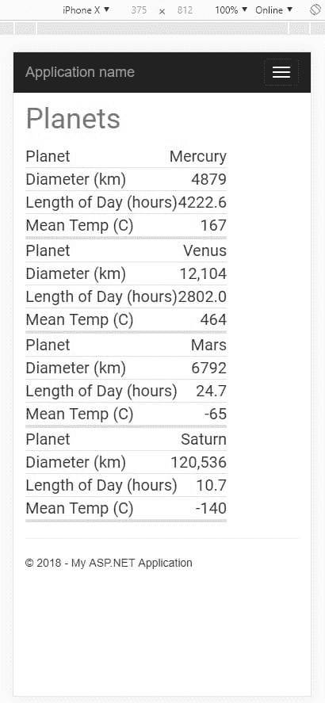
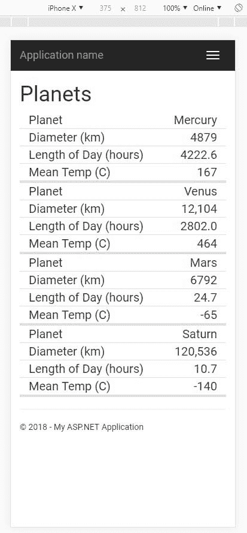
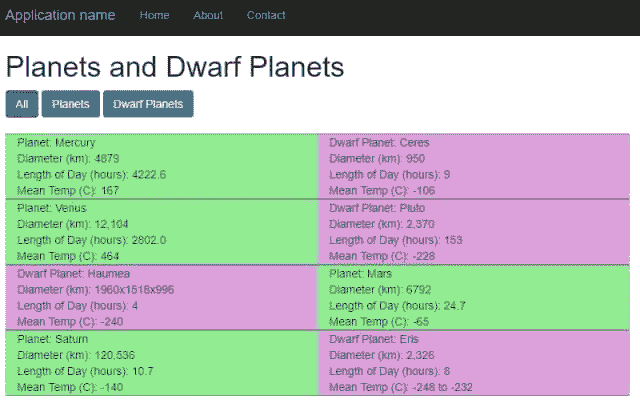
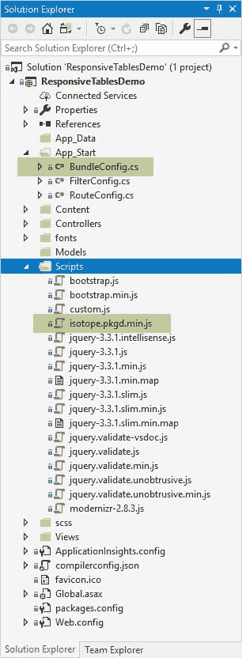
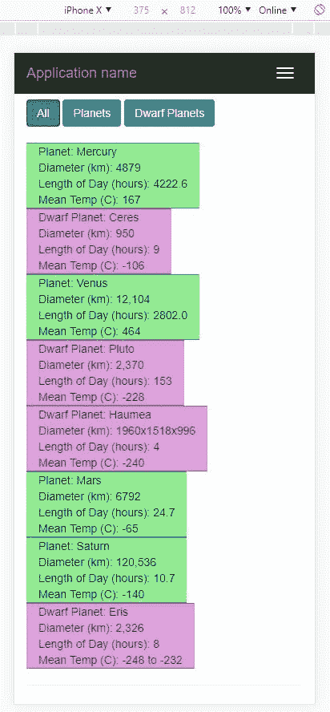

# 响应式表格——如何漂亮地扩展你的网站

> 原文：<https://dev.to/dirkstrauss/responsive-tables--how-to-scale-your-site-beautifully-4d8m>

响应式表格为您的站点提供了很好的伸缩性，尤其是在移动设备上查看表格时。但是对于一些网站来说，响应式表格是不存在的。您可能想知道如何使网站上现有的表格具有响应性。请注意，我所说的响应，并不是指水平滚动条。

### 找别的？请尝试以下链接:

*   [Chrome 开发者工具——你需要知道的简单网络调试](https://dev.to/dirkstrauss/chrome-developer-tools--easy-web-debugging-you-need-to-know-30na)
*   [Chrome 开发工具——更高级的调试技巧](https://dev.to/dirkstrauss/chrome-dev-tools--more-advanced-tips-for-better-debugging-5cgh)
*   [时髦的 Css——你需要知道的有价值的好处](https://dev.to/dirkstrauss/sassy-css--the-valuable-benefits-you-need-to-know-5447-temp-slug-6301632)
*   这个了不起的扩展会让你变得时髦起来
*   难以置信的强大多选功能。现在提高生产率

我在寻找一些关于响应式表格的信息，偶然看到了[马特·史密斯关于响应式表格布局的文章](https://allthingssmitty.com/2016/10/03/responsive-table-layout/)。让我们看看显示行星数据的标准表。

> 请注意，这个 Visual Studio 项目中的所有源代码[都可以在 Github](https://github.com/dirkstrauss/ResponsiveTables) 上获得。

## HTML 表格

对于这个例子，我将使用一些简单的标记来[创建一个表来保存行星数据](https://codepen.io/dirkstrauss/pen/GPqbOz)。

在 Visual Studio 中，我使用 Scss 添加了一些额外的样式，当我运行 web 项目时，我的表格如下所示:

[](https://res.cloudinary.com/practicaldev/image/fetch/s--pRrmKEjs--/c_limit%2Cf_auto%2Cfl_progressive%2Cq_auto%2Cw_880/https://i0.wp.com/dirkstrauss.com/wp-content/uploads/2018/12/responsive-tables-plain-table.jpg%3Fw%3D640%26ssl%3D1)

不算太坏，嘿？让我们来看看我们的桌子在 iPhone X 上的样子。

[](https://res.cloudinary.com/practicaldev/image/fetch/s--CiZIoXTZ--/c_limit%2Cf_auto%2Cfl_progressive%2Cq_auto%2Cw_880/https://i2.wp.com/dirkstrauss.com/wp-content/uploads/2018/12/responsive-tables-mobile-view.jpg%3Fw%3D640%26ssl%3D1)

在我看来这绝对不太好。这并不可怕，但在我看来并没有及格。

## 让星球表反应更灵敏

为此，我为每个表数据元素添加了一个数据标签属性。**数据标签**值是每列名称的值。

```
<td data-label="Planet">Mercury</td> 
```

Enter fullscreen mode Exit fullscreen mode

然后我添加了 Matt 在文章中建议的 CSS 媒体查询。[这是包括 CSS](https://codepen.io/dirkstrauss/pen/LMZwxa) 在内的完整笔。

现在看看这张桌子。它看起来肯定比上面以前的布局好得多。

[](https://res.cloudinary.com/practicaldev/image/fetch/s--n29FlUBG--/c_limit%2Cf_auto%2Cfl_progressive%2Cq_auto%2Cw_880/https://i0.wp.com/dirkstrauss.com/wp-content/uploads/2018/12/responsive-tables-css.jpg%3Fw%3D640%26ssl%3D1)

这真的很棒，满足了我们的最终目标，即让一个表格以一种用户友好的、更易读的方式响应移动设备。正如 sitepoint 提供的这个[全面的解决方案列表中所概述的，制作响应式表格肯定还有其他解决方案。](https://www.sitepoint.com/responsive-data-tables-comprehensive-list-solutions/)

我确实想和引导网格系统一起工作。我确信这样做会使代码库更容易使用。

## Bootstrap 响应式表示例

我想只使用 **div** 标签来做到这一点。您可能知道，如果您想要快速响应，那么使用自举是一个不错的选择。[这是代码的笔](https://codepen.io/dirkstrauss/pen/YdWmow)。注意:提醒一下，所有的源代码都可以在 GitHub 上找到[。](https://github.com/dirkstrauss/ResponsiveTables)

查看这段代码，您会发现我使用了 Scss 作为我的 css 预处理器。当我查看该网站的移动版时，你会看到结果和以前完全一样。

[](https://res.cloudinary.com/practicaldev/image/fetch/s--TLG3O1il--/c_limit%2Cf_auto%2Cfl_progressive%2Cq_auto%2Cw_880/https://i1.wp.com/dirkstrauss.com/wp-content/uploads/2018/12/responsive-tables-bootstrap-example.jpg%3Fw%3D640%26ssl%3D1)

Bootstrap 和媒体查询反应良好，保持了数据表的可读性和响应性。

我想更进一步。如果你需要创建一个反应灵敏的表格，包括过滤和许多其他功能，看看[同位素](https://isotope.metafizzy.co/)。

## 使用同位素的简单响应式表格示例

快速使用同位素真的很容易。让我们先看看我们的桌子。你会注意到我在网格中添加了更多的天体(矮行星)。

为了清楚起见，每一类行星(如果这是正确的术语)都被涂上不同的颜色。

[](https://res.cloudinary.com/practicaldev/image/fetch/s--yJgVaRnI--/c_limit%2Cf_auto%2Cfl_progressive%2Cq_auto%2Cw_880/https://i2.wp.com/dirkstrauss.com/wp-content/uploads/2018/12/responsive-tables-isotope.jpg%3Fw%3D640%26ssl%3D1)

要将同位素添加到您的 Web 应用程序中，您需要[访问同位素页面](https://isotope.metafizzy.co/)并下载**同位素. pkgd.min.js** 文件并将其添加到您的站点中。如果你愿意，也可以直接链接到 CDN。

在下面的截图中，你会注意到同位素文件被添加到我的**脚本**文件夹中。你也会注意到我添加的 **custom.js** 文件。

[](https://res.cloudinary.com/practicaldev/image/fetch/s--e1ywjAuO--/c_limit%2Cf_auto%2Cfl_progressive%2Cq_auto%2Cw_880/https://i1.wp.com/dirkstrauss.com/wp-content/uploads/2018/12/responsive-tables-add-isotope-to-project.jpg%3Fw%3D640%26ssl%3D1)

### 创建 custom.js 文件

**custom.js** 文件将包含同位素网格的自定义脚本。

```
var $grid;
var isoOptions;

$(function () {
    // Set the Isotope Grid Options
    isoOptions = {
        // options
        itemSelector: '.grid-item',
        masonry: {
            columnWidth: '.col-md-4'
        }
    };

    // Initialize the Isotope Grid
    $grid = $('.grid-container').isotope(isoOptions);

    // The Filter Button Click. This will filter the Isotope Grid by the class selected
    $('.button-filter').on('click', 'button', function () {
        var filterValue = $(this).attr('data-filter');
        currentFilter = filterValue; // Keep a variable set for the currently selected filter
        $grid.isotope({ filter: filterValue });
    });
}); 
```

Enter fullscreen mode Exit fullscreen mode

然后我们需要修改 **BundleConfig** 文件，并在其中添加以下内容:

```
bundles.Add(new ScriptBundle("~/bundles/isotope").Include("~/Scripts/isotope.pkgd.min.js"));
bundles.Add(new ScriptBundle("~/bundles/custom").Include("~/Scripts/custom.js")); 
```

Enter fullscreen mode Exit fullscreen mode

在 **_Layout.cshtml** 视图中，添加以下代码行:

```
@Scripts.Render("~/bundles/isotope")
@Scripts.Render("~/bundles/custom") 
```

Enter fullscreen mode Exit fullscreen mode

这应该就是你让同位素网格发挥作用所需要的一切。注意，所有代码(如上所述)也可以在 GitHub 上获得[。](https://github.com/dirkstrauss/ResponsiveTables)

### 运行同位素网格和过滤器

你最终会得到一个显示**行星**和**矮行星**的网格，但除此之外，它还包括一个过滤器。点击**行星**按钮将只显示行星，而点击**矮行星**按钮将只显示矮行星。

[在 YouTube 上观看过滤功能的演示](https://www.youtube.com/watch?v=Jeb-cxwxs0Q)

另一个好处是，同位素将改变你的网格项目的布局，使它们适合你正在使用的屏幕大小。

注意:我没有费心渲染手机的过滤按钮。

[](https://res.cloudinary.com/practicaldev/image/fetch/s--PlioYjqj--/c_limit%2Cf_auto%2Cfl_progressive%2Cq_auto%2Cw_880/https://i1.wp.com/dirkstrauss.com/wp-content/uploads/2018/12/responsive-tables-isotope-mobile.jpg%3Fw%3D640%26ssl%3D1)

这种响应也不会影响过滤器的功能。它始终保持完全的功能和响应。

## 同位素提供得多

同位素包为开发者提供了很多东西。看看可用的[过滤选项](https://isotope.metafizzy.co/filtering.html)以及[排序](https://isotope.metafizzy.co/sorting.html)和[布局模式](https://isotope.metafizzy.co/layout-modes.html)。

帖子[响应式表格——如何漂亮地扩展你的网站](https://dirkstrauss.com/responsive-tables/)最先出现在[编程和技术博客](https://dirkstrauss.com)上。