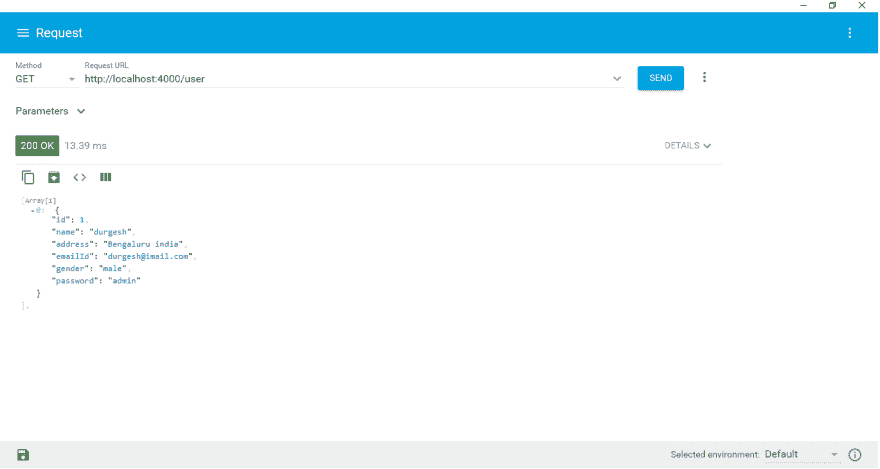
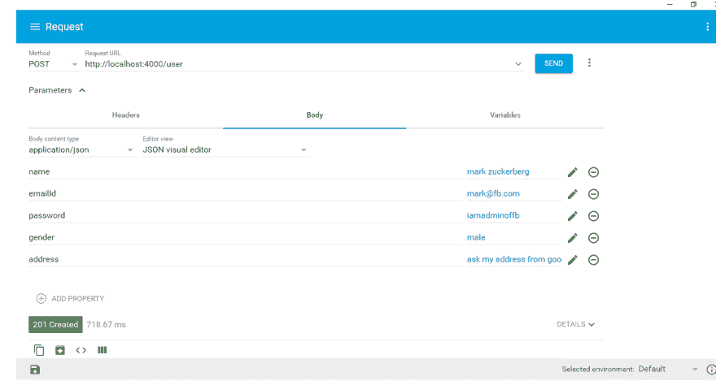

# 使用 TypeScript 和 FortJs 在 Node.js 中 Rest API

> 原文：<https://dev.to/ujjwal_kr_gupta/rest-api-in-nodejs-using-typescript-and-fortjs-5ff7>

# 简介

Typescript 是一项伟大的技术——它将静态类型添加到您的 javascript 代码中，提供更好的 intillisense 支持，意味着更快的开发等等。流行的客户端框架 Angular2 是如何使用 typescript 在更短的时间内创建大型项目的一个例子。

现在您一定想知道——我们可以使用 typescript 的能力来创建 nodejs 服务器吗？

答案是肯定的。

在本文中:-我们将使用 [fortjs](http://fortjs.info/) -一个完全兼容 typescript 和下一代 javascript - es6、es7 的 nodejs mvc 框架。

# 代码

本文的代码库可以从 github 上的- [示例链接下载](https://github.com/ujjwalguptaofficial/fortjs/tree/master/example/rest/typescript)

## 设置

克隆或下载 fortjs-[https://github . com/ujjwalgupta official/fortjs-typescript-starter](https://github.com/ujjwalguptaofficial/fortjs-typescript-starter)的 typescript starter 项目。

下载完项目后。打开控制台，移动到项目目录，并执行以下步骤，

*   运行命令- npm install
*   运行命令- npm run start

在浏览器中打开 url - localhost:4000。您将看到类似下面的内容，

[](https://res.cloudinary.com/practicaldev/image/fetch/s--dQOhsJep--/c_limit%2Cf_auto%2Cfl_progressive%2Cq_auto%2Cw_880/https://cdn-images-1.medium.com/max/800/1%2AaXOp3XaGdxml0HSB8v6XEQ.png)

## 休息

我们将为实体用户创建 rest 端点——它将为用户执行 crud 操作，如添加用户、删除用户、获取用户、更新用户。

空调休息，

1.  添加用户-应该使用 http 方法“POST”来完成
2.  删除用户-应该使用 http 方法“REMOVE”来完成
3.  获取用户应该使用 http 方法“GET”来完成
4.  更新用户-应该使用 http 方法“PUT”来完成

为了创建一个端点，我们需要创建一个控制器。你可以在这里阅读控制器-[http://fortjs.info/tutorial/controller/](http://fortjs.info/tutorial/controller/)

在 contollers 文件夹中创建一个 user_controller.ts 文件，并将下面的代码复制到该文件中，

```
import { Controller, textResult, DefaultWorker} from 'fortjs'  
export class UserController extends Controller {  
      @DefaultWorker()  
      async default() {  
          return textResult('you have successfully created a user controller');  
      }  
} 
```

Enter fullscreen mode Exit fullscreen mode

在上面的代码中，

*   我们创建了一个类“UserController ”,它从 fortjs 扩展了另一个类控制器。
*   我们已经创建了一个方法 default，它通过使用 fortjs 的方法 textResult 返回一些结果。textResult 返回内容类型为“text/plain”的 http 响应。
*   我们使用了来自 fortjs 的装饰器默认工人。一个 worker 使该方法对 http 请求可见，以便可以使用 http 请求调用它(没有 worker 意味着它只是一个仅对该类可用的函数)。默认工作线程是为目标方法添加路由“/”的工作线程。请看工人 doc-[http://fortjs.info/tutorial/worker/](http://fortjs.info/tutorial/worker/)
*   我们已经创建了一个控制器，但是 fortjs 仍然不知道它&为了使用这个控制器，我们需要将它添加到 routes 中。打开 src 文件夹中的 routes.ts 并将 UserController 添加到 routes。

我们已经创建了一个控制器，但是 fortjs 仍然不知道它&为了使用这个控制器，我们需要将它添加到 routes 中。打开 src 文件夹中的 routes.ts 并将 UserController 添加到 routes。

```
import {DefaultController } from "./controllers/default_controller";  
import { UserController } from "./controllers/user_controller";  

export const routes = [{  
    path: "/*",  
    controller: DefaultController  
},{  
    path: "/user",   
    controller: UserController  
}] 
```

Enter fullscreen mode Exit fullscreen mode

您可以看到我们为 UserController 添加了路径“/user”。这意味着当路径为“/user”时，将调用 UserController。

现在打开 url — localhost:4000/user。您可以看到从“UserController”中的默认方法返回的输出。

[](https://res.cloudinary.com/practicaldev/image/fetch/s--_oC0-wA1--/c_limit%2Cf_auto%2Cfl_progressive%2Cq_auto%2Cw_880/https://thepracticaldev.s3.amazonaws.com/i/pmi5jrhhn8t6g0x098vt.jpg)

这里需要注意的一点是，代码看起来非常简单和漂亮。由于 typescript & fortjs，这是可能的。另一个有趣的地方是——您将获得 intillisense 支持，这一切都让开发人员的生活变得轻松起来:)。

## 服务

在继续之前，让我们写服务代码，这将有助于我们做 crud 操作。

### 创建模型

创建一个文件夹“models ”,然后在该文件夹中创建一个文件“user.ts”。将下面的代码粘贴到文件中，

```
import { Length, Contains, IsIn, IsEmail } from "class-validator";  

export class User {  
    id?: number;  

    @Length(5)  
    password?: string;  

    @Length(5)  
    name: string;  

    @IsIn(["male", "female"])  
    gender: string;  

    @Length(10, 100)  
    address: string;  

    @IsEmail()  
    emailId: string;  

    constructor(user: any) {  
       this.id = Number(user.id);  
       this.name = user.name;  
       this.gender = user.gender;  
       this.address = user.address;  
       this.emailId = user.emailId;  
       this.password = user.password;  
    }  
} 
```

Enter fullscreen mode Exit fullscreen mode

我使用一个 npm 插件——“类验证器”来验证模型。服务和控制器将使用该模型“用户”来传输数据。

创建一个文件夹“services ”,然后在该文件夹中创建一个文件“user_service.ts”。将下面的代码粘贴到文件中，

```
import { User } from "../models/user";  

interface IStore {  
    users: User[];  
}  

const store: IStore = {  
    users: [{  
        id: 1,  
        name: "ujjwal gupta",  
        address: "Bengaluru india",  
        emailId: "admin-ujjwal@imail.com",  
        gender: "male",  
        password: "admin"  
    }]  
}  

export class UserService {

    getUsers() {  
        return store.users;  
    }

    addUser(user: User) {  
        const lastUser = store.users[store.users.length - 1];  
        user.id = lastUser == null ? 1 : lastUser.id + 1;  
        store.users.push(user);  
        return user;  
    } 

    updateUser(user: User) {  
        const existingUser = store.users.find(qry => qry.id === user.id);  
        if (existingUser != null) {  
            existingUser.name = user.name;  
            existingUser.address = user.address;  
            existingUser.gender = user.gender;  
            existingUser.emailId = user.emailId;  
            return true;  
        }  
        return false;  
    }  

    getUser(id: number) {  
        return store.users.find(user => user.id === id);  
    }  

    removeUser(id: number) {  
        const index = store.users.findIndex(user => user.id === id);  
        store.users.splice(index, 1);  
    }  
} 
```

Enter fullscreen mode Exit fullscreen mode

在上面的代码中，我们创建了一个虚拟服务。它包含一个变量 store，该变量 store 包含用户的集合，服务内部的方法执行操作，如添加、更新、删除、获取该存储。

### 得到

我们将为获取用户创建一个端点。

让我们将默认方法重命名为“getUsers ”,这将返回所有用户。将 user_controller.ts 中的代码替换为下面的代码，

```
import { Controller, jsonResult, DefaultWorker} from 'fortjs'  

export class UserController extends Controller {  
    @DefaultWorker()  
    async getUsers() {  
       const service = new UserService();  
       return jsonResult(service.getUsers());  
    }  
} 
```

Enter fullscreen mode Exit fullscreen mode

正如你所看到的——我们使用了 DefaultWorker，因为它使这个方法对 http 请求可见，并用 http 方法“GET”添加了 route“/”。所以所有这些都是由一个装饰者完成的。

让我们使用 http 客户端来尝试一下

[](https://res.cloudinary.com/practicaldev/image/fetch/s---YTl-ja_--/c_limit%2Cf_auto%2Cfl_progressive%2Cq_auto%2Cw_880/https://thepracticaldev.s3.amazonaws.com/i/kgaseie4gicyom5wd21f.png)

### 岗位

我们需要创建一个方法来添加用户，并且只为 http 方法“POST”工作。所以现在“UserController”看起来是这样的，

```
import { Controller, jsonResult, DefaultWorker, HTTP_METHOD, HTTP_STATUS_CODE, Worker, Route } from 'fortjs'  

export class UserController extends Controller {  

      @DefaultWorker()  
      async getUsers() {  
          const service = new UserService();  
          return jsonResult(service.getUsers());  
      }  

      @Worker([HTTP_METHOD.Post])  
      @Route("/")  
      async addUser() {  
          const user = {  
              name: this.body.name,  
              gender: this.body.gender,  
              address: this.body.address,  
              emailId: this.body.emailId,  
              password: this.body.password  
          };  
          const service = new UserService();  
          const newUser = service.addUser(user);  
          return jsonResult(newUser, HTTP_STATUS_CODE.Created);  
      }  
} 
```

Enter fullscreen mode Exit fullscreen mode

在上面的代码中，

*   我们已经创建了一个方法“addUser”&添加了一个带参数“/”的装饰器“Route”，它将把路由添加到方法“addUser”中。这意味着-当 url 为:- localhost:4000/user/时，将调用方法“addUser”。
*   为了让这个方法对 http 请求可见——我们使用了 decorator“Worker”。参数“HTTP_METHOD。Post”使该方法仅在请求方法是 POST 时才起作用。
*   方法 addUser——从主体(post 数据)获取数据，并通过调用服务将用户添加到存储中。添加成功后，它返回添加的用户，http code - 201(资源已创建)。

总之——我们创建了一个方法“addUser ”,它的唯一目的是添加用户。它只对 http 方法 post & route "/"有效。

您可以通过将 post 请求发送到 URL-“localhost:4000/user/”来测试这一点，并将用户模型值作为请求的主体。

[](https://res.cloudinary.com/practicaldev/image/fetch/s--l2OKoaRK--/c_limit%2Cf_auto%2Cfl_progressive%2Cq_auto%2Cw_880/https://thepracticaldev.s3.amazonaws.com/i/qdrhwdnqpfp0kmv9qols.png)

因此，我们已经成功地创建了 POST 端点。但是这里需要注意的一点是——我们没有为用户做任何验证。可能是 post 请求中提供了无效数据。

我们可以在方法“addUser”中编写代码进行验证，或者在控制器中编写单独的方法(比如 validateUser)进行验证。

让我们添加验证码，

```
import { Controller, jsonResult, DefaultWorker, HTTP_METHOD, HTTP_STATUS_CODE, Worker, Route } from 'fortjs'  
import { User } from '../models/user';  
import { validate } from "class-validator";   

export class UserController extends Controller {  

    @DefaultWorker()  
    async getUsers() {  
        const service = new UserService();  
        return jsonResult(service.getUsers());  
    }  

    @Worker([HTTP_METHOD.Post])  
    @Route("/")  
    async addUser() {  
        const user = {  
            name: this.body.name,  
            gender: this.body.gender,  
            address: this.body.address,  
            emailId: this.body.emailId,  
            password: this.body.password  
        }  
        as User;  
        const errorMsg = await this.validateUser(user);  
        if (errorMsg == null) {  
            const service = new UserService();  
            const newUser = service.addUser(user);  
            return jsonResult(newUser, HTTP_STATUS_CODE.Created);  
        } else {  
            return textResult(errMessage, HTTP_STATUS_CODE.BadRequest);  
        }  
    }  

    async validateUser(user: User) {  
        const errors = await validate('User', user);  
        if (errors.length === 0) {  
            return null;  
        } else {  
            const error = errors[0];  
            const constraint = Object.keys(error.constraints)[0];  
            const errMessage = error.constraints[constraint];  
            return errMessage;  
        }  
    }  
} 
```

Enter fullscreen mode Exit fullscreen mode

好了，我们已经将代码添加到验证中，它会像预期的那样工作，但是你不认为-我们的代码看起来污染很少，随着时间的推移，它会看起来污染很多。

FortJs 提供了[组件](http://fortjs.info/tutorial/components/)用于验证&任何额外的工作，这样你的代码看起来更干净，更容易管理。

FortJs 说:“一个工作者应该只拥有与其主要目的相关的代码，多余的代码应该写入组件中。”

fortjs 有三个组成部分

*   墙-在应用程序级别使用
*   屏蔽-用于控制器级别
*   防护装置-用于工人级别

让我们使用组件实现上面的验证——因为我们在 worker 上进行操作，所以我们需要使用 [Guard](http://fortjs.info/tutorial/guard/) 组件。

### 守卫

创建一个文件夹“guards”和一个文件“model_user_guard.ts”。在文件中写下下面的代码，

```
import { Guard, HttpResult, MIME_TYPE, HTTP_STATUS_CODE, textResult } from "fortjs";  
import { User } from "../models/user";  
import { validate } from "class-validator";  

export class ModelUserGuard extends Guard {  
    async check() {  
        const user: User = new User(this.body);  
        // here i am using a plugin to validate but you can write your own code too.   
        const errors = await validate('User', user);  
        if (errors.length === 0) {  
            // pass this to method, so that they dont need to parse again  
            this.data.user = user;  
            return null;  
        }  
        else {  
            const error = errors[0];  
            const constraint = Object.keys(error.constraints)[0];  
            const errMessage = error.constraints[constraint];  
            return textResult(errMessage, HTTP_STATUS_CODE.BadRequest);  
        }  
    }  
} 
```

Enter fullscreen mode Exit fullscreen mode

在上面的代码中，

*   我们在 check 方法中编写代码，这是 guard 生命周期的一部分。我们正在验证里面的用户。
*   如果用户有效，那么我们通过使用“数据”属性传递用户并返回 null。返回 null 意味着 guard 已经允许这个请求，应该调用 worker。
*   如果用户无效，我们将以文本响应的形式返回错误消息，http 代码为“badrequest”。我们正在返回 textResult，这意味着 fortjs 会将此视为响应，不会调用 worker。

现在我们需要将这个保护添加到方法“addUser”，

```
@Guards([ModelUserGuard])  
@Worker([HTTP_METHOD.Post])  
@Route("/")  
async addUser() {  
    const user: User = this.data.user;  
    const service = new UserService();  
    return jsonResult(service.addUser(user), HTTP_STATUS_CODE.Created);  
} 
```

Enter fullscreen mode Exit fullscreen mode

在上面的代码中，

*   我已经使用装饰守卫添加了守卫——“model user guard”。
*   有了进程中的防护，我们不再需要在 worker 内部解析来自 body 的数据，我们从 this.data 中读取它，这是我们从“ModelUserGuard”传递的。
*   只有当 Guard allow 表示所有数据都有效时，才会调用方法“addUser”。

你可以看到我们的 worker 方法在使用 component 后看起来很轻。

### 放

现在我们需要创建一个方法来更新用户，并且只对 http 方法“PUT”有效。

让我们添加另一个方法——“update user”和 route "/"，guard——“model user guard”(用于用户验证)，以及最重要的——worker 和 http 方法——“PUT”

```
@Worker([HTTP_METHOD.Put])  
@Guards([ModelUserGuard])  
@Route("/")  
async updateUser() {  
      const user: User = this.data.user;  
      const service = new UserService();  
      const userUpdated = service.updateUser(user);  
      if (userUpdated === true) {  
          return textResult("user updated");  
      }  
      else {  
          return textResult("invalid user");  
      }  
} 
```

Enter fullscreen mode Exit fullscreen mode

上面的代码很简单，只是调用服务代码来更新用户。但是需要注意的一件重要的事情是，我们重复使用了“模型用户保护”，这使得我们的代码非常干净。

所以我们结束了，

*   GET -返回所有用户
*   添加后用户
*   上传-更新用户

目前 GET 请求返回所有用户，但是如果我们只想获得一个用户呢？

我们来看看:怎么做，

我们创建了一个方法“getUsers”来返回所有用户。现在让我们创建另一个方法“getUser ”,它将只返回一个用户。

```
@Worker([HTTP_METHOD.Get])  
@Route("/{id}")  
async getUser() {  
      const userId = Number(this.param.id);  
      const service = new UserService();  
      const user = service.getUser(userId);  
      if (user == null) {  
          return textResult("invalid id");  
      }  
      return jsonResult(user);  
} 
```

Enter fullscreen mode Exit fullscreen mode

在上面的代码中，我们在 route 中使用了一个占位符。现在，当 url 类似于 localhost:4000/user/1 时，将调用“getUser ”,占位符值将通过使用“this.param”来消耗。

### 删除

我们将使用与 get 相同的概念，

```
@Worker([HTTP_METHOD.Delete])  
@Route("/{id}")  
async removeUser() {  
      const userId = Number(this.param.id);  
      const service = new UserService();  
      const user = service.getUser(userId);  
      if (user != null) {  
          service.removeUser(userId);  
          return textResult("user deleted");  
      }  
      else {  
          return textResult("invalid user");  
      }  
} 
```

Enter fullscreen mode Exit fullscreen mode

在上面的代码中——我们只是在从 route 获取 id 后调用服务来删除用户。

最后，我们成功地为用户创建了一个 rest 端点。

# 总结

TypeScript 通过静态类型和 intillisense 支持使开发变得非常快。另一方面:fortjs -帮助你编写非常干净、模块化和安全的服务器代码。

# 引用

*   [http://fortjs.info/](http://fortjs.info/)
*   [https://medium . com/fortjs/rest-API-using-typescript-94004d 9 AE 5 e 6](https://medium.com/fortjs/rest-api-using-typescript-94004d9ae5e6)