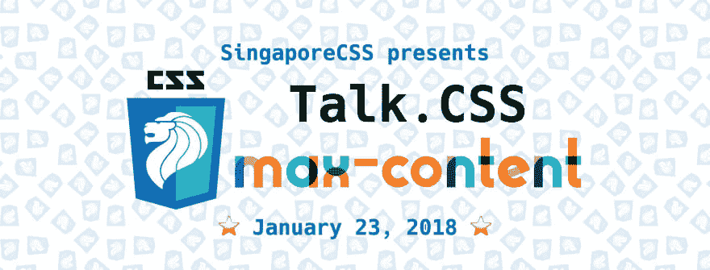
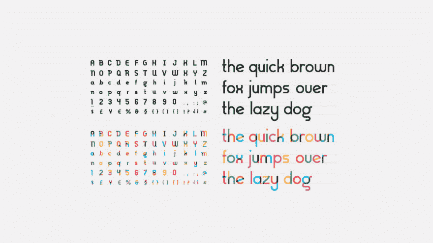
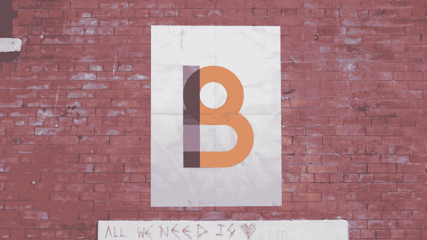
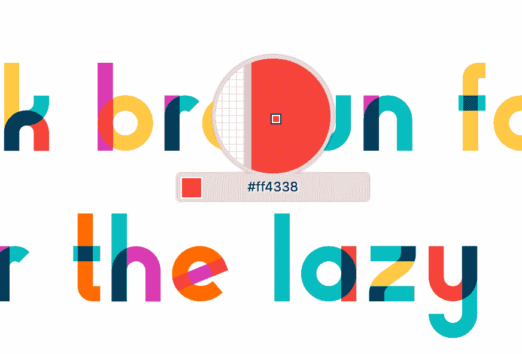
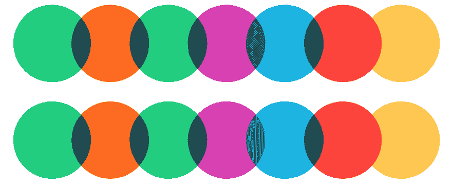
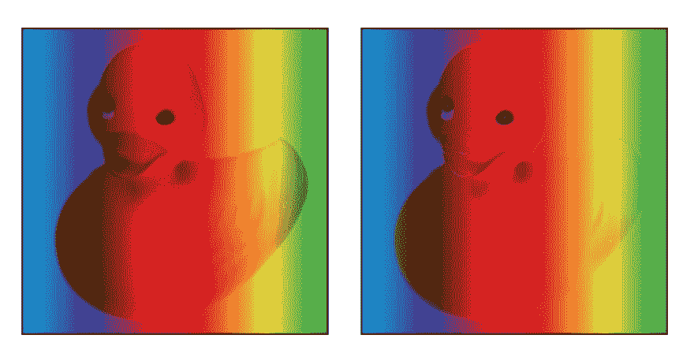
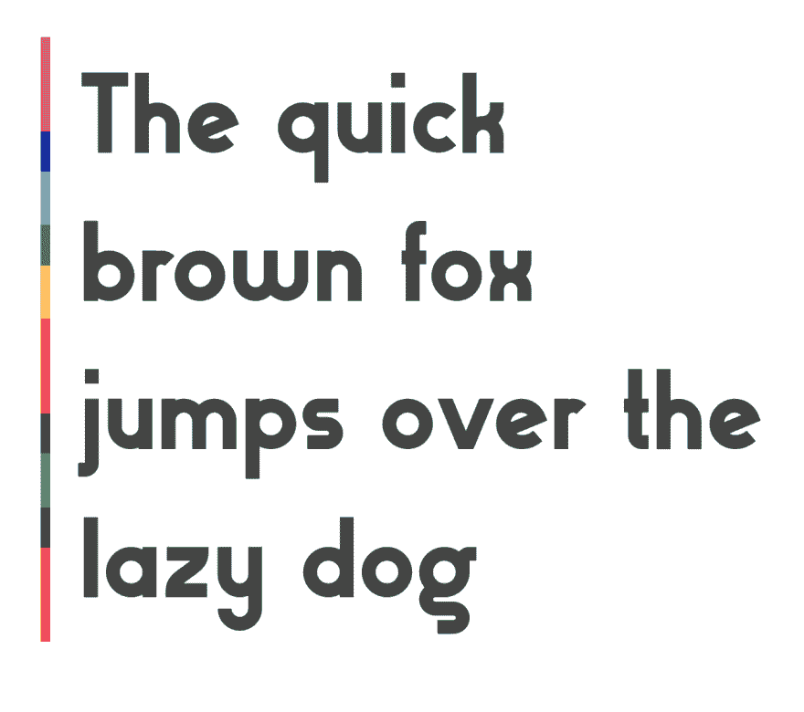
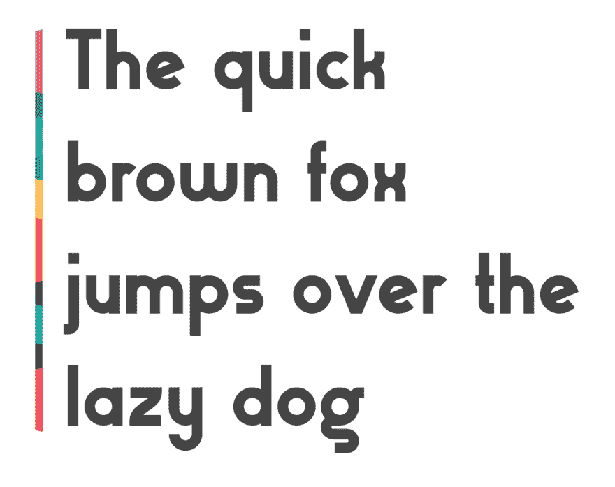

# 逆向工程吉尔伯特颜色的混合模式

> 原文：<https://dev.to/wgao19/reverse-engineering-the-blending-mode-of-gilbert-color-26j0>

我一直在为我的[演讲做准备。CSS](http://singaporecss.github.io) 本周谈论`mix-blend-mode`。与此同时，如果你碰巧遇到了这个叫做 SingaporeCSS 的可爱的小社区，甚至在我们的 facebook 群中，你会注意到这个横幅虽然可以追溯到 2018 年 1 月，但使用了一种有趣的显示字体。

[](https://res.cloudinary.com/practicaldev/image/fetch/s--bxOzO5sF--/c_limit%2Cf_auto%2Cfl_progressive%2Cq_auto%2Cw_880/https://paper-attachments.dropbox.com/s_3FE563BBEB57460B63252FD6A500CCA308DF4EC01CA05F49A0596CC2D75D6AD8_1554523322197_image.png)

这种字体是为了纪念设计彩虹旗的吉尔伯特·贝克。

[](https://res.cloudinary.com/practicaldev/image/fetch/s--9OMjt85M--/c_limit%2Cf_auto%2Cfl_progressive%2Cq_auto%2Cw_880/https://static1.squarespace.com/static/58ed2d6244024330c0a58707/t/5940481b725e252076c4cddf/1497384996193/%3Fformat%3D2500w)

它是一种[彩色字体](https://www.w3.org/TR/css-fonts-4/#color-font-support)，你可以从 [Type With Pride 网站](https://www.typewithpride.com/)下载彩色版和普通版。

[](https://res.cloudinary.com/practicaldev/image/fetch/s--zzQiDZnT--/c_limit%2Cf_auto%2Cfl_progressive%2Cq_auto%2Cw_880/https://static1.squarespace.com/static/58ed2d6244024330c0a58707/58ed2dbbf7e0abfc5d7ebb1c/58efdb79bebafbc81fb63c3e/1492114301044/TypeWithPride-11.jpg%3Fformat%3D2500w)

除了难以置信的美丽，你不能错过笔画交叉点的混合效果。嘿，记得我演讲的主题吗？这个 CSS 属性`mix-blend-mode`就是关于颜色如何混合的。所以现在它成了我幻灯片的字体。

[](https://res.cloudinary.com/practicaldev/image/fetch/s--mcFy8_53--/c_limit%2Cf_auto%2Cfl_progressive%2Cq_auto%2Cw_880/https://static1.squarespace.com/static/58ed2d6244024330c0a58707/58ed9e0686e6c03e56a1e29d/58ee39a39de4bb85a0b9ec13/1492007334100/B.jpg%3Fformat%3D2500w)

## 弄清楚混合模式

为`mix-blend-mode`上的演讲做准备的一个副作用是，你不能停下来，而是想知道你看到的每个颜色交叉点上使用的是什么混合模式(或者没有混合模式)。在准备幻灯片的过程中，我越来越想知道我选择的字体是什么。我是说，如果有人问这个问题呢？

我在看颜色方面没有受过很好的训练。仅凭肉眼我无法分辨颜色是如何混合的。我想既然我正在学习一些关于混合模式的东西，为什么不试试我的运气来弄清楚呢？

现在，逆向工程需要对 [CSS 颜色](http://www.w3.org/TR/css-color-4/)和[混合](https://www.w3.org/TR/compositing-1/#blending)有所了解，我将对这个过程进行总结:

*   16 种混合模式中的 12 种是在 sRGB 色彩空间中计算的*可分离混合模式*。*可分离*意味着合成颜色的 R、G 和 B 通道是单独计算的。其他 4 个是*不可分的*，在 HSL 表示中计算。
*   计算使用每种颜色的分数值，即“0xFF”或 255 表示 1，“0x80”或 128 表示 0.5。

你可以查看[规范](https://www.w3.org/TR/compositing-1/#blending)中 CSS 指定混合模式的完整列表。

不能保证我能在可分离的混合模式中找到我的匹配，甚至可能没有任何 CSS 指定的混合模式。字体的设计者可以为笔画的交叉点选择任何颜色。谁知道呢🤷🏻‍♀️

尽管如此，我还是把印刷工最喜欢的一句话放到了白色背景上，开始这样做:

[](https://res.cloudinary.com/practicaldev/image/fetch/s--tdC71CcR--/c_limit%2Cf_auto%2Cfl_progressive%2Cq_auto%2Cw_880/https://paper-attachments.dropbox.com/s_3FE563BBEB57460B63252FD6A500CCA308DF4EC01CA05F49A0596CC2D75D6AD8_1554525398416_image.png)

这里是颜色

```
--orange: rgb(255, 107, 0); /* #ff6b00 */
--red: rgb(255, 67, 56); /* #ff4338 */
--green: rgb(5, 206, 124); /* #05ce7c */
--blue: rgb(0, 179, 227); /* #00b3e3 */
--magenta: rgb(218, 58, 179); /* #da3ab3 */
--yellow: rgb(255, 200, 67); /* #ffc843 */ 
```

基本上，我已经决定尝试每个混合功能，看看哪个匹配。我想先检查一下是否有简单的淘汰。

例如，Normal 说根本没有混合。

变暗和变亮分别选择较暗或较亮的通道值。因此，结果应该有数字匹配的组成颜色的通道之一，但没有除了零。

第一个具有重要混合计算的是 multiply，它本质上是将颜色乘以通道。小学数学告诉我们，零乘以任何数等于零。因此，我尝试了几种包含两种零颜色的组合:

从颜色选择器中读取:

*   绿色 x 橙色:`#055600`或`rgb(5, 86, 0)`
*   蓝色 x 红色:`#002f32`或`rgb(0, 47, 50)`
*   蓝色 x 洋红色:`#00299f`或`rgb(0, 41, 159)`

然后我算了一下，四舍五入到最接近的整数:

*   绿色橙色

R: (5 / 255) * (255 / 255) = 5 / 255

G: (206 / 255) * (107 / 255) = 86 / 255

B: (227 / 255) * (0 / 255) = 0 / 255

我得到… `rgb(5, 86, 0)`这正是交集！我试了几个组合，都匹配。😱我是不是运气太差了？

现在，用一个中国术语来说，胆大心细这意味着你应该大胆但小心，是数学家的美德。我应该验证它确实是乘法，而不是别的。

还有几个可以用肉眼排除，也可以用简单的数学很容易地验证。如果你感兴趣，我在 CodePen 上也有这个调色板:

[https://codepen.io/wgao19/embed/zXrpEG?height=600&default-tab=result&embed-version=2](https://codepen.io/wgao19/embed/zXrpEG?height=600&default-tab=result&embed-version=2)

它不是 screen，因为用 0 屏蔽任何颜色都会恢复颜色。
不是色彩闪避，因为 B？(x，1)不会得出 1。
不是烧色，因为 B？(1，x)不会得出 1。
……我最终意识到，毕竟没有那么多交集。所有这些都是乘法运算，真的。QED。虽然，这并不保证将来有任何参考...设计师可能会改变主意🤷🏻‍♀️

**乘暗**

虽然暗化很容易被逻辑消除，但我注意到乘法和暗化在这种情况下看起来非常相似。CodePen 上并排比较可能会给你一个想法，让我再贴一张截图:

[](https://res.cloudinary.com/practicaldev/image/fetch/s--oIAcu5bs--/c_limit%2Cf_auto%2Cfl_progressive%2Cq_auto%2Cw_880/https://paper-attachments.dropbox.com/s_3FE563BBEB57460B63252FD6A500CCA308DF4EC01CA05F49A0596CC2D75D6AD8_1554577534840_image.png)

对于单色，由于“变暗”和“倍增”在每个颜色通道中都产生较弱的值，因此它们很可能会产生非常相似的结果颜色。当应用于照片或任何具有更复杂轮廓和纹理的图形时，它们有很大的不同。因为乘法是线性运算，所以它保留了两个图形的纹理。但是变暗只是在每个通道上选取较小的值，因此不能保证任何一面的纹理都能保留。

[](https://res.cloudinary.com/practicaldev/image/fetch/s--kkkGOlZ3--/c_limit%2Cf_auto%2Cfl_progressive%2Cq_auto%2Cw_880/https://paper-attachments.dropbox.com/s_3FE563BBEB57460B63252FD6A500CCA308DF4EC01CA05F49A0596CC2D75D6AD8_1554577656208_image.png)

**绕道**

这个过程走了一段弯路。我最初玩的是 Chrome，但数字和我的计算从来不匹配。它们很接近，但是结果值总是相差几个整数。当玩`mix-blend-mode: screen`游戏时，他们经常相差两位数😲

我差点以为我一点也不了解 mix 混合模式。原来 Chrome 中有一个 [bug](https://bugs.chromium.org/p/chromium/issues/detail?id=880059&q=mix-blend-mode&colspec=ID%20Pri%20M%20Stars%20ReleaseBlock%20Component%20Status%20Owner%20Summary%20OS%20Modified) 可能与此有关。永远不要太自信，也不要太确定错误在你😬。另一方面，Firefox 愉快地吐出了我的结果，除了几个例外，最多是四舍五入。看起来 Firefox 正在舍入，我正在进行传统的数学舍入。

## 块引用边框融合

我想我应该做些事情来使我的幻灯片的主题与字体设计相匹配。既然我现在已经知道了它们颜色的秘密，为什么不把这些知识用于自由人呢？

我想为我的块引用元素创建一个混合的边界，我将使用颜色来覆盖边界，使它们相互交叉，并为交叉点使用匹配的混合模式。

我决定使用多张背景图片，并使用`background-blend-mode: multiply`。

最初，我在考虑用一些重叠的背景线性渐变图像来叠加。

```
blockquote {
  background-image: linear-gradient(
      to bottom,
      var(--magenta) 0,
      var(--magenta) 100%
    ), linear-gradient(to bottom, var(--blue) 0, var(--blue) 100%),
    linear-gradient(to bottom, var(--yellow) 0, var(--yellow) 100%),
    linear-gradient(to bottom, var(--orange) 0, var(--orange) 100%),
    linear-gradient(to bottom, var(--green) 0, var(--green) 100%),
    linear-gradient(to bottom, var(--red) 0, var(--red) 100%);
  background-size: 8px calc(100% / 4.5); /* to create the overlap */
  background-repeat: no-repeat;
  background-position-y: 0, calc(100% / 5), calc(200% / 5), calc(300% / 5), calc(
      400% / 5
    ), calc(500% / 5);
  background-blend-mode: multiply;
} 
```

他们成功了。但是它们看起来相当无趣..

[](https://res.cloudinary.com/practicaldev/image/fetch/s--dfPLqyTR--/c_limit%2Cf_auto%2Cfl_progressive%2Cq_auto%2Cw_880/https://paper-attachments.dropbox.com/s_3FE563BBEB57460B63252FD6A500CCA308DF4EC01CA05F49A0596CC2D75D6AD8_1554575118585_image.png)

这是个人的，但是我在渐变方向上添加了一个调整，这让我非常高兴。最终结果如下所示:

[](https://res.cloudinary.com/practicaldev/image/fetch/s--fYMFhISS--/c_limit%2Cf_auto%2Cfl_progressive%2Cq_auto%2Cw_880/https://paper-attachments.dropbox.com/s_3FE563BBEB57460B63252FD6A500CCA308DF4EC01CA05F49A0596CC2D75D6AD8_1554569507931_image.png)

你可以在这个代码栏中查看实现。注意颜色部分只在支持颜色字体的[浏览器上起作用。](https://www.colorfonts.wtf/)

[https://codepen.io/wgao19/embed/qwNgMj?height=600&default-tab=result&embed-version=2](https://codepen.io/wgao19/embed/qwNgMj?height=600&default-tab=result&embed-version=2)

## 到下次🤞

如果你这个月碰巧在新加坡，并且对彼此感兴趣的设计师或前端开发人员，也许可以来谈谈。CSS #38 来听我谈谈这个叫做 mix blend mode 的 CSS 属性。或者如果你受到这个小作品的启发，创造了一些有趣的东西，请[展示并告诉](https://airtable.com/shrahPiYG3oCtOM6e?fbclid=IwAR0mw6xqqkXJVoi-YS7yQ8ITEWyfBcasHoyWSXznScKQWjM1IUYU3cl4vo0)我们👀

手指交叉为 CodePen 回到形状虽然。

## 参考文献

*   [CSS 合成和混合模块级别 1](https://www.w3.org/TR/compositing-1)
*   [CSS 字体模块第四级](https://www.w3.org/TR/css-fonts-4)
*   [说话。CSS](http://singaporecss.github.io)
*   [自豪地打字](https://www.typewithpride.com/)
*   [颜色字体](https://www.colorfonts.wtf/)