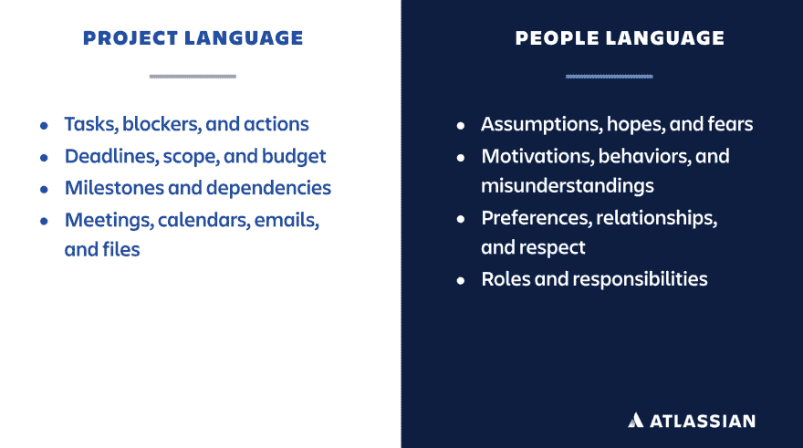

# 用这些新的技术来更新你的回顾

> 原文：<https://dev.to/atlassian/revitalize-your-retrospectives-with-these-fresh-techniques-42ml>

劳拉是一位经验丰富的项目经理，她对回顾展了如指掌。因此，当她最喜欢的技术失去光芒时，她立即认出了这些迹象。“团队提出的话题越来越少，我们也不再进行实质性的讨论。甚至上座率也开始下降。”

当你的“可靠的”回顾形式不可避免地变得陈旧时，你需要一个锦囊妙计来使事情焕然一新，并让你的团队保持参与。在过去和现在队友的帮助下，我已经收集了一些有趣的变化来融入其中。

## 重大事件

找到你能找到的最大的白板，在整个白板上画一条水平线。这是你的时间线。请团队成员来标记发布、重大胜利、重大失败、团队成员的变化…任何对你的团队有意义的事情。在你的回顾开始时，花 10-15 分钟在这上面来刷新你的记忆，并为接下来的会议做好准备。

## 开始、停止、继续

如果你的团队一想到谈论他们的感受就有点紧张，那么通过关注他们将会做的事情来让他们放松。这种变化具有“面向行动”的基因，因此它经常受到高度务实的人们的欢迎。如果你在整个回顾中使用这种形式，在开始、停止和继续各花 10 分钟。对于更长的回顾会议，您也可以在最后使用“闪电回合式”来确定行动项目和所有者。

## 喜欢、厌恶、匮乏、博学

过去一年你喜欢什么？你讨厌什么？你缺少(或渴望)什么？最重要的是，你学到了什么？每个问题留出 10 分钟时间。另外,“4Ls”技术对于个人回顾也很有用。我们的常驻工作未来学家 Dom Price 大约每个季度都会浏览一次 4l。“让自己对采取行动和实际做出改变负责是关键，”他说。“我不允许自己添加一个‘渴望的’，直到我删除了一个‘厌恶的’。”

## 像人类一样说话

谈论项目机制要比关系和沟通容易得多。但是许多问题与任务无关，所有事情都与人际交往有关。在这种情况下，真正的*对话不是用项目语言，而是用人民语言*。

保留一部分回顾来讨论人际关系。人们的假设和期望是什么？误区在哪里？人们对他们的工作感觉如何？为什么同样的改善行动一次又一次出现？

## [5 个为什么](https://www.atlassian.com/team-playbook/plays/5-whys)

当你确定了你想在未来避免的痛苦时刻时，问问为什么会失败。然后，当你就原因达成一致时，问为什么*会是这种情况。诸如此类。在问完“为什么？”几次之后，根本原因和长期解决方案就很清楚了。为您计划探索的每个难点留出 5-10 分钟的时间。*

## 圆点投票

如果出现了大量改进的想法，投票决定你将在近期优先考虑哪些行动项目。从在白板上列出它们开始。然后，让每个人拿起记号笔，在他们希望列在列表首位的三个想法上画点。与你的团队讨论结果，向他们提出诸如“为什么这个想法比其他的更有价值？”以及“如果我们不这样做，会发生什么？”最后，为投票最多的项目选择所有者和截止日期。

## 作证

如果时间允许(并且团队成员愿意)，让每个参与者分享他们认为团队在回顾中讨论的最重要的事情，以及为什么它对他们来说很突出。这有助于确保所有团队成员平等地做出贡献，并促进更深入的讨论。

## 傻帽

邀请群里的每个人都戴上可笑的帽子来复古。这有助于鼓励——开个玩笑！_ 没有什么严肃的理由要这样做。但是如果你喜欢愚蠢的帽子，不要让这阻止你。再说:一起玩的团队就呆在一起。

## 鸣谢

当你忙着拿$#的时候！完成后，很容易让好事不被注意和感谢。在结束时留出 5 分钟来获得同事间的称赞——即使是一些小事情，比如给出有用的反馈或者做一个传声筒。回顾到现在，你可能已经进行了一些激烈的(也许不舒服的)讨论，所以使用这种技巧在高潮中结束会议。

## 这些回顾技术不能解决的问题(以及你能做什么)

公平地说，如果有更深层次的问题困扰着你的团队，融入新奇的活动可能是一个权宜之计。另一位经验丰富的 Atlassian 项目经理 Penny 说:“我多次看到团队参与度下降，原因有很多，但都是因为团队不再相信回顾是有用的”。她指出了一些可能的原因。

最糟糕的情况是，团队感觉他们在回顾中的讨论被用来反对他们。这是个坏消息，但你可以通过在会议记录中不提谁说了什么来创造一个安全的空间。在极端情况下，你可能选择完全不记笔记，或者要求经理或利益相关者离开一两次会议。

或者，如果从回顾中得出的行动项目没有产生影响，团队可能会感到沮丧。他们是不是野心太大，或者尝试了太多可能相互矛盾的改变？通过做一些小的改变，并把它们当作实验，你可能会获得更大的成功。如果团队对进展缓慢感到沮丧，帮助他们管理他们的期望，并通过庆祝小的胜利来建立动力感。

处于“紧张状态”的团队可能会抵制回顾，因为他们觉得自己现在太忙了。一个已经有一个可靠的回顾游戏的团队可能无论如何都会进行回顾，并利用它作为一个机会来找出如何减轻现在的压力并在未来避免它。也就是说，有时我们需要与利益相关者和管理层合作，以确保我们正在培养一个团队能够做出改进的环境，即使最后期限即将到来。

## 持续改进为赢

请记住，还有其他方法可以改变你的回顾游戏。偶尔在户外举行，或者在不同的房间举行。包括来自相邻团队的人，如果他们深入参与了你将要思考的工作。

对于劳拉和她的团队来说，改变节奏带来了变化。“我们把他们隔开了一点，现在团队带着更多的话题和解决问题的欲望走进来。”这种持续改进的精神对辅导员来说也很重要。不断尝试，不断进步，不断胜利。

帖子[用这些新鲜的技术振兴你的回顾](https://www.atlassian.com/blog/teamwork/revitalize-retrospectives-fresh-techniques)首先出现在[大西洋博客](https://www.atlassian.com/blog)上。