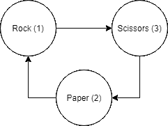

# 使用模运算的石头剪刀布

> 原文：<https://dev.to/renegadecoder94/rock-paper-scissors-using-modular-arithmetic-2j4p>

最近，在我的 Java 课程中，学生们正在完成一项类似于石头剪刀布的作业，其中一个学生提出了一个聪明的问题:我们可以用数字来比较每个选择吗？思考片刻后，我意识到我们完全可以使用模运算实现石头剪刀布。

## 石头剪刀布规则

在我们进入解决方案之前，我发现列出需求总是有用的。特别是，什么是石头剪子布，我们如何在电脑游戏中对其建模？

我们先说清楚，石头剪刀布是一个一对一的策略游戏，玩家同时选择石头、布或剪刀。获胜者是根据不同选择之间的关系决定的:布战胜石头，石头战胜剪刀，剪刀战胜布。

为了在程序中模拟这种类型的游戏，我们必须设定一些基本规则。我们将使用数字 1、2 和 3，而不是石头、布和剪刀。这允许我们避免用户输入问题。例如，谁想处理弦乐的所有变奏(即摇滚、摇滚、摇滚等。)?

此外，我们将设置程序，以便用户可以玩电脑。为此，我们将让程序生成一个介于 1 和 3 之间的随机数，同时向用户请求一个介于 1 和 3 之间的数。如果用户输入一个无效的号码，他们会自动输。

有了这些规则，我们应该能够实现一个相对简单的剪刀石头布的解决方案。

## 石头剪刀布挑战

当然，以我的经验来看，实现石头剪刀布其实没那么容易。事实上，我已经看到很多学生因为很多原因而努力编写程序。

在某些情况下，学生刚刚学会[控制流](https://therenegadecoder.com/code/control-flow-syntax-and-design-in-java/)，所以他们努力设置他们的条件。其他时候，他们很难简化他们的解决方案，所以到处都是这种情况——因此如果可能的话，我尽量避免处理用户输入。

在后一种情况下，我发现许多学生希望明确涵盖所有可能的情况:

1.  纸张与纸张
2.  纸对石头
3.  剪刀和布
4.  摇滚对摇滚
5.  石头对纸
6.  石头大战剪刀
7.  剪刀对剪刀
8.  剪刀和布
9.  剪刀 vs 石头
10.  错误输入

很快，学生们就会意识到写出 10 个 if 语句是很痛苦的。到了第五个，他们会开始怀疑自己是不是做错了什么。在这一点上，他们通常会修改他们的策略，减少他们的测试用例，并可能点燃他们对计算机科学的热情。毕竟，我总是发现降低复杂性是一项真正有趣且有益的任务。当然，并不是每个人都像我一样。

无论如何，许多学生会注意到在上面的解决方案中有一些多余的案例。特别是，他们可能会发现，他们可以将所有三个捆绑案例简化为一个案例(即`choice == choice`)。不幸的是，这只能把十个案子减少到八个。

那么，有没有更好的办法呢？嗯，据我的一个学生说有，但我们还没到那一步！相反，我想花些时间深入研究代码。

## 石头剪子布解

当我第一次解决这个问题时，我正在[编写一个 JUnit 测试用例](https://github.com/jrg94/CSE1223/blob/b53c380a8ec9f6fe9e50e59c285e05b84780a9f3/Projects/Project04/Project04Test.java#L189-L212)，这样我可以自动给学生评分。如您所见，我采用了上面的八种情况，但是为了代码清晰起见，我使用了枚举。当我可以这么称呼它的时候，为什么要用 1 来称呼它呢？

在进一步思考这个问题后，我确信有无数更干净的解决方案。例如，如果我回去重新编写代码，我可能会填充一些查找表。这样，我可以使用用户选择和计算机选择作为矩阵中的索引。我只需要从表中检索结果，而不是编写八个 if 语句。

也就是说，我想花点时间介绍一些典型的解决方案。出于我自己的理智，所有的解决方案都将使用 Python 而不是 Java，但想法是一样的。

### 通用样板文件

以下所有解决方案将共享一些相同的代码。为了避免复制样板文件，我们现在将讨论所有这些:

```
import random
import sys

# Create number to choice mapping mapping = {
  1: "Rock",
  2: "Paper",
  3: "Scissors"
}

# Generate computer choice pc_choice = random.randint(1, 3)
pc_choice_output = "I chose %s." % mapping[pc_choice]

# Request user choice try:
  user_choice = int(input("Choose Rock (1), Paper (2), or Scissors (3): "))
  user_choice_output = "You chose %s." % mapping[user_choice]
except (ValueError, KeyError):
  print(pc_choice_output)
  print("You chose nothing.")
  print("You lose by default.")
  sys.exit(0)

# Share choices print(pc_choice_output)
print(user_choice_output)

# Setup results i_win = "%s beats %s - I win!" % (mapping[pc_choice], mapping[user_choice])
u_win = "%s beats %s - you win!" % (mapping[user_choice], mapping[pc_choice])
tie = "Tie!" 
```

Enter fullscreen mode Exit fullscreen mode

在这个代码片段中，我们从导入`random`库开始，我们用它来生成计算机玩家的随机选择(稍后会详细介绍)。除了随机库之外，我们还导入了`sys`库，我们将使用它在错误输入时退出:

```
import random
import sys 
```

Enter fullscreen mode Exit fullscreen mode

之后，我们创建一个数字到字符串的映射，将我们的数字选择映射到它们所代表的字符串——石头、布、剪刀:

```
mapping = {
  1: "Rock",
  2: "Paper",
  3: "Scissors"
} 
```

Enter fullscreen mode Exit fullscreen mode

然后，我们使用之前引用的随机库生成计算机的选择。当我们在那里的时候，我们创建了一个字符串，它将指示计算机给用户做了什么选择:

```
pc_choice = random.randint(1, 3)
pc_choice_output = "I chose %s." % mapping[pc_choice] 
```

Enter fullscreen mode Exit fullscreen mode

接下来，我们来到一个 try/except 块，我们用它来做一些粗略的数据验证。特别是，我们希望确保用户输入了有效的数字。如果用户输入了超出我们预期范围的数字，或者他们根本没有输入数字，我们希望能够检测到这一点。如果这样做，我们会打印一个漂亮的对话框，导致用户丢失，从而终止程序:

```
try:
  user_choice = int(input("Choose Rock (1), Paper (2), or Scissors (3): "))
  user_choice_output = "You chose %s." % mapping[user_choice]
except (ValueError, KeyError):
  print(pc_choice_output)
  print("You chose nothing.")
  print("You lose by default.")
  sys.exit(0) 
```

Enter fullscreen mode Exit fullscreen mode

一旦两个玩家都有了有效的选择，我们就可以把它们打印给用户:

```
print(pc_choice_output)
print(user_choice_output) 
```

Enter fullscreen mode Exit fullscreen mode

最后，我们设置了一些结果字符串，稍后我们将填充这些字符串:

```
i_win = "%s beats %s - I win!" % (mapping[pc_choice], mapping[user_choice])
u_win = "%s beats %s - you win!" % (mapping[user_choice], mapping[pc_choice])
tie = "Tie!" 
```

Enter fullscreen mode Exit fullscreen mode

如果我们将解决方案运行到这一步，我们可能会看到如下所示的内容:

```
Choose Rock (1), Paper (2), or Scissors (3): 2
I chose Rock.
You chose Paper. 
```

Enter fullscreen mode Exit fullscreen mode

同时，不成功的执行可能如下所示:

```
Choose Rock (1), Paper (2), or Scissors (3): 5
I chose Paper.
You chose nothing.
You lose by default. 
```

Enter fullscreen mode Exit fullscreen mode

在这一点上，我们能够深入了解输赢逻辑。

### 十案巨兽

如果我们想在 Python 中对所有十种情况建模，我们可以使用以下九个 If 语句(错误的输入已经被处理了):

```
# Share winner if pc_choice == 1 and user_choice == 1: # Rock vs. Rock
  print(tie)
elif pc_choice == 2 and user_choice == 2: # Paper vs. Paper
  print(tie)
elif pc_choice == 3 and user_choice == 3: # Scissors vs. Scissors
  print(tie)
elif pc_choice == 1 and user_choice == 2: # Rock vs. Paper
  print(u_win)
elif pc_choice == 1 and user_choice == 3: # Rock vs. Scissors
  print(i_win)
elif pc_choice == 2 and user_choice == 1: # Paper vs. Rock
  print(i_win)
elif pc_choice == 2 and user_choice == 3: # Paper vs. Scissors
  print(u_win)
elif pc_choice == 3 and user_choice == 1: # Scissors vs. Rock
  print(u_win)
else: # Scissors vs. Paper
  print(i_win) 
```

Enter fullscreen mode Exit fullscreen mode

当然，像这样的解决方案还有很多不足之处。例如，有大量的重复代码。以下各行在解决方案中各出现三次:

```
print(u_win)
print(i_win)
print(tie) 
```

Enter fullscreen mode Exit fullscreen mode

此外，当我们进行比较时，很难记住映射。因此，为了清楚起见，我添加了额外的注释。也就是说，让代码自己说话会好得多。

无论如何，这是一个完全有效的解决方案，但我认为我们可以做得更好。

### 八格伟岸

如前所述，我们可以通过合并所有平局场景将上述十种情况减少到八种:

```
# Share winner if pc_choice == user_choice: # Same choice
  print(tie)
elif pc_choice == 1 and user_choice == 2: # Rock vs. Paper
  print(u_win)
elif pc_choice == 1 and user_choice == 3: # Rock vs. Scissors
  print(i_win)
elif pc_choice == 2 and user_choice == 1: # Paper vs. Rock
  print(i_win)
elif pc_choice == 2 and user_choice == 3: # Paper vs. Scissors
  print(u_win)
elif pc_choice == 3 and user_choice == 1: # Scissors vs. Rock
  print(u_win)
else: # Scissors vs. Paper
  print(i_win) 
```

Enter fullscreen mode Exit fullscreen mode

在平局的情况下，我们知道用户和计算机做出了相同的选择，所以我们可以直接比较它们的值。因此，我们可以很快从顶部删除两个案例。

不幸的是，我们仍然有相当多的重复代码，但是减少这些情况要困难得多。虽然我们可能希望整合所有计算机获胜的案例，但我们并不清楚如何去做。

同样，我们可能会注意到，其中一些情况只是彼此相反(例如，石头与纸，纸与石头)。也许有某种方法可以合并这些案件，但还不清楚。

### 筑巢娃娃

减少重复代码的一种方法是引入一些嵌套的 if 语句:

```
# Share winner if pc_choice == user_choice:
  print(tie)
elif pc_choice == 1: # Rock
  if user_choice == 2: # Paper
    print(u_win)
  else: # Scissors
    print(i_win)
elif pc_choice == 2: # Paper
  if user_choice == 1: # Rock
    print(i_win)
  else: # Scissors
    print(u_win)
else: # Scissors
  if user_choice == 1: # Rock
    print(u_win)
  else: # Paper
    print(i_win) 
```

Enter fullscreen mode Exit fullscreen mode

不幸的是，这个解决方案并没有真正减少我们的代码。在某些方面，它实际上更令人困惑。我们能做些什么来减少一点代码吗？很高兴你问了！

### 模运算极简

当我第一次提出这个解决方案时，是因为一个学生提出了一个关于直接使用关系运算符(>、

*   摇滚==摇滚
*   纸张==纸张
*   剪刀==剪刀
*   石头>剪刀
*   岩石
*   纸张>岩石
*   纸
*   剪刀>布
*   剪刀

出于某种原因，这些关系似乎真的很直观。毕竟，剪刀比纸强，但比石头弱。所以，把它们想成数学量是有意义的。

问题是数字不像石头、布、剪刀那样显示出这种周期性。当然，三大于二，但一不大于三。那么，我们该怎么办？

事实证明，有一种叫做模的数学运算符可能会挽救这一天。出于我们的目的，模运算符将允许我们在三个选择之间建立这种循环关系。看一看:

```
# Share results if pc_choice == user_choice:
  print(tie)
elif (user_choice + 1) % 3 == pc_choice % 3:
  print(i_win)
else:
  print(u_win) 
```

Enter fullscreen mode Exit fullscreen mode

病例的大幅减少怎么样？在这里，我们从十种情况的最坏情况到仅仅四种情况(包括坏的输入情况)，但是它是如何工作的呢？

事实证明，我们必须小心选择的映射。在我们的例子中，赢发生在循环的一个方向，而输发生在另一个方向。换句话说，三打二，二打一，一打三:

[](https://res.cloudinary.com/practicaldev/image/fetch/s---9odrkRi--/c_limit%2Cf_auto%2Cfl_progressive%2Cq_auto%2Cw_880/https://thepracticaldev.s3.amazonaws.com/i/196oemkls19nsme8s7ui.png)

为了捕捉这种循环关系，我们使用以下条件:

```
(user_choice + 1) % 3 == pc_choice % 3 
```

Enter fullscreen mode Exit fullscreen mode

该表达式的左半部分计算循环中的下一个选择。如果用户选择 rock，表达式的值将为 2，因为(1 + 1) % 3 是 2。

如果循环中的下一个选择碰巧也是计算机的选择，我们知道用户已经输了。同样，如果循环中的下一个选择不是计算机的选择，我们知道我们一定赢了(假设我们已经测试了平局)。

有了这个解决方案，我们不再需要处理所有重复的代码。我们有一个错误输入的例子，一个平局的例子，一个胜利的例子，一个失败的例子。

### 简单的修改

在提出模块化解决方案后，我意识到仍然有简化解决方案的方法。特别是，**从零**开始映射会很有帮助。

我在之前的解决方案中遇到的一个问题是当用户选择纸张时。因此，表达式`(user_choice + 1) % 3`的值为零，这不是我们的选择之一。为了补偿，解决方案还必须评估计算机选择的模。以下完整的解决方案解决了这个问题:

```
import random
import sys

# Create number to choice mapping mapping = {
  0: "Rock",
  1: "Paper",
  2: "Scissors"
}

# Generate computer choice pc_choice = random.randint(0, 2)
pc_choice_output = "I chose %s." % mapping[pc_choice]

# Request user choice try:
  user_choice = int(input("Choose Rock (0), Paper (1), or Scissors (2): "))
  user_choice_output = "You chose %s." % mapping[user_choice]
except (ValueError, KeyError):
  print(pc_choice_output)
  print("You chose nothing.")
  print("You lose by default.")
  sys.exit(0)

# Share choices print(pc_choice_output)
print(user_choice_output)

# Setup results i_win = "%s beats %s - I win!" % (mapping[pc_choice], mapping[user_choice])
u_win = "%s beats %s - you win!" % (mapping[user_choice], mapping[pc_choice])
tie = "Tie!"

# Share winner if pc_choice == user_choice:
  print(tie)
elif (user_choice + 1) % 3 == pc_choice:
  print(i_win)
else:
  print(u_win) 
```

Enter fullscreen mode Exit fullscreen mode

而且，就是这样！我们用 40 行代码创建了一个使用模运算的命令行石头剪刀布游戏。

## 模运算的威力

写完这篇文章后，我上网看是否有人做过类似的事情，结果发现我不是第一个，很遗憾。从积极的一面来看，有很多关于这个解决方案为什么有效的信息。

事实证明，有一种不同的表达方式可以更好地抓住不同选择之间的关系:

```
(user_choice - pc_choice) % 3 
```

Enter fullscreen mode Exit fullscreen mode

根据这个表达式，我们有三种情况:

*   0(平局)
*   1(用户获胜)
*   2(计算机获胜)

我们甚至可以将这个解决方案扩展到任意数量的选择。有一个游戏我见过几次，是石头剪刀布蜥蜴史波克。在这种情况下，我们将使用值 0 到 4 对五个选项进行编码，并使用下面的表达式确定获胜者:

```
(user_choice - pc_choice) % 5 
```

Enter fullscreen mode Exit fullscreen mode

根据这个表达式，我们仍然有三种情况:

*   0(平局)
*   1，2(用户获胜)
*   3，4(计算机获胜)

换句话说，差额的前半部分导致用户赢，而差额的后半部分导致用户输。

正如我们所看到的，这种解决方案可以扩展到任意数量的选择，效率惊人。我们只需要处理相同的三个场景，而不是写出选择数量的平方。这就是模运算的威力吗？

## 分享你的故事

尽管我不是第一个用模运算解决石头剪刀布的人，但我真的认为这很酷也很有趣，我希望你也是。

如果你知道任何复杂的问题有这样一个优雅的解决方案，请在评论中告诉我们。我对探索这类问题的可能模式很感兴趣。也许我们可以从一些例子中收集到一些减少分支的技巧。

无论如何，再次感谢您花时间阅读我的一篇文章。如果你喜欢你所读的，考虑把它传给一个朋友。口口相传对我有很大帮助。

既然你在这里，我想是时候提一下我有一个名为[叛离的编码者](https://therenegadecoder.com/)的网站了。你可以在 [dev.to](https://dev.to) 上找到大部分编码内容，但我也有一些仅供会员使用的内容，涵盖了我的博士之旅、我的教学经历、我的行业经历和我的个人生活。如果这些听起来很有趣，或者你只是想得到我的时事通讯，请随时[注册](https://therenegadecoder.com/members/)。

下次见！