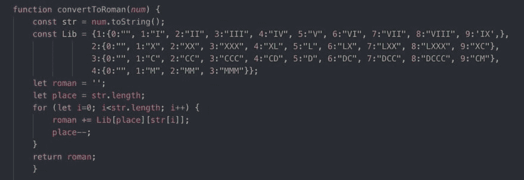

# 罗马数字转换器

> 原文：<https://dev.to/pickleat/roman-numeral-converter-2in1>

至少可以说，我的编码教育之旅有点脱节。我已经停止浏览免费代码营、CS50、其他教程、书籍，只是和聪明人一起闲逛。我的目标是回去拿一些我今年跳过的认证，今天在 freeCodeCamp 上解决了“罗马数字转换器”。我很想知道别人是怎么解决这个问题的。因为这只是我想到的第一个主意，我相信还有很多其他方法可以实现它！

你的解决方案有哪些优点和缺点？

下面是我的: 