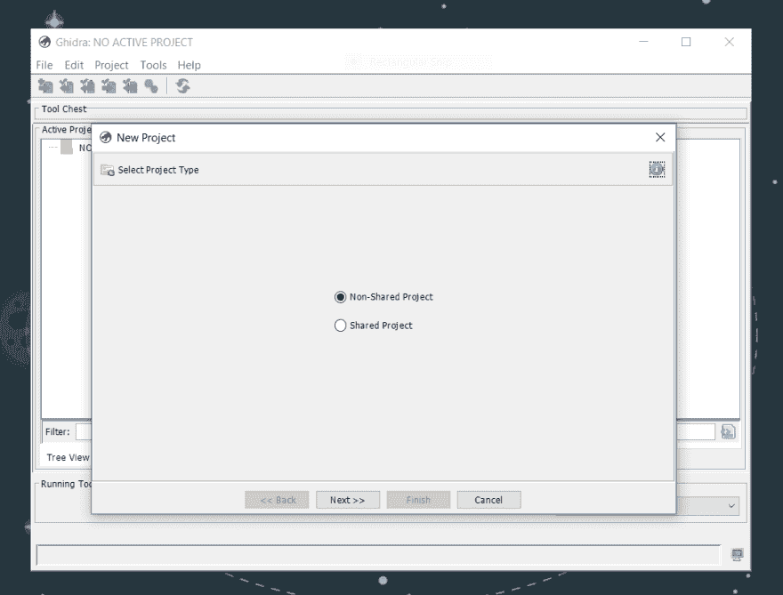
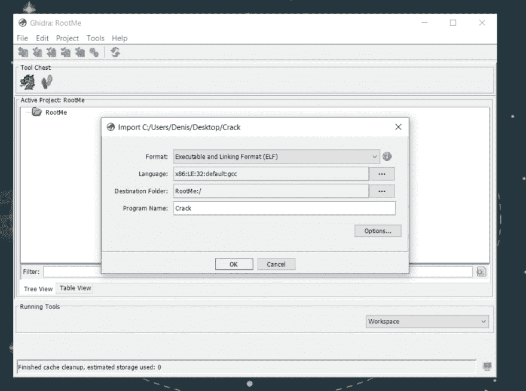
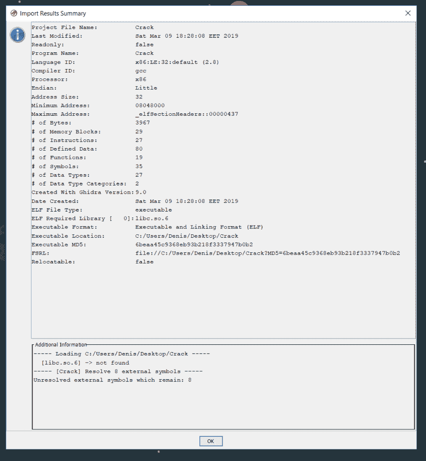
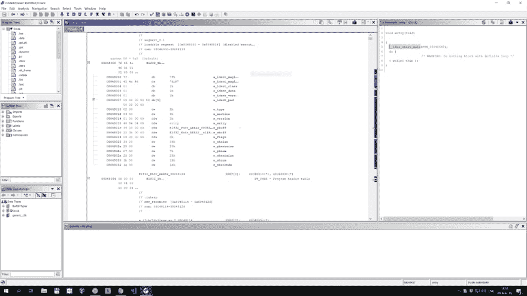
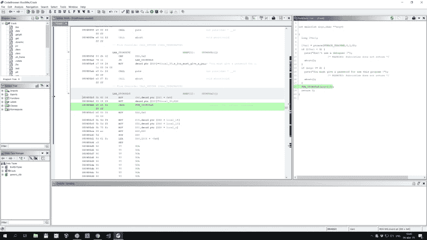
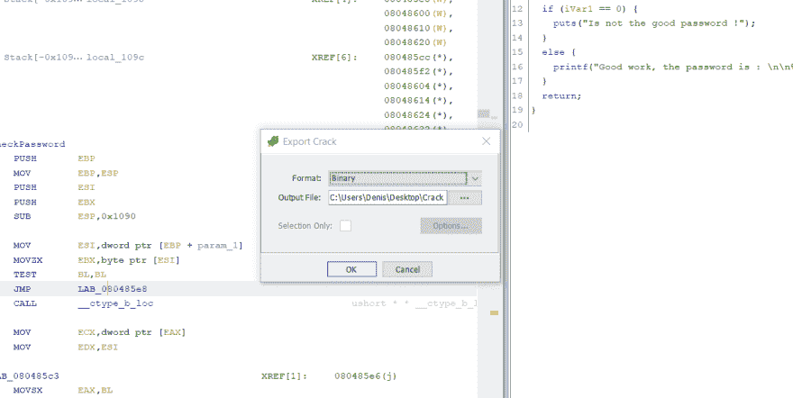

# 根我:与国家安全局的吉德拉 ELF-CrackPass

> 原文：<https://dev.to/nuculabs_dev/root-me-elf-crackpass-with-nsas-ghidra-403o>

你好！

我最近玩了一会儿 g hidra T1，这是一个逆向工程工具，最近由美国国家安全局开源。官网对该工具的描述是:

> 软件逆向工程(SRE)工具套件，由美国国家安全局研究局开发，用于支持网络安全任务

我刚刚开始我的逆向工程生涯，我没有做过任何高级的东西，我不知道像这样的专业工具会有什么功能，如果你想了解高级的 Ghidra 功能，我很抱歉。:/

在这篇文章中，我将尝试解决我在网站 [root-me](https://www.root-me.org/) 上发现的一个简单的 crackme 挑战。我正在解决的挑战叫做[ELF–crack pass](https://www.root-me.org/en/Challenges/Cracking/ELF-CrackPass)，如果你想自己尝试，那么你应该考虑不要读这篇文章，因为我会破坏你的挑战。

我们开始吧！我打开 Ghidra 并创建了一个新项目，我称之为 RootMe。

[](https://res.cloudinary.com/practicaldev/image/fetch/s--SQZ_OvXI--/c_limit%2Cf_auto%2Cfl_progressive%2Cq_auto%2Cw_880/https://thepracticaldev.s3.amazonaws.com/i/cboe9a15o89a6y67ow1u.png)

然后，我通过将挑战文件拖动到项目文件夹来导入它，我将使用默认值。

[](https://res.cloudinary.com/practicaldev/image/fetch/s--Owed4Wm0--/c_limit%2Cf_auto%2Cfl_progressive%2Cq_auto%2Cw_880/https://thepracticaldev.s3.amazonaws.com/i/tapdmlfvird4y0uufvat.png)

在得到一些关于二进制文件的提示后，我按 OK，选择文件并双击它。这将打开 Ghidra 的代码浏览器实用程序，并询问我是否要分析该文件，然后我按“是”并继续使用默认值。

导入文件后，我们得到一些关于二进制文件的信息。按 OK，关闭这个窗口，然后双击我们导入的文件，打开 Ghidra 的代码浏览器实用程序。当提示我分析二进制文件并继续使用默认值时，我选择 Yes。

[](https://res.cloudinary.com/practicaldev/image/fetch/s--x8ode7jL--/c_limit%2Cf_auto%2Cfl_progressive%2Cq_auto%2Cw_880/https://thepracticaldev.s3.amazonaws.com/i/o2u828pxowz8vfe2lcsx.png)

代码浏览器相当方便。在左边的面板中我们可以看到反汇编视图，在右边的面板中可以看到反编译视图。

Ghidra 直接显示 ELF 头信息和二进制文件的入口点，双击入口点后，分解器视图跳转到入口函数。现在我们可以成功地识别主函数，我将其重命名为 main，如果该工具能够尝试自动检测主函数并相应地重命名它，那就太好了。

[](https://res.cloudinary.com/practicaldev/image/fetch/s--xw1_JI7k--/c_limit%2Cf_auto%2Cfl_progressive%2Cq_auto%2Cw_880/https://thepracticaldev.s3.amazonaws.com/i/d5dbl20f8xslo39qn147.png)

在分析主函数之前，我想改变它的签名。我将返回类型改为 int，并更正了参数的类型和名称。这一改变已经在反编译视图中生效。这很酷！

反编译视图中突出显示的一行也会在汇编视图中突出显示。

[](https://res.cloudinary.com/practicaldev/image/fetch/s--tnwAed9b--/c_limit%2Cf_auto%2Cfl_progressive%2Cq_auto%2Cw_880/https://thepracticaldev.s3.amazonaws.com/i/jpcf6k3577solprf7gvg.png)

让我们探索一下 FUN_080485a5 函数，我将把它重命名为 CheckPassword。

CheckPassword 函数的内容可以在下面找到。我已经直接从 Ghidra 的反编译视图中复制了代码，这是许多这种类型的工具所缺乏的一个简洁的特性！能够复制汇编和代码是一个很好的特性！

```
void CheckPassword(char *param_1)
 {
   ushort **ppuVar1;
   int iVar2;
   char *pcVar3;
   char cVar4;
   char local_108c [128];
   char local_100c [4096];
   cVar4 = param_1;   
    if (cVar4 != 0) {    
      ppuVar1 = __ctype_b_loc();     
      pcVar3 = param_1;     
      do {       
        if (((byte )(ppuVar1 + (int)cVar4) & 8) == 0) {
         puts("Bad password !");
                     /* WARNING: Subroutine does not return */
         abort();
       }
       cVar4 = pcVar3[1];
       pcVar3 = pcVar3 + 1;
     } while (cVar4 != 0);
   }
   FUN_080484f4(local_100c,param_1);
   FUN_0804851c(s_THEPASSWORDISEASYTOCRACK_08049960,local_108c);
   iVar2 = strcmp(local_108c,local_100c);
   if (iVar2 == 0) {
     printf("Good work, the password is : \n\n%s\n",local_108c);
   }
   else {
     puts("Is not the good password !");
   }
   return;
 } 
```

Enter fullscreen mode Exit fullscreen mode

看了一下代码后，我得出了以下结论。带有 if 的块检查用户是否提供了密码，并检查所提供的密码是否是有效字符或其他什么。我不确定它在检查什么，但是 __ctype_b_loc()的文档是这样说的:

> __ctype_b_loc()函数将返回一个指针，指向当前语言环境中的字符数组，该数组包含当前字符集中每个字符的特征。该数组应包含总共 384 个字符，并且可以用任何有符号或无符号字符进行索引(即索引值在-128 和 255 之间)。如果应用程序是多线程的，数组应该是当前线程的本地数组。

不管怎样，这段代码不值得花时间，因为它不会以任何方式修改我们的密码，它只是验证密码，我们可以跳过这种验证。

下一个调用的函数是 FUN_080484f4。看它的代码，我们可以看出它只是一个定制的 memcopy 实现。我没有从反编译器视图中复制 C 代码，而是复制了汇编代码，是的，这很有趣。

```
*************************************************************                     *                           FUNCTION                                               *************************************************************                     undefined  FUN_080484f4 (undefined4  param_1 , undefined4  p     undefined         AL:1           <RETURN>     undefined4        Stack[0x4]:4   param_1                                 XREF[1]:     080484f8 (R)        undefined4        Stack[0x8]:4   param_2                                 XREF[1]:     080484fb (R)                        FUN_080484f4                                    XREF[1]:     CheckPassword:080485f5 (c)   
 080484f4 55              PUSH       EBP
 080484f5 89  e5           MOV        EBP ,ESP
 080484f7 53              PUSH       EBX
 080484f8 8b  5d  08       MOV        EBX ,dword ptr [EBP  + param_1 ]
 080484fb 8b  4d  0c       MOV        ECX ,dword ptr [EBP  + param_2 ]
 080484fe 0f  b6  11       MOVZX      EDX ,byte ptr [ECX ]
 08048501 84  d2           TEST       DL,DL
 08048503 74  14           JZ         LAB_08048519
 08048505 b8  00  00       MOV        EAX ,0x0
             00  00
                         LAB_0804850a                                    XREF[1]:     08048517 (j)   
 0804850a 88  14  03       MOV        byte ptr [EBX  + EAX *0x1 ],DL
 0804850d 0f  b6  54       MOVZX      EDX ,byte ptr [ECX  + EAX *0x1  + 0x1 ]
             01  01
 08048512 83  c0  01       ADD        EAX ,0x1
 08048515 84  d2           TEST       DL,DL
 08048517 75  f1           JNZ        LAB_0804850a
                         LAB_08048519                                    XREF[1]:     08048503 (j)   
 08048519 5b              POP        EBX
 0804851a 5d              POP        EBP
 0804851b c3              RET
Comment: param_1 is dest, param_2 is src. 
08048501 checks if src is null and if it is 
it returns else it initializes EAX (index, current_character) 
with 0\. The next instructions move bytes into EBX (dest) from EDX (src).
The loop stops when EDX is null. 
```

Enter fullscreen mode Exit fullscreen mode

另一个函数 FUN_0804851c 从“THEPASSWORDISEASYTOCRACK”字符串生成密码。查看反编译视图，我们可以粗略地看到这个函数是如何工作的，如果没有反编译视图，我们就需要手动分析函数中的每一条汇编指令，以了解它的作用。

然后，我们将之前生成的密码与从用户处获得的密码进行比较(第一个参数，argv[1])。如果匹配，程序会说干得好并打印出来，否则会打印一条错误消息。

从这个基本分析，我们可以得出结论，如果我们在不同的地方修补程序，我们可以让它吐出密码，而不需要我们逆转任何 C 函数和编写代码。修补程序意味着改变它的一些指令。

让我们看看我们需要修补什么:

在地址 0x0804868c，我们将 JNS 指令修补到 JMP 中。瞧，这种变化反映在反编译器视图中。绕过 ptrace 结果检查。

```
{
   ptrace(PTRACE_TRACEME,0,1,0);
   if (argc != 2) {
     puts("You must give a password for use this program !");
                     /* WARNING: Subroutine does not return */
     abort();
   }
   CheckPassword(argv[1]);
   return 0;
} 
```

Enter fullscreen mode Exit fullscreen mode

在地址 0x080485b8，我们将 JZ 指令修补到 JMP 中。我们绕过了前面看到密码验证块。

```
void CheckPassword(undefined4 param_1)
 {
   int iVar1;
   char local_108c [128];
   char local_100c [4096];
   CustomCopy(local_100c,param_1);
      GeneratePassword(s_THEPASSWORDISEASYTOCRACK_08049960,local_108c);
   iVar1 = strcmp(local_108c,local_100c);
   if (iVar1 == 0) {
     printf("Good work, the password is : \n\n%s\n",local_108c);
   }
   else {
     puts("Is not the good password !");
   }
   return;
 } 
```

Enter fullscreen mode Exit fullscreen mode

在地址 0x0804861e，我们将 JNZ 连接到 JZ。这颠倒了 if/else 条件，因为我们不知道密码，所以我们将提交一个随机的密码，它不等于生成的密码，从而在 else 块上执行 printf。

```
void CheckPassword(undefined4 param_1)
 {
   int iVar1;
   char local_108c [128];
   char local_100c [4096];
   CustomCopy(local_100c,param_1);
   // constructs the password from the strings and stores it in
   // local_108c 
   GeneratePassword(s_THEPASSWORDISEASYTOCRACK_08049960,local_108c);
   iVar1 = strcmp(local_108c,local_100c);
   if (iVar1 == 0) { // passwords are equal
     puts("Is not the good password !");
   }
   else {
     printf("Good work, the password is : \n\n%s\n",local_108c);
   }
   return;
 } 
```

Enter fullscreen mode Exit fullscreen mode

仅此而已！

现在，我们运行程序，在其他工具中，我们只需保存文件，它就可以工作，但在 Ghidra 中，我们似乎需要导出它。

要导出程序，我们去文件->导出程序(O)。我们更改二进制格式，然后单击 OK。

[](https://res.cloudinary.com/practicaldev/image/fetch/s--wmvmTbJW--/c_limit%2Cf_auto%2Cfl_progressive%2Cq_auto%2Cw_880/https://thepracticaldev.s3.amazonaws.com/i/clxq5vrhu760ap2sagjj.png)

我在桌面上安装了导出的程序，但是没有用，我无法运行导出的程序。在尝试用 readelf -h 程序读取它的头之后，我得到了下面的输出:

```
root@DESKTOP:/mnt/c/users/denis/Desktop# readelf -h Crack.bin
 ELF Header:
   Magic:   7f 45 4c 46 01 01 01 00 00 00 00 00 00 00 00 00
   Class:                             ELF32
   Data:                              2's complement, little endian
   Version:                           1 (current)
   OS/ABI:                            UNIX - System V
   ABI Version:                       0
   Type:                              EXEC (Executable file)
   Machine:                           Intel 80386
   Version:                           0x1
   Entry point address:               0x8048440
   Start of program headers:          52 (bytes into file)
   Start of section headers:          2848 (bytes into file)
   Flags:                             0x0
   Size of this header:               52 (bytes)
   Size of program headers:           32 (bytes)
   Number of program headers:         7
   Size of section headers:           40 (bytes)
   Number of section headers:         27
   Section header string table index: 26
 readelf: Error: Reading 1080 bytes extends past end of file for section headers 
```

Enter fullscreen mode Exit fullscreen mode

可耻。看起来 Ghidra 弄乱了[文件头](https://en.wikipedia.org/wiki/Executable_and_Linkable_Format#File_header) …现在我不想手动修复文件头，所以我启动了[二进制忍者](https://binary.ninja/)并对文件应用了相同的补丁，保存它，用随机参数运行它并验证了标志。

## 结论

Ghidra 是一个很好的工具，有很大的潜力，在它目前的状态下，它不是很好，但它很有效，我在笔记本电脑上运行它时也遇到了一个奇怪的滚动错误。

另一种选择是支付$$购买其他这类工具，制作自己的工具或者使用免费但不太用户友好的工具。

让我们希望一旦代码发布，社区将开始修复和改进 Ghidra。

感谢阅读！