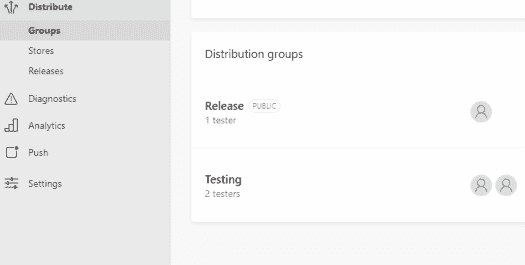

# 将 AppCenter 分发 SDK 路由到特定的发布组

> 原文：<https://dev.to/egitsptr/route-appcenter-distribute-sdk-to-specific-release-group-3olb>

> 注明是因为没有找到正式的文本文件。免费更新。

CI 之一。

预字:

*   [应用中心](https://appcenter.ms/)
*   [Appcenter 分发版](https://docs.microsoft.com/en-us/appcenter/distribution/)–允许我设置应用内自动更新到发布组。

[](https://res.cloudinary.com/practicaldev/image/fetch/s--UsH8Qn9G--/c_limit%2Cf_auto%2Cfl_progressive%2Cq_auto%2Cw_880/https://esabook.files.wordpress.com/2019/01/capture-1.png%3Fw%3D525)

# 但是对于但是，

有一个灵活的 SDK，我们可以根据自己的准备将更新检查指向特定的组。这样，我们就可以在不作为测试者合作者登录的情况下获得应用内自动更新。

```
import com.microsoft.appcenter.utils.storage.SharedPreferencesManager;

...

SharedPreferencesManager.initialize(this);
SharedPreferencesManager.putString("Distribute.distribution_group_id", "***REPLACE WITH GROUP-ID HERE***");

```