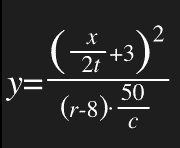

# Clojure 中的 RPN 表达式，玩宏。

> 原文：<https://dev.to/deepbit/rpn-expressions-in-clojure-playing-with-macros-2108>

## TL；博士:

```
 ; Let's Calculate sqrt((((2*3)/a)*18+t)/X)  ; That is annoying  (sqrt  (/  (+  (*  (/  (*  2  3)  a)  18)  t)  X))  ; That looks better (if you know how to look at it)  (rpn  2  3  *  a  /  18  *  t  +  X  /  sqrt)  ;CHANGE MY MIND 
```

大家好。这篇文章是关于用 Clojure 写算术表达式的。第一次接触 Clojure 或 LISP 时，有些人可能会觉得 parens 有点烦人或令人困惑。然而，如果你遵循一个好的[编码风格](https://github.com/bbatsov/clojure-style-guide)，习惯 parens plus 只是时间问题。

> 迈克尔·伯格@ themichaelburgef(5，6) -《实用程序员的理想语法》
> f 5 6 -《离奇；只有学者才会使用“
> (f 5 6) -“太多括号”
> 5 . F5(6)-“您下一个 web 应用的首选”2018 年 11 月 04 日上午 00:53[](https://twitter.com/intent/tweet?in_reply_to=1058885000588750848)[](https://twitter.com/intent/retweet?tweet_id=1058885000588750848)893[](https://twitter.com/intent/like?tweet_id=1058885000588750848)2305

虽然您可以非常习惯这种语法，但当您需要键入一个算术表达式时，这可能是一种真正的痛苦，比如:
[](https://res.cloudinary.com/practicaldev/image/fetch/s--hvEx8mQO--/c_limit%2Cf_auto%2Cfl_progressive%2Cq_auto%2Cw_880/https://thepracticaldev.s3.amazonaws.com/i/x1sq311p9g03pae2c4n4.png)

老实说，不管你用的是什么语言，你都会使用很多 paren，但是 Clojure 的前缀符号+paren 使它更加混乱。

从高中开始，我就在数学和物理课上使用惠普科学计算器。惠普计算器有点特殊，因为它们默认设置有 [RPN](https://en.wikipedia.org/wiki/Reverse_Polish_notation) 符号、[(演示)](https://youtu.be/Xxr-o3Mmmkw?t=122)。

什么是 RPN 符号？

RPN 代表*反向波兰符号*，它是与中缀符号完全不同的执行操作的方式。

RPN 依赖于一个堆栈，当你想对堆栈的顶部元素应用一个操作时，你可以将操作数压入堆栈。这将取决于操作的 arity(+arity 是 2，而 *sqrt* arity 是 1)。它的工作方式是:从栈顶弹出操作数，然后执行操作，结果被推回到栈顶。

在 UNIX 系统中，你通常可以在 [/usr/bin/dc](https://linux.die.net/man/1/dc) 中找到一个 RPN 计算器。

示例:

```
Infix notation: (1 + 5) * 13 + 8 = 86
RPN: 1 5 + 13 * 8 +

STACK[]     :push 1
STACK[1]    :push 5
STACK[1 5]  :pop 5, pop 1, apply + to 1 and 5 (1+5), then push 6 
STACK[6]    :push 13
STACK[6 13] :pop 13, pop 6, apply * to 6 and 13, then push 78
STACK[78]   :push 8
STACK[78 8] :pop 8, pop 78, apply + to 78 and 8 (78+8), push 86 
STACK[86]   

Infix: ((1 + 5) * (2 / (1 - 7) + 5)) / 2 = 14
RPN: 1 5 + 2 1 7 - / 5 + * 2 /

STACK[]         :push 1    
STACK[1]        :push 5
STACK[1 5]      :pop 5, pop 1, apply + to 1 and 5, push 6
STACK[6]        :push 2
STACK[6 2]      :push 1
STACK[6 2 1]    :push 7
STACK[6 2 1 7]  :pop 7, pop 1, apply - to 1 and 7, push -6
STACK[6 2 -6]   :pop -6 pop 2 apply / to 2 and -6, push -2/6
STACK[6 -2/6]   :push 5
STACK[6 -2/6 5] :pop 5, pop -2/6, apply + to -2/6 and 5, push 28/6
STACK[6 28/6]   :pop 28/6, pop 6, apply * to 6 and 28/6, push 28
STACK[28]       :push 2
STACK[28 2]     :pop 2 pop 28 apply / to 28 and 2, push 14
STACK[14] 
```

这可能看起来有点复杂，但相信我，当你习惯了 RPN 计算器，你几乎忘记了如何使用传统的计算器(例如:经典卡西欧)。写大方程要快得多，也容易得多。的确，通常你有额外的工具来处理堆栈，比如删除顶值或者交换前 2 个位置等等。

在这篇文章中，我想做的是编写一个 Clojure 宏，允许您编写 RPN 表达式，这样它就可以将 RPN 转换成标准前缀表示法。

示例:

```
; (1 + 5) * 13 + 8  (rpn  1  5  +  13  *  8  +)  =>  86  (macroexpand  '(rpn  1  5  +  13  *  8  +))  =>  (+  (*  (+  1  5)  13)  8) 
```

现在最大的问题是。RPN 比标准的 Clojure 前缀表示法更好吗？。我认为这是非常主观的，这是事实，你不使用括号与 RPN，但当公式变大，很难保持一个大的堆栈在你的大脑中，如果你正在阅读代码。我不得不说，虽然写一个公式对我来说非常容易，但一周后回去试着读它是一个不同的故事。

这个宏可能不是很有用，但是它让我学到了关于编写宏的有趣概念。

在这里你可以找到宏，下面你会找到一个 REPL，你可以在那里玩它，如果你喜欢。

```
(defmacro  rpn  [&  args]  (loop  [[f  &  rst]  args  acc  (list)]  (cond  (and  (symbol?  f)  (ifn?  @(resolve  f)))  (if  (=  1  (count  (:arglists  (meta  (resolve  f)))))  (recur  rst  (cons  (list  f  (first  acc))  (drop  1  acc)))  (recur  rst  (cons  (list  f  (second  acc)  (first  acc))  (drop  2  acc))))  (nil?  f)  (first  acc)  :else  (recur  rst  (cons  f  acc))))) 
```

[https://repl.it/@coelias/rpn-macro?lite=true](https://repl.it/@coelias/rpn-macro?lite=true)