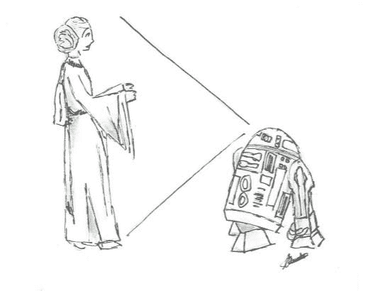
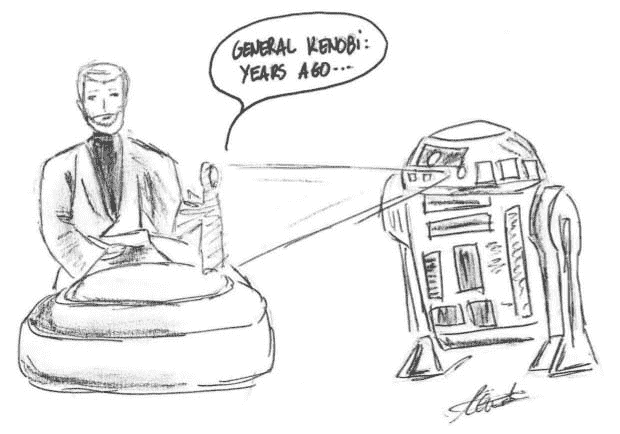

# RSA:数学将如何保护我们，而 P！=NP

> 原文：<https://dev.to/juaneto/rsa-how-maths-will-protect-us-while-pnp-koi>

## 简介

在之前的[帖子](https://dev.to/juaneto/knowing-monads-through-the-category-theory-1mea)中，我们讨论了数学如何帮助我们成为更好的程序员，这一次我们将讨论由于 **RSA 加密技术**，数学如何成为全球网络安全的基础。

历史上**密码学**的重要性一直很大。它主要被军方和政府使用，能够与敌人保持秘密是胜利的主要因素。

历史上有很多关于它的使用的例子和故事。尤利乌斯·凯撒用来隐藏军事秘密的凯撒密码，加速美国加入第一次世界大战的著名的[齐默尔曼电报](https://en.wikipedia.org/wiki/Zimmermann_Telegram)，或者致力于解密纳粹密码的[艾伦·图灵](https://en.wikipedia.org/wiki/Alan_Turing#Cryptanalysis)，特别是那些将第二次世界大战缩短了大约两年(历史学家估计)的恩尼格玛机器的密码。还有更多例子…

现在它不仅用于战争冲突，也用于安全冲突(个人和公司)和捍卫个人隐私的斗争。菲尔·齐默曼( [PGP](https://en.wikipedia.org/wiki/Pretty_Good_Privacy) 的创造者)在一份声明中总结道，他的第一句话(也是非常好的一句话)是*“这是个人的。这是隐私。这不关任何人的事，只关你的事。”*。

这篇文章的主要目的是解释两件事:一，RSA 算法是如何工作的，他的复杂性在于什么，以及(二)为什么数学现在支持它的安全性，也就是说，我们将谈论著名的和非常重要的问题 **P = NP？**

## 公钥加密

由于密码学存在了几千年，加密系统的重要性在于算法的复杂性和解密密钥的分布。越来越多复杂的算法被建立起来，这就需要越来越复杂的密钥来解密。但是这些算法总是有同样的问题。如果找到了钥匙会怎么样？如何在不泄露隐私的情况下分发密码？在一小部分情况下，这导致了实际的后勤问题，例如当分发由一个大的军队产生的数千本关键书籍时。最后，算法的复杂并不重要，如果找到了解密的密钥，所有算法都是脆弱的。

因此，密码社区开始关注密钥的分发，并开始在理论上研究一些看似矛盾的东西:密钥交换系统。

在 **1976** 年，在历史性的全国计算大会上，惠特菲尔德·迪菲和蒙特·赫尔曼提出了[迪菲-赫尔曼](http://www.cs.berkeley.edu/~christos/classics/diffiehellman.pdf)算法。他们想出了一种让两个人交换加密信息而无需交换任何密钥的方法。这种方法使用了模运算以及隐含模运算的素数的性质。

Diffie 和 Hellman 提出的基很快被 Ronald Rivest、阿迪·萨莫尔和 Leonard Adleman 在 1977 年采用并发展，他们确定用公钥创建非对称加密系统的理想数学函数是因式分解。这就是 **RSA** 的由来。

## RSA 是如何工作的？

回想一下，RSA 算法是非对称加密，也称为**公钥加密**。

简而言之，公钥算法的工作原理就好像我们每个人都有一个打开的盒子(只有盒子的主人有钥匙)，这样任何人都可以输入信息。当有人想给我们发东西时，他或她在盒子里输入信息，然后关上盒子。现在只有主人能打开它。这样，如果我想给鲍勃发信息，我只需要找到他的信箱，在里面输入信息，然后关上他的信箱。

稍后我们将解释用于加密消息的功能，但是我们将开始解释上面的内容，它是如何工作的以及它的机制是什么。

我们可以用经典的爱丽丝和鲍勃的例子来做，但是你可以找到很多关于这些角色的例子，我们更喜欢这样做，因为我们更喜欢《星球大战》。

**RSA 加密**示例:

1.  莱娅记录了这条信息，并向欧比-万解释说，R2D2 单位包含了义军同盟的基本信息，这些信息应该尽快到达奥德朗。

2.  莱娅要求 R2D2 用欧比-万·克诺比的公钥加密这条信息。

1.  莱娅让 R2D2 带着这条信息去找欧比万，并给他看。

1.  多亏了卢克，欧比万收到了这条信息，并用他的私人钥匙解密了这条信息。

2.  欧比万已经能够理解莱娅的信息，并开始和卢克一起帮助义军同盟。

**RSA 的数字签名**示例:

1.  阅读消息(与前面的示例相同)。

2.  莱娅要求 R2D2 用他的私人密钥对信息进行数字化处理。

3.  莱娅和 R2D2 一起把这条信息发给欧比万，让他看。

4.  欧比万收到了数字签名的信息，并用莱娅的公钥验证了这条信息确实是公主发来的。

5.  欧比万现在可以完全放心地聆听留言，因为录音的人已经读过了。

在现实世界中，可悲的是莱娅、欧比旺和 R2D2 并不存在:_(，所以我们可以通过互联网把莱娅和欧比旺换成随机的人(或者任何需要传递信息的人)和 R2D2，以使例子有意义。

## 让我们学习 RSA 的数学(只给勇敢的人)

首先，如果你不是数学爱好者，或者你迫不及待地想知道更多关于 P=NP 的知识？(或者你只是累了)跳到下一章。

让我们从头开始。我们必须选择两个大的质数…多大？大约 10200 磅。两者都不可能非常接近，假设它们必须至少相差 1090。

数字 **n = p * q** 是我们公钥的一半！为了找到另一半，我们必须做更多的手术。首先，我们找到数φ(n) = (p-1) (q-1)也就是所谓的欧拉的 [fi。](https://en.wikipedia.org/wiki/Euler%27s_totient_function)

现在我们要找到一个数，使得φ(n)和那个数的最大公约数是 1，即**互质**。有很多种可能，甚至还有人更喜欢一直走同一个:216 + 1 = 65537。不管你选择什么，重要的是互质(我们会看到为什么)。我们称这个数为 e，它是我们公钥的另一半。也就是公钥是: **(n，e)** 。

私钥呢？私钥 **d** 是模φ(n)中 e 的[模逆](https://en.wikipedia.org/wiki/Modular_multiplicative_inverse)。这个逆存在并且是**唯一的**，因为 **φ(n)和 e 是互质**。

现在，假设我们已经在某处发布了我们的公钥(n，e) = (46927，39423)，现在一个朋友想给我们发送消息 m = "YES "。他会怎么加密呢？

1.  第一件事是把字母转换成数字，也就是在 26 个字母的字母表里把 m 放在基数 26。在我们的例子中:是= (24，4，18) → x = 24 * 262 + 4 * 26 + 18 * 260 = 16346。

2.  我们现在使用公式 y=xe(mod n)。也就是说，我们将 x 提高到 e，然后除以 n 得到该数的余数。在我们的示例中:y = 1634639423 (mod 46927)，然后 y = 21166。

3.  我们只需要再把那个数放在基数 26 上:c = (y)2626。在我们的例子中:21166 = 1 * 263+5 * 262+8 * 261+2 =(1582)26→BFIC。

所以他给我们发了短信 c = "BFIC" …好吧…我们怎么解密它？也就是用私钥，简单的做:m = cd (mod n)。

观察结果:

*   如果我们公开消息，那么任何人都可以解密消息。

*   如果我们公开 **p** 或 **q** ，那么任何人都可以计算 **φ(n)** 因此也可以计算 **d** 。所以知道 **φ(n)** 和知道 **p** 和 **q** 是一样的。

*   我们可以在不窃取任何东西的情况下解密消息，“只”通过因式分解 n 来找到 p 和 q。这是下一节的要点。

## P=NP？

这是每个人都在谈论的问题。但是……为什么呢？

从广义上讲，如果这个等式成立，世界安全将会受到损害，因为许多算法(也包括 RSA)将能够在相当短的时间内被解决。

但是我们不会停留在这几行，我们会更深入地解释这个等式是什么？？？意味着。去吧。

我们需要知道的第一件事是，我们正在关注**决策问题**。这些问题的可能答案是“**是**或“**否**”。

我们可以将这些问题分为复杂的类别，其中两类是我们将要关注的: **P** 和 **NP** 。

**P 类**组成那些在**多项式时间内**解决** **的问题。定义算法所需时间的变量是输入数据。一个算法的例子:生命的游戏——给定康威生命的游戏的初始配置，一个特定的细胞，和时间 T(一元),在 T 步之后，这个细胞还活着吗？****

 ****NP 类**由那些解决方案可以在多项式时间内**检验的问题组成。请注意，这是验证，而不是多项式时间内解决的问题的解决方案。我们已经有很多 NP 类了，都是 P 类的问题！这是因为类 **P 包含在类 NP** 中，因为如果我们在多项式时间内延迟求解它们，也将需要多项式时间来验证它们。**

让我们考虑一下 RSA。我们知道数字的因式分解需要**个指数时间**，但是验证可以在多项式时间内完成(简单地检查被因式分解的每个素数之间的除法是否有零余数)。还有其他 NP 问题的例子比如旅行者问题(属于 NP 完全类)。这些问题是 NP 的，但是……它们在 P 类吗？如果是的话，我们就有大麻烦了。

从这里我们的初始问题来了，会是 **P = NP 吗？**两个班真的是同一个班吗？我们能在多项式时间内解决 NP 问题吗？

如果我们最终证明这些问题在 P 类中(因此 P = NP)，许多事情都会改变。证明这一点的一个方法是看一个 NP 完全的类问题属于类 P，所以所有的 NP 问题都是 P …但那是另一个故事了。

一方面，我们可以在更短的时间内解决这些问题，但另一方面，这将意味着全球安全将受到损害，因为像 RSA 这样的算法将不会有效，我们将不得不寻找其他方法来保护自己。

对于量子计算，这些算法将不再有意义，因为，例如， [Shor 算法](https://en.wikipedia.org/wiki/Shor%27s_algorithm) 4 可以在多项式时间内破解 RSA。但与此同时(量子计算似乎并没有我们几年前想象的那么近)，我们是安全的。而当我们不在**时，数学**会给我们另一种解决办法。

## 备注:

**1。**ϕ(n)=(P1)(Q1)= pq pq+1 = npq+1 所以 p+q = n+1 ϕ(n).如我们所知，pq = N，我们有数 p 和 q 的和与积(你可以自己解方程)。

**2。**多项式是类型为 **k * xn** 的项的和，其中 **n > = 0** 。例如 3×3+5×2。非多项式的一个例子是 1/x 或 2x。

**3。**维基百科中的 P-完整页面:【https://en.wikipedia.org/wiki/P-complete T2】

**4。利用 Shor 的量子算法，阶乘分解将取 O((log N)3)而不是 O((log N)k)。从指数到多项式。**

* *本文原载于 2017 年 7 月 31 日 [Datio 的博客](http://www.datio.com/security/rsa-how-maths-will-protect-us-while-pnp/)。***