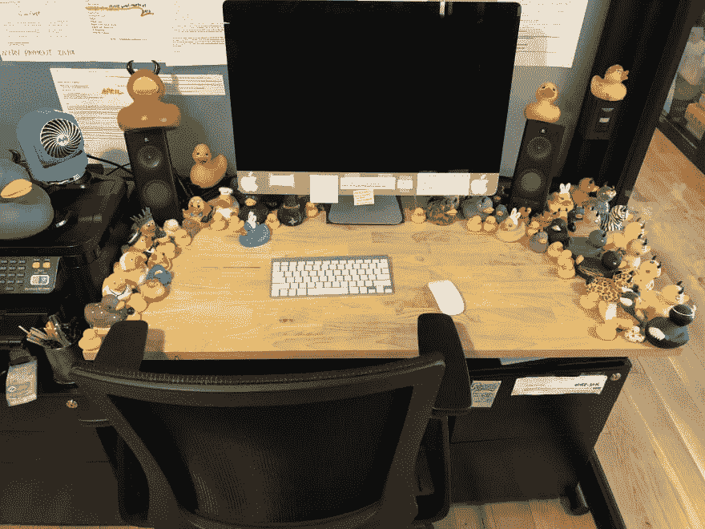
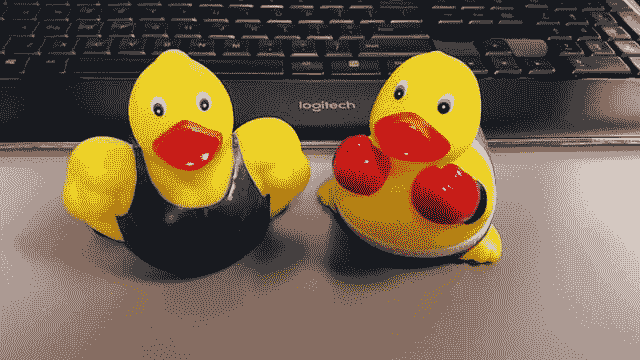

# 橡皮鸭调试！

> 原文：<https://dev.to/rachelsoderberg/rubber-ducky-debugging-1jbe>

当我第一次被介绍到橡皮鸭调试这个概念时，我的眼睛因为惊奇而发亮。鸭子？在工作？！这是什么荒谬的疯狂？！我想象着开发者被一堆鸭子包围着，就像这个人的桌子一样...

尽管鸭子军团有点极端，但在任何给定的团队中，至少有一个开发人员有一只或三只橡皮鸭子，这并不罕见。

如果你不熟悉这个概念，你可能想知道“橡皮鸭到底和软件开发有什么关系？”你会怀疑地盯着我，可能会认为我是个疯子。好吧，让我来解释一下，这样你就可以知道一些神奇的调试效率的秘密了！

### 橡皮鸭调试，解释道

想象一下，如果你愿意的话，一个你无法用手指找到的卑鄙的虫子。您的 IDE 没有什么帮助，并且您已经从头到尾阅读了可疑代码 20 分钟了；一切看起来都应该像你期望的那样工作，但事实并非如此！你叫一个队友过来，让他们听你说一分钟。当你口头通读代码，向他们解释每一个细节和决定时，突然 bug 就出现了。这太明显了！！你可能会拍拍额头，感谢你的同事，他们笑着走开了，你做出了修改，修复了错误。

现在考虑这样一个事实，即使我们喜欢互相帮助，我们都很忙，有时间表要满足。如果我们可以模仿“啊哈”的时刻，通过一行一行地表达每一段代码，而不需要人们停下手中的工作来倾听，会怎么样？鸭子入场。你可以把代码读给你快乐的小鸭子朋友听，不管他是海盗、宇航员、魔鬼，还是根本不是鸭子(我们支持机会均等的调试伙伴)。正如你的同事不必说一个字，你的鸭子也不会。重要的部分是阅读和解释一切，就好像它真的在听一样——如果你像你头 26 次阅读时那样在脑海中掩饰细节，这是行不通的。和鸭子说话。

额外的好处:你可以假装你的鸭子处于幼儿园的理解水平，练习用更简单的细节解释你的代码，这是许多开发人员需要努力的技能。

我建议你去找一两只鸭子！好好享受吧，给自己找个新的调试伙伴！

* * *

现在一个要求:
如果你有一只(或几只)鸭子，给我看几张图片！这些是我的:
