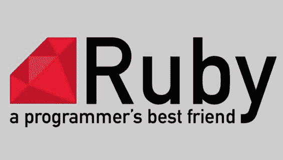

# 露比或者。NET -哪个是更好的选择？

> 原文：<https://dev.to/fractiontech/ruby-or-net---which-is-the-better-alternative-3l6c>

在计划开发软件时，您可能不知道应该使用哪种技术。因此，本文将帮助您给出问题的解决方案，并将引导您比较两种流行的技术——Ruby 和. NET。

## 红宝石

[**Ruby**](https://www.ruby-lang.org/en/) 是一种开源语言。您可以轻松地在 Ruby 中创建组件，并且可以与其他产品和服务进行交互。Ruby 的版本很神奇，你可以导入库并学习各种方法。在 Ruby 中，有不止一种方法可以完成相同的任务。Ruby 是一种非常动态的、反射式的、面向对象的、通用的编程语言。有很多公司使用 Ruby 比如 Hulu、ZenDesk、Basecamp、Shopify、Urban Dictionary、GitHub 以及 Twitter。

当你在 Ruby 社区中时，你会发现开放和令人兴奋的资源。Rails 是 Ruby 的框架。它强烈地坚持支持传统。Rails 的约定允许管理和构建 web 应用程序。Ruby 具有快速原型制作的能力，非常受初创企业的欢迎。当我们比较 Python、PHP 和 Java 等语言时，Rails 与它们配合得最好，并且具有更高的增长率。

1.  Ruby 是轻量级的，专注于命令行。
2.  它有一个 Rails 社区，支持活跃的开发者。
3.  Ruby 是一种纯编程语言，有一个 RubyGems 库。

## 为什么要切换到 Ruby on Rails？

Ruby on Rails 是一个 web 框架的应用程序，它是在 MIT 许可下用 Ruby 编写的。Rails 是一种 MVC 架构，它为数据库、web 服务和网页提供了默认的结构。Ruby 促进了 web 标准的使用，比如用于数据传输的 JSON 或 XML、HTML、CSS 和 JavaScript。它还具有显著的优势，并使用熟悉的软件工程模式。

### Ruby on Rails 的特性

1.  它是一个开源框架，可以在多种平台上工作
2.  它可以嵌入到 HTML 中，并使用非常高级的语言(VHLL)
3.  Ruby 提供了对象内的数据方法和封装
4.  它是基于纯 OOP 的，带有超级先进的字符串和文本操作技术。
5.  它连接 DB2、MySQL、Oracle 和 Sybase。
6.  具有更好的安全特性，还有一个调试器
7.  提供灵活的语法、高级数组类和多线程应用程序

### 局限性

1.  缺乏信息资源，学习相当困难
2.  CPU 处理时间比其他编程语言要长。
3.  更新和发展过程缓慢而稳定。

## [T1。网](#net)

。NET 也是一个开源的 [**web 应用框架**](http://www.fraction.tech/services/application-development) 主要是为 web 的开发而设计的。它生成由微软程序员开发的用于构建 CLR 的动态网页。ASP.NET 具有各种优势，如 [**、**](https://www.microsoft.com/net) SOAP 扩展框架允许多个组件处理这些 SOAP 消息。

### ASP.NET 的特色

1.  。NET 大大减少了构建大型应用程序的代码量。
2.  您可以配置安全的内置 Windows 应用程序
3.  通过即时编译、本机优化和缓存服务，它的性能会更好。
4.  。NET 有能力利用绑定来执行更好的任务，形成带有客户端身份验证的简单提交。
5.  。NET 页面易于编写和维护，因为它们可以一起构建源代码和 HTML。它为创建网页提供了强大的功能和灵活性。
6.  。NET 是纯粹基于服务器的技术，在发送到浏览器之前可以在服务器端执行。
7.  没有必要进去。NET 将组件注册为。net 易于部署。
8.  它还可以与 ADO.NET 一起使用数据绑定和页面格式功能。
9.  。NET 有助于更快地运行应用程序，并在没有性能问题的情况下应对大量用户。

### 的局限性。网

1.  社区支持正在下降
2.  。Net 是微软的天下，那里有各种各样的开源机会。

## 结论

我们知道，选择一个 web 框架是一件非常困难的工作，因为它们具有语言、性能、托管成本等等方面的优势。所以决定哪一个最适合你完全是你的选择。