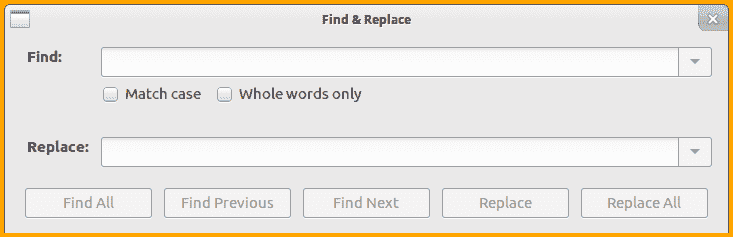
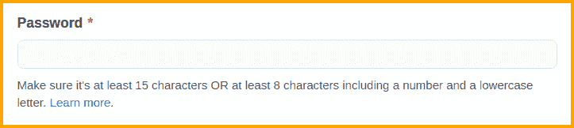

# Ruby Regexp 第 1 部分-简介

> 原文：<https://dev.to/learnbyexample/ruby-regexp-part-1---introduction-5c77>

# 前言&先决条件

本系列将通过大量的例子和练习向您传授从基础到高级的 Ruby 正则表达式。

你应该有使用 Ruby 的经验，应该知道像块，字符串格式，字符串方法，可枚举等概念。

您可以使用以下链接获得该书的免费 pdf/epub 版本:

*   [https://gumroad.com/l/rubyregexp](https://gumroad.com/l/rubyregexp)
*   [https://leanpub.com/rubyregexp](https://leanpub.com/rubyregexp)

# 为什么需要？

正则表达式是文本处理的通用工具。您会发现它们包含在大多数用于编写脚本的编程语言的标准库中。如果没有，一般可以找第三方库。正则表达式的语法和功能因语言而异。Ruby 的产品基于 Onigmo 正则表达式库。

`String`类装载了各种处理文本的方法。那么，正则表达式有什么特别之处，为什么需要它呢？出于学习和理解的目的，人们可以将正则表达式本身视为一种小型编程语言，专门用于文本处理。类似于变量和函数，正则表达式的某些部分可以保存起来以备将来使用。有多种方法来执行 AND、OR、NOT 条件句。类似于范围和字符串重复操作符等的操作。

以下是一些常见的使用案例:

*   净化字符串以确保它满足一组已知的规则。例如，检查给定字符串是否匹配密码规则。
*   过滤或提取抽象层次的部分，如字母、数字、标点符号等。
*   合格的字符串替换。例如，在字符串的开头或结尾，基于周围的文本，只有整个单词，等等。

你可能对图形搜索和替换工具很熟悉，比如下面的 LibreOffice Writer 截图。**匹配大小写**、**全词唯一**、**替换**和**替换全部**是正则表达式支持的一些基本特性。

[](https://res.cloudinary.com/practicaldev/image/fetch/s--I4iF-c8s--/c_limit%2Cf_auto%2Cfl_progressive%2Cq_auto%2Cw_880/https://learnbyexample.github.io/Ruby_Regeimg/find_replace.png)

另一个真实的用例是密码验证。下面的截图来自 GitHub 注册页面。执行多种检查，比如字符串长度和允许的字符类型是正则表达式的另一个核心特性。

[](https://res.cloudinary.com/practicaldev/image/fetch/s--p32EgQ_X--/c_limit%2Cf_auto%2Cfl_progressive%2Cq_auto%2Cw_880/https://learnbyexample.github.io/Ruby_Regeimg/password_check.png)

这里有一些关于正则表达式的文章，以了解它的历史和它适用的问题类型。

*   正则表达式的真正力量——它还包括对*正则表达式*在上下文中的含义的很好的解释
*   [软件工程:学习正则表达式是每个程序员的必修课吗？](https://softwareengineering.stackexchange.com/questions/133968/is-it-a-must-for-every-programmer-to-learn-regular-expressions)
*   软件工程:什么时候不应该使用正则表达式？
*   编码主持人:现在你有两个问题
*   维基百科:正则表达式(Regular expression)——这篇文章包括关于正则表达式作为一种正式语言的讨论，以及各种实现的细节

# 正则表达式简介

在这一章中，你将了解如何声明和使用正则表达式。对于一些示例，显示了等效的正常字符串方法以供比较。正则表达式的特性将在下一章讨论。主要重点是让您熟悉语法和文本处理示例。本章将介绍三种方法。用于搜索输入是否包含字符串的`match?`方法和用于用其他内容替换部分输入的`sub`和`gsub`方法。

> 本书将互换使用术语**正则表达式**和**正则表达式**。

## Regexp 文档

知道在哪里可以找到文档总是一个好主意。访问 [ruby-doc: Regexp](https://ruby-doc.org/core-2.7.1/Regexp.html) ,获取关于`Regexp`类、可用方法、语法、特性、示例等更多信息。这里有一段引言:

> 正则表达式( *regexps* )是描述字符串内容的模式。它们用于测试一个字符串是否包含给定的模式，或者提取匹配的部分。它们是用`/pat/`和`%r{pat}`文字或`Regexp.new`构造函数创建的。

## 匹配？方法

首先，一个简单的例子来测试一个字符串是否是另一个字符串的一部分。通常，您会使用`include?`方法并传递一个字符串作为参数。对于正则表达式，使用`match?`方法并将搜索字符串括在`//`分隔符(regexp 文字)中。

```
>> sentence = 'This is a sample string'

# check if 'sentence' contains the given string argument
>> sentence.include?('is')
=> true
>> sentence.include?('z')
=> false

# check if 'sentence' matches the pattern as described by the regexp argument
>> sentence.match?(/is/)
=> true
>> sentence.match?(/z/)
=> false 
```

Enter fullscreen mode Exit fullscreen mode

`match?`方法接受可选的第二个参数，该参数指定了开始搜索的索引。

```
>> sentence = 'This is a sample string'

>> sentence.match?(/is/, 2)
=> true
>> sentence.match?(/is/, 6)
=> false 
```

Enter fullscreen mode Exit fullscreen mode

一些正则表达式功能是通过传递由字母字符表示的修饰符来实现的。如果你使用了命令行，修饰符类似于命令选项，例如`grep -i`将执行不区分大小写的匹配。这将在[修改器](https://learnbyexample.github.io/Ruby_Regexp/modifiers.html)一章中详细讨论。这里有一个`i`修改器的例子。

```
>> sentence = 'This is a sample string'

>> sentence.match?(/this/)
=> false
# 'i' is a modifier to enable case insensitive matching
>> sentence.match?(/this/i)
=> true 
```

Enter fullscreen mode Exit fullscreen mode

## Regexp 文字重用和插值

regexp 文本可以保存在变量中。这有助于提高代码的清晰度，作为方法参数传递，支持重用等。

```
>> pet = /dog/i
>> pet
=> /dog/i

>> 'They bought a Dog'.match?(pet)
=> true
>> 'A cat crossed their path'.match?(pet)
=> false 
```

Enter fullscreen mode Exit fullscreen mode

与双引号字符串相似，您可以在 regexp 文本中使用插值和转义序列。参见 [ruby-doc: Strings](https://ruby-doc.org/core-2.7.1/doc/syntax/literals_rdoc.html#label-Strings) 了解字符串转义序列的语法细节。正则表达式有自己特殊的转义，这将在[转义序列](https://learnbyexample.github.io/Ruby_Regexp/escaping-metacharacters.html#escape-sequences)部分讨论。

```
>> "cat\tdog".match?(/\t/)
=> true
>> "cat\tdog".match?(/\a/)
=> false

>> greeting = 'hi'
>> /#{greeting} there/
=> /hi there/
>> /#{greeting.upcase} there/
=> /HI there/
>> /#{2**4} apples/
=> /16 apples/ 
```

Enter fullscreen mode Exit fullscreen mode

## sub 和 gsub 方法

对于搜索和替换，使用`sub`或`gsub`方法。`sub`方法将只替换匹配的第一个匹配，而`gsub`将替换所有匹配。与输入字符串匹配的 regexp 模式必须作为第一个参数传递。第二个参数指定将替换模式匹配部分的字符串。

```
>> greeting = 'Have a nice weekend'

# replace first occurrence of 'e' with 'E'
>> greeting.sub(/e/, 'E')
=> "HavE a nice weekend"
# replace all occurrences of 'e' with 'E'
>> greeting.gsub(/e/, 'E')
=> "HavE a nicE wEEkEnd" 
```

Enter fullscreen mode Exit fullscreen mode

使用`sub!`和`gsub!`方法进行就地替换。

```
>> word = 'cater'

# this will return a string object, won't modify 'word' variable
>> word.sub(/cat/, 'wag')
=> "wager"
>> word
=> "cater"

# this will modify 'word' variable itself
>> word.sub!(/cat/, 'wag')
=> "wager"
>> word
=> "wager" 
```

Enter fullscreen mode Exit fullscreen mode

## 正则表达式运算符

Ruby 还提供了用于正则表达式匹配的操作符。

*   `=~`匹配运算符返回第一个匹配的索引，如果没有找到匹配，则返回`nil`
*   如果字符串*不包含给定的正则表达式*，匹配操作符返回`true`，否则返回`false`
*   `===`匹配运算符返回`true`或`false`，类似于`match?`方法

```
>> sentence = 'This is a sample string'

# can also use: /is/ =~ sentence
>> sentence =~ /is/
=> 2
>> sentence =~ /z/
=> nil

# can also use: /z/ !~ sentence
>> sentence !~ /z/
=> true
>> sentence !~ /is/
=> false 
```

Enter fullscreen mode Exit fullscreen mode

就像`match?`方法一样，`=~`和`!~`都可以用在条件语句中。

```
>> sentence = 'This is a sample string'

>> puts 'hi' if sentence =~ /is/
hi

>> puts 'oh' if sentence !~ /z/
oh 
```

Enter fullscreen mode Exit fullscreen mode

对于可枚举的方法，如`grep`、`grep_v`、`all?`、`any?`等，`===`操作符派上了用场。

```
>> sentence = 'This is a sample string'

# regexp literal has to be on LHS and input string on RHS
>> /is/ === sentence
=> true
>> /z/ === sentence
=> false

>> words = %w[cat attempt tattle]
>> words.grep(/tt/)
=> ["attempt", "tattle"]
>> words.all?(/at/)
=> true
>> words.none?(/temp/)
=> false 
```

Enter fullscreen mode Exit fullscreen mode

> 与`match?`方法的一个关键区别是，这些操作符还将设置 regexp 相关的[全局变量](https://learnbyexample.github.io/Ruby_Regexp/working-with-matched-portions.html#regexp-global-variables)。

## 习题

对于练习问题，请访问 GitHub 上本书资源库中的 [Exercises.md](https://github.com/learnbyexample/Ruby_Regexp/blob/master/exercises/Exercises.md) 文件。