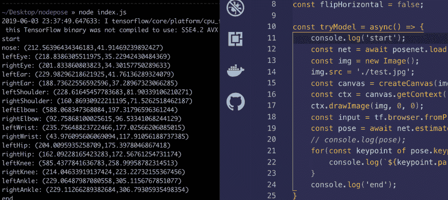

# 使用 Nodejs 运行 PoseNet

> 原文：<https://dev.to/0xkoji/run-posenet-with-nodejs-12be>

## 什么是 Posenet？

[https://medium . com/tensor flow/real-time-human-pose-estimation-in-the-browser-with-tensor flow-js-7 DD 0 BC 881 CD 5](https://medium.com/tensorflow/real-time-human-pose-estimation-in-the-browser-with-tensorflow-js-7dd0bc881cd5)
[https://github . com/tensor flow/tfjs-models/tree/master/pose net](https://github.com/tensorflow/tfjs-models/tree/master/posenet)

如你所见，基本上我们不需要为 PoseNet 使用 nodejs，因为我们需要使用 canvas 向 tensorflowjs lol 提供数据

此外，我们可以在 python 中使用 tensorflow 而不是`js`，但我确实尝试过，因为有 nodejs 和 tfjs-node([https://github.com/tensorflow/tfjs-node](https://github.com/tensorflow/tfjs-node))。

### 步骤

1.  安装包/库
2.  安装 npm 软件包
3.  编写代码并运行它

#### Step1

正如我提到的，需要使用`canvas`，所以需要安装 libs。
顺便说一句，这是针对 mac 的，但是你可以在网上找到 Linux 和 Windows 的信息。另外，现在我们可以在 Linux 上使用家酿了(我在 Ubuntu 上测试过)

```
$ brew install pkg-config cairo pango libpng jpeg giflib 
```

Enter fullscreen mode Exit fullscreen mode

#### 第二步

我使用 yarn，因为 npm 不允许我安装 tfjs。但是，你可以用/试试`npm`而不是`yarn`。

```
$ yarn add @tensorflow-models/posenet @tensorflow/tfjs @tensorflow/tfjs-node botkit canvas rollup 
```

Enter fullscreen mode Exit fullscreen mode

#### 第三步

代码很乱，因为只是用 posenet 测试 tfjs-node。

```
const tf = require('@tensorflow/tfjs-node');
const posenet = require('@tensorflow-models/posenet');
const {
    createCanvas, Image
} = require('canvas')
const imageScaleFactor = 0.5;
const outputStride = 16;
const flipHorizontal = false;

const tryModel = async() => {
    console.log('start');
    const net = await posenet.load(0.75);
    const img = new Image();
    img.src = './test.jpg';
    const canvas = createCanvas(img.width, img.height);
    const ctx = canvas.getContext('2d');
    ctx.drawImage(img, 0, 0);
    const input = tf.browser.fromPixels(canvas);
    const pose = await net.estimateSinglePose(input, imageScaleFactor, flipHorizontal, outputStride);
    // console.log(pose);
    for(const keypoint of pose.keypoints) {
        console.log(`${keypoint.part}: (${keypoint.position.x},${keypoint.position.y})`);
    }
    console.log('end');
}

tryModel(); 
```

Enter fullscreen mode Exit fullscreen mode

## 结果

得了 17 分，耶！
[T3】](https://res.cloudinary.com/practicaldev/image/fetch/s--4e9mfu0a--/c_limit%2Cf_auto%2Cfl_progressive%2Cq_auto%2Cw_880/https://thepracticaldev.s3.amazonaws.com/i/7k5v8xlvhq5jyogu4uq3.png)