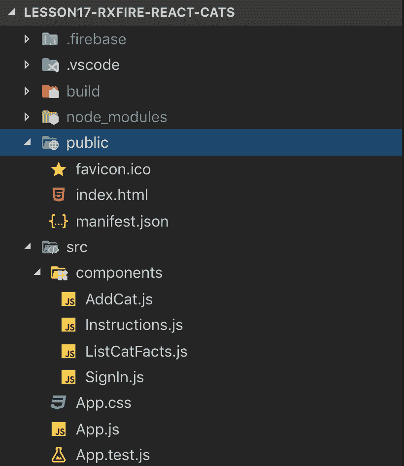

# 使用 Firebase Firestore 和身份验证的反应堆中的 RxFire

> 原文：<https://dev.to/codercatdev/rxfire-in-reactjs-using-firebase-firestore-and-authentication-1i5p>

原帖:[https://ajonp . com/lessons/rx fire-in-react js-using-firebase-firestore-and-authentic ation/](https://ajonp.com/lessons/rxfire-in-reactjs-using-firebase-firestore-and-authentication/)

[https://www.youtube.com/embed/hTzcRCAm5e0](https://www.youtube.com/embed/hTzcRCAm5e0)

# RxFire 在 ReactJS 中使用 Firebase Firestore 和认证

RxFire 是由 Firebase 开发者倡导者[大卫·伊斯特](https://twitter.com/_davideast)创建的。虽然 [Firebase 博客](https://firebase.googleblog.com/2018/09/introducing-rxfire-easy-async-firebase.html)在 2018 年 9 月介绍了 RxFire，但我认为这对同时使用 [ReactJs](https://reactjs.org/) 和 [Firebase](https://www.firebase.com/) 的初学者来说是一个很好的参考点。

对于那些来自角度背景的人，你可能熟悉 [RxJS](https://github.com/ReactiveX/rxjs) 和 [Angularfire2](https://github.com/angular/angularfire2) 包。根据我的经验，如果你想在任何尺寸的应用中使用 Angular，你*必须*学习 RxJS。这可能是最难学的部分之一，但有几个精彩的教程和网站专门介绍 RxJS 是如何工作的。

我最喜欢的一些

*   [Fireship 的十大 RxJS 概念](https://fireship.io/lessons/rxjs-basic-pro-tips/)
*   [xjs 大理石](https://rxmarbles.com/)

新反应过来的，请结账

*   [Wes Bos 的 React for 初学者](https://reactforbeginners.com/)

# 教训

## 举例

在下面的例子中，它展示了最终的 React 应用程序将如何工作的快速预览。如您所见，将会发生基本的 4 个步骤。

1.  签到
2.  添加卡特彼勒事实
3.  在列表中显示添加的卡特彼勒事实
4.  签名登记离开

<video controls=""><source src="https://res.cloudinary.com/ajonp/video/upload/v1556399505/ajonp-ajonp-com/17-rxfire-react-cats/5.webm" type="video/webm"> <source src="https://res.cloudinary.com/ajonp/video/upload/v1556399505/ajonp-ajonp-com/17-rxfire-react-cats/5.mov" type="video/mp4"></video> 

## 设置

你将需要与 nodejs 捆绑在一起的 NPM。

由于我们将成为`create-react-app` cli，您必须安装第一个
[https://Facebook . github . io/create-react-app/docs/getting-started](https://facebook.github.io/create-react-app/docs/getting-started)

您还需要创建自己的 Firebase 项目并初始化 Firestore 数据库，请使用严格模式创建。

## 最终 App 结构

[](https://res.cloudinary.com/practicaldev/image/fetch/s--7si6H2bF--/c_limit%2Cf_auto%2Cfl_progressive%2Cq_auto%2Cw_880/https://res.cloudinary.com/ajonp/image/upload/f_auto%2Cfl_lossy%2Cq_auto/v1556401634/ajonp-ajonp-com/12-angular-material-from-firestore/tnjyrsul0tegl2if31gf.png)

## 安装依赖项

你将需要两个 [rxfire](https://www.npmjs.com/package/rxfire) 和[firebase](https://www.npmjs.com/package/firebase)T4】

```
npm i rxfire firebase 
```

Enter fullscreen mode Exit fullscreen mode

## 创建 Firebase.js

js 将是我们的主要 firebase 文件，并将包含我们的 Firebase 应用程序的工具，包括 Firebase 的实例化。该文件包括用于 auth 和 firestore 助手功能的 rxfire。

Firebase.js

```
import 'firebase/auth';
import 'firebase/firestore';

import firebase from 'firebase/app';
import { authState } from 'rxfire/auth';
import { collectionData } from 'rxfire/firestore';
import { filter } from 'rxjs/operators';

const app = firebase.initializeApp({
/* Place your configuration here */
});

const firestore = firebase.firestore(app); // Initialize firestore
const auth = firebase.auth(app); // Initialize firebase auth
const loggedIn$ = authState(auth).pipe(filter(user => !!user)); // Observable only return when user is logged in.

export { app, auth, firestore, collectionData, loggedIn$ };

export default firebase; 
```

Enter fullscreen mode Exit fullscreen mode

> 如果您已经熟悉 ReactJS，可以跳过本课的说明部分。

## 简单的初始组件

### 删除 App.js 并替换

首先移除 App.js 的核心，因为我们将使用`extends React.Component`的模式。
我们现在开始简单地添加第一个名为指令的 React 组件。

```
import './App.css';

import React from 'react';
import Instructions from './components/Instructions';

class App extends React.Component {
  render() {
    return (
      <div
        style={{
          display: 'flex',
          justifyContent: 'center',
          flexFlow: 'row wrap'
        }}
      >
        <div
          style={{
            display: 'flex',
            justifyContent: 'center',
            flexFlow: 'column'
          }}
        >
          <Instructions />
        </div>
      </div>
    );
  }
}

export default App; 
```

Enter fullscreen mode Exit fullscreen mode

### 创建说明. js

这是一个非常简单的 React 组件，不需要任何道具，它只是直接返回 html。

components/Instructions.js

```
import React from 'react';

class Instructions extends React.Component {
  render() {
    return (
      <div
        style={{
          display: 'flex',
          justifyContent: 'start',
          flexFlow: 'row wrap'
        }}
      >
        <div
          style={{
            maxWidth: '500px'
          }}
        >
          
        </div>
        <div>
          <p>
            In this example we will use RxFire to Observe the Cat Facts that we
            add to our Firestore Database.
          </p>
          <a
            href="https://github.com/AJONPLLC/rxfire-react-cats"
            target="no_index"
          >
            https://github.com/AJONPLLC/rxfire-react-cats
          </a>
          <ol>
            <li>
              Sign In
              <ul>
                <li>Uses Google Auth for Firebase</li>
                <li>Found in App.js</li>
              </ul>
            </li>
            <li>
              Add Cat Fact
              <ul>
                <li>
                  This will use an API and Insert the facts into Firestore
                </li>
                <li>Found in components/AddCat.js</li>
              </ul>
            </li>
            <li>
              Firestore collection
              <ul>
                <li>
                  Observing catfacts for changes, heart eyes are your facts
                </li>
                <li>Found in components/ListCatFacts.js</li>
              </ul>
            </li>
            <li>
              Sign Out
              <ul>
                <li>Observe that user is removed</li>
              </ul>
            </li>
          </ol>
        </div>
      </div>
    );
  }
}

export default Instructions; 
```

Enter fullscreen mode Exit fullscreen mode

## 更新集合 catfacts

### [创建 AddCat.js](#create-addcatjs)

我们要添加的第一个按钮非常简单，它调用一个 API 并将返回的数据作为一个新文档推入 firestore 集合。我总是喜欢自上而下地工作，所以首先让我们将 AddCat.js 导入我们的 App.js。

### 更新 App.js

App.js

```
...
import AddCat from './components/AddCat';
...
<div style={{ maxWidth: '800px' }}>
  <AddCat />
</div> ... 
```

Enter fullscreen mode Exit fullscreen mode

现在它已经在我们的应用程序中，让我们创建 AddCat 组件。唯一返回的 html 是`onClick={this.addCatFact}`。这是 JSX 使用 onClick 和传递函数的方式。如果你是 ES6 arrow functions 的新手，那么`addCatFact = () => {`仍然只是使用一种简化的语法来定义一个函数，现在它变得越来越标准了。

`addCatFact`函数调用一个 API，该 API 从 https://cat-fact.herokuapp.com 的[返回一个随机的猫事实。因为 CORS，我们必须通过代理传递它，但是你会看到我们得到了一个返回值。然后，我们使用 javascript](https://cat-fact.herokuapp.com) [析构赋值](https://developer.mozilla.org/en-US/docs/Web/JavaScript/Reference/Operators/Destructuring_assignment)来创建一个新对象，方法是将我们的`catFactDate`添加到该对象中。这允许我们以后按降序对列表中的事实进行排序。

components/AddCat.js

```
import React from 'react';

import { firestore } from '../Firebase';

class AddCat extends React.Component {
  addCatFact = () => {
    /* The dreaded CORS, had to pass through a proxy */
    fetch(
      `https://cors-anywhere.herokuapp.com/https://cat-fact.herokuapp.com/facts/random?animal_type=cat&amount=1`
    )
      .then(blob => blob.json())
      .then(value => {
        console.log('fetched', value);
        firestore
          .collection('catfacts')
          .add({ ...value, catFactDate: new Date() })
          .then(
            () => {},
            reason => {
              alert('Must Be Logged In To Add, See Console');
              console.log('Failed Adding Cat Fact', reason);
            }
          );
      });
  };
  render() {
    return (
      <button className="myButton" onClick={this.addCatFact}>
        2. Add Cat Fact
      </button>
    );
}

export default AddCat; 
```

Enter fullscreen mode Exit fullscreen mode

现在，如果您现在尝试此操作，应该会失败，并显示此警告
[](https://res.cloudinary.com/practicaldev/image/fetch/s--5033Fw9Q--/c_limit%2Cf_auto%2Cfl_progressive%2Cq_auto%2Cw_880/https://res.cloudinary.com/ajonp/image/upload/f_auto%2Cfl_lossy%2Cq_auto/v1556403260/ajonp-ajonp-com/12-angular-material-from-firestore/pmapculndlkk3c61pa21.jpg)

这是意料之中的，因为我们的 firestore.rules 设置为严格模式，我们将在下一步通过身份验证部分后添加这些规则。

您可能还会在控制台中注意到(在屏幕上，事实会跳进跳出)，firebase 实际上会添加到我们的阵列中，直到后端出现故障。这样做是有目的的，因为它给了我们所期望的快速 UI，同时还保持了数据的完整性。

## 添加 Firebase 认证

### 更新 App.js

我们需要在应用程序中存储使用状态，所以我们可以用字段`user`定义一个状态对象，然后当用户登录时，我们将从 firebase 中使用它。我们还将导入一个新的`SignIn`按钮，我们可以使用它根据当前状态隐藏显示登录/注销。

在`SignIn`组件中，我们将首次开始使用 props，我们将传递用户状态以及组件中更新用户所需的几个函数。

App.js

```
 ...
  import { firestore, loggedIn$ } from './Firebase';
  ...

  state = {
    user: null
  };
  componentDidMount() {
    /* Observable from RxFire */
    loggedIn$.subscribe(user => {
      this.authHandler({ user }); //Update state on load of app
      const { displayName, email, phoneNumber, photoURL } = user;
      firestore
        .collection('users')
        .doc(user.uid)
        .set({ displayName, email, phoneNumber, photoURL });
    });
  }
  authHandler = async authData => {
    this.setUser(authData.user);
  };
  setUser = user => {
    this.setState({
      user: user
    });
  };

  ...

  <Instructions />
  <SignIn
    user={this.state.user}
    authHandler={this.authHandler}
    setUser={this.setUser}
  />
  <div style={{ maxWidth: '800px' }}>
    <AddCat user={this.state.user} />
  ... 
```

Enter fullscreen mode Exit fullscreen mode

SignIn.js

```
import React from 'react';

import firebase, { app } from '../Firebase';

class SignIn extends React.Component {
  signIn = () => {
    const authProvider = new firebase.auth.GoogleAuthProvider();
    app
      .auth()
      .signInWithPopup(authProvider)
      .then(this.props.authHandler);
  };
  signOut = async () => {
    await firebase.auth().signOut();
    this.props.setUser(null);
  };
  render() {
    if (!this.props.user) {
      return (
        <button className="myButton" onClick={this.signIn}>
          1. Sign In
        </button>
      );
    } else {
      return (
        <div>
          <span>Welcome {this.props.user.email} </span>
          <button className="myButton" onClick={this.signOut}>
            4. Sign Out
          </button>
        </div>
      );
    }
  }
}

export default SignIn; 
```

Enter fullscreen mode Exit fullscreen mode

## 更新 AddCat 以包含用户 uid

### 将用户传递给 AddCat

更新我们的主 app，通过用户道具。

App.js

```
 <AddCat user={this.state.user} /> 
```

Enter fullscreen mode Exit fullscreen mode

现在，我们可以用它来将我们的数据包含到 firestore 中。
AddCat.js

```
...
.add({ ...value, uid: this.props.user.uid, catFactDate: new Date() })
... 
```

Enter fullscreen mode Exit fullscreen mode

除了是否显示 Add Cat Fact 按钮，我们还检查用户是否存在。此按钮应仅在用户登录时显示。

```
 render() {
    let addCatButton = null;
    if (this.props.user)
      addCatButton = (
        <button className="myButton" onClick={this.addCatFact}>
          2. Add Cat Fact
        </button>
      );
    return addCatButton;
  } 
```

Enter fullscreen mode Exit fullscreen mode

## 更新 firestore.rules

```
service cloud.firestore {
  match /databases/{database}/documents {
    // LockDown All
    match /{document=**} {
      allow read: if false;
      allow write: if false;
    }
    // User
    match /users/{userId} {
      allow read: if false;
      allow write: if request.resource.id == request.auth.uid;
    }
    // CatFacts
    match /catfacts/{catFactId} {
      allow read: if true;
      allow write: if request.auth.uid != null && request.resource.data.uid == request.auth.uid;
    }
  }
} 
```

Enter fullscreen mode Exit fullscreen mode

## 创建猫事实列表

### 创建 ListCatFacts

这可能是`RxFire`最重要的部分，它将返回一个可观察值，您可以通过使用函数`collectionData`订阅对集合的所有更改，该函数将集合作为参数以及要创建的选项 id，在我们的例子中，我们传递了`catFactsRef.orderBy('catFactDate', 'desc')`和`'catFactId'`。

现在，我们可以使用一个 map 来迭代每个 catFact，每当可观察对象更新当前的`catFact`状态时，数组就会更新，我们可以使用`{this.state.catfacts.map(catFact => {`显示完整的列表更新。

ListCatFacts.js

```
import React from 'react';

import { collectionData, firestore } from '../Firebase';

class ListCatFacts extends React.Component {
  state = {
    catfacts: []
  };
  componentDidMount() {
    const catFactsRef = firestore.collection('catfacts');
    collectionData(
      catFactsRef.orderBy('catFactDate', 'desc'),
      'catFactId'
    ).subscribe(catfacts => {
      console.log('firestoreList', catfacts);
      // re-render on each change
      this.setState({ catfacts });
    });
  }
  componentWillUnmount() {}
  render() {
    return (
      <>
        <h3>Firestore Collection "catfacts"</h3>
        {this.state.catfacts.map(catFact => {
          let myFact;
          if (this.props.user && this.props.user.uid === catFact.uid) {
            myFact = (
              <span role="img" aria-label="fun-cat">
                😻
              </span>
            );
          } else {
            myFact = (
              <span role="img" aria-label="fun-cat">
                😺
              </span>
            );
          }
          return (
            <div key={catFact.catFactId}>
              {myFact}
              <span>{catFact.text}</span>
            </div>
          );
        })}
      </>
    );
  }
}

export default ListCatFacts; 
```

Enter fullscreen mode Exit fullscreen mode